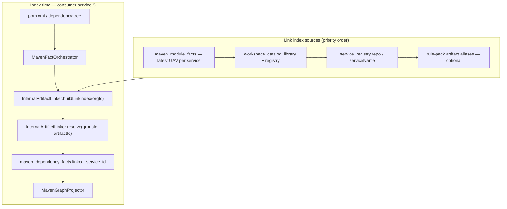

# AC-MVN-4 — Internal artifact `linkedServiceId` (BL-058 P3)

> **Status:** Shipped (2026-06-16)  
> **Parent:** [TestSeer_BL058_Maven_Dependency_Tree_Design.md](TestSeer_BL058_Maven_Dependency_Tree_Design.md) §7.3, §10  
> **Feature doc:** [29-maven-dependency-tree.md](features/29-maven-dependency-tree.md)  
> **Req IDs:** MVN-09, MVN-10, MVN-11  
> **Pilot:** `transaction-eval-suite` → `com.quotient:platform-evaluation-lib` → `evaluation-lib` catalog service  
> **Author / date:** 2026-06-16

---

## 1. Executive summary

AC-MVN-4 closes the **cross-repo Maven link** gap: when a consumer declares an internal Quotient artifact, TestSeer must persist and return **`linkedServiceId`** (and `linkedRepo`) pointing at the owning indexed service — not the consumer.

| Layer | Today | AC-MVN-4 target |
|-------|-------|-----------------|
| Index facts | `linked_service_id` column exists; `InternalArtifactLinker` wired in `MavenFactOrchestrator` | Reliable resolution for pilot + framework modules |
| Graph | `ARTIFACT` node `service` field set from link | Same; optional `OWNED_BY` edge |
| Query | `GET /v1/facts/maven-dependencies` returns `linkedServiceId` | Non-null for eval-lib on indexed pilot |
| Viz | **Maven (cross-service)** tab reads `linkedServiceId` | Edge `transaction-eval-suite` → `evaluation-lib` service |

**Pilot pass condition:** After `evaluation-lib` catalog profile and `transaction-eval-suite` are both indexed, at least one runtime dependency row for `platform-evaluation-lib` has `linkedServiceId` equal to the **evaluation-lib** registry UUID (≠ consumer UUID).

---

## 2. Problem statement (historical)

Pilot indexing satisfied AC-MVN-1..3 before AC-MVN-4 shipped. Pre-fix symptom:

```bash
curl -s "$BASE/v1/facts/maven-dependencies?orgId=quotient&serviceId=$EVAL_CONSUMER&artifactId=platform-evaluation-lib&scope=runtime" \
  | jq '.data.dependencies[] | {artifactId, linkedServiceId, linkedRepo}'
# → linkedServiceId: null (typical today)
```

Viz **Maven (cross-service)** shows: *"No cross-service Maven links found. Index Maven services with internal artifact pins (linked_service_id)."*

### 2.2 Root causes (addressed)

| # | Cause | Evidence |
|---|-------|----------|
| R1 | **Naming mismatch** — consumer GAV `platform-evaluation-lib` ≠ catalog `library_id` `evaluation-lib` ≠ published module `evaluation-lib` (`com.quotient.platform`) | `config/workspace.yml` catalogLibraries; `platform-evaluation-lib/evaluation-lib/pom.xml` |
| R2 | **Linker keys artifactId only** — no `groupId:artifactId`, no alias table, no `maven_module_facts` reverse lookup | `InternalArtifactLinker.resolve()` |
| R3 | **Registry ambiguity** — one repo (`platform-evaluation-lib`) hosts two catalog libs (`evaluation-lib`, `redemption-lib`); repo-level registration may not match consumer artifactId | `workspace.yml` + multi-profile index |
| R4 | **Index-order / freshness** — link index built from registry at consumer index time; lib profile may not be registered yet | `buildLinkIndex(orgId)` per job |
| R5 | **No tests** — `InternalArtifactLinkerTest` specified in BL-058 §11.1 but not implemented | **Fixed** — unit + integration tests |

**Resolution (2026-06-16):** `InternalArtifactLinker` (4-tier index), V23 columns, `quotient-artifacts.yml`, `POST /admin/maven/backfill-links`, `OWNED_BY` edges.

**Misdiagnosis to avoid:** AC-MVN-4 is **not** blocked on P2 tree resolution or query hydration (AC-MVN-3). Declared POM deps are enough to populate `linked_service_id` at index time.

---

## 3. Design principles

1. **Index-time resolution** — populate `linked_service_id` in `MavenFactOrchestrator`; no query-time guessing.
2. **Prefer evidence over convention** — `maven_module_facts` GAV (when present) beats repo-name heuristics.
3. **Same-repo guard** — dependencies that resolve to modules inside the **current** service get `linkedServiceId = null` (monorepo sibling modules).
4. **Deterministic tie-break** — when multiple services match, prefer catalog-pinned `serviceName` over bare repo registration.
5. **Idempotent** — re-index replaces rows; linker improvements apply on next consumer index (optional admin backfill for bulk refresh).

---

## 4. Architecture



**Cross-repo flag (MVN-11):** derived when `linkedServiceId != null && linkedServiceId != indexingServiceId`. Stored on fact row (new column or JSON metadata) and surfaced in API; graph edge evidence optional follow-up.

---

## 5. Link resolution specification

### 5.1 `InternalArtifactLinker` — extended index

Replace flat `Map<artifactId, ArtifactLink>` with a **multi-key index** built once per org per index job:

| Key pattern | Source | Example |
|-------------|--------|---------|
| `{artifactId}` | registry `repo`, registry `serviceName`, catalog `library_id`, catalog `repo` | `platform-evaluation-lib` |
| `{groupId}:{artifactId}` | `maven_module_facts` (latest commit per service) | `com.quotient:platform-evaluation-lib` |
| alias keys | rule pack | `platform-evaluation-lib` → evaluation-lib service |

**Tier 1 — Maven module GAV index (new, highest confidence 0.98)**

```sql
SELECT DISTINCT ON (mm.group_id, mm.artifact_id)
       mm.group_id, mm.artifact_id, mm.service_id, sr.repo
FROM maven_module_facts mm
JOIN service_registry sr ON sr.service_id = mm.service_id
WHERE mm.org_id = :orgId
  AND mm.group_id IS NOT NULL AND mm.artifact_id IS NOT NULL
  AND mm.packaging IN ('jar', 'war', 'bundle')
ORDER BY mm.group_id, mm.artifact_id, mm.indexed_at DESC
```

Index both `artifactId` and `groupId:artifactId` keys.

**Tier 2 — Workspace catalog (existing, confidence 0.95)**

From `workspace_catalog_library` (+ YAML fallback via `OrgWorkspaceConfigResolver`):

- Register keys: `library_id`, `repo`, optional future `mavenArtifactId` field.
- Resolve `service_id` via `registryRepository.findByOrgRepoService(org, repo, serviceName)`.

**Tier 3 — Service registry convention (existing, confidence 0.90)**

- `repo` name and `serviceName` as lowercase keys (current behavior).

**Tier 4 — Rule pack aliases (new, optional, confidence 0.92)**

File: `config/rule-packs/quotient-artifacts.yml`:

```yaml
artifactLinks:
  - groupId: com.quotient
    artifactId: platform-evaluation-lib
    catalogLibrary: evaluation-lib
  - groupId: com.quotient.platform
    artifactId: evaluation-lib
    catalogLibrary: evaluation-lib
```

Loader mirrors `MessagingRulePackLoader` pattern; small dedicated `ArtifactLinkRulePack`.

### 5.2 `resolve()` algorithm

```
Input: orgId, consumerServiceId, groupId, artifactId, linkIndex, localModuleGavs

1. If (groupId, artifactId) matches any module in localModuleGavs → empty (same-repo sibling)
2. Try linkIndex[groupId + ":" + artifactId]
3. Try linkIndex[artifactId]  (case-insensitive)
4. Try rule-pack alias → catalog library → registry
5. If match.serviceId == consumerServiceId → empty (self-link)
6. Return ArtifactLink(serviceId, repo, linkSource, confidence)
```

`linkSource` enum: `MAVEN_MODULE_GAV | CATALOG | REGISTRY | ALIAS` — persisted in new column `link_source` (V23) for diagnostics.

### 5.3 Same-repo guard

Before external lookup, `MavenFactOrchestrator` passes `localModuleGavs`:

```java
Set<String> localKeys = parsed.stream()
    .filter(p -> p.groupId() != null && p.artifactId() != null)
    .map(p -> p.groupId() + ":" + p.artifactId())
    .collect(toSet());
```

Pilot: `evaluation-common`, `redemption-common` parent modules inside `transaction-eval-suite` must **not** get cross-repo links.

---

## 6. Data model changes

### 6.1 V23 migration (minimal)

```sql
ALTER TABLE maven_dependency_facts
    ADD COLUMN IF NOT EXISTS link_source VARCHAR(50),
    ADD COLUMN IF NOT EXISTS cross_repo BOOLEAN NOT NULL DEFAULT FALSE;

CREATE INDEX IF NOT EXISTS idx_maven_dep_gav
    ON maven_dependency_facts (to_group_id, to_artifact_id)
    WHERE linked_service_id IS NOT NULL;
```

Populate `cross_repo = (linked_service_id IS NOT NULL AND linked_service_id <> service_id)` on write.

### 6.2 Optional catalog extension (later)

```yaml
catalogLibraries:
  - id: evaluation-lib
    repo: platform-evaluation-lib
    serviceName: evaluation-lib
    mavenArtifactIds:          # optional explicit aliases
      - platform-evaluation-lib
      - evaluation-lib
    mavenGroupIds:
      - com.quotient
      - com.quotient.platform
```

Defer to rule pack if YAML schema change is costly for P3.

### 6.3 Graph projection (MVN-10)

| Target | Change |
|--------|--------|
| `ARTIFACT` node | Keep `GraphNode.service = linkedServiceId` (existing `MavenGraphProjector`) |
| `DEPENDS_ON_ARTIFACT` edge | Set `cross_repo` on fact; edge evidence JSON deferred (no `graph_edges` metadata column today) |
| `OWNED_BY` edge | `ARTIFACT` → `SERVICE` when `crossRepo=true` — **Shipped** (S6); upserted on index and optional backfill |

---

## 7. Component changes

| # | Class | Change |
|---|-------|--------|
| C1 | `InternalArtifactLinker` | Multi-tier index; GAV query; alias support; `resolve(consumerServiceId, …)` |
| C2 | `MavenFactOrchestrator` | Pass local GAV set; store `linkSource`, `crossRepo` |
| C3 | `FactBatch.MavenDependencyFact` | Add `linkSource`, `crossRepo` fields |
| C4 | `DualWriteService` | INSERT new columns |
| C5 | `MavenDependencyQueryService` | SELECT `link_source`, `cross_repo` (API optional fields) |
| C6 | `ArtifactLinkRulePackLoader` | **New** — load `quotient-artifacts.yml` |
| C7 | `MavenLinkBackfillService` | **Shipped** — `POST /admin/maven/backfill-links`; re-run linker for latest commit per service |

No changes to `DependencyTreeGraphService` BFS — links flow through facts API and viz cross-service graph.

---

## 8. Pilot configuration

### 8.1 Required index order

From `config/workspace.yml` `bundles.quotient-full.indexOrder`:

1. `catalogLibrary: evaluation-lib` (registers evaluation-lib profile for `platform-evaluation-lib` repo)
2. `serviceModule: transaction-eval-suite` (consumer)

Re-index consumer **after** lib profile if linker was upgraded.

### 8.2 Expected registry rows

| Profile | repo | serviceName | role |
|---------|------|-------------|------|
| evaluation-lib catalog | `platform-evaluation-lib` | `evaluation-lib` | **link target** |
| transaction-eval-suite | `platform-transaction-eval-consumer` | `transaction-eval-suite` | consumer |

Consumer dependency coordinate (from resolved tree / POM): `com.quotient:platform-evaluation-lib:<version>`.

Rule pack entry maps that GAV to catalog `evaluation-lib` when Tier 1 GAV index misses (e.g. lib not maven-indexed yet but catalog registered).

---

## 9. Acceptance criteria

### 9.1 AC-MVN-4 (primary)

| Step | Assertion |
|------|-----------|
| Pre | `evaluation-lib` catalog index **CURRENT**; `transaction-eval-suite` index **CURRENT** |
| SQL | `SELECT linked_service_id, linked_repo FROM maven_dependency_facts WHERE service_id = :consumer AND to_artifact_id IN ('platform-evaluation-lib','evaluation-lib') AND linked_service_id IS NOT NULL LIMIT 1` → ≥ 1 row |
| API | `GET /v1/facts/maven-dependencies?serviceId=:consumer&artifactId=platform-evaluation-lib` → `linkedServiceId` = evaluation-lib UUID, `linkedServiceId ≠ serviceId` |
| Viz | Dependency Graph → **Maven (cross-service)** shows edge consumer → evaluation-lib |

### 9.2 Negative cases

| Case | Expected |
|------|----------|
| In-repo module dep (`evaluation-common`) | `linkedServiceId = null` |
| External GAV (`org.springframework:spring-core`) | `linkedServiceId = null` |
| Lib not registered | `linkedServiceId = null`, `link_source = null` |
| Self-link artifact built by same service | `linkedServiceId = null` |

### 9.3 Validation curl

```bash
ORG=quotient
BASE=http://localhost:8080
CONSUMER=<transaction-eval-suite-service-id>
LIB=<evaluation-lib-service-id>

curl -s "$BASE/v1/facts/maven-dependencies?orgId=$ORG&serviceId=$CONSUMER&scope=runtime&directOnly=true" \
  | jq '[.data.dependencies[] | select(.artifactId|test("evaluation-lib"))] |
        map({artifactId, version, linkedServiceId, linkedRepo})'

# Pass: any row with .linkedServiceId == LIB and .linkedServiceId != CONSUMER
```

---

## 10. Test matrix

### 10.1 Unit — `InternalArtifactLinkerTest`

| Method | Fixture | Expected |
|--------|---------|----------|
| `linksByRegistryRepoName` | registry row repo=`platform-evaluation-lib` | resolve `platform-evaluation-lib` → serviceId |
| `linksByCatalogLibraryId` | workspace row `library_id=evaluation-lib` | resolve `evaluation-lib` → serviceId |
| `linksByMavenModuleGav` | `maven_module_facts` row `com.quotient:platform-evaluation-lib` | highest priority match |
| `linksByRulePackAlias` | `quotient-artifacts.yml` alias | `platform-evaluation-lib` → evaluation-lib service |
| `skipsSameRepoModule` | consumer has local module same GAV | empty |
| `skipsSelfLink` | linked serviceId == consumer | empty |

### 10.2 Integration — extend `MavenDependencyIntegrationTest`

Register **two** services: `demo-service` (consumer) + `platform-evaluation-lib` (lib). Assert `linked_service_id` on eval-lib dep row.

### 10.3 Pilot IT — `TransactionEvalMavenLinkIT` (new)

Classpath resource or tagged integration: index evaluation-lib profile + transaction-eval-suite fixtures; assert AC-MVN-4 SQL + API.

---

## 11. Implementation phasing

| Step | Effort | Delivers |
|------|--------|----------|
| **S1** | S | V23 columns; `link_source` / `cross_repo` write path |
| **S2** | M | GAV tier + same-repo guard + extended resolve |
| **S3** | S | `quotient-artifacts.yml` + loader; pilot alias entries |
| **S4** | S | Unit + integration tests |
| **S5** | S | Re-index pilot or backfill; feature doc AC-MVN-4 → **Shipped** |
| S6 | M | `MavenLinkBackfillService` admin POST; `OWNED_BY` edges — **Done** |

**Estimated:** 1–2 days backend + pilot validation.

---

## 12. Operational notes

1. **Bulk re-index:** After deploy, run `./scripts/index-all-repos.sh` or re-index `transaction-eval-suite` only — linker is index-time.
2. **Diagnose null links:** `SELECT to_group_id, to_artifact_id, link_source FROM maven_dependency_facts WHERE linked_service_id IS NULL AND to_group_id LIKE 'com.quotient%'` — add rule-pack alias for misses.
3. **Multi-module libs:** GAV tier distinguishes `evaluation-lib` vs `redemption-lib` modules in same repo once both are maven-indexed.

---

## 13. Related docs

| Doc | Relationship |
|-----|--------------|
| [TestSeer_BL058_Maven_Dependency_Tree_Design.md](TestSeer_BL058_Maven_Dependency_Tree_Design.md) | Parent P3 requirements MVN-09–11 |
| [BACKLOG.md](../../docs/BACKLOG.md) BL-060 | Ongoing alias expansion in `quotient-artifacts.yml` |
| [16-workspace-catalog-config.md](features/16-workspace-catalog-config.md) | Catalog lib → service_id pinning |
| DesignDocuments `TransactionEvalConsumer_ServiceGraph_TestSeer.md` | Pilot validation §10–12 |

---

## 14. Document history

| Date | Change |
|------|--------|
| 2026-06-16 | Initial AC-MVN-4 implementation design |
| 2026-06-16 | Implemented — V23, extended linker, rule pack, tests, backfill, OWNED_BY |
