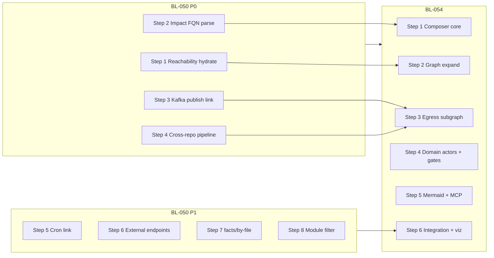

# TestSeer BL-050 + BL-054 — Master Implementation Design

> **Status:** Ready for implementation  
> **Backlog:** [BL-050](../../docs/BACKLOG.md) · [BL-054](../../docs/BACKLOG.md)  
> **Pilot:** `transaction-eval-suite` / `platform-transaction-eval-consumer`  
> **Evidence:** `DesignDocuments/Docs/TransactionEvalConsumer_ServiceGraph_GapAnalysis.md`  
> **Issue registry:** [28-transaction-eval-graph-gap-issues.md](features/28-transaction-eval-graph-gap-issues.md)  
> **Author / date:** 2026-06-16

This document is the **single implementation roadmap** for closing the transaction-eval pilot graph gaps. It supersedes step ordering in the parent [Kafka design](TestSeer_BL050_Kafka_Messaging_Graph_Design.md) for execution purposes while retaining requirement IDs (KFK-*, SFD-*).

**Related (do not duplicate work):**

| Doc | Scope |
|-----|--------|
| [TestSeer_BL050_P0_Implementation_Design.md](TestSeer_BL050_P0_Implementation_Design.md) | P0 steps 1–4 detail (TE-GAP-01–04) |
| [TestSeer_BL054_Service_Flow_Diagram_Design.md](TestSeer_BL054_Service_Flow_Diagram_Design.md) | BL-054 API + Mermaid rules |
| [TestSeer_BL053_Processor_Routing_CallGraph_Design.md](TestSeer_BL053_Processor_Routing_CallGraph_Design.md) | **Shipped** — INVOKES, ROUTES_TO |
| [TestSeer_BL055_BL057_CrossRepo_Trace_Hardening_Design.md](TestSeer_BL055_BL057_CrossRepo_Trace_Hardening_Design.md) | **Shipped** — cross-repo BFS + gap taxonomy |

---

## 1. Executive summary

### 1.1 Problem

Manual service graphs for `transaction-eval-consumer` document a **single composed view**: Kafka ingress → orchestration → processor fan-out → five Kafka exits + HTTP notification. TestSeer indexes the same codebase but exposes facts across **disjoint APIs** with empty reachability edges, missing Kafka publish hops, broken reverse impact, and no composed diagram.

### 1.2 Solution split

| Backlog | Delivers | Closes |
|---------|----------|--------|
| **BL-050** | Index + query hardening for Kafka messaging, call-graph hydration, outbound URLs, monorepo scoping | TE-GAP-01–08 |
| **BL-054** | Query-time **service flow diagram composer** (JSON + Mermaid) matching manual §6 | TE-GAP-03 (shared), TE-GAP-10 |

### 1.3 Implementation order



**Rule:** Complete BL-050 **P0 (Steps 1–4)** before BL-054 **Step 3** (messaging egress in diagram). BL-054 **Steps 1–2** can start after BL-050 **Step 1**.

### 1.4 Already shipped (baseline)

| Item | Status |
|------|--------|
| KFK-01 `@KafkaListener` → `KAFKA_SUBSCRIBE` | Done |
| `YamlKafkaTopicExtractor`, `kafkaClassLinks` rule pack | Done |
| BL-053 `INVOKES`, `ROUTES_TO`, `/graph/routing` | Done |
| BL-051 `HttpPubSubPublishLinker`, V21 unique index | Done |
| BL-055/056/057 cross-repo trace hardening | Done |
| `transport` on pubsub/org inventory + cross-repo hops | Done |

---

## 2. BL-050 — All steps

### Step overview

| Step | Issue | Req | Priority | Est. |
|------|-------|-----|----------|------|
| **1** | TE-GAP-02 | KFK-04 | P0 | 1–2 d |
| **2** | TE-GAP-03 | TRG-13-R, SFD-18 | P0 | 0.5 d |
| **3** | TE-GAP-01 | KFK-02, KFK-03 | P0 | 2–3 d |
| **4** | TE-GAP-04 | KFK-03, MSG-05 | P0 | 1–2 d |
| **5** | TE-GAP-05 | KFK-05 | P1 | 1–2 d |
| **6** | TE-GAP-06 | KFK-06 | P1 | 2 d |
| **7** | TE-GAP-07 | KFK-07 | P2 | 1 d |
| **8** | TE-GAP-08 | KFK-08, GRP-17 | P2 | 1–2 d |

---

### BL-050 Step 1 — Reachability node/edge hydration (TE-GAP-02)

**Detailed spec:** [P0 design §4.1](TestSeer_BL050_P0_Implementation_Design.md#step-1--te-gap-02-reachability-nodeedge-hydration-kfk-04)

#### Root cause

`GraphProjectionService` CTEs return reachable node IDs; response ends with `new ReachabilityResult(ids, List.of())` — edges never hydrated despite `graph_edges` containing `INVOKES` from BL-053.

#### Design

1. Extend `ReachabilityResult` with `List<GraphEdgeView> edges`.
2. Add `GraphSubgraphHydrator` — batch `SELECT` from `graph_nodes` / `graph_edges` for ID set.
3. Union **anchor node** into hydration set (CTE excludes start).
4. Wire into `classDependsOnClassForward`, `methodForward`, optionally `immediateNeighborhood`.
5. Edge types: `INVOKES`, `ROUTES_TO`, `DEPENDS_ON`, `PUBLISHES_TO`, `SUBSCRIBES_TO`, `GUARDED_BY`.

#### Expected behavior

| Query | Before | After |
|-------|--------|-------|
| `reachability?type=class&symbolFqn=…TransactionEvalConsumer` | `nodeIds: 121`, `nodes: []`, `edges: []` | `nodes ≥ 5`, `edges ≥ 4` |
| `reachability?type=service&serviceId=…` (no symbolFqn) | Empty or cross-service only | **Unchanged** — document as cross-service `CALLS` only |

#### Tests

| Test class | Assert |
|------------|--------|
| `GraphSubgraphHydratorTest` | Fixture nodes/edges → correct subgraph |
| `GraphQueryControllerReachabilityTest` | `type=class` returns non-empty `nodes` + `edges` |
| `TransactionEvalSuiteGraphIT` | Consumer → `TransactionEvaluationService` edge exists |

#### Validation

```bash
HANDLER=com.quotient.platform.transaction.eval.consumer.TransactionEvalConsumer
curl -s "$BASE/v1/graph/reachability?orgId=$ORG&serviceId=$SVC&type=class&symbolFqn=$HANDLER" \
  | jq '{nodeIds: (.data.nodeIds|length), nodes: (.data.nodes|length), edges: (.data.edges|length),
         sampleEdge: .data.edges[0]}'
```

**Pass:** `nodes >= 5`, `edges >= 4`, one edge target contains `TransactionEvaluationService`.

---

### BL-050 Step 2 — Reverse impact handler FQN parsing (TE-GAP-03)

**Detailed spec:** [P0 design §4.2](TestSeer_BL050_P0_Implementation_Design.md#step-2--te-gap-03-reverse-impact-handler-fqn-parsing-trg-13-r)

#### Root cause

`EntryFlowService.parseHandlerFqn` supports `Class#method` but not `Class.method` (dot notation). Agents and gap-analysis curls use dot form → zero SQL matches.

#### Design

Extend `parseHandlerFqn`:

1. `#` separator (canonical)
2. Dot suffix when last segment matches `^[a-z][a-zA-Z0-9_]*$` and prefix contains `.`
3. Class-only FQN fallback

Impact tiers unchanged: EXACT+METHOD → EXACT → SIMPLE_NAME org-wide.

#### Expected behavior

| Input | `triggers` count | `triggerKind` |
|-------|------------------|---------------|
| `…TransactionEvalConsumer.processSalesCanonicalEvent` | ≥ 1 | `KAFKA_SUBSCRIBE` |
| `…TransactionEvalConsumer#processSalesCanonicalEvent` | ≥ 1 | `KAFKA_SUBSCRIBE` |
| `…TransactionEvalConsumer` (class only) | ≥ 1 | `KAFKA_SUBSCRIBE` |

#### Tests

| Test | Assert |
|------|--------|
| `EntryFlowServiceHandlerParsingTest` | Dot, hash, class-only, negative (inner class edge case) |
| `EntryTriggerQueryControllerTest` | HTTP impact returns trigger for dot FQN |

#### Validation

```bash
METHOD=processSalesCanonicalEvent
HANDLER=com.quotient.platform.transaction.eval.consumer.TransactionEvalConsumer
curl -s "$BASE/v1/graph/entry-flow/impact?orgId=$ORG&serviceId=$SVC&handlerFqn=${HANDLER}.${METHOD}" \
  | jq '{count: (.data.triggers|length), kind: .data.triggers[0].trigger.triggerKind,
         topic: .data.triggers[0].trigger.pathPattern}'
```

**Pass:** `count >= 1`, `kind == "KAFKA_SUBSCRIBE"`, topic matches `QUOT.SALES.TRANSACTION.PIPELINE.EVENTS`.

---

### BL-050 Step 3 — Kafka publish hops X1–X5 (TE-GAP-01)

**Detailed spec:** [P0 design §4.3](TestSeer_BL050_P0_Implementation_Design.md#step-3--te-gap-01-kafka-publish-hops-x1x5-kfk-02-kfk-03)

#### Root cause

Producer **classes** indexed; yaml `PUBLISH` facts missing or `linked_class_fqn` null (monorepo module mismatch). `event-flow` has nothing to join.

#### Design

1. **MessagingClassLinker Tier B** — match rule-pack topic + class when module differs (suite monorepo).
2. Verify `YamlKafkaTopicExtractor` emits PUBLISH for producer-only yaml blocks.
3. Confirm `MessagingGraphProjector` → `PUBLISHES_TO` after linker.
4. Add `UNLINKED_KAFKA_PUBLISHER` gap when topic row exists without link.

#### Pilot topic map

| Manual | Topic | Producer class |
|--------|-------|----------------|
| X1 | `QUOT.SALES.TRANSACTION.PROCESSED.EVENTS` | `StxnProcessedEventProducer` |
| X2 | `QUOT.REBATE.REDEEM.EVENTS` | `TransactionHelper` |
| X3 | `QUOT.REBATE.REWARD-STATUS.EVENTS` | `TransactionHelper` |
| X4 | `QUOT.FRAUD.RULES.EVALUATION.EVENTS` | `FraudRulesEvaluationEventProducer` |
| X5 | `QUOT.FRAUD.TRANSACTION.PATTERN.EVENTS` | `PatternCheckEventProducer` |

#### Expected behavior

For each topic, `GET /v1/graph/event-flow?serviceId=$SVC&shortId=$TOPIC&env=dev`:

- `steps.length >= 1`
- At least one outbound with linked producer FQN
- `pubsubResources` row with `transport=KAFKA`, `role=PUBLISH`

#### Tests

| Test | Assert |
|------|--------|
| `MessagingClassLinkerKafkaPublishTest` | All 5 rule-pack topics link on suite fixture |
| `YamlKafkaTopicExtractorTest` | Producer-only yaml → PUBLISH fact |
| `MessagingFlowServiceKafkaIT` | Event-flow returns PUBLISH step per topic |

#### Validation

```bash
TOPICS=(
  QUOT.SALES.TRANSACTION.PROCESSED.EVENTS
  QUOT.REBATE.REDEEM.EVENTS
  QUOT.REBATE.REWARD-STATUS.EVENTS
  QUOT.FRAUD.RULES.EVALUATION.EVENTS
  QUOT.FRAUD.TRANSACTION.PATTERN.EVENTS
)
for T in "${TOPICS[@]}"; do
  echo "=== $T ==="
  curl -s "$BASE/v1/graph/event-flow?orgId=$ORG&serviceId=$SVC&shortId=$T&env=dev" \
    | jq '{steps: (.data.steps|length), publishOutbounds: ([.data.steps[].outbounds[]? | select(.role=="PUBLISH")] | length),
           handler: .data.steps[0].handler}'
done
```

**Pass:** Each topic `publishOutbounds >= 1`.

#### Post-step SQL check

```sql
SELECT short_id, linked_class_fqn, module_name
FROM pubsub_resource_facts
WHERE service_id = :svc AND role = 'PUBLISH'
  AND attributes->>'transport' = 'KAFKA';
-- Expect 5+ rows with non-null linked_class_fqn
```

---

### BL-050 Step 4 — Cross-repo pipeline & notification (TE-GAP-04)

**Detailed spec:** [P0 design §4.4](TestSeer_BL050_P0_Implementation_Design.md#step-4--te-gap-04-cross-repo-pipeline--notification-kfk-03-msg-05)

#### Root cause

Bundle index gaps, Kafka/PubSub join, env lane mismatch; false `NO_SUBSCRIBER` / `NO_PUBLISHER` when eval indexed.

#### Design

1. Operational: index `quotient-full` including upstream pipeline publisher repo.
2. `KafkaTopicAliasIndex` for pipeline env aliases (rule pack).
3. Gap codes: `NO_SUBSCRIBER_INDEX_GAP` when repo in `missingBundleRepos`.
4. Verify BL-051 HTTP_PUBSUB rows for `DEV_T.NOTIFICATION_REQ`.
5. Cross-repo hop `transport=KAFKA` when all participants are Kafka.

#### Expected behavior

| Trace | Expected |
|-------|----------|
| `cross-repo?shortId=QUOT.SALES.TRANSACTION.PIPELINE.EVENTS&followMode=runtime` | Eval suite in hop 1 subscribers; no false `NO_SUBSCRIBER` |
| `cross-repo?shortId=DEV_T.NOTIFICATION_REQ&env=dev` | HTTP_PUBSUB publisher from eval and/or receipt (deduped to 2 services) |

#### Tests

| Test | Assert |
|------|--------|
| `MessagingFlowServiceTopicAliasTest` | Alias resolves PDN → QUOT logical name |
| `MessagingFlowServiceCrossRepoKafkaTest` | Pipeline subscriber present |

#### Validation

```bash
curl -s "$BASE/v1/graph/event-flow/cross-repo?orgId=$ORG&env=dev&bundle=quotient-full\
&shortId=QUOT.SALES.TRANSACTION.PIPELINE.EVENTS&followMode=runtime&maxHops=5" \
  | jq '{hops: (.data.hops|length), subscribers: [.data.hops[0].subscribers[].serviceName],
         gaps: [.data.gaps[].gapType]}'

curl -s "$BASE/v1/graph/event-flow/cross-repo?orgId=$ORG&env=dev&bundle=quotient-full\
&shortId=DEV_T.NOTIFICATION_REQ&maxHops=1" \
  | jq '.data.hops[0] | {pubCount: (.publishers|length), transports: [.publishers[].transport]|unique}'
```

**Pass:** Pipeline has eval subscriber; notification `pubCount == unique service count` (BL-056 dedupe); no `NO_SUBSCRIBER` on pipeline when bundle complete.

---

### BL-050 Step 5 — Cron → handler linking (TE-GAP-05)

#### Root cause

`CRON_K8S` triggers indexed from suite manifests without `linked_handler_fqn` → orphan ingress in entry catalog.

#### Design

1. **`CronJobHandlerLinker`** (new) — match `cronJobName` / workload from trigger `pathPattern` to:
   - `*Application.java` with `main` in same module path, or
   - Rule-pack override `cronHandlerLinks` in `quotient-messaging.yml`
2. Run in `EntryTriggerOrchestrator` post-extraction.
3. Document suite crons as **out of consumer package** (manual boundary note).

#### Expected behavior

```bash
curl -s "$BASE/v1/facts/entry-triggers?serviceId=$SVC&kind=CRON_K8S" \
  | jq '.data[] | select(.triggerId|test("stc-retry")) | {triggerId, linkedHandlerFqn}'
```

**Pass:** `linkedHandlerFqn` non-null for `stc-retry-job` (or documented rule-pack exception).

#### Tests

| Test | Assert |
|------|--------|
| `CronJobHandlerLinkerTest` | Manifest fixture → main class FQN |
| `EntryTriggerIntegrationTest` | Re-index suite fixture → cron linked |

---

### BL-050 Step 6 — External endpoints & outbound (TE-GAP-06)

#### Root cause

`rest.apis.pubsub` / Workbench URLs in yaml not surfaced in `external_endpoint_facts`; `PubSubNotificationClient` missing from outbound inventory.

#### Design

1. **`YamlRestEndpointExtractor`** — flatten `rest.apis.*`, `rest-clients.*` → `external_endpoint_facts`.
2. Extend **`OutboundCallExtractor`** — `RestService` subclasses, `workbenchSubmissionRestClient` call sites.
3. Link to existing `external-endpoints` query API.

#### Expected behavior

| Query | Expected |
|-------|----------|
| `facts/outbound?serviceId=$SVC` | Symbols for `PubSubNotificationClient`, Workbench client |
| `facts/external-endpoints?serviceId=$SVC` | Resolved URL templates for pubsub + workbench |

#### Validation

```bash
curl -s "$BASE/v1/facts/outbound?orgId=$ORG&serviceId=$SVC" \
  | jq '[.data[] | select(.symbolName|test("PubSub|Workbench";"i")) | .symbolName]'

curl -s "$BASE/v1/facts/external-endpoints?orgId=$ORG&serviceId=$SVC&env=dev" \
  | jq '[.data[] | {partnerSlug, urlTemplate, callerClassFqn}] | .[0:5]'
```

**Pass:** `PubSubNotificationClient` in outbound; external-endpoints non-empty for eval.

#### Tests

`YamlRestEndpointExtractorTest`, `OutboundCallExtractorRestServiceTest`, integration on suite fixture.

---

### BL-050 Step 7 — facts/by-file (TE-GAP-07)

#### Root cause

`symbol_facts.file_path` null on insert → `GET /v1/facts/by-file` returns `[]`.

#### Design

1. Ensure `DualWriteService` / symbol projection writes `file_path` from `ParsedModel.sourcePath`.
2. Normalize path in query (strip leading `/`, match repo-relative).

#### Expected behavior

```bash
curl -s "$BASE/v1/facts/by-file?orgId=$ORG&serviceId=$SVC\
&filePaths=evaluation-consumers/transaction-eval-consumer/src/main/java/.../TransactionEvalConsumer.java" \
  | jq '[.data[] | select(.kind=="CLASS") | .fqn]'
```

**Pass:** Returns `TransactionEvalConsumer` FQN.

#### Tests

`FactQueryControllerByFileTest`, `DualWriteServiceSymbolPathTest`.

---

### BL-050 Step 8 — Module / package filter (TE-GAP-08)

#### Root cause

Monorepo suite indexes `evaluation-jobs` crons and unrelated modules → consumer-scoped queries show noise.

#### Design

Add query params (prefer **one** for P2):

| Param | Endpoints |
|-------|-----------|
| `packagePrefix` | `entry-flow`, `entry-triggers`, `flow-diagram` (BL-054) |
| `serviceModuleId` | Same — resolves roots from `workspace.yml` `serviceModules` |

Filter: only triggers / symbols whose `sourceRef` or FQN starts with prefix.

#### Expected behavior

```bash
curl -s "$BASE/v1/facts/entry-triggers?serviceId=$SVC&packagePrefix=com.quotient.platform.transaction.eval" \
  | jq '[.data[].triggerKind] | unique'
```

**Pass:** No `CRON_K8S` in filtered result (crons are suite-level, outside package).

#### Tests

`EntryFlowServicePackageFilterTest`, `EntryTriggerQueryControllerFilterTest`.

---

## 3. BL-054 — All steps

### Step overview

| Step | Req IDs | Depends on | Est. |
|------|---------|------------|------|
| **1** | SFD-01, SFD-02, SFD-04, SFD-14 | BL-050 Step 2 | 2 d |
| **2** | SFD-05, SFD-06, SFD-07 | BL-050 Step 1, BL-053 | 2 d |
| **3** | SFD-08, SFD-09, SFD-15 | BL-050 Steps 3–4, BL-051 | 1–2 d |
| **4** | SFD-10, SFD-11, SFD-12 | BL-052 gates | 1–2 d |
| **5** | SFD-03, SFD-16, SFD-17 | Steps 1–4 | 1 d |
| **6** | SFD-19, SFD-20 | All above | 1–2 d |

**Shared with BL-050:** SFD-18 (TRG-13) = **BL-050 Step 2** — do not implement twice.

---

### BL-054 Step 1 — Composer core + anchor resolution

**API:** `GET /v1/graph/flow-diagram` (new)

#### Design

| Class | Responsibility |
|-------|----------------|
| `ServiceFlowDiagramComposer` | Orchestrate expansion |
| `FlowDiagramAnchorResolver` | `triggerId` \| `handlerFqn` \| `symbolFqn` \| `nodeId` → start node(s) |
| `FlowDiagramResponse` | `nodes[]`, `edges[]`, `gaps[]`, `stats` |

**Anchor resolution rules:**

| `anchor` param | Resolves to |
|----------------|-------------|
| `triggerId:kafka:…` | Entry trigger row → handler class/method node |
| `handlerFqn:Class.method` | Method node (requires BL-050 Step 2 parser) |
| `symbolFqn:…` | Class or method graph node id |
| `nodeId:…` | Direct graph_nodes.id |

Query params: `serviceId`, `orgId`, `packagePrefix`, `depth` (default 6), `includeMessaging`, `includeExternalDomain`, `includeGates`, `format=json|mermaid`.

#### Expected behavior (JSON)

- `schemaVersion: 1.0`, `freshnessStatus: CURRENT`
- `data.anchor` echoes resolved anchor metadata
- `data.nodes` non-empty for pilot trigger anchor
- Stable `nodeId` per graph node (dedupe by `symbolFqn`)

#### Tests

| Test | Assert |
|------|--------|
| `FlowDiagramAnchorResolverTest` | Each anchor type resolves |
| `ServiceFlowDiagramComposerTest` | Minimal fixture → nodes + edges |
| `GraphQueryControllerFlowDiagramTest` | 200 + schema shape |

#### Validation

```bash
curl -s "$BASE/v1/graph/flow-diagram?orgId=$ORG&serviceId=$SVC\
&anchor=handlerFqn:com.quotient.platform.transaction.eval.consumer.TransactionEvalConsumer.processSalesCanonicalEvent\
&packagePrefix=com.quotient.platform.transaction.eval&depth=4" \
  | jq '{nodeCount: (.data.nodes|length), edgeCount: (.data.edges|length), anchor: .data.anchor}'
```

**Pass:** `nodeCount >= 10`, `edgeCount >= 8`.

---

### BL-054 Step 2 — Graph expansion (ingress + orchestration)

#### Design

`FlowDiagramGraphExpander` — BFS from anchor:

1. **Ingress** — `SUBSCRIBES_TO` from `entry_trigger_facts` / messaging edges
2. **Code path** — `INVOKES` + `ROUTES_TO` (BL-053), cap at `depth`
3. **Routing fan-out** — include all `routing_table_facts` rows when `ProcessorFactory` in scope
4. **Filter** — drop nodes outside `packagePrefix` unless `includeExternalDomain=true`

#### Expected behavior

Response includes chain:

```
TransactionEvalConsumer → TransactionEvaluationService → ProcessorFactory
  → DefaultTxnEvalProcessor | ReceiptTxnEvalProcessor | CorrectedTxnEvalProcessor
```

Method node: `TransactionEvalConsumer#processSalesCanonicalEvent`.

Compare to manual ED001–ED007.

#### Tests

| Test | Assert |
|------|--------|
| `FlowDiagramGraphExpanderTest` | BFS respects depth + packagePrefix |
| `ServiceFlowDiagramPilotIT` | AC-F2, AC-F3 from BL-054 design |

#### Validation

```bash
curl -s "$BASE/v1/graph/flow-diagram?orgId=$ORG&serviceId=$SVC\
&anchor=triggerId:kafka:quot.sales.transaction.pipeline.events:...transactionevalconsumer\
&packagePrefix=com.quotient.platform.transaction.eval" \
  | jq '[.data.nodes[].simpleName] | unique'
```

**Pass:** Contains `TransactionEvalConsumer`, `TransactionEvaluationService`, `ProcessorFactory`, ≥3 processor simple names.

---

### BL-054 Step 3 — Messaging & HTTP egress subgraph

#### Design

When `includeMessaging=true`:

1. For each processor/handler in scope, append `PUBLISHES_TO` / `SUBSCRIBES_TO` edges to TOPIC nodes
2. Append `external_endpoint_facts` / `OUTBOUND_TO` as exit nodes (HTTP)
3. **`gaps[]`** — for each manual exit X1–X7 without indexed hop, emit:

```json
{ "gapType": "NO_MESSAGING_HOP", "shortId": "QUOT.REBATE.REDEEM.EVENTS",
  "description": "Producer not linked in event-flow (BL-050 Step 3)" }
```

Never silently omit egress — gaps document BL-050 incompleteness.

#### Expected behavior

| BL-050 state | Diagram behavior |
|--------------|------------------|
| Step 3 complete | X1–X5 topic nodes + `PUBLISHES_TO` edges |
| Step 3 incomplete | Topic nodes in `gaps[]` only |
| BL-051 complete | X7 notification topic + HTTP_PUBSUB edge |

#### Validation

```bash
curl -s "$BASE/v1/graph/flow-diagram?orgId=$ORG&serviceId=$SVC\
&anchor=handlerFqn:...TransactionEvalConsumer.processSalesCanonicalEvent\
&packagePrefix=com.quotient.platform.transaction.eval&includeMessaging=true" \
  | jq '{topicNodes: [.data.nodes[]|select(.kind=="TOPIC")|.shortId],
         gaps: [.data.gaps[].gapType]}'
```

**Pass (after BL-050 Step 3):** ≥3 Kafka topic nodes; `gaps` empty or only X6/X8 deferred.

---

### BL-054 Step 4 — Annotations, domain actors, gate labels

#### Design

1. **`DomainActorRoleEnricher`** — load `quotient-domain-actors.yml`:

| FQN | role |
|-----|------|
| `TransactionHelper` | `URT_REDEEM_ORCHESTRATOR` |
| `STCRetryQueueDao` | `STC_RETRY_PERSISTENCE` |
| … | (XN001–XN007) |

2. **`NodeLabelEnricher`** — merge `facts/class` annotations (`@ConditionalOnProperty`, …) onto CLASS nodes
3. **Gate edges** — when `includeGates=true`, attach `flow_gate_facts` to edges from guarded symbols (BL-052)

#### Expected behavior

- `TransactionEvalConsumer` node: `annotations` includes `ConditionalOnProperty`
- `TransactionHelper` node: `role=URT_REDEEM_ORCHESTRATOR`, `moduleScope=external-domain`
- Guarded edges: `label` contains `gateKey`

#### Tests

`DomainActorRoleEnricherTest`, `FlowDiagramGateLabelTest`.

#### Validation

```bash
curl -s "$BASE/v1/graph/flow-diagram?orgId=$ORG&serviceId=$SVC&anchor=...&includeGates=true" \
  | jq '.data.nodes[] | select(.simpleName=="TransactionHelper") | {role, moduleScope}'
```

**Pass:** `role == "URT_REDEEM_ORCHESTRATOR"`.

---

### BL-054 Step 5 — Mermaid renderer + MCP + docs (SFD-03, SFD-16, SFD-17)

#### Design

`FlowDiagramMermaidRenderer` — subgraph layout mirroring manual §6:

1. `subgraph entry` — topic → consumer
2. `subgraph core` — evaluation service → factory
3. `subgraph processors` — ROUTES_TO fan-out (not collapsed)
4. `subgraph exits` — topics + HTTP clients

`format=mermaid` returns plain-text Mermaid in `data.mermaid` or raw body (document choice in OpenAPI).

**MCP:** `testseer_get_service_flow_diagram` — params mirror REST; markdown summary + JSON attachment.

**SFD-16:** Update agent skills + gap analysis §11 — never use bare `reachability?serviceId=` for intra-service parity.

#### Validation

```bash
curl -s "$BASE/v1/graph/flow-diagram?orgId=$ORG&serviceId=$SVC\
&anchor=triggerId:kafka:...&packagePrefix=com.quotient.platform.transaction.eval&format=mermaid" \
  | jq -r '.data.mermaid // .' | head -30
```

**Pass:** Valid Mermaid (`flowchart TB`); contains `ProcessorFactory`; parses in Mermaid live editor without error.

---

### BL-054 Step 6 — Integration test + optional viz (SFD-19, SFD-20)

#### Integration test (`ServiceFlowDiagramPilotIT`)

Fixture or live index of `transaction-eval-suite`:

| AC | Assertion |
|----|-----------|
| AC-F1 | ≥17 consumer class nodes with `packagePrefix` |
| AC-F2 | Method node `TransactionEvalConsumer#processSalesCanonicalEvent` |
| AC-F3 | Core chain Consumer → EvaluationService → Factory → ≥3 processors |
| AC-F4 | Mermaid renders without parse errors |
| AC-F5 | `TransactionHelper` with `role=URT_REDEEM_ORCHESTRATOR` |
| AC-F6 | `ConditionalOnProperty` on consumer node |
| AC-F7 | `gaps[]` reflects BL-050 messaging state |
| AC-F8 | Impact returns T1 (BL-050 Step 2) |

#### Viz (optional SFD-20)

New **Service flow** tab in `viz.html`:

- Service picker + anchor dropdown (from entry-triggers)
- `packagePrefix` default `com.quotient.platform.transaction.eval`
- Render Mermaid inline (mermaid.js) or link to exported text
- Reuse `followMode` / trace patterns from Event Flow tab

---

## 4. Combined acceptance matrix

| ID | Backlog | Criterion | Validation ref |
|----|---------|-----------|----------------|
| P0-AC-1 | BL-050 S1 | Reachability `nodes`/`edges` non-empty | §BL-050 Step 1 |
| P0-AC-2 | BL-050 S2 | Impact dot + hash FQN → Kafka trigger | §BL-050 Step 2 |
| P0-AC-3 | BL-050 S3 | Five egress topics have PUBLISH outbound | §BL-050 Step 3 |
| P0-AC-4 | BL-050 S4 | Pipeline cross-repo eval subscriber | §BL-050 Step 4 |
| P0-AC-5 | BL-050 S4 | Notification HTTP_PUBSUB publisher | §BL-050 Step 4 |
| P1-AC-1 | BL-050 S5 | Cron `linkedHandlerFqn` set | §BL-050 Step 5 |
| P1-AC-2 | BL-050 S6 | Outbound + external-endpoints populated | §BL-050 Step 6 |
| P2-AC-1 | BL-050 S7 | facts/by-file returns class | §BL-050 Step 7 |
| P2-AC-2 | BL-050 S8 | packagePrefix excludes suite crons | §BL-050 Step 8 |
| AC-F1–F8 | BL-054 | Flow diagram pilot assertions | §BL-054 Step 6 |
| REG-1 | Both | `affiliate-notifications` Pub/Sub regression | Re-index smoke |

---

## 5. Master validation script

Run after BL-050 P0 + BL-054 Steps 1–5 on `quotient-full` index.

```bash
#!/usr/bin/env bash
set -euo pipefail
ORG=quotient
BASE=http://localhost:8080
REPO=/Users/mrinalthigale/Documents/GitHub/platform-transaction-eval-consumer
BUNDLE=quotient-full
PIPELINE=QUOT.SALES.TRANSACTION.PIPELINE.EVENTS
HANDLER=com.quotient.platform.transaction.eval.consumer.TransactionEvalConsumer
METHOD=processSalesCanonicalEvent
PKG=com.quotient.platform.transaction.eval

# Resolve serviceId (status API uses .services[], not .data[])
SVC=$(curl -s "$BASE/v1/status?orgId=$ORG" | jq -r '.services[]? | select(.repo|test("transaction-eval")) | .serviceId' | head -1)
echo "serviceId=$SVC"

echo "=== BL-050 Step 1: reachability ==="
curl -s "$BASE/v1/graph/reachability?orgId=$ORG&serviceId=$SVC&type=class&symbolFqn=$HANDLER" \
  | jq '{nodes: (.data.nodes|length), edges: (.data.edges|length)}'

echo "=== BL-050 Step 2: reverse impact ==="
curl -s "$BASE/v1/graph/entry-flow/impact?orgId=$ORG&serviceId=$SVC&handlerFqn=${HANDLER}.${METHOD}" \
  | jq '.data.triggers|length'

echo "=== BL-050 Step 3: Kafka egress ==="
for T in QUOT.SALES.TRANSACTION.PROCESSED.EVENTS QUOT.REBATE.REDEEM.EVENTS \
         QUOT.FRAUD.RULES.EVALUATION.EVENTS; do
  N=$(curl -s "$BASE/v1/graph/event-flow?orgId=$ORG&serviceId=$SVC&shortId=$T&env=dev" \
    | jq '[.data.steps[].outbounds[]?]|length')
  echo "$T outbounds=$N"
done

echo "=== BL-050 Step 4: cross-repo ==="
curl -s "$BASE/v1/graph/event-flow/cross-repo?orgId=$ORG&bundle=$BUNDLE&shortId=$PIPELINE&env=dev&followMode=runtime&maxHops=5" \
  | jq '{hops: (.data.hops|length), gaps: [.data.gaps[].gapType], skipped: .data.skippedExpansionCount}'

echo "=== BL-054: flow diagram JSON ==="
curl -s "$BASE/v1/graph/flow-diagram?orgId=$ORG&serviceId=$SVC\
&anchor=handlerFqn:${HANDLER}.${METHOD}&packagePrefix=$PKG&depth=6&includeMessaging=true" \
  | jq '{nodes: (.data.nodes|length), edges: (.data.edges|length), gaps: (.data.gaps|length)}'

echo "=== BL-054: flow diagram Mermaid ==="
curl -s "$BASE/v1/graph/flow-diagram?orgId=$ORG&serviceId=$SVC\
&anchor=handlerFqn:${HANDLER}.${METHOD}&packagePrefix=$PKG&format=mermaid" \
  | jq -r '.data.mermaid // .' | head -25

echo "=== BL-050 P1: cron links (when Step 5 done) ==="
curl -s "$BASE/v1/facts/entry-triggers?orgId=$ORG&serviceId=$SVC&kind=CRON_K8S" \
  | jq '[.data[] | {id: .triggerId, handler: .linkedHandlerFqn}] | .[0:3]'

echo "=== BL-050 P1: external endpoints (when Step 6 done) ==="
curl -s "$BASE/v1/facts/external-endpoints?orgId=$ORG&serviceId=$SVC&env=dev" \
  | jq '.data|length'
```

---

## 6. PR breakdown (recommended)

### BL-050

| PR | Steps | Title |
|----|-------|-------|
| PR-050-1 | 1 | `feat(graph): hydrate reachability nodes and edges` |
| PR-050-2 | 2 | `fix(entry-flow): dot-notation handlerFqn for impact` |
| PR-050-3 | 3 | `fix(kafka): link publish topics on suite monorepo` |
| PR-050-4 | 4 | `fix(messaging): cross-repo pipeline aliases and gaps` |
| PR-050-5 | 5–6 | `feat(index): cron handler link + yaml REST endpoints` |
| PR-050-6 | 7–8 | `fix(query): by-file path + packagePrefix filter` |

### BL-054

| PR | Steps | Title |
|----|-------|-------|
| PR-054-1 | 1–2 | `feat(graph): flow-diagram composer core + expansion` |
| PR-054-2 | 3–4 | `feat(graph): messaging exits, domain actors, gates` |
| PR-054-3 | 5–6 | `feat(graph): Mermaid format, MCP, pilot IT, viz tab` |

**Merge order:** PR-050-1 → PR-050-2 → (PR-054-1 parallel) → PR-050-3 → PR-050-4 → PR-054-2 → PR-054-3 → PR-050-5/6.

---

## 7. Risks

| Risk | Mitigation |
|------|------------|
| BL-054 ships before BL-050 Step 3 | Always emit `gaps[]`; document in AC-F7 |
| Dot FQN splits inner classes | Only split when method segment is lowercase-led |
| Hydration performance | Batch SQL; cap edges at 500/request |
| Mermaid label escaping | Sanitize `#`, quotes; use `simpleName` |
| Suite module mismatch | Tier B linker + packagePrefix filter |
| False parity in gap analysis | Standard query set in SFD-16; update §11 scripts |

---

## 8. Sign-off checklist

### BL-050

- [x] Steps 1–4 (P0) merged + pilot script P0-AC-1–5 pass
- [x] Steps 5–8 (P1/P2) merged or explicitly deferred with backlog note
- [x] TE-GAP-01–08 closed in issue registry
- [x] OpenAPI + CHANGELOG if `ReachabilityResult.edges` added
- [x] Gap analysis §13 updated

### BL-054

- [x] `GET /v1/graph/flow-diagram` shipped
- [x] AC-F1–F8 pass on pilot index (`3756095a-e423-4aeb-b11a-fe6d3340fca5`)
- [x] MCP `testseer_get_service_flow_diagram`
- [x] TE-GAP-10 closed
- [x] BL-054 moved to Done in BACKLOG

---

## 9. References

| Artifact | Path |
|----------|------|
| Manual service graph | `DesignDocuments/Docs/TransactionEvalConsumer_ServiceGraph_Manual.md` |
| TestSeer service graph | `DesignDocuments/Docs/TransactionEvalConsumer_ServiceGraph_TestSeer.md` |
| Gap analysis | `DesignDocuments/Docs/TransactionEvalConsumer_ServiceGraph_GapAnalysis.md` |
| P0 implementation detail | [TestSeer_BL050_P0_Implementation_Design.md](TestSeer_BL050_P0_Implementation_Design.md) |
| Flow diagram API spec | [TestSeer_BL054_Service_Flow_Diagram_Design.md](TestSeer_BL054_Service_Flow_Diagram_Design.md) |
| Issue registry | [28-transaction-eval-graph-gap-issues.md](features/28-transaction-eval-graph-gap-issues.md) |
| Cross-repo validation (done) | [TestSeer_BL055_BL057_CrossRepo_Trace_Hardening_Design.md](TestSeer_BL055_BL057_CrossRepo_Trace_Hardening_Design.md) §9 |
