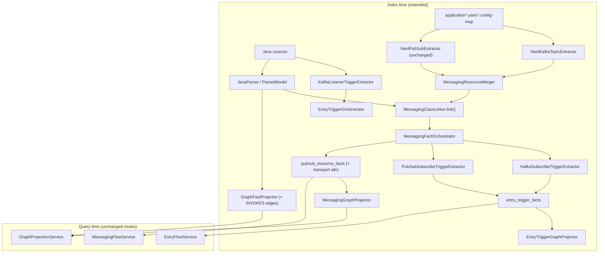

# TestSeer BL-050 — Kafka Messaging Index & Service Graph Hardening

> **Status:** Design (`in-progress` — KFK-01 shipped on pilot; **P0 implementation:** [TestSeer_BL050_P0_Implementation_Design.md](TestSeer_BL050_P0_Implementation_Design.md))  
> **Backlog:** [BL-050](../../docs/BACKLOG.md)  
> **Feature summary:** [24-kafka-messaging-and-graph-gaps.md](features/24-kafka-messaging-and-graph-gaps.md)  
> **Evidence:** Manual vs TestSeer gap analysis on `transaction-eval-suite`  
> **Pilot serviceId:** `81d1611f-e019-4ce4-94f1-7df64aa15c41`  
> **Author / date:** 2026-06-15 (updated 2026-06-16)

---

## 1. Executive summary

Quotient platform services use **Kafka** for primary async ingress and egress. TestSeer Option C and entry triggers were built around **GCP Pub/Sub**, REST, and K8s cron. Indexing `platform-transaction-eval-consumer` proves the gap: the real entry (`@KafkaListener` on `TransactionEvalConsumer`) is invisible; five Kafka publish paths are missing; `reachability` / `neighborhood` return empty graphs; cross-repo trace reports `NO_PUBLISHER` / `NO_SUBSCRIBER` for the pipeline topic.

**BL-050** extends the existing messaging and trigger pipelines **without forking** them: unify Kafka topics under the same resource fact model, add `KAFKA_SUBSCRIBE` entry triggers, project `SUBSCRIBES_TO` / `PUBLISHES_TO` edges, and harden call-graph projection so agent queries match manual service graphs.

**Pilot service:** `serviceId` `0bab295f-1ce4-441e-a9ad-d29c547490d8` (`transaction-eval-suite`).

---

## 2. Background & evidence

### 2.1 Pilot manual graph (code read)

Primary path for transaction eval consumer:

```
Kafka QUOT.SALES.TRANSACTION.PIPELINE.EVENTS
  → TransactionEvalConsumer.processSalesCanonicalEvent
  → TransactionEvaluationService.evaluateTransactionEvent
  → ProcessorFactory → Default | Receipt | Corrected processor
  → Kafka exits: processed, redeem, reward-status, fraud rules, pattern
  → HTTP exits: Workbench REST, PubSub notification API
```

See: `DesignDocuments/Docs/TransactionEvalConsumer_ServiceGraph_Manual.md`

### 2.2 Pilot TestSeer index (2026-06-16)

| Query | Expected (manual) | Actual (TestSeer) |
|-------|-------------------|-------------------|
| `entry-flow/impact` on `TransactionEvalConsumer` | Kafka trigger | `triggers: []` |
| `facts/pubsub?env=dev` | N/A (Kafka) | `[]` |
| `event-flow` pipeline topic | Subscriber hop | `steps: []`, gaps both ways |
| `graph/reachability` | Non-empty | `empty: true` |
| `facts/entry-triggers` | Kafka + optional cron | 4× `CRON_K8S` only, unlinked |
| `facts/outbound` | WB + PubSub client | 3 symbols; no `PubSubNotificationClient` |

See: `DesignDocuments/Docs/TransactionEvalConsumer_ServiceGraph_TestSeer.md`  
Gap matrix: `DesignDocuments/Docs/TransactionEvalConsumer_ServiceGraph_GapAnalysis.md`

### 2.3 Root causes (code-level)

| # | Root cause | Where in TestSeer today |
|---|------------|------------------------|
| R1 | `YamlPubSubExtractor` only matches `pubsub.publisher.topicId.*` and subscription keys | `ingestion/messaging/YamlPubSubExtractor.java` |
| R2 | `PubSubSubscribeTriggerExtractor` only runs on `PubSubResourceFact` with `role=SUBSCRIBE` | `ingestion/triggers/PubSubSubscribeTriggerExtractor.java` |
| R3 | `MessagingClassLinker.isConsumer()` matches `*Consumer` but **no SUBSCRIBE facts exist** for Kafka yaml | `MessagingClassLinker.java` L195–201 |
| R4 | `MessagingGraphProjector` only projects `PubSubResourceFact` → TOPIC/SUBSCRIPTION nodes | `graph/MessagingGraphProjector.java` |
| R5 | `GraphFactProjector` builds `DEPENDS_ON` from injection types, not **method body CALLS** | `graph/GraphFactProjector.java` |
| R6 | `symbol_facts.file_path` may be unset → `GET /v1/facts/by-file` returns `[]` | `FactQueryController.querySymbolsByFile` |
| R7 | Monorepo suite index merges unrelated `evaluation-jobs` cron manifests into consumer entry catalog | `EntryTriggerOrchestrator` + `K8sCronTriggerExtractor` |
| R8 | `BatchLauncherTriggerExtractor` / manifest path not linking cron → `*JobApplication.main` | Entry trigger P2 shipped without handler link |

---

## 3. Requirements (KFK-01–08)

| ID | Requirement | Priority |
|----|-------------|----------|
| **KFK-01** | `@KafkaListener` / `@KafkaHandler` → `KAFKA_SUBSCRIBE` entry trigger with `linkedHandlerFqn` + `linkedMethod` | P0 |
| **KFK-02** | Extract `kafka.topics.*` from Spring YAML → messaging resource facts | P0 |
| **KFK-03** | `event-flow` / `event-flow/cross-repo` hops for Kafka topics (same hop model as Pub/Sub) | P0 |
| **KFK-04** | Non-empty `reachability` / `neighborhood` for indexed consumer services | P0 |
| **KFK-05** | Link `CRON_K8S` triggers to job module `main` or `@Scheduled` entry | P1 |
| **KFK-06** | `external-endpoints` + outbound for yaml `rest.apis` / `rest-clients` and `RestService` subclasses | P1 |
| **KFK-07** | Fix `facts/by-file` when `symbol_facts.file_path` populated | P1 |
| **KFK-08** | Filter entry-flow by `serviceModuleId` or source-root prefix | P2 |

---

## 4. Design principles

1. **Extend Option C, don’t fork** — Reuse `PubSubResourceFact` shape with `transport=KAFKA` in attributes (or add optional column later). Query layer treats `shortId` as topic name regardless of transport.
2. **Mirror Pub/Sub trigger pattern** — `KafkaSubscribeTriggerExtractor` parallel to `PubSubSubscribeTriggerExtractor`.
3. **Yaml-first topic identity** — Resolve `${kafka.topics.stxn.pipeline.topic-name}` from flattened config; annotation provides fallback.
4. **Same graph edge types** — `PUBLISHES_TO` / `SUBSCRIBES_TO` from class → TOPIC node (`node_type=TOPIC`).
5. **Backward compatible REST** — No breaking changes to existing `/v1/graph/event-flow*` response shape; add `transport` field on hops where useful.
6. **Pilot-driven acceptance** — Ship P0 when transaction-eval-consumer acceptance criteria pass.

---

## 5. Target architecture



---

## 6. Data model

### 6.1 Phase 1 — attributes on existing facts (no migration)

Extend `PubSubResourceFact.attributes` JSON:

```json
{
  "transport": "KAFKA",
  "topicName": "QUOT.SALES.TRANSACTION.PIPELINE.EVENTS",
  "consumerGroup": "transaction-eval-consumer",
  "containerFactory": "transationEvalListener",
  "enabledProperty": "kafka.topics.stxn.pipeline.enabled"
}
```

| `resourceKind` | Kafka usage |
|----------------|-------------|
| `TOPIC` | Topic name as `shortId` |
| `CONSUMER_GROUP` | Optional second fact for group-id (P2); P0 uses group in attributes only |

| `role` | Meaning |
|--------|---------|
| `SUBSCRIBE` | Consumer listens on topic |
| `PUBLISH` | Producer sends to topic |

### 6.2 Phase 2 — optional schema (if query perf needs it)

```sql
ALTER TABLE pubsub_resource_facts
  ADD COLUMN transport VARCHAR(16) DEFAULT 'PUBSUB';
-- Values: PUBSUB | KAFKA
```

Defer until attribute filtering proves insufficient.

### 6.3 Entry trigger — `KAFKA_SUBSCRIBE`

```java
// EntryTriggerFact fields (existing record)
triggerId:    "kafka:QUOT.SALES.TRANSACTION.PIPELINE.EVENTS:com...TransactionEvalConsumer"
triggerKind:  "KAFKA_SUBSCRIBE"
direction:    "INBOUND"
actor:        "kafka"
pathPattern:  "QUOT.SALES.TRANSACTION.PIPELINE.EVENTS"  // topic short id
linkedHandlerFqn: "com.quotient...TransactionEvalConsumer"
linkedMethod: "processSalesCanonicalEvent"
sourceRef:    "evaluation-consumers/.../TransactionEvalConsumer.java"
evidenceSource: "JAVA_ANNOTATION"
```

Add `KAFKA_SUBSCRIBE` to `trigger_kind` taxonomy in [11-entry-triggers.md](features/11-entry-triggers.md).

### 6.4 Graph nodes & edges (unchanged types)

| Node | `node_type` | Example id |
|------|-------------|------------|
| Kafka topic | `TOPIC` | `{orgId}:topic:{env}:{QUOT.SALES.TRANSACTION.PIPELINE.EVENTS}` |
| Handler class | `CLASS` | `{serviceId}::{fqn}` |
| Entry trigger | (query-only via `entry_trigger_facts`) | — |

| Edge | From | To |
|------|------|-----|
| `SUBSCRIBES_TO` | CLASS (consumer) | TOPIC |
| `PUBLISHES_TO` | CLASS (producer) | TOPIC |
| `TRIGGERED_BY` | CLASS | trigger node (existing entry trigger projection) |
| `INVOKES` | CLASS | CLASS (new — method call within service) |

---

## 7. Component design

### 7.1 `YamlKafkaTopicExtractor` (new)

**Package:** `io.testseer.backend.ingestion.messaging`

**Input:** `List<YamlPubSubExtractor.ConfigFile>` (reuse config file walker).

**Algorithm:**

1. Flatten yaml (reuse `YamlPubSubExtractor.flatten` or extract shared `YamlFlattener`).
2. Match keys:
   - `kafka.topics.<segment>.topic-name` → SUBSCRIBE or PUBLISH fact (role from parent: `consumer.enabled` vs `producer.enabled`).
   - `kafka.topics.<segment>.retryTopicName` → optional RETRY topic (P1).
   - `kafka.topics.<segment>.consumer.group-id` → attributes.
3. Resolve `${property}` placeholders **literally** when value unresolved (confidence 0.75); resolve from same flat map when key exists (confidence 0.9).
4. Emit `PubSubResourceFact` with `attributes.transport=KAFKA`.

**Pilot yaml paths** (from `transaction-eval-consumer.dev.config-map.yaml`):

| springKey (flattened) | shortId | role |
|-----------------------|---------|------|
| `kafka.topics.stxn.pipeline.topic-name` | `QUOT.SALES.TRANSACTION.PIPELINE.EVENTS` | SUBSCRIBE |
| `kafka.topics.stxn.processed.topic-name` | `QUOT.SALES.TRANSACTION.PROCESSED.EVENTS` | PUBLISH |
| `kafka.topics.rebate.redeem.topic-name` | `QUOT.REBATE.REDEEM.EVENTS` | PUBLISH |
| `kafka.topics.notification.reward.topic-name` | `QUOT.REBATE.REWARD-STATUS.EVENTS` | PUBLISH |
| `kafka.topics.fraud.rules.evaluation.topic-name` | `QUOT.FRAUD.RULES.EVALUATION.EVENTS` | PUBLISH |
| `kafka.topics.fraud.transaction.pattern.topic-name` | `QUOT.FRAUD.TRANSACTION.PATTERN.EVENTS` | PUBLISH |

### 7.2 `KafkaListenerTriggerExtractor` (new)

**Package:** `io.testseer.backend.ingestion.triggers`

**Input:** `List<ParsedModel>` (annotations already parsed).

**Rules:**

| Annotation element | Extract |
|--------------------|---------|
| `@KafkaListener(topics = "...")` | topic pattern |
| `@KafkaListener(topics = "${kafka...}")` | placeholder key → resolve via yaml map |
| `@KafkaListener(groupId = "...")` | consumer group |
| Method name | `linkedMethod` |
| Class FQN | `linkedHandlerFqn` |
| `@ConditionalOnProperty` on class | `enabledProperty` in attributes |

**Dedup:** One trigger per (topic, handler method).

**Wire:** `EntryTriggerOrchestrator.buildFromModels()` — add after `inboundRestTriggerExtractor`:

```java
merged.addAll(kafkaListenerTriggerExtractor.extract(models, contentByPath, yamlFlatMap, defaultEnvLane));
```

### 7.3 `KafkaSubscribeTriggerExtractor` (new)

Mirror `PubSubSubscribeTriggerExtractor`:

- Input: Kafka `PubSubResourceFact` where `attributes.transport=KAFKA` and `role=SUBSCRIBE`
- Output: `EntryTriggerFact` with `triggerKind=KAFKA_SUBSCRIBE`
- `triggerId`: `kafka:{shortId}:{linkedClassFqn}`

Run **after** `MessagingClassLinker` so `linkedClassFqn` is populated.

### 7.4 `MessagingClassLinker` extensions

**Subscribe linking (Kafka):**

1. Rule pack entries in `config/rule-packs/quotient-messaging.yml` (new section `kafkaClassLinks`) — highest confidence.
2. Match `@KafkaListener` in same file as consumer class (tier 1).
3. Match class name `*Consumer` + `KafkaListener` in content (existing `isConsumer`).

**Publish linking (Kafka):**

Quotient pattern uses `AsyncProducer<QMsgEvent>` beans with `@Qualifier("salesTransactionProcessedAsyncProducer")`:

| Heuristic | Example |
|-----------|---------|
| Class name `*EventProducer` + method `publishEvent` / `post*Event` | `StxnProcessedEventProducer` |
| Field injection type `AsyncProducer` + send call | `salesTransactionProcessedAsyncProducer.send(...)` |
| Rule pack: qualifier → topic spring key | `salesTransactionProcessedAsyncProducer` → `kafka.topics.stxn.processed` |

Extend `isPublisher()`:

```java
private static boolean isKafkaProducer(ProtoSchemaExtractor.JavaSourceFile jf) {
    return jf.content() != null
        && (jf.content().contains("AsyncProducer")
            || jf.content().contains("KafkaTemplate"));
}
```

### 7.5 `MessagingFactOrchestrator` changes

```java
List<PubSubResourceFact> pubsub = yamlPubSubExtractor.extract(configFiles);
List<PubSubResourceFact> kafka = yamlKafkaTopicExtractor.extract(configFiles);
List<PubSubResourceFact> allMessaging = merge(pubsub, kafka);
List<PubSubResourceFact> linked = messagingClassLinker.linkPubSub(allMessaging, javaFiles, rulePack);
```

Pass `linked` to entry trigger orchestrator for `KafkaSubscribeTriggerExtractor`.

### 7.6 `MessagingFlowService` changes

- When building hops, include facts where `transport` is `KAFKA` or `PUBSUB`.
- `topicShortId` query matches `shortId` regardless of transport.
- Cross-repo BFS: same `shortId` join key (pilot uses logical topic name `QUOT.*`, not env-prefixed PDN names — document env alias table in rule pack P1).

**Env alias rule pack** (new entries):

```yaml
topicAliases:
  - logical: QUOT.SALES.TRANSACTION.PIPELINE.EVENTS
    pdn: PDN_T.SALES_TRANSACTION_PIPELINE  # example — verify from prod yaml
```

### 7.7 Graph projection hardening (KFK-04)

> **Shipped (BL-053):** [TestSeer_BL053_Processor_Routing_CallGraph_Design.md](TestSeer_BL053_Processor_Routing_CallGraph_Design.md) — `INVOKES`, `ROUTES_TO`, method nodes, `routing_table_facts`, reachability API fix, `GET /v1/graph/routing`. Re-index required.

**Problem:** `reachability` traverses `CALLS` edges; `GraphFactProjector` only creates service-level `CALLS` from `OUTBOUND_TO`, not intra-service method/class calls.

**Phase 1 fix — `INVOKES` edges from `ParsedModel`:**

If `ParsedModel` already captures method invocations, project:

```
TransactionEvalConsumer → INVOKES → TransactionEvaluationService
TransactionEvaluationService → INVOKES → ProcessorFactory
```

**Phase 1 fallback — dependency closure:**

If method calls not in `ParsedModel`, add `INVOKES` from consumer class to `@Autowired` service types used in listener method body (single-hop).

**`GraphProjectionService` change:**

Include `INVOKES` in reachability CTE alongside `CALLS`, `DEPENDS_ON`:

```sql
WHERE e.edge_type IN ('CALLS', 'DEPENDS_ON', 'INVOKES', 'USES_TYPE')
```

**`neighborhood` API:** Accept `symbolFqn` **or** `nodeId` (fix validation error `Required parameter 'nodeId' is missing` when clients pass `symbolFqn` only).

### 7.8 Outbound & external endpoints (KFK-06)

**`YamlRestEndpointExtractor` (new or extend config walker):**

Flatten keys:

- `rest.apis.pubsub.uri` + `rest.apis.pubsub.topic-name`
- `rest-clients.*.uri`

Emit `external_endpoint_facts` with `boundary=INTERNAL`, resolved host + path.

**`OutboundCallExtractor`:**

- Detect extends `RestService` (Quotient `PubSubNotificationClient`)
- Detect `workbenchSubmissionRestClient.createWorkbenchSubmission`

### 7.9 `facts/by-file` fix (KFK-07)

**Root cause:** `DualWriteService` insert into `symbol_facts` may omit `file_path`.

**Fix:** Ensure `ParsedModel.sourcePath` written on every symbol row during index.

**Verification:**

```bash
curl "http://localhost:8080/v1/facts/by-file?serviceId=0bab295f-...&filePath=evaluation-consumers/transaction-eval-consumer/src/main/java/.../TransactionEvalConsumer.java"
# → CLASS row for TransactionEvalConsumer
```

### 7.10 Monorepo scoping (KFK-08)

**Problem:** `transaction-eval-suite` indexes `evaluation-jobs/` → unrelated crons appear as entry catalog.

**Options:**

| Option | Behavior |
|--------|----------|
| A | `GET /v1/graph/entry-flow?sourceRootPrefix=evaluation-consumers/` |
| B | `GET /v1/graph/entry-flow?serviceModuleId=transaction-eval-consumer` via `workspace.yml` |
| C | Separate registry service per deployable (consumer vs stc-retry-job) |

**Recommendation:** B — aligns with `workspace.yml` `serviceModules` already used for catalog libs.

### 7.11 Cron → handler linking (KFK-05)

For `k8s-cron:stc-retry-job`:

1. Parse CronJob manifest `job module` / image / args.
2. Match `evaluation-jobs/stc-retry-job/**/**Application.java` `main`.
3. Set `linkedHandlerFqn` on `CRON_K8S` trigger.
4. Optional: `BatchLauncherTriggerExtractor` links to Spring Batch job bean.

---

## 8. Rule pack additions

**File:** `config/rule-packs/quotient-messaging.yml` (extend)

```yaml
kafkaClassLinks:
  - role: SUBSCRIBE
    module: transaction-eval-consumer
    topicShortId: QUOT.SALES.TRANSACTION.PIPELINE.EVENTS
    classFqn: com.quotient.platform.transaction.eval.consumer.TransactionEvalConsumer
    method: processSalesCanonicalEvent

  - role: PUBLISH
    module: transaction-eval-consumer
    topicShortId: QUOT.SALES.TRANSACTION.PROCESSED.EVENTS
    classFqn: com.quotient.platform.transaction.eval.producer.StxnProcessedEventProducer
    method: publishEvent

  - role: PUBLISH
    topicShortId: QUOT.REBATE.REDEEM.EVENTS
    classFqn: com.quotient.platform.evaluation.common.helper.TransactionHelper
    method: postRedeemAndPayoutEvent
```

Rule pack gives **0.99 confidence** links before heuristics (same as Pub/Sub `pubSubClassLinks`).

---

## 9. API & query behavior

### 9.1 No new REST routes (P0)

Extend existing endpoints:

| Endpoint | Change |
|----------|--------|
| `GET /v1/facts/entry-triggers` | Includes `KAFKA_SUBSCRIBE` |
| `GET /v1/facts/pubsub` | Includes Kafka rows; response **`transport`** field (`PUBSUB` \| `KAFKA`) — **shipped** (query reads `attributes.transport`) |
| `GET /v1/facts/pubsub/org` | Same `transport` on org inventory rows — **shipped** |
| `GET /v1/graph/entry-flow` | Kafka trigger steps with handler reads/writes |
| `GET /v1/graph/entry-flow/impact` | Reverse lookup from `TransactionEvalConsumer` |
| `GET /v1/graph/event-flow*` | Kafka hops; **`CrossRepoHop.transport`** — **shipped** (viz P4) |
| `GET /v1/graph/reachability` | `INVOKES` traversal |
| `GET /v1/graph/neighborhood` | Accept `symbolFqn` → resolve `nodeId` |

### 9.2 Optional P2 query params

| Param | Endpoint |
|-------|----------|
| `transport=KAFKA\|PUBSUB\|ALL` | `facts/pubsub`, `event-flow` |
| `serviceModuleId` | `entry-flow`, `entry-triggers` |

### 9.3 MCP tools

Update `testseer_trace_topic_flow` / `testseer_get_entry_triggers` markdown summaries to mention Kafka when `transport=KAFKA` present. No new tool required for P0.

---

## 10. Pilot acceptance criteria

After `POST /admin/index/local` on `platform-transaction-eval-consumer`:

| # | Assertion | API |
|---|-----------|-----|
| AC-1 | `KAFKA_SUBSCRIBE` trigger for `TransactionEvalConsumer.processSalesCanonicalEvent` | `GET /v1/facts/entry-triggers` |
| AC-2 | Reverse impact ≥ 1 trigger | `GET /v1/graph/entry-flow/impact?handlerFqn=...TransactionEvalConsumer.processSalesCanonicalEvent` |
| AC-3 | Pipeline topic subscriber hop | `GET /v1/graph/event-flow?shortId=QUOT.SALES.TRANSACTION.PIPELINE.EVENTS&env=dev` |
| AC-4 | Processed + redeem topics show publisher class | `event-flow` per topic |
| AC-5 | `TransactionEvaluationService` neighborhood depth ≥ 1 | `GET /v1/graph/neighborhood?symbolFqn=...TransactionEvaluationService&depth=2` |
| AC-6 | `PubSubNotificationClient` in outbound | `GET /v1/facts/outbound` |
| AC-7 | Cross-repo pipeline: no `NO_SUBSCRIBER` when suite + publishers indexed in `quotient-full` | `event-flow/cross-repo` |

---

## 11. Implementation phases

| Phase | Scope | Est. | Delivers |
|-------|--------|------|----------|
| **P1a** | KFK-01, KFK-02, rule pack seed, `KafkaSubscribeTriggerExtractor` | 3–5 d | Entry triggers + yaml topics |
| **P1b** | KFK-03, `MessagingClassLinker` publish heuristics, cross-repo | 3–5 d | Event-flow hops |
| **P1c** | KFK-04, KFK-06, KFK-07, neighborhood param fix | 3–4 d | Graph + outbound |
| **P2** | KFK-05, KFK-08, env topic aliases, CONSUMER_GROUP facts | 3–5 d | Monorepo polish |

---

## 12. Test plan

### 12.1 Unit tests

| Class | Cases |
|-------|-------|
| `YamlKafkaTopicExtractor` | Pilot config-map fixture; nested `kafka.topics.stxn.pipeline`; disabled flag |
| `KafkaListenerTriggerExtractor` | `@KafkaListener` with literal and `${}` topics; `@ConditionalOnProperty` |
| `KafkaSubscribeTriggerExtractor` | Dedup triggerId; missing linked class |
| `MessagingClassLinker` | `*EventProducer.publishEvent`; `TransactionEvalConsumer` subscribe |

### 12.2 Integration test

- Index minimal fixture module under `src/test/resources/fixtures/kafka-consumer-suite/`
- Assert AC-1 through AC-5 via `@SpringBootTest` + Testcontainers Postgres

### 12.3 Regression

- Re-index `affiliate-notifications` or other Pub/Sub consumer — `PUBSUB_SUBSCRIBE` triggers unchanged
- `YamlPubSubExtractor` tests still green

### 12.4 Manual pilot script

```bash
SVC=0bab295f-1ce4-441e-a9ad-d29c547490d8
REPO=/Users/mrinalthigale/Documents/GitHub/platform-transaction-eval-consumer

curl -s -X POST 'http://localhost:8080/admin/index/local' \
  -H 'Content-Type: application/json' \
  -d "{\"orgId\":\"quotient\",\"path\":\"$REPO\",\"serviceId\":\"$SVC\"}"

curl -s "http://localhost:8080/v1/facts/entry-triggers?serviceId=$SVC" | jq '.data[] | select(.triggerKind=="KAFKA_SUBSCRIBE")'
curl -s "http://localhost:8080/v1/graph/event-flow?serviceId=$SVC&shortId=QUOT.SALES.TRANSACTION.PIPELINE.EVENTS&env=dev" | jq '.data.steps'
```

---

## 13. Risks & mitigations

| Risk | Impact | Mitigation |
|------|--------|------------|
| Quotient uses custom `AsyncProducer` not `KafkaTemplate` | Publish links fail | Rule pack `kafkaClassLinks` + qualifier map |
| Topic names differ dev vs PDN | Cross-repo trace breaks | `topicAliases` in rule pack; env-specific yaml paths |
| Reusing `pubsub_resource_facts` name confuses agents | Wrong assumptions | `transport` attribute + doc; optional rename API field `messagingResources` P2 |
| `INVOKES` explosion on large services | Slow reachability | Limit depth; index only public method calls from indexed handlers |
| Monorepo cron noise | Wrong entry catalog | KFK-08 module filter |

---

## 14. Out of scope (BL-050)

- Kafka Schema Registry / protobuf subject linking (use existing `ProtoSchemaExtractor` separately)
- Live Kafka cluster verification (analogous to MSG-10 GCP verify)
- RabbitMQ (`@RabbitListener`) — follow same pattern as [BL-051 HTTP Pub/Sub hop](TestSeer_HTTP_PubSub_EventFlow_Hop_Design.md) if needed
- Replacing manual domain actor docs — TestSeer cross-checks, not authoritative contract

---

## 15. References

| Artifact | Path |
|----------|------|
| Manual service graph | `DesignDocuments/Docs/TransactionEvalConsumer_ServiceGraph_Manual.md` |
| TestSeer service graph | `DesignDocuments/Docs/TransactionEvalConsumer_ServiceGraph_TestSeer.md` |
| Gap analysis | `DesignDocuments/Docs/TransactionEvalConsumer_ServiceGraph_GapAnalysis.md` |
| Option C messaging | [07-option-c-messaging-flow.md](features/07-option-c-messaging-flow.md) |
| Entry triggers | [11-entry-triggers.md](features/11-entry-triggers.md) |
| Graph projection | [04-graph-projection.md](features/04-graph-projection.md) |
| Pilot raw API JSON | `DesignDocuments/Docs/.testseer-tmp-transaction-eval/` |

---

## 16. Open questions

1. **Single inventory API name** — Keep `/v1/facts/pubsub` or add `/v1/facts/messaging` alias?
2. **CONSUMER_GROUP as graph node** — Needed for ops, or topic-only sufficient for QA?
3. **Separate registry services** — Split `transaction-eval-consumer` from `transaction-eval-suite` for cleaner entry catalog?
4. **Method-level `INVOKES`** — Full JavaParser call graph vs autowired one-hop for P1?

---

## 17. Sign-off checklist (implementation complete)

- [ ] KFK-01–04 acceptance criteria pass on pilot index
- [ ] Rule pack `kafkaClassLinks` committed for transaction-eval-consumer
- [ ] [11-entry-triggers.md](features/11-entry-triggers.md) taxonomy updated
- [ ] [REQUIREMENTS.md](../../docs/REQUIREMENTS.md) KFK-* rows added
- [ ] Unit + integration tests green
- [ ] [CURRENT_STATUS.md](../../docs/CURRENT_STATUS.md) + BL-050 moved to Done
- [ ] MCP tool summaries mention Kafka when present
