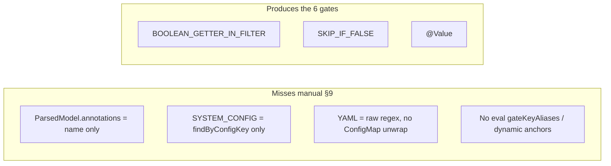
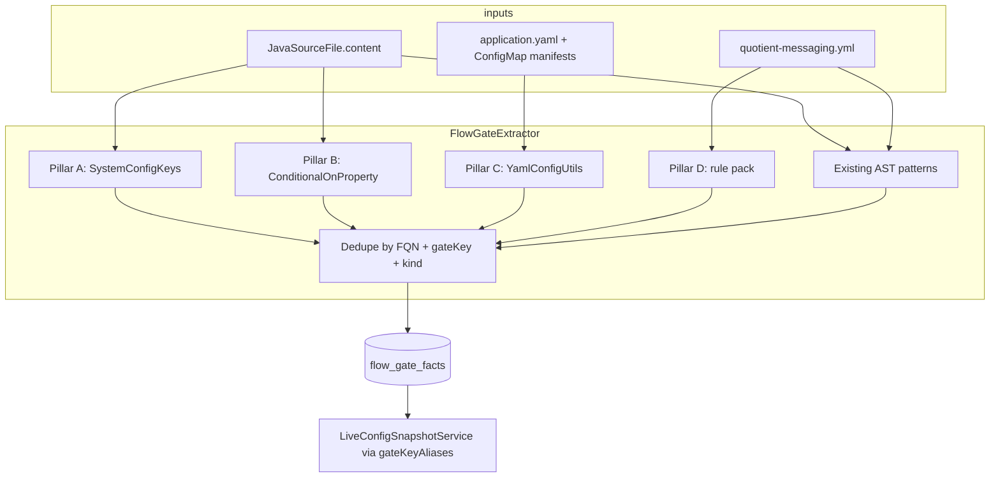

# TestSeer BL-052 — FlowGateExtractor alignment with Manual §9 (partner / system config gates)

> **Status:** Shipped (BL-052 pillars A–D)  
> **Backlog:** BL-052 · **Feature:** [26-flow-gate-manual-s9.md](features/26-flow-gate-manual-s9.md)  
> **Component:** C14 `FlowGateExtractor` extension  
> **Related:** [BL-050](TestSeer_BL050_Kafka_Messaging_Graph_Design.md) (orthogonal — Kafka graph) · [BL-051 HTTP Pub/Sub hop](TestSeer_HTTP_PubSub_EventFlow_Hop_Design.md) (orthogonal — notification egress) · [15-live-flow-gates.md](features/15-live-flow-gates.md) · [TestSeer_Consistency_Catalog_S06_S12_Design.md](TestSeer_Consistency_Catalog_S06_S12_Design.md) § C14  
> **Evidence:** `DesignDocuments/Docs/TransactionEvalConsumer_ServiceGraph_GapAnalysis.md` §6 · Manual §9 in `TransactionEvalConsumer_ServiceGraph_Manual.md`  
> **Author / date:** 2026-06-15

---

## 1. Executive summary

Manual §9 lists **behavior switches** (Spring flags + `system_configuration` keys) that gate transaction-eval paths. Pre-BL-052, TestSeer indexed **6 gates** on `transaction.eval` (`IsDiscounted`, `isTrustedPartner`, `@Value` retry count, etc.) — expected for the prior extractor scope.

Gap analysis §6: manual has **partner-config breadth**; TestSeer adds **AST guards** manual did not list (`IsDiscounted`). Closing manual §9 parity requires four extractor extensions:

| Pillar | What | Primary unlock |
|--------|------|----------------|
| **A** | `SystemConfigKeys` → `SYSTEM_CONFIG` regex | `SkipEvaluationEnabled`, `TrustedRedemptionEnabled`, workbench flags |
| **B** | `@ConditionalOnProperty` from Java **source** | `kafka.topics.stxn.pipeline.enabled` on `TransactionEvalConsumer` |
| **C** | ConfigMap YAML unwrap via `YamlConfigUtils` | Same kafka flag from K8s manifests |
| **D** | Rule-pack anchors + `gateKeyAliases` | Dynamic keys, live overlay, flow-step wiring, string-constant configs |

**Pillars A–C are necessary; Pillar D is the curation layer** that makes extracted gates **actionable** across query surfaces (live config, event-flow, cross-repo linker) without unsafe regex explosion.

**Pilot:** `platform-transaction-eval-consumer` / `transaction-eval-suite` (`0bab295f-1ce4-441e-a9ad-d29c547490d8`).

---

## 2. Problem statement

### 2.1 What manual §9 expects

From `TransactionEvalConsumer_ServiceGraph_Manual.md` §9:

| Config key | Effect |
|------------|--------|
| `kafka.topics.stxn.pipeline.enabled` | Enables consumer bean |
| `SkipEvaluationEnabled` (per partner) | Skip eval → publish processed only |
| `TrustedRedemptionEnabled` | Skips fraud + pattern on default path |
| `StcRealtimePatternCheckEnabled` / `ReceiptRealtimePatternCheckEnabled` | Pattern-check Kafka publish |
| `TransactionFraudRules` / `STCTransactionFraudRules` | Fraud-rules Kafka when non-empty |
| `IS_WORKBENCH_REST_SUBMISSION_ENABLED` | Workbench REST vs legacy path |
| `scannedUpcBasedEvaluation`, `RemoveReceiptDiscountedLineItems`, etc. | Receipt-path behavior |
| `CONDITIONAL_STACKING_OFFERIDS` | COS retry eval |
| `PersistTrainingData` | BQ training on correction |
| `stc-retry.max-retry-count` | STC retry queue max |

### 2.2 What TestSeer indexes today (expected)

From gap analysis §6 / `TransactionEvalConsumer_ServiceGraph_TestSeer.md` §7:

| guardedSymbolFqn | gateKey | source |
|------------------|---------|--------|
| `DefaultTxnEvalProcessor` | `isTrustedPartner=true` | `SKIP_IF_FALSE` on local boolean |
| `DefaultTxnEvalProcessor` | `IsDiscounted` | AST stream filter |
| `ReceiptTxnEvalProcessor` | `IsDiscounted` | AST |
| `CorrectedTxnEvalProcessor` | `IsDiscounted`, `itemCodeInPossibleProduct=true` | AST |
| `TransactionEvaluationService` | `stc-retry.max-retry-count` | `@Value` |

**Verdict until BL-052:** 6 gates = correct for prior `FlowGateExtractor` scope.  
**After BL-052 + re-index:** manual §9 keys indexed via pillars A–D (~12–18 gates on `transaction.eval`, deduped).

### 2.3 Root causes



| Gap | Example | Why |
|-----|---------|-----|
| Annotation text lost | `@ConditionalOnProperty("kafka.topics.stxn.pipeline.enabled")` | `JavaParserService` stores annotation **names** only |
| Wrong config idiom | `isConfigEnabled(partnerId, SystemConfigKeys.SkipEvaluationEnabled.name())` | Regex only matches `findByConfigKey("...")` |
| ConfigMap nesting | kafka enabled in `*.config-map.yaml` | `extractYamlGates` does not call `YamlConfigUtils` |
| Dynamic / indirect keys | Fraud rules ternary; `CONDITIONAL_STACKING_OFFERIDS` string constant | Not stable single-line `SystemConfigKeys.X.name()` pattern |

---

## 3. Goals and non-goals

### Goals

| ID | Goal |
|----|------|
| FG-01 | `isConfigEnabled` / `config(..., SystemConfigKeys.X)` → `SYSTEM_CONFIG` with enum name as `gateKey` |
| FG-02 | `@ConditionalOnProperty` from source text |
| FG-03 | YAML gates via `YamlConfigUtils.expandAndFlatten` |
| FG-04 | Rule-pack entries for eval keys + live-config aliases |
| FG-05 | Preserve §11.11 AST gates (`IsPublished`, `IsDiscounted`, Freedom `insertedBy`) |

### Non-goals

- Per-partner live values at index time (`LiveConfigSnapshotService` at query time)
- Full JavaParser AST for all `ConfigService` overloads
- Replacing manual doc or BL-050 Kafka inventory

---

## 4. Pillar A — `SystemConfigKeys` → `SYSTEM_CONFIG`

**Where:** `FlowGateExtractor.extractCodeGates()` — new patterns after existing `findByConfigKey` block.

**Patterns:**

```java
isConfigEnabled\s*\(\s*[^,]+,\s*SystemConfigKeys\.(\w+)\.name\(\)\s*\)
isConfigEnabled\s*\(\s*SystemConfigKeys\.(\w+)\.name\(\)\s*\)
isBannerOrPartnerLevelSystemConfigEnabled\s*\([^,]+,\s*[^,]+,\s*SystemConfigKeys\.(\w+)\.name\(\)
config(?:OrDefault)?\s*\([^)]*SystemConfigKeys\.(\w+)\.(?:name|toString)\(\)
```

**Emitted fact:**

```
gateKind:          SYSTEM_CONFIG
gateKey:           SkipEvaluationEnabled    // enum constant name
requiredValue:     true | non-empty
requiredOperator:  EQ | EXISTS
effectWhenFail:    SKIP | NO_PUBLISH
testPrecondition:  "system_configuration.<key> …" (+ partnerScoped note when applicable)
evidenceSource:    JAVA_AST
confidence:        0.90
```

**Dedup:** Prefer `SYSTEM_CONFIG` / `TrustedRedemptionEnabled` over `SKIP_IF_FALSE` / `isTrustedPartner=true` on the same FQN.

---

## 5. Pillar B — `@ConditionalOnProperty` from source

**Problem:** `extractAnnotationGates` reads `ParsedModel.annotations()` which contains only `ConditionalOnProperty`, not the property key.

**Fix:** Parse class-level annotations from `JavaSourceFile.content` (same approach as `KafkaListenerTriggerExtractor`).

**Patterns:**

```java
@ConditionalOnProperty("kafka.topics.stxn.pipeline.enabled")
@ConditionalOnProperty(name = "kafka.topics.stxn.pipeline.enabled", havingValue = "true")
```

**Emitted fact:**

```
gateKind:          CONDITIONAL_BEAN
gateKey:           kafka.topics.stxn.pipeline.enabled
requiredValue:     true
effectWhenFail:    NO_BEAN
guardedSymbolFqn:  TransactionEvalConsumer
evidenceSource:    JAVA_ANNOTATION
```

Move extraction out of broken `extractAnnotationGates(ParsedModel)` path; keep unit tests on source snippets.

---

## 6. Pillar C — ConfigMap YAML unwrap

**Replace** naive `extractYamlGates` line scan with:

```java
for (ConfigFile file : yamlFiles) {
  for (FlatMapSource src : YamlConfigUtils.expandAndFlatten(file.path(), file.content())) {
    // emit YAML_FLAG for *.enabled keys in flattened map
  }
}
```

**Effects:**

- Surfaces `kafka.topics.stxn.pipeline.enabled` from nested ConfigMap `data.application.yaml`
- Env lane via `EnvLaneResolver`
- Shares implementation with BL-050 `YamlKafkaTopicExtractor`

**Dedup:** When Java `CONDITIONAL_BEAN` and YAML `YAML_FLAG` share a key, keep one fact on the guarded class; attach `yamlPath` for evidence.

---

## 7. Pillar D — Rule-pack entries (why we need it)

Pillars A–C automate extraction from code and YAML. **Pillar D is still required** because several manual §9 gates are either **not extractable safely by regex alone** or **not useful to agents until curated metadata is attached**.

### 7.1 Dynamic key selection (regex cannot pick one gate)

`FraudRulesEvaluationHelper` does not call `isConfigEnabled(SystemConfigKeys.TransactionFraudRules.name())`. It assigns the enum to a variable:

```java
SystemConfigKeys fraudRules = isSTC ?
    SystemConfigKeys.STCTransactionFraudRules : SystemConfigKeys.TransactionFraudRules;
if (!configService.config(partnerId, fraudRules.name()).orElse("").isEmpty()) {
    // publish fraud event
}
```

Pillar A regex on `SystemConfigKeys.(\w+).name()` **does not fire** — the enum constant is not inline in the call. A naive “match any `SystemConfigKeys` reference in file” rule would emit **both** keys on every class touch, creating false positives.

**Pillar D fix:** `codeGateRules` anchor on the method/file with `gateKeyFromGroup` or two explicit rules:

```yaml
- pattern: 'SystemConfigKeys\.(STCTransactionFraudRules|TransactionFraudRules)'
  gateKind: SYSTEM_CONFIG
  gateKeyFromGroup: 1
  requiredValue: non-empty
  operator: EXISTS
  effectWhenFail: SKIP
  testPrecondition: "Fraud rules config populated for partner (STC vs non-STC key)"
```

This is the same pattern already used for Freedom `insertedBy=FREEDOM` — **domain knowledge the generic extractor cannot infer**.

### 7.2 String-constant config keys (not `SystemConfigKeys` enum)

`CONDITIONAL_STACKING_OFFERIDS` is read via a **local string constant**, not `SystemConfigKeys`:

```java
// ConditionalOfferStackingHelper.java
private static final String ConditionStackingOffersConfigKey = "CONDITIONAL_STACKING_OFFERIDS";
```

Pillar A explicitly targets `SystemConfigKeys.*` idioms. Extending regex to all `configService.config(...)` string literals would match hundreds of unrelated keys platform-wide.

**Pillar D fix:** Optional `declaredGates` (or scoped `codeGateRules`) in `quotient-messaging.yml` for manual §9 keys that use string constants — curated, low false-positive rate.

### 7.3 `gateKeyAliases` — bridge index gates → live DB (BL-027)

Indexed `gateKey` must map to `system_configuration.config_key` for `LiveConfigSnapshotService`:

- Partner-scoped keys need `partnerScoped: true` (SkipEvaluationEnabled is per `partnerId`)
- Spring property `kafka.topics.stxn.pipeline.enabled` is **not** in `system_configuration` — alias marks `envScoped: true`
- Some extracted keys need explicit `configKey` when gateKey differs from DB column naming

Without Pillar D aliases, pillars A–C produce static facts with `liveStatus: UNKNOWN` forever — agents see gates but cannot answer “is this enabled in PDN today?”

### 7.4 `flowStep` wiring for eval hops

`classFlowStepRules` attach `guardedFlowStep` (e.g. `EVAL_STC`) so gates appear on the right event-flow / cross-repo hop via `CrossRepoGateLinker` (C15). FQN substring `transaction.eval` is not in today’s rule pack; without:

```yaml
classFlowStepRules:
  - match: transaction.eval
    flowStep: EVAL_STC
```

gates index correctly but **do not surface** on pipeline trace preconditions.

### 7.5 Effect and precondition semantics (curated, not inferred)

For some keys, `effectWhenFail` is domain-specific:

| Key | effectWhenFail | Hard to infer from AST |
|-----|----------------|------------------------|
| `SkipEvaluationEnabled` | `SKIP` (eval body) + processed-only publish | Requires method-context analysis |
| `IS_WORKBENCH_REST_SUBMISSION_ENABLED` | `NO_PUBLISH` on X6 path | Exit-point semantics |
| Fraud rules | `SKIP` on X4 | Empty config = no fraud event |

Rule-pack `codeGateRules` / `declaredGates` set `testPrecondition` text aligned with manual §9 — same role as Freedom gate today.

### 7.6 What Pillar D is *not*

| Misconception | Reality |
|---------------|---------|
| “Duplicate all manual §9 in YAML” | Only keys A–C miss or mis-label |
| “Replace pillars A–C” | D supplements; FREEDOM gate already proves hybrid model |
| “Required day one” | Phased: P1–P3 deliver most keys; P4 aliases + fraud anchor for live overlay parity |

### 7.7 Pillar D deliverables

```yaml
classFlowStepRules:
  - match: transaction.eval
    flowStep: EVAL_STC

codeGateRules:
  - pattern: 'SystemConfigKeys\.(STCTransactionFraudRules|TransactionFraudRules)'
    flowStep: EVAL_STC
    gateKind: SYSTEM_CONFIG
    gateKeyFromGroup: 1
    requiredValue: non-empty
    operator: EXISTS
    effectWhenFail: SKIP
    confidence: 0.88

gateKeyAliases:
  SkipEvaluationEnabled:
    configKey: SkipEvaluationEnabled
    partnerScoped: true
  TrustedRedemptionEnabled:
    configKey: TrustedRedemptionEnabled
    partnerScoped: true
  StcRealtimePatternCheckEnabled:
    configKey: StcRealtimePatternCheckEnabled
    partnerScoped: true
  ReceiptRealtimePatternCheckEnabled:
    configKey: ReceiptRealtimePatternCheckEnabled
    partnerScoped: true
  TransactionFraudRules:
    configKey: TransactionFraudRules
    partnerScoped: true
  STCTransactionFraudRules:
    configKey: STCTransactionFraudRules
    partnerScoped: true
  IS_WORKBENCH_REST_SUBMISSION_ENABLED:
    configKey: IS_WORKBENCH_REST_SUBMISSION_ENABLED
  kafka.topics.stxn.pipeline.enabled:
    configKey: kafka.topics.stxn.pipeline.enabled
    envScoped: true

# Optional phase-2
declaredGates:
  - classFqn: com.quotient.platform.transaction.eval.helper.ConditionalOfferStackingHelper
    gateKind: SYSTEM_CONFIG
    gateKey: CONDITIONAL_STACKING_OFFERIDS
    requiredValue: non-empty
    operator: EXISTS
    effectWhenFail: SKIP
    flowStep: EVAL_STC
```

**Schema note:** `gateKeyFromGroup` and `declaredGates` are small extensions to `MessagingRulePack` / loader — mirror existing `requiredValueFromGroup` on `CodeGateRule`.

---

## 8. Architecture (index time)



No Flyway migration. `FlowGateFact` columns unchanged.

---

## 9. Manual §9 acceptance matrix (pilot)

| Manual §9 key | Pillar | Expected FQN | gateKind |
|---------------|--------|--------------|----------|
| `kafka.topics.stxn.pipeline.enabled` | B (+ C) | `TransactionEvalConsumer` | `CONDITIONAL_BEAN` |
| `SkipEvaluationEnabled` | A | `TransactionEvaluationService` | `SYSTEM_CONFIG` |
| `TrustedRedemptionEnabled` | A | `DefaultTxnEvalProcessor` | `SYSTEM_CONFIG` |
| `StcRealtimePatternCheckEnabled` | A | `DefaultTxnEvalProcessor` | `SYSTEM_CONFIG` |
| `ReceiptRealtimePatternCheckEnabled` | A | `ReceiptTxnEvalProcessor` | `SYSTEM_CONFIG` |
| `TransactionFraudRules` / `STCTransactionFraudRules` | **D** | `FraudRulesEvaluationHelper` | `SYSTEM_CONFIG` |
| `IS_WORKBENCH_REST_SUBMISSION_ENABLED` | A | `ReceiptTxnEvalProcessor` | `SYSTEM_CONFIG` |
| `scannedUpcBasedEvaluation` | A | `ReceiptTxnEvalProcessor` | `SYSTEM_CONFIG` |
| `RemoveReceiptDiscountedLineItems` | A | `ReceiptTxnEvalProcessor` | `SYSTEM_CONFIG` |
| `CONDITIONAL_STACKING_OFFERIDS` | **D** | `ConditionalOfferStackingHelper` | `SYSTEM_CONFIG` |
| `PersistTrainingData` | A | `CorrectedTxnEvalProcessor` | `SYSTEM_CONFIG` |
| `stc-retry.max-retry-count` | existing | `TransactionEvaluationService` | `CODE_FLAG` |
| `IsDiscounted` (TestSeer value-add) | existing AST | processors | `BUSINESS_RULE` |

**Before BL-052 + re-index:** 6 gates on `transaction.eval` = expected (prior extractor).  
**After BL-052 + re-index:** ~12–18 gates (manual §9 + AST extras, deduped).

---

## 10. Phasing

| Phase | Delivers |
|-------|----------|
| **P1** | Pillar A + dedup vs `SKIP_IF_FALSE` |
| **P2** | Pillar B — consumer enablement |
| **P3** | Pillar C — ConfigMap yaml (shared with BL-050) |
| **P4** | Pillar D — aliases, fraud anchor, `EVAL_STC` flowStep, optional `declaredGates` |
| **P5** | Re-index pilot; update gap analysis §6 |

---

## 11. Tests

| Test | Covers |
|------|--------|
| `extract_systemConfigKeys_partnerScoped` | `SkipEvaluationEnabled` snippet |
| `extract_conditionalOnProperty_fromSource` | `TransactionEvalConsumer` header |
| `extract_yamlConfigMap_enabledFlag` | config-map fragment |
| `dedup_trustedRedemption_over_isTrustedPartner` | Dedup policy |
| `extract_fraudRules_dynamicKey` | Pillar D `codeGateRules` |
| `regression_isDiscounted_unchanged` | §11.11 |
| `regression_freedomInsertedBy` | Existing rule-pack gate |

---

## 12. Relationship to other work

| Item | Relationship |
|------|----------------|
| **BL-050** | Orthogonal (Kafka graph); shares `YamlConfigUtils` |
| **C14 / §11.11** | BL-052 extends shipped AST patterns |
| **BL-027 live gates** | Pillar D `gateKeyAliases` required for `liveStatus` |
| **Gap analysis §6** | Mark missing manual keys as “expected until BL-052” |

---

## 13. One-line verdict

**Pillars A–C** automate the common Quotient config idioms. **Pillar D** is the curation layer for dynamic keys, string-constant configs, live-config mapping, and eval flow-step wiring. **BL-052 shipped** — re-index `transaction-eval-suite` to populate `flow_gate_facts`.
