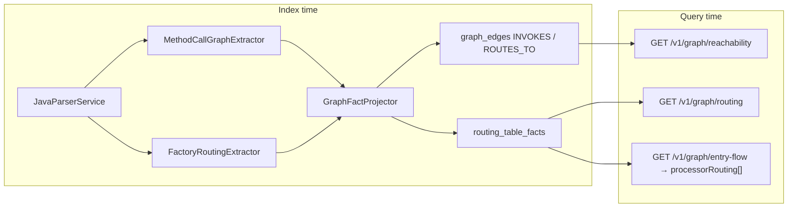

# BL-053 — Processor routing & intra-service call graph

> **Status:** Implemented (2026-06-15)  
> **Backlog:** BL-053 · extends [BL-050](TestSeer_BL050_Kafka_Messaging_Graph_Design.md) **KFK-04**  
> **Pilot:** `platform-transaction-eval-consumer` / `transaction-eval-suite` (`ProcessorFactory` → Default | Receipt | Corrected)  
> **Related:** [04-graph-projection.md](features/04-graph-projection.md) · [24-kafka-messaging-and-graph-gaps.md](features/24-kafka-messaging-and-graph-gaps.md) · external gap analysis `DesignDocuments/Docs/TransactionEvalConsumer_ServiceGraph_GapAnalysis.md`

## Problem

Manual service graph for transaction-eval-consumer documents:

```
TransactionEvalConsumer → TransactionEvaluationService → ProcessorFactory
  → DefaultTxnEvalProcessor | ReceiptTxnEvalProcessor | CorrectedTxnEvalProcessor
```

TestSeer before BL-053:

| Gap | Cause |
|-----|--------|
| No processor fan-out | `ProcessorFactory` wires processors in `@PostConstruct` `Map.put`, not static calls |
| `@Resource` beans invisible | `JavaParserService` only indexed `@Autowired` fields |
| Method chains missing | No `MethodCallExpr` extraction — only field-use `INVOKES` heuristic |
| `reachability?type=class&serviceId=UUID` empty | API passed raw `serviceId` instead of `{serviceId}::class::{fqn}` |
| No routing query | No `ROUTES_TO` edge type or `routing_table_facts` |

## Solution overview



## Index-time artifacts

### ParsedModel extensions

| Field | Source |
|-------|--------|
| `fieldInjections` | `@Autowired` / `@Resource` / `@Inject` (+ bean name) |
| `methodCalls` | Bounded `MethodCallExpr` on public handler methods |
| `factoryRouting` | `@PostConstruct` map `put` + `orElse` fallback |
| `componentBeanName` | `@Component("…")` / `@Service` value |

### Graph nodes & edges

| Node id | `node_type` | Example |
|---------|-------------|---------|
| `{serviceId}::class::{fqn}` | `CLASS` | `…::class::…ProcessorFactory` |
| `{serviceId}::method::{fqn#method}` | `METHOD` | `…::method::…TransactionEvalConsumer#processSalesCanonicalEvent` |

| Edge | Meaning |
|------|---------|
| `INVOKES` | Class or method → class (field use + method calls) |
| `ROUTES_TO` | Factory class → processor implementation class |

### `routing_table_facts` (V19)

Persists discriminator key → target processor per factory (`factory_class_fqn`, `routing_key`, `target_bean`, `target_class_fqn`, `fallback`).

### Rule pack

`config/rule-packs/quotient-routing.yml` — bean name → class FQN for `defaultTxnEvalProcessor`, `receiptTxnEvalProcessor`, `correctedTxnEvalProcessor`; factory metadata for `ProcessorFactory`.

Config key: `testseer.routing.rule-pack-path` in `application.yml`.

## Query API

### `GET /v1/graph/reachability` (fixed + extended)

| Param | Role |
|-------|------|
| `serviceId` | Required — freshness scope |
| `type` | `service` (default), `class`, or `method` |
| `symbolFqn` | Resolves class/method anchor when `nodeId` omitted |
| `methodName` | With `symbolFqn` + `type=method` |
| `nodeId` | Explicit graph node id |
| `depth` | Method traversal cap (default 6) |

**Breaking fix:** `type=class` without `symbolFqn`/`nodeId` returns **400** (no longer treats UUID as class node id).

**Examples:**

```bash
# Class reachability from orchestrator
curl "http://localhost:8080/v1/graph/reachability?serviceId=0bab295f-...&type=class&symbolFqn=com.quotient.platform.transaction.eval.service.TransactionEvaluationService"

# Method chain from Kafka consumer handler
curl "http://localhost:8080/v1/graph/reachability?serviceId=0bab295f-...&type=method&symbolFqn=com.quotient.platform.transaction.eval.consumer.TransactionEvalConsumer&methodName=processSalesCanonicalEvent&depth=4"
```

### `GET /v1/graph/routing` (new)

```bash
curl "http://localhost:8080/v1/graph/routing?serviceId=0bab295f-...&factoryFqn=com.quotient.platform.transaction.eval.processors.ProcessorFactory"
```

Response: `data.factories[]` with `selectorMethod`, `discriminatorType`, `routes[]` (`routingKey`, `targetClassFqn`, `fallback`).

### `GET /v1/graph/entry-flow` (additive)

`data.processorRouting[]` — `PROCESSOR_ROUTING` steps with `factoryFqn`, `possibleProcessors[]` (from `ProcessorRoutingEnricher`).

## Pilot acceptance (after re-index)

| # | Assertion |
|---|-----------|
| AC-R1 | `neighborhood?symbolFqn=…TransactionEvaluationService` includes `ProcessorFactory` |
| AC-R2 | `routing?factoryFqn=…ProcessorFactory` returns ≥3 processor routes + fallback |
| AC-R3 | `reachability?type=class&symbolFqn=…DefaultTxnEvalProcessor` reaches producer classes |
| AC-R4 | `reachability?type=method` from `TransactionEvalConsumer#processSalesCanonicalEvent` depth ≥4 reaches a processor |
| AC-R5 | `type=class` without `symbolFqn` → 400 |

## Implementation map

| Class | Role |
|-------|------|
| `MethodCallGraphExtractor` | Field injections + method call edges |
| `FactoryRoutingExtractor` | PostConstruct map routing |
| `GraphFactProjector` | Projects INVOKES, ROUTES_TO, METHOD nodes; writes `routing_table_facts` |
| `GraphProjectionService` | Traverses `ROUTES_TO`; `methodForward()` |
| `GraphRoutingService` | `/v1/graph/routing` |
| `ProcessorRoutingEnricher` | Entry-flow `processorRouting[]` |
| `RoutingRulePackLoader` | `quotient-routing.yml` |

## Limitations

- No whole-program points-to — routing is static index + rule pack, not runtime `TransactionSource` proof
- `List<Processor>` / switch-based routers need rule-pack overrides (phase 2)
- Full JavaParser call graph capped at 200 calls/method; skips `log.*`, `Optional.*`, etc.
- Re-index required — old graphs lack `ROUTES_TO` and `routing_table_facts`

## Related backlog

| ID | Relationship |
|----|--------------|
| BL-050 KFK-04 | Parent graph-hardening goal; BL-053 delivers processor routing slice |
| BL-051 | Orthogonal — HTTP Pub/Sub event-flow hop (do not confuse with BL-053) |
| BL-052 | Orthogonal — FlowGate manual §9 partner config gates |
