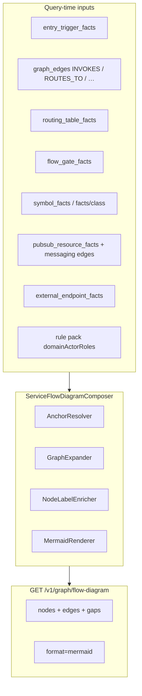

# BL-054 — Service flow diagram composer (manual graph parity)

> **Status:** Ready (spec)  
> **Backlog:** BL-054 · **Master implementation:** [TestSeer_BL050_BL054_Master_Implementation_Design.md](TestSeer_BL050_BL054_Master_Implementation_Design.md) · extends [BL-053](TestSeer_BL053_Processor_Routing_CallGraph_Design.md) · depends on [BL-050](TestSeer_BL050_Kafka_Messaging_Graph_Design.md) egress (partial)  
> **Pilot:** `platform-transaction-eval-consumer` / `transaction-eval-suite`  
> **Evidence:** `DesignDocuments/Docs/TransactionEvalConsumer_ServiceGraph_GapAnalysis.md` · manual `TransactionEvalConsumer_ServiceGraph_Manual.md` §5–§6 vs TestSeer `TransactionEvalConsumer_ServiceGraph_TestSeer.md`

## Problem

Manual service graphs for Quotient consumers document a **single composed view**:

- Kafka ingress → handler method → orchestration chain → processor fan-out → messaging/HTTP exits
- **Method nodes** (`processSalesCanonicalEvent`, `evaluateTransactionEvent`, …)
- **External domain actors** with roles (`TransactionHelper` = URT/redeem, `STCRetryQueueDao` = retry persistence, …)
- **Conditional edge labels** tied to config gates
- **Mermaid** diagram (manual §6)

TestSeer after BL-053 indexes the same **17 consumer classes** and exposes the facts **across separate APIs**:

| Capability | API | Pilot state (2026-06-16) |
|------------|-----|--------------------------|
| Class inventory + annotations | `GET /v1/facts/class` | ✓ 17 classes |
| Processor routing | `GET /v1/graph/routing` | ✓ matches manual §7 |
| Intra-service edges | `graph_edges` (`INVOKES`, `ROUTES_TO`, `DEPENDS_ON`) | ✓ populated after re-index |
| Depth-1 neighbors | `GET /v1/graph/neighborhood?symbolFqn=…` | ✓ non-empty (e.g. 22 nodes from `TransactionEvaluationService`) |
| Transitive code path | `GET /v1/graph/reachability?type=class\|method&symbolFqn=…` | ✓ when queried correctly; **empty** with default `type=service` |
| Kafka ingress | `GET /v1/graph/entry-flow` | ✓ T1 linked |
| Messaging egress | `GET /v1/graph/event-flow` | ✗ 0 steps (BL-050 pending) |
| Reverse handler → trigger | `GET /v1/graph/entry-flow/impact` | ✗ empty (TRG-13 gap) |
| **Composed Mermaid / flow view** | — | **Missing** |

**Gap owner:** TestSeer product — not index failure. Agents and comparison docs call `reachability` with bare `serviceId` (`type=service`), which only traverses cross-service `CALLS` edges and returns empty for monolith-style consumers.

## Goal

Deliver a **query-time composer** that assembles an agent- and human-readable **service flow diagram** from existing facts + graph projection, equivalent to manual §6 for the pilot and generalizable to other Quotient services.

**Non-goals (BL-054):**

- Full whole-program points-to analysis
- Replacing manual narrative (when processed events fire, ack+retry semantics)
- Runtime proof of which `TransactionSource` branch executed

## Requirement IDs (SFD-01–SFD-20)

| ID | Requirement | Priority |
|----|-------------|----------|
| SFD-01 | `GET /v1/graph/flow-diagram` returns composed flow for a service anchor | Must |
| SFD-02 | Response includes structured `nodes[]` and `edges[]` with stable ids | Must |
| SFD-03 | Optional `format=mermaid` returns renderable Mermaid `flowchart` text | Must |
| SFD-04 | Anchor resolution: `triggerId`, `handlerFqn`, `symbolFqn`, or `nodeId` | Must |
| SFD-05 | Include primary ingress hop from `entry_trigger_facts` / entry-flow | Must |
| SFD-06 | Include transitive code path via `INVOKES` + `ROUTES_TO` (BL-053) | Must |
| SFD-07 | Include processor fan-out from `routing_table_facts` when factory in scope | Must |
| SFD-08 | Include messaging egress hops (`PUBLISHES_TO`, `SUBSCRIBES_TO`) when indexed | Should |
| SFD-09 | Include outbound HTTP symbols / `external_endpoint_facts` as exit nodes | Should |
| SFD-10 | Merge `facts/class` annotations onto class nodes (`@ConditionalOnProperty`, …) | Must |
| SFD-11 | Tag external / suite-domain classes with **role** from rule pack | Must |
| SFD-12 | Attach **gate keys** to edges where `flow_gate_facts` guards the source symbol | Should |
| SFD-13 | `moduleFilter` / `packagePrefix` to limit diagram to consumer module (e.g. `transaction.eval`) | Must |
| SFD-14 | `depth` cap for transitive expansion (default 6) | Must |
| SFD-15 | `gaps[]` in response listing missing layers (messaging, reverse impact, unresolved URL) | Must |
| SFD-16 | Document reachability query contract: `type=class\|method` + `symbolFqn` required | Must |
| SFD-17 | MCP tool `testseer_get_service_flow_diagram` | Should |
| SFD-18 | Fix TRG-13: `entry-flow/impact` returns triggers for linked Kafka handler | Must |
| SFD-19 | Integration test on `transaction-eval-suite` fixture | Must |
| SFD-20 | Optional `viz.html` "Service flow" tab consuming same API | Could |

**Traceability:** Maps to [REQUIREMENTS.md](../../docs/REQUIREMENTS.md) **GRP-12–GRP-20**.

## Solution overview



## API design

### `GET /v1/graph/flow-diagram`

| Param | Required | Description |
|-------|----------|-------------|
| `serviceId` | Yes | Freshness scope |
| `orgId` | No | Default `quotient` |
| `anchor` | One of | `triggerId` \| `handlerFqn` \| `symbolFqn` \| `nodeId` |
| `packagePrefix` | No | e.g. `com.quotient.platform.transaction.eval` — filters nodes/edges |
| `depth` | No | Transitive expansion cap (default 6) |
| `includeMessaging` | No | Default `true` — add Kafka/Pub/Sub hops when facts exist |
| `includeExternalDomain` | No | Default `true` — include suite helpers (XN* actors) |
| `includeGates` | No | Default `true` — edge gate labels |
| `format` | No | `json` (default) \| `mermaid` |

**Example (pilot):**

```bash
SVC=bd0d2428-0810-4f79-9928-a8366cd74dc1

# Primary business ingress → full consumer flow
curl -s "http://localhost:8080/v1/graph/flow-diagram?orgId=quotient&serviceId=$SVC\
&anchor=triggerId:kafka:quot.sales.transaction.pipeline.events:com.quotient.platform.transaction.eval.consumer.transactionevalconsumer\
&packagePrefix=com.quotient.platform.transaction.eval&format=mermaid"

# Handler-anchored (method subgraph)
curl -s "http://localhost:8080/v1/graph/flow-diagram?orgId=quotient&serviceId=$SVC\
&anchor=handlerFqn:com.quotient.platform.transaction.eval.consumer.TransactionEvalConsumer.processSalesCanonicalEvent\
&depth=4"
```

### Response shape (`format=json`)

```json
{
  "schemaVersion": "1.0",
  "freshnessStatus": "CURRENT",
  "data": {
    "serviceId": "…",
    "anchor": { "kind": "TRIGGER", "triggerId": "kafka:…", "linkedHandlerFqn": "…TransactionEvalConsumer.processSalesCanonicalEvent" },
    "nodes": [
      {
        "nodeId": "…::class::…TransactionEvalConsumer",
        "kind": "CLASS",
        "symbolFqn": "com.quotient.platform.transaction.eval.consumer.TransactionEvalConsumer",
        "simpleName": "TransactionEvalConsumer",
        "moduleScope": "consumer",
        "role": "KAFKA_IN",
        "annotations": ["Component", "ConditionalOnProperty"],
        "gates": [{ "gateKey": "kafka.topics.stxn.pipeline.enabled", "effectWhenFail": "NO_BEAN" }]
      },
      {
        "nodeId": "…::method::…TransactionEvalConsumer#processSalesCanonicalEvent",
        "kind": "METHOD",
        "symbolFqn": "com.quotient.platform.transaction.eval.consumer.TransactionEvalConsumer#processSalesCanonicalEvent"
      },
      {
        "nodeId": "…::class::…evaluation.common.helper.TransactionHelper",
        "kind": "CLASS",
        "symbolFqn": "com.quotient.platform.evaluation.common.helper.TransactionHelper",
        "moduleScope": "external-domain",
        "role": "URT_REDEEM_ORCHESTRATOR"
      },
      {
        "nodeId": "quotient:topic:…:QUOT.SALES.TRANSACTION.PROCESSED.EVENTS",
        "kind": "TOPIC",
        "shortId": "QUOT.SALES.TRANSACTION.PROCESSED.EVENTS",
        "transport": "KAFKA"
      }
    ],
    "edges": [
      { "from": "…TOPIC:PIPELINE…", "to": "…TransactionEvalConsumer", "edgeType": "SUBSCRIBES_TO", "label": "ingress" },
      { "from": "…TransactionEvalConsumer", "to": "…TransactionEvaluationService", "edgeType": "INVOKES" },
      { "from": "…ProcessorFactory", "to": "…DefaultTxnEvalProcessor", "edgeType": "ROUTES_TO", "label": "BI_SALES_TRANSACTION|fallback" },
      { "from": "…DefaultTxnEvalProcessor", "to": "…TOPIC:PROCESSED…", "edgeType": "PUBLISHES_TO", "label": "X1" }
    ],
    "gaps": [
      { "gapType": "NO_MESSAGING_HOP", "shortId": "QUOT.REBATE.REDEEM.EVENTS", "description": "Producer not linked in event-flow (BL-050)" }
    ],
    "stats": { "nodeCount": 24, "edgeCount": 31, "consumerClassCount": 17 }
  }
}
```

### Mermaid rendering rules (`format=mermaid`)

Mirror manual §6 layout:

1. `subgraph entry` — trigger/topic → consumer class or handler method
2. `subgraph core` — `TransactionEvaluationService` → `ProcessorFactory`
3. `subgraph processors` — `ROUTES_TO` fan-out (not collapsed to single edge)
4. `subgraph exits` — topics, HTTP clients, data-access store groups (optional fourth subgraph)
5. Node labels: `simpleName` + optional `role` badge; method nodes as `Class#method`
6. Dashed edges for gate-guarded paths with `gateKey` in label
7. Annotate `@ConditionalOnProperty` on ingress consumer node

## Index-time extensions (phased)

### Phase A — Query-only (no new extractors)

Sufficient for pilot **core path** if BL-053 graph is populated:

- Compose from `entry-flow` + `reachability?type=method` + `routing` + `neighborhood` + `facts/class`
- External domain nodes appear via `DEPENDS_ON` / `INVOKES` to suite classes

### Phase B — Semantic enrichment

| Change | Class / artifact | Delivers |
|--------|------------------|----------|
| **Domain actor roles** | `config/rule-packs/quotient-domain-actors.yml` | SFD-11 — map FQN → `role` (XN001–XN007 equivalents) |
| **Method node index** | Extend `MethodCallGraphExtractor` or `symbol_facts` | All public handler methods on indexed classes, not only call-graph seeds |
| **Gate on edge** | `FlowGateEdgeProjector` | `GUARDED_BY` or edge metadata `gateKey` when `if (config.getX())` precedes invoke |
| **TRG-13 fix** | `EntryFlowImpactService` | `entry-flow/impact` returns T1 for `processSalesCanonicalEvent` (SFD-18) |

### Phase C — Egress completeness (BL-050 / BL-051 dependency)

| Exit (manual) | Composer source |
|---------------|-----------------|
| X1–X5 Kafka | `PUBLISHES_TO` from Kafka producer linker (BL-050) |
| X6 Workbench | `OUTBOUND_TO` + `external_endpoint_facts` |
| X7 Pub/Sub notification | `HTTP_PUBSUB` publish facts (BL-051) |
| X10 stores | Optional `data-access` summary nodes grouped by `physicalName` |

## Rule pack: domain actor roles

New file `config/rule-packs/quotient-domain-actors.yml` (pilot excerpt):

```yaml
domainActors:
  - classFqn: com.quotient.platform.evaluation.common.helper.TransactionHelper
    role: URT_REDEEM_ORCHESTRATOR
    manualNodeId: XN001
  - classFqn: com.quotient.platform.redemption.helper.transaction.TransactionEvaluationHelper
    role: OFFER_EVAL_ENGINE
    manualNodeId: XN002
  - classFqn: com.quotient.platform.evaluation.common.helper.ReceiptWorkbenchHelper
    role: WORKBENCH_SUBMISSION
    manualNodeId: XN003
  - classFqn: com.quotient.platform.evaluation.common.helper.BigQueryHelper
    role: BIGQUERY_STATE
    manualNodeId: XN004
  - classFqn: com.quotient.platform.cache.offers.rebate.service.RebateOfferCacheService
    role: REDIS_OFFER_CACHE
    manualNodeId: XN005
  - classFqn: com.quotient.platform.cache.configuration.system.service.ConfigService
    role: PARTNER_CONFIG
    manualNodeId: XN006
  - classFqn: com.quotient.platform.redemption.dao.STCRetryQueueDao
    role: STC_RETRY_PERSISTENCE
    manualNodeId: XN007

consumerRoles:
  - packagePrefix: com.quotient.platform.transaction.eval.consumer
    defaultRole: KAFKA_IN
  - packagePrefix: com.quotient.platform.transaction.eval.processors
    defaultRole: PROCESSOR
  - packagePrefix: com.quotient.platform.transaction.eval.producer
    defaultRole: KAFKA_PRODUCER
```

Config key: `testseer.domain-actors.rule-pack-path` (parallel to `testseer.routing.rule-pack-path`).

## Implementation map

| Class | Role |
|-------|------|
| `ServiceFlowDiagramComposer` | Orchestrates expansion + enrichment |
| `FlowDiagramAnchorResolver` | Maps `anchor` param → start node(s) |
| `FlowDiagramGraphExpander` | BFS over `INVOKES`, `ROUTES_TO`, messaging edges |
| `DomainActorRoleEnricher` | Applies rule pack roles |
| `FlowDiagramMermaidRenderer` | `format=mermaid` |
| `GraphQueryController` | REST endpoint |
| `EntryFlowImpactService` | TRG-13 fix (SFD-18) |

## Pilot acceptance criteria

After re-index `transaction-eval-suite` on backend with BL-053 + Flyway current:

| # | Assertion |
|---|-----------|
| AC-F1 | `flow-diagram?anchor=triggerId:…pipeline…&packagePrefix=…transaction.eval` returns ≥17 consumer class nodes |
| AC-F2 | Response includes method node `TransactionEvalConsumer#processSalesCanonicalEvent` |
| AC-F3 | Core chain present: Consumer → EvaluationService → ProcessorFactory → ≥3 processors |
| AC-F4 | `format=mermaid` renders without parse errors; contains `ProcessorFactory` and three processor names |
| AC-F5 | External domain: `TransactionHelper` node with `role=URT_REDEEM_ORCHESTRATOR` |
| AC-F6 | `TransactionEvalConsumer` node includes `@ConditionalOnProperty` annotation |
| AC-F7 | `gaps[]` lists messaging topics not yet in `event-flow` when BL-050 incomplete |
| AC-F8 | `entry-flow/impact?handlerFqn=…processSalesCanonicalEvent` returns T1 trigger (SFD-18) |
| AC-F9 | `reachability?type=service&serviceId=…` documented as cross-service only; comparison docs use `type=class\|method` |

## Comparison doc guidance (SFD-16)

Update agent skills and gap analysis scripts to **never** use bare `GET /v1/graph/reachability?serviceId=…` for intra-service parity. Standard query set:

```bash
# Transitive code path
GET /v1/graph/reachability?type=method&symbolFqn=…TransactionEvalConsumer&methodName=processSalesCanonicalEvent&depth=4

# One-hop deps
GET /v1/graph/neighborhood?symbolFqn=…TransactionEvaluationService

# Composed view (BL-054)
GET /v1/graph/flow-diagram?anchor=triggerId:…&packagePrefix=…transaction.eval&format=mermaid
```

## Dependencies

| Item | Relationship |
|------|--------------|
| BL-053 | **Required** — `INVOKES`, `ROUTES_TO`, method nodes, `/graph/routing` |
| BL-050 | **Partial** — Kafka `PUBLISHES_TO` / `SUBSCRIBES_TO` for full exit subgraph |
| BL-051 | **Partial** — HTTP Pub/Sub notification exit hop |
| BL-052 | **Done** — gate facts for node/edge labels |
| TRG-13 / BL-020 | **SFD-18** — reverse impact for handler anchor |
| Manual gap doc | Acceptance reference |

## Risks

| Risk | Mitigation |
|------|------------|
| Diagram too large for suite index | `packagePrefix` + `depth` defaults; collapse `evaluation-domain` to role-labeled stubs |
| Mermaid label escaping | Sanitize `#`, quotes; use `simpleName` in nodes |
| Duplicate class nodes (short FQN bug) | Normalize to full FQN in composer; dedupe by `symbolFqn` |
| False parity claim before BL-050 | Always emit `gaps[]`; never silent omit of egress |

## Effort estimate

| Phase | Scope | Estimate |
|-------|-------|----------|
| P1a | Composer + JSON + Mermaid + pilot AC (Phase A) | 3–4 d |
| P1b | Domain actor rule pack + TRG-13 fix | 1–2 d |
| P1c | Gate edge labels + MCP tool | 1–2 d |
| P2 | viz.html tab + data-access exit subgraph | 2–3 d |

## Related reading

- [04-graph-projection.md](features/04-graph-projection.md)
- [11-entry-triggers.md](features/11-entry-triggers.md)
- [24-kafka-messaging-and-graph-gaps.md](features/24-kafka-messaging-and-graph-gaps.md)
- [TestSeer_BL053_Processor_Routing_CallGraph_Design.md](TestSeer_BL053_Processor_Routing_CallGraph_Design.md)
- `DesignDocuments/Docs/TransactionEvalConsumer_ServiceGraph_GapAnalysis.md`
