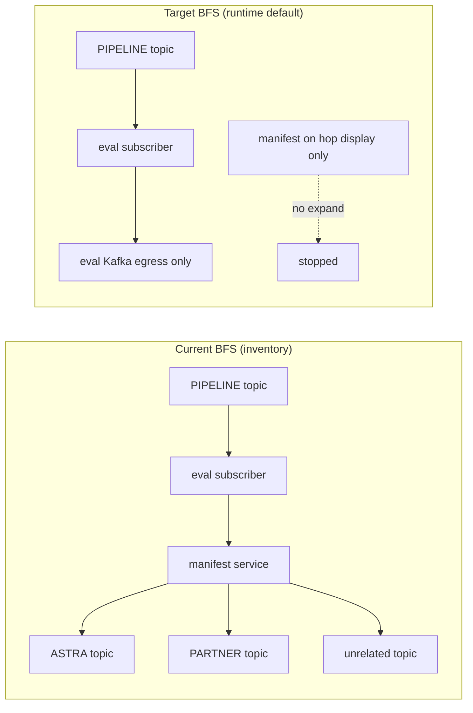

# TestSeer BL-055 / BL-057 — Cross-repo BFS scope & gap taxonomy

> **Status:** Ready for implementation  
> **Backlog:** [BL-055](../../docs/BACKLOG.md) · [BL-057](../../docs/BACKLOG.md)  
> **Issues:** [TE-GAP-11](features/28-transaction-eval-graph-gap-issues.md#te-gap-11-cross-repo-bfs-manifest-fan-out) · [TE-GAP-13](features/28-transaction-eval-graph-gap-issues.md#te-gap-13-terminal-external-topic-gap-taxonomy)  
> **Depends on:** [BL-056](features/28-transaction-eval-graph-gap-issues.md#te-gap-12-cross-repo-hop-participant-dedupe) (`CrossRepoFlowPresenter`, structured `FlowGap`) — **partial shipped**  
> **Parent:** [Option C messaging](Option_C_Messaging_Flow.md) · [BL-050 P0](TestSeer_BL050_P0_Implementation_Design.md)  
> **Pilot:** `QUOT.SALES.TRANSACTION.PIPELINE.EVENTS` · `DEV_T.NOTIFICATION_REQ` · `quotient-full` bundle  
> **Author / date:** 2026-06-16

---

## 1. Executive summary

Cross-repo trace (`GET /v1/graph/event-flow/cross-repo`) is **functionally correct on hop 1** for the transaction-eval pilot but **misleading on hops 2–12** because:

1. **BL-055 (TE-GAP-11):** BFS expands by **service inventory**, not causal chain — manifest subscribers pull hundreds of unrelated topics into the trace.
2. **BL-057 (TE-GAP-13):** Gap detector emits generic **`NO_SUBSCRIBER`** for partner/manifest boundary topics where no indexed consumer exists by design.

| Backlog | Issue | Deliverable |
|---------|-------|-------------|
| **BL-055** | TE-GAP-11 | Scoped BFS: default `followMode=runtime`; manifest/catalog subscribers visible on hops but **not** expanded |
| **BL-057** | TE-GAP-13 | `CrossRepoGapClassifier`: `MANIFEST_ONLY_PUBLISHER`, `TERMINAL_EXTERNAL`, reserved `NO_SUBSCRIBER` |

**Non-goals:** Per-env commit resolution (future); replacing `TerminalHopEnricher` DLQ continuations; indexing partner-side ASTRA consumers.

---

## 2. Problem statement

### 2.1 Observed behavior (pilot, 2026-06-16)

| Start topic | Hop 1 | Hops 2–12 | Gap noise |
|-------------|-------|-----------|-----------|
| `QUOT.SALES.TRANSACTION.PIPELINE.EVENTS` | ✓ `transaction-eval-suite` subscriber | `PDN_T.*.ASTRA`, partner topics via manifest fan-out | `NO_SUBSCRIBER` × N |
| `DEV_T.NOTIFICATION_REQ` | ✓ eval + receipt publishers | Same manifest trees | `NO_SUBSCRIBER` on ASTRA |

### 2.2 Root cause (confirmed in code)

Current BFS enqueue (simplified):

```141:147:testseer-backend/src/main/java/io/testseer/backend/query/MessagingFlowService.java
            for (PubSubOrgView sub : subscribers) {
                all.stream()
                        .filter(p -> p.serviceId().equals(sub.serviceId()) && "PUBLISH".equals(p.role()))
                        .map(PubSubOrgView::shortId)
                        .map(topicAliases::canonical)
                        .filter(t -> !visitedTopics.contains(t))
                        .forEach(queue::add);
            }
```

For **every** subscriber on hop *N*, **all** `PUBLISH` rows for that `serviceId` enter the queue. `platform-argocd-manifest` is indexed as a pipeline subscriber (YAML / rule-pack) and owns manifest-only publish facts for partner egress topics with **no** runtime Java consumer in `quotient-full`.

### 2.3 Target mental model



**Hop display** may still list manifest participants (audit). **Queue expansion** must not walk their full publish inventory unless `followMode=inventory` or `includeManifest=true`.

---

## 3. Scope

### In scope

| ID | Requirement | Backlog |
|----|-------------|---------|
| MSG-12-R1 | Do not BFS-follow manifest/catalog-only subscribers unless opted in | BL-055 |
| MSG-12-R2 | Follow only runtime subscribers (`linkedClassFqn` or `entry_trigger_facts`) | BL-055 |
| MSG-12-R3 | Query param `followMode` (`runtime` \| `inventory` \| `causal`) | BL-055 |
| MSG-14-R1 | `MANIFEST_ONLY_PUBLISHER` when all publishers YAML-only, no linked class | BL-057 |
| MSG-14-R2 | `TERMINAL_EXTERNAL` for rule-pack / pattern partner boundaries | BL-057 |
| MSG-14-R3 | `NO_SUBSCRIBER` only when runtime publisher exists, consumer repo missing | BL-057 |
| — | Rule-pack `crossRepoTrace` section | Both |
| — | Unit + integration tests; OpenAPI; MCP param forward | Both |

### Out of scope

- BL-056 remainder (viz-only polish — shipped)
- Env-lane filtering on `pubsub_resource_facts` (explicitly deferred)
- Indexing external partner repos
- `causal` mode graph `PUBLISHES_TO` wiring (phase 2 of MSG-12-R3 — spec only in v1)

---

## 4. BL-055 — BFS scope design

### 4.1 API surface

Extend `GET /v1/graph/event-flow/cross-repo`:

| Param | Type | Default | Description |
|-------|------|---------|-------------|
| `followMode` | enum | `runtime` | How to enqueue next-hop topics from subscribers |
| `includeManifest` | boolean | `false` | Deprecated alias: when `true`, equivalent to `followMode=inventory` for manifest repos |

`MessagingFlowService.traceCrossRepo(...)` gains `CrossRepoTraceOptions options` (or overload with `followMode`).

MCP `testseer_trace_topic_flow` forwards `followMode` when `crossRepo=true`.  
Entry-flow `crossRepo=true` path forwards same (TRG-12 chain).

### 4.2 `followMode` semantics

| Mode | Subscriber filter | Egress topic filter | Use case |
|------|-------------------|---------------------|----------|
| **`runtime`** (default) | `isRuntimeSubscriber(sub)` | All `PUBLISH` for that `serviceId` (manifest excluded at subscriber step) | Production triage, agents, viz |
| **`inventory`** | None (current behavior) | All `PUBLISH` per subscriber service | Infra audit, “what could this service emit?” |
| **`causal`** | `isRuntimeSubscriber(sub)` | Only topics with `PUBLISHES_TO` edge from subscriber handler **or** publisher row sharing `linkedClassFqn` with subscriber | Stricter lane trace (v1.1 if graph edges thin) |

**v1 implementation:** ship `runtime` + `inventory`; `causal` returns `400` with message “not yet implemented” **or** falls back to `runtime` with `traceWarnings[]` — prefer **fallback + warning** to avoid breaking clients.

### 4.3 Runtime subscriber classification

New component: `CrossRepoFollowPolicy` (`io.testseer.backend.query`).

```java
public final class CrossRepoFollowPolicy {
    record Context(
        Set<String> manifestOnlyRepos,
        Map<String, Set<String>> entryTriggersByServiceId, // preloaded once per trace
        String followMode
    ) {}

    boolean shouldExpandFrom(PubSubOrgView subscriber, Context ctx);
    List<String> egressTopicsToEnqueue(
        PubSubOrgView subscriber,
        List<PubSubOrgView> allFacts,
        KafkaTopicAliasIndex aliases,
        Context ctx);
}
```

**`isRuntimeSubscriber(sub)`** — true when **any** of:

| Tier | Rule | Confidence |
|------|------|------------|
| A | `linkedClassFqn != null` and not blank | High |
| B | `entry_trigger_facts` row: same `service_id`, trigger kind ∈ `{PUBSUB_SUBSCRIBE, KAFKA_SUBSCRIBE}`, topic matches hop (alias-aware) | High |
| C | `pubSubClassLinks` / `kafkaClassLinks` rule-pack match for service+topic | Medium |

**`isManifestOnlySubscriber(sub)`** — true when **all** of:

- `repo` ∈ `manifestOnlyRepos` (rule-pack + workspace), **or**
- `service_registry.module_type = 'library'` (never expand), **or**
- subscribe fact has `evidenceSource ∈ {YAML, MANIFEST}` and `linkedClassFqn` empty and no entry trigger (Tier B false)

Default: manifest-only subscribers appear on **`CrossRepoHop.subscribers`** but **`shouldExpandFrom` returns false** unless `followMode=inventory`.

### 4.4 Manifest repo registry

**Source of truth (layered):**

1. **Rule pack** `quotient-messaging.yml`:

```yaml
crossRepoTrace:
  manifestOnlyRepos:
    - platform-argocd-manifest
  # Optional: repos that are YAML-only deploy descriptors
  catalogOnlyRepos: []
```

2. **Workspace catalog** — `serviceModules` with `indexDdl: false` and yaml-only `sourceRoots` (e.g. `platform-argocd-manifest`) auto-merge into manifest set at runtime via `WorkspaceCatalogService`.

3. **Override** `?includeManifest=true` for one-shot inventory trace.

No DB migration.

### 4.5 Algorithm change

Replace inner BFS loop body:

```java
CrossRepoFollowPolicy policy = CrossRepoFollowPolicy.load(
    messagingRulePack, workspaceCatalog, orgId, followMode, entryTriggersIndex);

for (PubSubOrgView sub : subscribers) {
    if (!policy.shouldExpandFrom(sub, ctx)) continue;
    for (String topic : policy.egressTopicsToEnqueue(sub, all, topicAliases, ctx)) {
        if (!visitedTopics.contains(topic)) queue.add(topic);
    }
}
```

**`egressTopicsToEnqueue` for `runtime`:** same as today (all publish short ids for service) but only called for runtime subscribers.

**`egressTopicsToEnqueue` for `inventory`:** current behavior for all subscribers.

### 4.6 Report metadata

Add optional fields on `CrossRepoFlowReport` (additive):

| Field | Type | Purpose |
|-------|------|---------|
| `followMode` | string | Echo query param |
| `traceWarnings` | string[] | e.g. `"causal mode fell back to runtime"` |
| `skippedExpansionCount` | int | Manifest/catalog subscribers not expanded |

`CrossRepoFlowPresenter` appends to `narrative`:

```
BFS followMode=runtime · skipped 1 manifest subscriber expansion(s)
```

### 4.7 Acceptance (TE-GAP-11)

```bash
PIPELINE="QUOT.SALES.TRANSACTION.PIPELINE.EVENTS"
curl -s "$BASE/v1/graph/event-flow/cross-repo?orgId=$ORG&bundle=quotient-full&shortId=$PIPELINE&maxHops=5" \
  | jq '{followMode: .data.followMode, topics: [.data.hops[].topicShortId], astra: ([.data.hops[].topicShortId[] | select(test("ASTRA"))] | length)}'
```

**Pass:** `astra == 0`; topics ⊆ `{PIPELINE, eval egress kafka topics}`.

**Inventory mode regression:**

```bash
curl -s "$BASE/v1/graph/event-flow/cross-repo?...&followMode=inventory&maxHops=12" \
  | jq '.data.hops | length'
```

**Pass:** ≥ previous hop count (manifest fan-out preserved when explicitly requested).

---

## 5. BL-057 — Gap taxonomy design

### 5.1 Gap type catalog

| `gapType` | When | `NO_SUBSCRIBER` replacement? |
|-----------|------|------------------------------|
| `NO_PUBLISHER` | No publisher indexed for topic | — (unchanged) |
| `NO_PUBLISHER_INDEX_GAP` | Bundle repos missing from index | — |
| `NO_SUBSCRIBER` | Runtime publisher(s) exist, zero subscribers, consumer **should** be in bundle | **Reserved** per MSG-14-R3 |
| `NO_SUBSCRIBER_INDEX_GAP` | Same + `missingBundleRepos` non-empty | — |
| **`MANIFEST_ONLY_PUBLISHER`** | Publisher(s) exist, **all** manifest-only (YAML, no `linkedClassFqn`), zero subscribers | **Yes** |
| **`TERMINAL_EXTERNAL`** | Topic matches `terminalTopics` pattern / partner boundary, zero subscribers | **Yes** |
| `TERMINAL_BATCH_RETRY` | Existing — DLQ + cron continuation (`TerminalHopEnricher`) | Coexists |
| `GCP_*` | Live verify | — |

### 5.2 Classifier component

New: `CrossRepoGapClassifier` (`io.testseer.backend.query`).

```java
public final class CrossRepoGapClassifier {
    record TopicContext(
        String topicShortId,
        int hopOrder,
        List<PubSubOrgView> publishers,
        List<PubSubOrgView> subscribers,
        List<String> missingBundleRepos,
        CrossRepoTraceRulePack rules
    ) {}

    Optional<FlowGap> classifyMissingSubscriber(TopicContext ctx);
    // publisher gaps unchanged initially
}
```

**Decision tree** (`classifyMissingSubscriber`):

```
if subscribers not empty → empty
if publishers empty → NO_PUBLISHER* (existing helper)
if all publishers manifest-only → MANIFEST_ONLY_PUBLISHER
else if topic matches terminalTopics → TERMINAL_EXTERNAL
else if any publisher is runtime (linkedClassFqn or JAVAPARSER evidence) 
        and missingBundleRepos non-empty → NO_SUBSCRIBER_INDEX_GAP
else if any publisher is runtime → NO_SUBSCRIBER
else → MANIFEST_ONLY_PUBLISHER  // conservative fallback
```

**`isManifestOnlyPublisher(pub)`:**

- `linkedClassFqn` null/blank **and**
- `evidenceSource` ∈ `{YAML, MANIFEST}` **or** `repo` ∈ `manifestOnlyRepos`

**`isRuntimePublisher(pub)`:** negation of manifest-only **or** `linkedClassFqn` present **or** `evidenceSource` ∈ `{JAVAPARSER, RULE_PACK, SPRING_INDEX}`.

### 5.3 Rule pack: `crossRepoTrace.terminalTopics`

```yaml
crossRepoTrace:
  manifestOnlyRepos:
    - platform-argocd-manifest
  terminalTopics:
    - id: partner-astra
      pattern: "*.ASTRA"           # glob on topicShortId after canonical alias
      boundary: PARTNER_EXTERNAL
      note: "Partner adapter ingress; consumer outside quotient-full"
    - id: partner-notification-egress
      pattern: "*.PARTNER_NOTIFICATION"
      boundary: PARTNER_EXTERNAL
    - id: freedom-activate
      pattern: "PDN_T.ACTIVATE_OFFER.ASTRA"
      boundary: PARTNER_EXTERNAL
    - id: freedom-redeem
      pattern: "PDN_T.REDEEM_OFFER.ASTRA"
      boundary: PARTNER_EXTERNAL
    - id: payment-handler-astra
      pattern: "PDN_T.PAYMENT.HANDLER.ASTRA"
      boundary: PARTNER_EXTERNAL
```

`MessagingRulePack` new records:

```java
public record CrossRepoTraceRule(
    List<String> manifestOnlyRepos,
    List<TerminalTopicRule> terminalTopics
) {}

public record TerminalTopicRule(
    String id,
    String pattern,      // glob: * and ? 
    String boundary,     // PARTNER_EXTERNAL | EGRESS_ONLY
    String note
) {}
```

Pattern matcher: `TopicGlobMatcher` — case-sensitive on canonical short id.

### 5.4 Interaction with `TerminalHopEnricher`

**Order in `traceCrossRepo` (unchanged position, updated contracts):**

1. BFS + hop gaps via `CrossRepoGapClassifier` (not raw `subscriberGap()`)
2. `enrichCrossRepoHops` / `firstHopEnricher`
3. `TerminalHopEnricher.enrich` — update filter to suppress `NO_SUBSCRIBER` **and** `TERMINAL_EXTERNAL` when DLQ continuation resolves; emit `TERMINAL_BATCH_RETRY` as today
4. Live verify gaps
5. `CrossRepoFlowPresenter`

`TerminalHopEnricher` gap filter today:

```java
.filter(gap -> !( "NO_SUBSCRIBER".equals(gap.gapType()) && resolvedTopics...))
```

**Change to:**

```java
.filter(gap -> !( SUBSCRIBER_GAP_TYPES.contains(gap.gapType()) && resolvedTopics...))
// SUBSCRIBER_GAP_TYPES = NO_SUBSCRIBER, TERMINAL_EXTERNAL
```

### 5.5 `FlowGap` enrichment (optional v1.1)

Add nullable `boundary` string on `FlowGap` for `TERMINAL_EXTERNAL` / `MANIFEST_ONLY_PUBLISHER` (`PARTNER_EXTERNAL`, `MANIFEST_CATALOG`). Defer if OpenAPI churn is a concern — `description` carries `note` from rule pack in v1.

### 5.6 Narrative / MCP / viz

`CrossRepoFlowPresenter.buildNarrative` gap section uses new types verbatim.  
MCP `formatGapLine` already prints `gapType` — no change required.  
Viz gap badges: optional icon map `MANIFEST_ONLY_PUBLISHER` → 📋, `TERMINAL_EXTERNAL` → ⇢.

### 5.7 Acceptance (TE-GAP-13)

```bash
curl -s "$BASE/v1/graph/event-flow/cross-repo?orgId=$ORG&shortId=$PIPELINE&maxHops=12&followMode=inventory" \
  | jq '[.data.gaps[] | select(.topicShortId|test("ASTRA")) | .gapType] | unique'
```

**Pass (with inventory mode to reach ASTRA hops):**  
`["MANIFEST_ONLY_PUBLISHER"]` or `["TERMINAL_EXTERNAL"]` — **not** `NO_SUBSCRIBER`.

With **default `runtime` mode**, ASTRA hops should not appear; gaps for ASTRA should be **empty** (preferred pilot outcome).

---

## 6. Implementation plan

| PR | Scope | Est. | Files (primary) |
|----|-------|------|-----------------|
| **PR-1** | Rule pack + `MessagingRulePack` types + loader | 0.5 d | `quotient-messaging.yml`, `MessagingRulePack.java` |
| **PR-2** | BL-055 `CrossRepoFollowPolicy` + API param | 1 d | `MessagingFlowService`, `MessagingQueryController`, `openapi.yaml` |
| **PR-3** | BL-057 `CrossRepoGapClassifier` + `TerminalHopEnricher` tweak | 1 d | `MessagingFlowService`, `TerminalHopEnricher`, `CrossRepoFlowPresenter` |
| **PR-4** | Tests + MCP + docs | 0.5 d | `MessagingFlowIntegrationTest`, `tools.test.mjs`, gap registry |

**Recommended merge order:** PR-1 → PR-2 → PR-3 → PR-4 (PR-2 and PR-3 can parallelize after PR-1).

### 6.1 Test matrix

| Test | Assert |
|------|--------|
| `CrossRepoFollowPolicyTest` | manifest subscriber not expanded in `runtime`; expanded in `inventory` |
| `CrossRepoGapClassifierTest` | ASTRA + YAML publishers → `TERMINAL_EXTERNAL` or `MANIFEST_ONLY_PUBLISHER` |
| `MessagingFlowIntegrationTest` | seed manifest + eval; `maxHops=5` runtime → no ASTRA topic |
| `TerminalHopEnricherTest` | suppresses `TERMINAL_EXTERNAL` when DLQ match |
| `MessagingQueryControllerTest` | `followMode` echoed on report |

---

## 7. OpenAPI changes

`CrossRepoFlowReport` properties: `followMode`, `traceWarnings`, `skippedExpansionCount`.

`GET /v1/graph/event-flow/cross-repo` parameters: `followMode`, `includeManifest`.

`FlowGap.gapType` description enum extended (documentation only — string remains open).

---

## 8. Acceptance criteria

| ID | BL | Check | Pass |
|----|-----|-------|------|
| **CR-AC-1** | BL-055 | Pipeline trace `followMode=runtime`, `maxHops=5` | Zero hop topics matching `ASTRA`; `skippedExpansionCount ≥ 1` when manifest on hop 1 |
| **CR-AC-2** | BL-055 | Same trace `followMode=inventory`, `maxHops=12` | Hop count ≥ pre-change baseline (manifest fan-out preserved) |
| **CR-AC-3** | BL-057 | Inventory trace reaches ASTRA topics | `gaps[].gapType` for ASTRA ∈ `{MANIFEST_ONLY_PUBLISHER, TERMINAL_EXTERNAL}` — not `NO_SUBSCRIBER` |
| **CR-AC-4** | BL-056 | Notification `maxHops=1` | `pubCount == |unique publishers by serviceName|` |
| **CR-AC-5** | BL-056 | Any cross-repo trace | `narrative[]` non-empty; `gaps[]` have `hopOrder` + `topicShortId` where topic known |
| **CR-AC-6** | BL-055/057 | `mvn test` | `CrossRepoFollowPolicyTest`, `CrossRepoGapClassifierTest`, `MessagingFlowIntegrationTest` green |

---

## 9. Pilot validation script

Run after PR-1–4 merge + `quotient-full` index on localhost:8080.

```bash
#!/usr/bin/env bash
set -euo pipefail
ORG=quotient
BASE=http://localhost:8080
BUNDLE=quotient-full
PIPELINE="QUOT.SALES.TRANSACTION.PIPELINE.EVENTS"
NOTIFY="DEV_T.NOTIFICATION_REQ"

echo "=== CR-AC-1 BL-055 runtime BFS (no ASTRA fan-out) ==="
curl -s "$BASE/v1/graph/event-flow/cross-repo?orgId=$ORG&bundle=$BUNDLE&shortId=$PIPELINE&maxHops=5&followMode=runtime" \
  | jq '{followMode: .data.followMode, hopCount: (.data.hops|length), topics: [.data.hops[].topicShortId],
         astraHops: ([.data.hops[].topicShortId | select(test("ASTRA"))] | length),
         skippedExpansion: .data.skippedExpansionCount}'

echo "=== CR-AC-2 BL-055 inventory mode regression ==="
RUNTIME_HOPS=$(curl -s "$BASE/v1/graph/event-flow/cross-repo?orgId=$ORG&bundle=$BUNDLE&shortId=$PIPELINE&maxHops=12&followMode=runtime" \
  | jq '.data.hops | length')
INVENTORY_HOPS=$(curl -s "$BASE/v1/graph/event-flow/cross-repo?orgId=$ORG&bundle=$BUNDLE&shortId=$PIPELINE&maxHops=12&followMode=inventory" \
  | jq '.data.hops | length')
echo "runtime_hops=$RUNTIME_HOPS inventory_hops=$INVENTORY_HOPS (expect inventory >= runtime)"

echo "=== CR-AC-3 BL-057 gap taxonomy (inventory reaches ASTRA) ==="
curl -s "$BASE/v1/graph/event-flow/cross-repo?orgId=$ORG&bundle=$BUNDLE&shortId=$PIPELINE&maxHops=12&followMode=inventory" \
  | jq '[.data.gaps[] | select(.topicShortId != null and (.topicShortId|test("ASTRA"))) | {hopOrder, gapType, topicShortId}]'

echo "=== CR-AC-4 BL-056 hop dedupe (notification hop 1) ==="
curl -s "$BASE/v1/graph/event-flow/cross-repo?orgId=$ORG&bundle=$BUNDLE&shortId=$NOTIFY&maxHops=1" \
  | jq '.data.hops[0] | {pubCount: (.publishers|length), pubServices: ([.publishers[].serviceName] | unique)}'

echo "=== CR-AC-5 BL-056 narrative + structured gaps ==="
curl -s "$BASE/v1/graph/event-flow/cross-repo?orgId=$ORG&bundle=$BUNDLE&shortId=$PIPELINE&maxHops=8&followMode=runtime" \
  | jq '{narrativeLines: (.data.narrative|length), sampleGap: .data.gaps[0] | {gapType, hopOrder, topicShortId}}'
curl -s "$BASE/v1/graph/event-flow/cross-repo?orgId=$ORG&bundle=$BUNDLE&shortId=$PIPELINE&maxHops=8&followMode=runtime" \
  | jq -r '.data.narrative[]' | head -20

echo "=== CR-AC-6 unit tests ==="
# From testseer-backend/: JAVA_HOME=... mvn test -Dtest=CrossRepoFollowPolicyTest,CrossRepoGapClassifierTest,MessagingFlowIntegrationTest
```

**Manual pass review:**

| AC | Expected |
|----|----------|
| CR-AC-1 | `astraHops == 0`; hop 1 includes eval subscriber |
| CR-AC-2 | `inventory_hops >= runtime_hops` (typically inventory >> runtime) |
| CR-AC-3 | No `gapType == "NO_SUBSCRIBER"` on ASTRA topics |
| CR-AC-4 | `pubCount` equals length of `pubServices` |
| CR-AC-5 | `narrativeLines > 0`; gaps show `hopOrder` when present |

---

## 10. Risks & mitigations

| Risk | Mitigation |
|------|------------|
| Hide real `NO_SUBSCRIBER` behind `TERMINAL_EXTERNAL` | Require runtime publisher for `NO_SUBSCRIBER`; conservative manifest fallback |
| `causal` mode needs `PUBLISHES_TO` coverage | Defer to v1.1; document fallback |
| Operators relied on manifest fan-out | `followMode=inventory` preserves old behavior |
| Rule-pack glob too broad | Start with explicit ASTRA patterns; review in pilot curl sign-off |
| Entry-flow `crossRepo` chain defaults | Forward `followMode=runtime` from entry-flow unless param set |

---

## 11. Sign-off checklist

- [x] PR-1–4 merged
- [x] Pilot script §9 — all CR-AC-1–5 pass (2026-06-16, `quotient-full` index)
- [x] TE-GAP-11, TE-GAP-12, TE-GAP-13 marked **Closed** in [28-transaction-eval-graph-gap-issues.md](features/28-transaction-eval-graph-gap-issues.md)
- [x] BACKLOG BL-055, BL-056, BL-057 → `done`
- [x] CHANGELOG entry

---

## 12. References

| Doc | Purpose |
|-----|---------|
| [28-transaction-eval-graph-gap-issues.md](features/28-transaction-eval-graph-gap-issues.md) | Issue registry MSG-12, MSG-14 |
| [TestSeer_BL050_P0_Implementation_Design.md](TestSeer_BL050_P0_Implementation_Design.md) | Cross-repo baseline |
| [07-option-c-messaging-flow.md](features/07-option-c-messaging-flow.md) | Option C hop model |
| [19-live-pubsub-verify.md](features/19-live-pubsub-verify.md) | GCP gap overlay |
| `DesignDocuments/Docs/TransactionEvalConsumer_ServiceGraph_GapAnalysis.md` | Pilot evidence |
