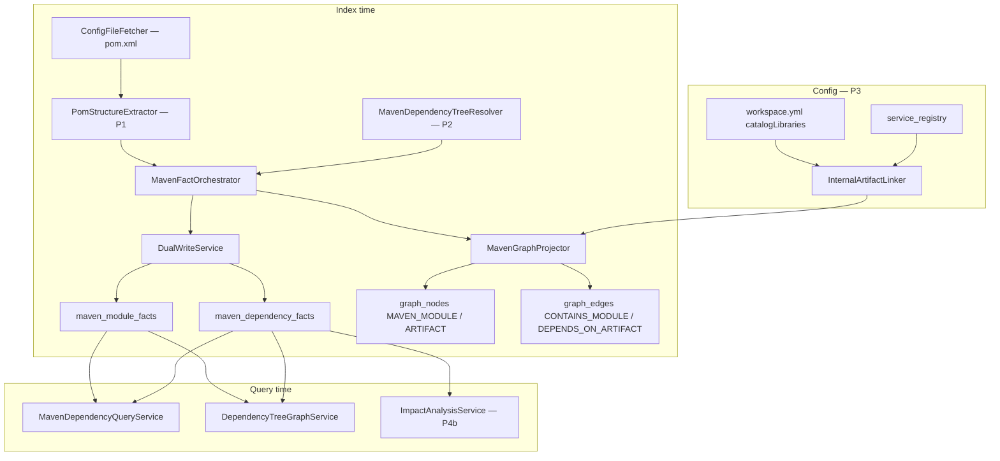

# BL-058 — Maven dependency tree + artifact versioning

> **Status:** Ready for implementation → **Shipped** (2026-06-16)  
> **Backlog:** [BL-058](../../docs/BACKLOG.md)  
> **Feature doc:** [29-maven-dependency-tree.md](features/29-maven-dependency-tree.md)  
> **AC-MVN-4:** [TestSeer_AC_MVN_4_Internal_Artifact_Link_Design.md](TestSeer_AC_MVN_4_Internal_Artifact_Link_Design.md)  
> **Req IDs:** MVN-01–MVN-18  
> **Pilot:** `platform-transaction-eval-consumer` / `transaction-eval-suite` — depends on `com.quotient:platform-evaluation-lib`  
> **Author / date:** 2026-06-16

---

## 1. Executive summary

TestSeer today models **Java-level** dependencies (`DEPENDS_ON`, `INVOKES`, `USES_TYPE`) from source parsing. It does **not** index **Maven artifact** dependencies (GAV coordinates, scopes, transitive closure, module parent/child structure).

BL-058 adds a **new fact layer** at index time — separate from reachability hydration (TE-GAP-02 / KFK-04). Agents and PR impact analysis can answer:

- What JARs does this service declare and resolve at runtime?
- Which downstream services share the same internal library version line?
- Did a PR bump `platform-evaluation-lib` and who else pins that artifact?

| Phase | Effort | Delivers |
|-------|--------|----------|
| **P1** — POM structure | Low | Parse `pom.xml`; `maven_module_facts`; parent/child module tree; direct declared deps (unresolved `${}` flagged) |
| **P2** — Resolved tree | Medium | `mvn -q dependency:tree` (or embedded Maven Resolver) per module; resolved GAV + scope; `DEPENDS_ON_ARTIFACT` edges |
| **P3** — Cross-repo link | Medium | Map internal `com.quotient:*` artifacts → `service_registry` / `workspace.yml` catalog libs |
| **P4** — Query + viz | Low | `GET /v1/graph/dependency-tree`; `GET /v1/facts/maven-dependencies`; hydrate like reachability; flow-diagram tab overlay |
| **P4b** — PR impact | High value | `testseer_get_impact` includes `artifactImpact[]` — downstream services on same artifact version line |

**Index-time note:** `mvn dependency:tree` is slower than JavaParser but runs **once per index job**, cached by `commit_sha` — acceptable.

---

## 2. Problem statement

| Gap | Symptom | Root cause |
|-----|---------|------------|
| No GAV facts | Agent cannot list `platform-evaluation-lib:2.14.0` for eval consumer | Only Java `USES_TYPE` / field injection indexed |
| No module tree | Monorepo parent POM → child modules invisible | `pom.xml` not parsed as facts |
| PR lib bump blind spot | Bumping a shared lib in one repo does not surface cross-repo consumers | No artifact-version index across `service_registry` |
| Confusion with KFK-04 | Reachability hydration returns class `DEPENDS_ON` — not Maven deps | Different edge semantics; must not extend reachability CTE |

**Misdiagnosis to avoid:** Adding Maven edges to class reachability CTEs. `DEPENDS_ON` (class→class) and `DEPENDS_ON_ARTIFACT` (module→GAV) are **orthogonal** layers.

---

## 3. Design principles

1. **Fact layer first** — `maven_module_facts` + `maven_dependency_facts` are source of truth; graph projection is a read-optimized mirror.
2. **Same versioning as other facts** — every row keyed by `org_id`, `service_id`, `commit_sha`, `indexed_at`.
3. **Complement, not replace** — keep `USES_TYPE` for Java-level shared library type usage; Maven facts answer build-time artifact graph.
4. **Graceful degradation** — P1 ships without `mvn` on worker; unresolved properties flagged, not silently dropped.
5. **Scope-aware queries** — `scope=compile|runtime|test` filter at query time; default `runtime` for impact.
6. **Idempotent index** — delete-then-insert per `(service_id, commit_sha)` like other fact tables; clear on index wipe.

---

## 4. Architecture



**Orchestration hook:** `IndexingOrchestrator` calls `MavenFactOrchestrator` after `ConfigFileFetcher` loads `pom.xml` files, **before** `GraphFactProjector` (Java graph). Maven projection uses `MavenGraphProjector` — not `GraphFactProjector`.

---

## 5. Requirements

### 5.1 Goals (MVN-G)

| ID | Requirement | Priority |
|----|-------------|----------|
| MVN-G01 | Index Maven module structure (path, packaging, parent coordinates) per registered service | Must |
| MVN-G02 | Index declared and resolved artifact dependencies with scope and transitivity | Must |
| MVN-G03 | Project module/artifact graph for query-time traversal separate from class reachability | Must |
| MVN-G04 | Version facts by `commit_sha` + `indexed_at` so PR lib bumps appear in impact | Must |
| MVN-G05 | Link internal `com.quotient:*` artifacts to owning service/repo when known | Should |
| MVN-G06 | Expose REST + MCP for agents; optional viz overlay on flow-diagram tab | Should |

### 5.2 Non-goals (MVN-NG)

| ID | Out of scope |
|----|--------------|
| MVN-NG01 | Gradle dependency tree (future BL; detect `build.gradle` → skip or stub) | **BL-059** (P3) |
| MVN-NG02 | Runtime classpath proof (only static index / Maven resolver) |
| MVN-NG03 | Merge Maven `DEPENDS_ON_ARTIFACT` into class `reachability` CTE |
| MVN-NG04 | BOM import transitive management simulation without resolver (P2 uses resolver) |
| MVN-NG05 | Private Nexus auth beyond worker env `settings.xml` |

### 5.3 Index-time (MVN-01–08)

| ID | Requirement | Phase | Acceptance |
|----|-------------|-------|------------|
| MVN-01 | Flyway **`maven_module_facts`** — one row per `pom.xml` in repo scope | P1 | Table exists; rows after index |
| MVN-02 | Flyway **`maven_dependency_facts`** — `from_module_path`, `to_group_id`, `to_artifact_id`, `to_version`, `scope`, `optional`, `transitive`, `resolved` | P1/P2 | Direct deps P1; transitive P2 |
| MVN-03 | `PomStructureExtractor` parses `<parent>`, `<modules>`, `<packaging>`, `<groupId>`, `<artifactId>`, `<version>`, `<dependency>` (declared only) | P1 | Unit tests with fixture POMs |
| MVN-04 | Unresolved `${property}` in GAV → `resolved=false`, `version_literal` preserved, `unresolved_reason` set | P1 | No fake version strings |
| MVN-05 | `MavenDependencyTreeResolver` runs `mvn -q dependency:tree -DoutputType=graphml` (or `-DoutputFile=`) per leaf module; parse GraphML/text | P2 | Skipped when `mvn` absent; `resolution_status=SKIPPED` |
| MVN-06 | `MavenFactOrchestrator` dual-writes facts; idempotent per commit | P1 | Re-index replaces rows |
| MVN-07 | `MavenGraphProjector` → `graph_nodes` (`MAVEN_MODULE`, `ARTIFACT`) + `graph_edges` (`CONTAINS_MODULE`, `DEPENDS_ON_ARTIFACT`) | P1/P2 | Spot-check SQL |
| MVN-08 | Index clear wipes maven facts + maven graph edges for service | P1 | `POST /admin/index/clear` |

### 5.4 Cross-repo link (MVN-09–11)

| ID | Requirement | Phase | Acceptance |
|----|-------------|-------|------------|
| MVN-09 | `InternalArtifactLinker` maps `groupId:artifactId` → `service_id` via `workspace_catalog_library` + registry `repo` name match | P3 | `platform-evaluation-lib` → lib service |
| MVN-10 | `ARTIFACT` node `metadata.linkedServiceId` when link known | P3 | Query returns link |
| MVN-11 | `DEPENDS_ON_ARTIFACT` edge `metadata.crossRepo=true` when target artifact owned by different service | P3 | Eval consumer → eval-lib |

### 5.5 Query-time (MVN-12–15)

| ID | Requirement | Phase | Acceptance |
|----|-------------|-------|------------|
| MVN-12 | `GET /v1/facts/maven-dependencies?serviceId=&modulePath=&scope=&directOnly=` — `ResponseEnvelope` + freshness | P4 | 200 with modules + deps |
| MVN-13 | `GET /v1/graph/dependency-tree?serviceId=&modulePath=&scope=&depth=&hydrate=` — tree or hydrated `nodes[]`/`edges[]` | P4 | Default `scope=runtime`, `hydrate=true` |
| MVN-14 | Redis cache + invalidate on index complete (same key pattern as facts API) | P4 | Cache hit on repeat |
| MVN-15 | `viz.html` flow-diagram tab — optional **Maven deps** panel (module → artifact list) | P4 | Read-only; no new index |

### 5.6 Impact + MCP (MVN-16–18)

| ID | Requirement | Phase | Acceptance |
|----|-------------|-------|------------|
| MVN-16 | `GET /v1/impact/pr` adds `artifactImpact[]`: changed `pom.xml` deps → other services pinning same `groupId:artifactId` (version diff highlighted) | P4b | PR bumping eval-lib lists consumers |
| MVN-17 | MCP `testseer_get_maven_dependencies` → MVN-12 | P4 | JSON same as REST |
| MVN-18 | MCP `testseer_get_dependency_tree` → MVN-13 | P4 | JSON same as REST |

---

## 6. Data model

### 6.1 `maven_module_facts` (V22 — P1)

```sql
CREATE TABLE maven_module_facts (
    org_id              VARCHAR(100)  NOT NULL,
    repo                VARCHAR(255)  NOT NULL,
    service_id          VARCHAR(100)  NOT NULL,
    commit_sha          VARCHAR(64)   NOT NULL,
    module_path         VARCHAR(500)  NOT NULL,   -- '' for root, else 'evaluation-consumers/transaction-eval-consumer'
    relative_pom_path   VARCHAR(500)  NOT NULL,   -- path to pom.xml from repo root
    group_id            VARCHAR(200),
    artifact_id         VARCHAR(200),
    version             VARCHAR(100),
    packaging           VARCHAR(50),
    parent_group_id     VARCHAR(200),
    parent_artifact_id  VARCHAR(200),
    parent_version      VARCHAR(100),
    is_root_module      BOOLEAN       NOT NULL DEFAULT FALSE,
    resolution_status   VARCHAR(50)   NOT NULL DEFAULT 'DECLARED_ONLY',  -- DECLARED_ONLY | RESOLVED | SKIPPED
    evidence_source     VARCHAR(50)   NOT NULL DEFAULT 'pom-xml',
    indexed_at          TIMESTAMPTZ   NOT NULL DEFAULT NOW(),
    PRIMARY KEY (service_id, commit_sha, module_path)
);

CREATE INDEX idx_maven_module_service ON maven_module_facts(service_id, commit_sha);
```

### 6.2 `maven_dependency_facts` (V22 — P1/P2)

```sql
CREATE TABLE maven_dependency_facts (
    org_id              VARCHAR(100)  NOT NULL,
    repo                VARCHAR(255)  NOT NULL,
    service_id          VARCHAR(100)  NOT NULL,
    commit_sha          VARCHAR(64)   NOT NULL,
    from_module_path    VARCHAR(500)  NOT NULL,
    to_group_id         VARCHAR(200)  NOT NULL,
    to_artifact_id      VARCHAR(200)  NOT NULL,
    to_version          VARCHAR(100),              -- null when unresolved
    version_literal     VARCHAR(200),              -- raw POM text incl. ${...}
    scope               VARCHAR(50)   NOT NULL DEFAULT 'compile',
    optional            BOOLEAN       NOT NULL DEFAULT FALSE,
    transitive          BOOLEAN       NOT NULL DEFAULT FALSE,
    resolved            BOOLEAN       NOT NULL DEFAULT FALSE,
    unresolved_reason   VARCHAR(200),
    linked_service_id   VARCHAR(100),              -- P3: owning service for internal artifact
    evidence_source     VARCHAR(50)   NOT NULL,    -- pom-xml | mvn-dependency-tree
    confidence          FLOAT         NOT NULL DEFAULT 0.95,
    indexed_at          TIMESTAMPTZ   NOT NULL DEFAULT NOW(),
  PRIMARY KEY (service_id, commit_sha, from_module_path, to_group_id, to_artifact_id, scope, transitive, COALESCE(to_version, version_literal, ''))
);

CREATE INDEX idx_maven_dep_artifact ON maven_dependency_facts(to_group_id, to_artifact_id, to_version);
CREATE INDEX idx_maven_dep_from ON maven_dependency_facts(service_id, from_module_path);
```

### 6.3 Graph projection

#### Node types

| `node_type` | `id` pattern | Example label |
|-------------|--------------|---------------|
| `MAVEN_MODULE` | `{serviceId}::maven::{modulePath}` | `transaction-eval-consumer` |
| `ARTIFACT` | `gav::{groupId}:{artifactId}:{version}` | `com.quotient:platform-evaluation-lib:2.14.0` |
| `SERVICE` | `{serviceId}` | existing registry row |

Global `ARTIFACT` node ids are **not** service-scoped so cross-repo reverse lookup works. `metadata.serviceId` on module nodes scopes ownership.

#### Edge types

| Edge | From → To | Meaning |
|------|-----------|---------|
| `CONTAINS_MODULE` | Parent module → child module | Reactor / multi-module POM |
| `DEPENDS_ON_ARTIFACT` | `MAVEN_MODULE` → `ARTIFACT` | Declared or transitive Maven dep |
| `USES_TYPE` | `SERVICE` / `CLASS` → type | **Keep** — Java-level; complements Maven |
| `OWNED_BY` (optional P3) | `ARTIFACT` → `SERVICE` | Internal lib ownership |

**Do not reuse** class-level `DEPENDS_ON` for GAV edges.

#### Edge metadata (JSON in `graph_edges.evidence` or dedicated column)

```json
{
  "scope": "compile",
  "optional": false,
  "transitive": true,
  "resolved": true,
  "crossRepo": true,
  "linkedServiceId": "uuid-of-platform-evaluation-lib"
}
```

---

## 7. Index-time components

| # | Class | Package | Phase | Role |
|---|-------|---------|-------|------|
| C1 | `PomStructureExtractor` | `ingestion.maven` | P1 | DOM parse `pom.xml`; modules + declared deps |
| C2 | `MavenDependencyTreeResolver` | `ingestion.maven` | P2 | Shell `mvn` or embedded Resolver API |
| C3 | `MavenDependencyGraphmlParser` | `ingestion.maven` | P2 | GraphML → fact rows |
| C4 | `MavenFactOrchestrator` | `ingestion.maven` | P1 | Orchestrate extractors; build `FactBatch` slice |
| C5 | `MavenGraphProjector` | `graph` | P1 | Project to `graph_nodes` / `graph_edges` |
| C6 | `InternalArtifactLinker` | `ingestion.maven` | P3 | `workspace.yml` + registry lookup |
| C7 | `IndexingOrchestrator` | `ingestion` | P1 | Wire C4 after pom fetch |

### 7.1 P1 — POM-only flow

1. `ConfigFileFetcher` already collects `pom.xml` paths for local index.
2. For each POM in repo (respect `service_modules` / root only for service-scoped index):
   - Parse structure → `maven_module_facts`
   - Parse `<dependencies>` → `maven_dependency_facts` (`transitive=false`, `resolved=false` if `${}`)
3. Build `CONTAINS_MODULE` from `<modules>` relative paths.
4. Build `DEPENDS_ON_ARTIFACT` for direct deps where `groupId`+`artifactId` known.

### 7.2 P2 — Resolved tree

Per leaf module (packaging `jar`, `war`, `bundle`, not `pom`-only aggregator unless requested):

```bash
mvn -q -f "$MODULE_POM" dependency:tree \
  -DoutputType=graphml \
  -DoutputFile="$WORK_DIR/tree.graphml" \
  -Dscope=runtime
```

- Worker must have `mvn` on PATH + optional `settings.xml` for private repos.
- Timeout: configurable `testseer.maven.tree-timeout-seconds` (default 120/module).
- On failure: log warning; keep P1 declared deps; set `resolution_status=SKIPPED` on module.

**Alternative (phase 2b):** Eclipse Aether / Maven Resolver embedded — no subprocess; heavier dependency.

### 7.3 P3 — Internal artifact link

Lookup order:

1. `workspace_catalog_library` where `artifact_id` matches (or repo name = artifactId).
2. `service_registry` where `repo` = Maven `artifactId` (Quotient convention).
3. Rule pack `config/rule-packs/quotient-artifacts.yml` overrides (optional).

Pilot: `com.quotient:platform-evaluation-lib` → service registered for `platform-evaluation-lib` repo.

---

## 8. Query API

### 8.1 `GET /v1/facts/maven-dependencies`

| Param | Required | Default | Description |
|-------|----------|---------|-------------|
| `serviceId` | yes | — | Freshness scope |
| `orgId` | no | from registry | |
| `modulePath` | no | root module | Filter to one module |
| `scope` | no | `runtime` | `compile`, `runtime`, `test`, `provided`, `all` |
| `directOnly` | no | `false` | Skip transitive rows |
| `groupId` / `artifactId` | no | — | Filter deps |

**Response `data`:**

```json
{
  "modules": [
    {
      "modulePath": "evaluation-consumers/transaction-eval-consumer",
      "groupId": "com.quotient",
      "artifactId": "transaction-eval-consumer",
      "version": "1.0.0-SNAPSHOT",
      "packaging": "jar",
      "resolutionStatus": "RESOLVED"
    }
  ],
  "dependencies": [
    {
      "fromModulePath": "evaluation-consumers/transaction-eval-consumer",
      "groupId": "com.quotient",
      "artifactId": "platform-evaluation-lib",
      "version": "2.14.0",
      "scope": "compile",
      "optional": false,
      "transitive": false,
      "resolved": true,
      "linkedServiceId": "…",
      "linkedRepo": "platform-evaluation-lib"
    }
  ]
}
```

### 8.2 `GET /v1/graph/dependency-tree`

| Param | Required | Default | Description |
|-------|----------|---------|-------------|
| `serviceId` | yes | — | |
| `modulePath` | no | primary deployable module | |
| `scope` | no | `runtime` | Maven scope filter |
| `depth` | no | `3` | Transitive hops from module |
| `hydrate` | no | `true` | Include `nodes[]` + `edges[]` (like reachability) |
| `includeExternal` | no | `true` | Include third-party artifacts |

**Response `data` (hydrated):**

```json
{
  "rootModulePath": "evaluation-consumers/transaction-eval-consumer",
  "nodeIds": ["…::maven::…", "gav::com.quotient:platform-evaluation-lib:2.14.0"],
  "nodes": [ { "id": "…", "nodeType": "MAVEN_MODULE", "label": "…" } ],
  "edges": [ { "fromNode": "…", "toNode": "…", "edgeType": "DEPENDS_ON_ARTIFACT", "scope": "compile" } ],
  "unresolvedCount": 0
}
```

Traversal: BFS on `CONTAINS_MODULE` + `DEPENDS_ON_ARTIFACT` only — **not** class edges.

### 8.3 P4b — Impact extension

`ImpactAnalysisService` when PR changes `pom.xml` or `**/pom.xml`:

1. Diff declared dependency version changes from indexed facts at base vs head commit (or parse PR files if head not indexed).
2. For each changed `groupId:artifactId`, query `maven_dependency_facts` across org for same artifact with **different** version.
3. Append `artifactImpact[]`:

```json
{
  "artifact": "com.quotient:platform-evaluation-lib",
  "previousVersion": "2.13.0",
  "newVersion": "2.14.0",
  "downstreamServices": [
    { "serviceId": "…", "repo": "platform-receipt-service", "pinnedVersion": "2.13.0" }
  ]
}
```

---

## 9. MCP integration

| Tool | REST | Phase |
|------|------|-------|
| `testseer_get_maven_dependencies` | `GET /v1/facts/maven-dependencies` | P4 |
| `testseer_get_dependency_tree` | `GET /v1/graph/dependency-tree` | P4 |

**Agent workflow — lib bump review:**

```
testseer_detect_service()
testseer_get_impact({ serviceId, org, repo, prNumber })
→ review artifactImpact[] + changedSymbols
testseer_get_dependency_tree({ serviceId, scope: "runtime" })
→ confirm resolved tree matches pom change
```

**Files to add (implementation):**

| File | Role |
|------|------|
| `testseer-mcp/src/tools/maven-dependencies.ts` | MVN-17 |
| `testseer-mcp/src/tools/dependency-tree.ts` | MVN-18 |
| `testseer-mcp/test/tools.test.mjs` | Tool contract tests |

Update [08-mcp-agent-integration.md](features/08-mcp-agent-integration.md) tool catalog (17 → 19 tools when shipped).

---

## 10. Pilot acceptance

**Service:** `platform-transaction-eval-consumer` (`transaction-eval-suite` repo)  
**Re-index required** after deploy.

| # | Assertion | Phase |
|---|-----------|-------|
| AC-MVN-1 | `maven_module_facts` ≥ 1 row for consumer module path | P1 |
| AC-MVN-2 | Direct dep on `platform-evaluation-lib` in `maven_dependency_facts` | P1 |
| AC-MVN-3 | `dependency-tree?serviceId=…&hydrate=true` returns `DEPENDS_ON_ARTIFACT` to eval-lib GAV | P2/P4 |
| AC-MVN-4 | `linkedServiceId` set on eval-lib artifact when evaluation-lib service indexed | P3 — **Shipped** ([AC-MVN-4 design](TestSeer_AC_MVN_4_Internal_Artifact_Link_Design.md)) |
| AC-MVN-5 | PR that bumps eval-lib version populates `artifactImpact[]` on another consumer | P4b |
| AC-MVN-6 | Class `reachability` unchanged — no `DEPENDS_ON_ARTIFACT` in class CTE | P4 |

### Validation curl (P4)

```bash
ORG=quotient
BASE=http://localhost:8080
SVC=<transaction-eval-suite-service-id>

curl -s "$BASE/v1/facts/maven-dependencies?orgId=$ORG&serviceId=$SVC&scope=runtime" \
  | jq '.data.dependencies[] | select(.artifactId=="platform-evaluation-lib")'

curl -s "$BASE/v1/graph/dependency-tree?orgId=$ORG&serviceId=$SVC&scope=runtime&hydrate=true" \
  | jq '{nodes: (.data.nodes|length), edges: (.data.edges|length),
         evalLib: ([.data.edges[]? | select(.toNode|contains("platform-evaluation-lib"))] | length)}'
```

| Metric | Pass threshold |
|--------|----------------|
| `dependencies` with `platform-evaluation-lib` | ≥ 1 |
| `evalLib` edges | ≥ 1 |
| `nodes` | ≥ 2 |

---

## 11. Test matrix (specified — implement with BL-058)

### 11.1 Unit tests

| Test class | Method | Fixture | Expected |
|------------|--------|---------|----------|
| `PomStructureExtractorTest` | `extractsParentAndModules` | Multi-module parent POM | 3 modules; `CONTAINS_MODULE` candidates |
| `PomStructureExtractorTest` | `extractsDeclaredDependencies` | Consumer `pom.xml` snippet | `platform-evaluation-lib` row, `transitive=false` |
| `PomStructureExtractorTest` | `flagsUnresolvedPropertyVersion` | `${platform.version}` dep | `resolved=false`, `unresolved_reason=PROPERTY` |
| `MavenDependencyGraphmlParserTest` | `parsesTransitiveEdges` | Sample GraphML from `dependency:tree` | Transitive rows with `transitive=true` |
| `MavenGraphProjectorTest` | `projectsModuleAndArtifactNodes` | Fact batch | `MAVEN_MODULE` + `ARTIFACT` nodes |
| `MavenGraphProjectorTest` | `doesNotEmitClassDependsOn` | Fact batch | No `DEPENDS_ON` edges |
| `InternalArtifactLinkerTest` | `linksQuotientLibToRegistry` | workspace + registry fixture | `linkedServiceId` set |
| `DependencyTreeGraphServiceTest` | `bfs_respectsScopeFilter` | Mixed scope deps | `test` scope excluded when `scope=runtime` |
| `DependencyTreeGraphServiceTest` | `hydrate_returnsNodesAndEdges` | Graph fixture | Same contract as `GraphSubgraphHydrator` |

### 11.2 Integration tests

| Test class | Method | Fixture | Expected |
|------------|--------|---------|----------|
| `MavenDependencyIntegrationTest` | `index_writesModuleAndDirectDeps` | Local index minimal repo with pom | Rows in both fact tables |
| `MavenDependencyIntegrationTest` | `dependencyTreeEndpoint_hydrates` | Same + projector | 200; `nodes`/`edges` non-empty |
| `MavenDependencyIntegrationTest` | `clearIndex_removesMavenFacts` | Index → clear | 0 rows |
| `TransactionEvalMavenIT` | `pilot_evalConsumer_declaresEvalLib` | `transaction-eval-consumer/pom.xml` from classpath resource | eval-lib coordinate present |
| `ImpactAnalysisIntegrationTest` | `prPomBump_populatesArtifactImpact` | Mock PR changing eval-lib version + multi-service facts | `artifactImpact` ≥ 1 entry |

### 11.3 MCP tests

| File | Case | Expected |
|------|------|----------|
| `testseer-mcp/test/tools.test.mjs` | `testseer_get_maven_dependencies` | Calls `/v1/facts/maven-dependencies`; parses JSON |
| `testseer-mcp/test/tools.test.mjs` | `testseer_get_dependency_tree` | Calls `/v1/graph/dependency-tree`; `hydrate` param forwarded |

**Run (after implementation):**

```bash
cd testseer-backend
./mvn21 test -Dtest=PomStructureExtractorTest,MavenDependencyIntegrationTest,TransactionEvalMavenIT

cd ../testseer-mcp
npm test
```

---

## 12. Implementation phasing checklist

| Phase | Flyway | Backend | MCP | Docs |
|-------|--------|---------|-----|------|
| P1 | V22 tables | C1, C4, C5, C7 | — | Feature doc, STORAGE map |
| P2 | — | C2, C3 | — | Note `mvn` worker requirement |
| P3 | V23 link columns | C6, backfill admin, `OWNED_BY` | — | [AC-MVN-4 design](TestSeer_AC_MVN_4_Internal_Artifact_Link_Design.md) |
| P4 | — | Query controllers, cache | C17–C18 | OpenAPI, MCP catalog |
| P4b | — | Impact extension | `get_impact` doc | PR comment bot v2 hook |

---

## 13. Operational notes

1. **Worker image:** Document `mvn` + Java in indexer Docker image for P2 (optional on P1).
2. **Monorepo scope:** Index all modules under registered `repo`; filter deployable module via `workspace_service_module` when set.
3. **Performance:** Cap modules per index job (`testseer.maven.max-modules-per-index`, default 50); log skip.
4. **Diagnose:** `resolution_status=SKIPPED` → check worker logs for `mvn` timeout; P1 facts still usable.

---

## 14. Related docs

| Doc | Relationship |
|-----|--------------|
| [29-maven-dependency-tree.md](features/29-maven-dependency-tree.md) | Feature entry point |
| [04-graph-projection.md](features/04-graph-projection.md) | Class graph — orthogonal |
| [05-impact-analysis.md](features/05-impact-analysis.md) | P4b extension |
| [16-workspace-catalog-config.md](features/16-workspace-catalog-config.md) | P3 catalog lib link |
| [TestSeer_Multi_Module_Catalog_Requirements.md](TestSeer_Multi_Module_Catalog_Requirements.md) | Module path conventions |
| [STORAGE_AND_API_MAP.md](../../docs/STORAGE_AND_API_MAP.md) | Storage inventory |
| [TestSeer_TE_GAP_02_Reachability_Hydration_Design.md](TestSeer_TE_GAP_02_Reachability_Hydration_Design.md) | Explicitly **not** this work |

---

## 15. Document history

| Date | Change |
|------|--------|
| 2026-06-16 | AC-MVN-4 shipped — linker, V23, backfill, OWNED_BY — see dedicated design doc |
