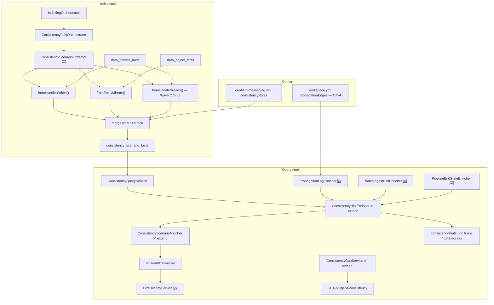

# Consistency Catalog S-01–S-12 — Component Design (BL-039–045)

> **Status:** Implemented (Waves 0–C shipped 2026-06-15)  
> **Last updated:** 2026-06-15 (implementation + dry-run verification)  
> **Backlog:** [BACKLOG.md](../../docs/BACKLOG.md) — BL-039–045 **Done**  
> **Extends:** [12-data-consistency-hints.md](features/12-data-consistency-hints.md) · [SOLUTIONS_DESIGN.md](../../docs/SOLUTIONS_DESIGN.md) §11  
> **Rule pack:** `config/rule-packs/quotient-messaging.yml`

## Problem

Phases 1–4 shipped S-01–S-05 and trace enrichment. The Quotient catalog defines S-06–S-12. **Waves 0–C are now implemented** (2026-06-15):

- `ConsistencyScenarioExtractor` classifies handler WRITE groups → `DUAL_WRITE_SAME_HANDLER`, `MULTI_TABLE_DOMAIN`, or `CROSS_STORE_WRITE` with correct participant roles.
- `fromEntityMirrors()` and `fromHandlerReads()` cover S-02 and S-09 index inference.
- `InvariantDeriver`, `HintOverlayService`, `GapStrategy`, and matcher/gap dispatch align with S-06/S-07.
- `PropagationTopologyLoader` + `PropagationLagEnricher` (S-08), `BatchIngestHintEnricher` (S-11), `PipelineEndStateEnricher` (S-12) are query-time wired.
- **Removed:** `DualWriteScenarioExtractor`, `MirrorScenarioMaterializer`.

**Post-deploy:** Re-index `quotient-full` so new patterns appear in `consistency_scenario_facts`; API scenarios T1–T5 require a live index.

This document specifies **every component** to extend the catalog without duplicating YAML invariants.

---

## Design principles

1. **One index extractor class, two evidence paths** — handler (`data_access_facts`) vs entity (`data_object_facts`).
2. **Reclassify, don’t re-detect** — Option B: extend handler grouping to emit `MULTI_TABLE_DOMAIN` / `CROSS_STORE_WRITE` / `DUAL_WRITE_SAME_HANDLER`.
3. **Roles encode test obligations** — `PRIMARY`, `REQUIRED_SIBLING`, `SECONDARY`, `MIRROR`, `PROJECTION`.
4. **`gapStrategy` over Java allowlists** — `INDEXED` | `REACHABLE` | `NONE` on rules and inferred metadata.
5. **Three-layer invariants at query time** — YAML (shrinking) → `InvariantDeriver` → gate facts.
6. **Curated id overlay at enrich time** — inferred slug + rule-pack anchor deduped in `ConsistencyHintEnricher`.

---

## Architecture overview



**Deprecates (merge into `ConsistencyScenarioExtractor`):** `DualWriteScenarioExtractor`, `MirrorScenarioMaterializer`.

---

## Catalog map (S-01–S-12)

| ID | Pattern | BL | Wave | Index | Query enricher | `gapStrategy` |
|----|---------|-----|------|-------|----------------|---------------|
| S-01 | `DUAL_WRITE_SAME_HANDLER` | — | A | `fromHandlerWrites` | `InvariantDeriver` | `INDEXED` |
| S-02 | `ASYNC_MIRROR` | — | — | `fromEntityMirrors` | — | `INDEXED` |
| S-03 | `PROJECTION_SPLIT` | — | — | rule pack | matcher | `NONE` |
| S-04 | `CO_TABLE_INVARIANT` | — | — | rule pack | matcher + gates | `REACHABLE` |
| S-05 | `ASYNC_MIRROR` family | — | — | `fromEntityMirrors` | — | `INDEXED` |
| S-06 | `MULTI_TABLE_DOMAIN` | 039 | A | `fromHandlerWrites` | `InvariantDeriver` | `REACHABLE` |
| S-07 | `CROSS_STORE_WRITE` | 040 | A | `fromHandlerWrites` | `InvariantDeriver` | `REACHABLE` |
| S-08 | `PROPAGATION_LAG` | 041 | B | — | `PropagationLagEnricher` | `NONE` |
| S-09 | `DUAL_READ_FALLBACK` | 042 | C | `fromHandlerReads` | `InvariantDeriver` | `INDEXED` |
| S-10 | `BUSINESS_FLAG` | 043 | C | rule pack + gates | matcher | `REACHABLE` |
| S-11 | `ASYNC_BATCH_INGEST` | 044 | C | rule pack | `BatchIngestHintEnricher` | `REACHABLE` |
| S-12 | `PIPELINE_END_STATE` | 045 | C | rule pack template | `PipelineEndStateEnricher` | `NONE` |

---

## Component index

| # | Component | Package | Wave | New/Change |
|---|-----------|---------|------|------------|
| C1 | `ConsistencyScenarioExtractor` | `ingestion.consistency` | A | **New** (replaces C1a, C1b) |
| C2 | `ConsistencyFactOrchestrator` | `ingestion.consistency` | A | **Change** |
| C3 | `HandlerWriteScenarioClassifier` | `ingestion.consistency` | A | **New** (internal) |
| C4 | `MessagingRulePack.ConsistencyRule` | `config` | 0 | **Change** — add `gapStrategy` |
| C5 | `ConsistencyGapService` | `query` | 0/A | **Change** |
| C6 | `ConsistencyScenarioMatcher` | `query` | A | **Change** |
| C7 | `InvariantDeriver` | `query` | 0 | **New** |
| C8 | `HintOverlayService` | `query` | A | **New** |
| C9 | `ConsistencyHintEnricher` | `query` | A/B/C | **Change** |
| C10 | `PropagationTopologyLoader` | `config` | B | **New** |
| C11 | `PropagationLagEnricher` | `query` | B | **New** |
| C12 | `BatchIngestHintEnricher` | `query` | C | **New** |
| C13 | `PipelineEndStateEnricher` | `query` | C | **New** |
| C14 | `FlowGateExtractor` | `ingestion` | 0 | **Extended (BL-052)** — `SystemConfigKeys`, source `@ConditionalOnProperty`, ConfigMap yaml |
| C15 | `CrossRepoGateLinker` | `query` | B | **Change** — optional S-08 patterns |

---

## C1 — `ConsistencyScenarioExtractor`

**Replaces:** `DualWriteScenarioExtractor`, `MirrorScenarioMaterializer`.

### Responsibility

Single index-time entry for all **inferrable** consistency scenarios. Does not load rule pack; orchestrator merges YAML after inference.

### Public API

```java
@Component
public class ConsistencyScenarioExtractor {

    /** WRK-25 + BL-039/040: handler WRITE groups → S-01, S-06, S-07 */
    List<ConsistencyScenarioFact> fromHandlerWrites(List<DataAccessFact> touchpoints);

    /** WRK-26: entity mirrors → S-02, S-05 */
    List<ConsistencyScenarioFact> fromEntityMirrors(List<DataObjectFact> entities);

    /** BL-042: handler READ groups → S-09 (Wave C) */
    List<ConsistencyScenarioFact> fromHandlerReads(List<DataAccessFact> touchpoints);
}
```

### C1.1 — `fromHandlerWrites` algorithm

1. Group touchpoints by `handlerClassFqn + "|" + handlerMethod`, filter `operation == WRITE`.
2. Skip groups with `size < 2`.
3. For each group, call `HandlerWriteScenarioClassifier.classify(group)` → pattern + participants + poll order.
4. Build `ConsistencyScenarioFact`:
   - `scenarioId` = `ConsistencyScenarioIds.fit(slug(handler, method) + suffix)` where suffix is `-dual-write`, `-multi-table`, or `-cross-store`
   - `scopeKind` = `HANDLER`
   - `scopeRef` = `handlerFqn#method`
   - `evidenceSource` = `HANDLER_CO_WRITE_EXTRACTOR`
   - `confidence` = 0.88 (same as today)

### C3 — `HandlerWriteScenarioClassifier` (internal)

```java
record ClassifiedWriteGroup(
    String pattern,           // DUAL_WRITE_SAME_HANDLER | MULTI_TABLE_DOMAIN | CROSS_STORE_WRITE
    List<Participant> participants,
    List<String> pollStoreOrder,
    String primaryStore,
    String primaryPhysical
) {}

static ClassifiedWriteGroup classify(List<DataAccessFact> writes);
```

**Classification rules (deterministic):**

| Condition | Pattern | Roles |
|-----------|---------|-------|
| `distinctStoreTypes(writes).size() > 1` | `CROSS_STORE_WRITE` | First write in stable sort order → `PRIMARY`; each other store → `SECONDARY` |
| `distinctPhysicalTables(writes).size() > 1` && single store type | `MULTI_TABLE_DOMAIN` | First table → `PRIMARY`; others → `REQUIRED_SIBLING` |
| Else (≥2 writes, same table or two ops on same entity) | `DUAL_WRITE_SAME_HANDLER` | All → `PRIMARY` (or first `PRIMARY`, rest `REQUIRED_SIBLING` if different DAO methods on same table — optional refinement) |

**Stable sort:** sort writes by `(storeType, physicalName, daoMethod)` before assigning PRIMARY.

**`lagClass`:** `SYNC` for co-located writes; `SYNC` on SECONDARY for cross-store unless rule pack overrides.

**`pollStrategy.order`:** distinct store types in write order for cross-store; single store type once for multi-table.

### C1.2 — `fromEntityMirrors` algorithm

Port existing `MirrorScenarioMaterializer` logic unchanged:

- Input: `data_object_facts` with `attributes.mirrors[]`
- Pattern: `ASYNC_MIRROR`
- Participants: `PRIMARY` + `MIRROR` (`lagClass: ASYNC_EVENTUAL`)
- `scopeKind` = `DATA_OBJECT`, `scopeRef` = `entityFqn`
- `evidenceSource` = `ENTITY_MIRROR_EXTRACTOR`

### C1.3 — `fromHandlerReads` algorithm (Wave C)

1. Group by handler#method, filter `operation == READ`.
2. Emit when `distinctStoreTypes >= 2`.
3. Pattern: `DUAL_READ_FALLBACK`
4. Participants: heuristic or YAML `readOrder` overlay — first store `PRIMARY_READ`, second `FALLBACK_READ` (new roles, or reuse `PRIMARY` + `SECONDARY` with note in `pollStrategy.notes`).
5. Do **not** emit `ROW_EXISTS` invariants for reads until `InvariantDeriver` has read-specific kinds.

### Tests

| Test class | Cases |
|------------|-------|
| `ConsistencyScenarioExtractorTest` | Hy-Vee dual DAO → S-01; continuity 3 Cassandra tables → S-06; OIS MariaDB+Mongo → S-07; single write → empty; mirror entity → S-02 |
| Migrate from | `DualWriteScenarioExtractorTest`, `MirrorScenarioMaterializerTest` |

---

## C2 — `ConsistencyFactOrchestrator`

### Change

```java
public List<ConsistencyScenarioFact> buildFromServiceIndex(List<DataAccessFact> dataAccessFacts) {
    List<ConsistencyScenarioFact> inferred = new ArrayList<>();
    inferred.addAll(extractor.fromHandlerWrites(dataAccessFacts));
    // Wave C: inferred.addAll(extractor.fromHandlerReads(dataAccessFacts));
    return mergeWithRulePack(inferred);
}

public List<ConsistencyScenarioFact> buildFromLibraryIndex(List<DataObjectFact> dataObjectFacts) {
    List<ConsistencyScenarioFact> inferred = extractor.fromEntityMirrors(dataObjectFacts);
    return mergeWithRulePack(inferred);
}
```

### `mergeWithRulePack` behavior (unchanged semantics)

- Map by `scenarioId`; rule pack entries **overwrite** inferred on id collision only.
- Inferred `adapter-record-dual-write` and rule-pack `partner-offer-call-recorder-dual-write` remain **separate ids** until enrich-time overlay (C8).

---

## C4 — Rule pack schema extension

### `MessagingRulePack.ConsistencyRule`

Add optional field:

```java
public record ConsistencyRule(
        String pattern,
        List<String> flowSteps,
        String primaryStore,
        String primaryPhysical,
        List<ConsistencyParticipantRule> participants,
        List<ConsistencyInvariantRule> invariants,  // shrink over time — Layer 1 only when unavoidable
        List<String> correlationKeys,
        Map<String, Object> pollStrategy,
        String gapStrategy   // NEW: INDEXED | REACHABLE | NONE; default infer from pattern if null
) {}
```

### Default `gapStrategy` when omitted

| Pattern | Default |
|---------|---------|
| `DUAL_WRITE_SAME_HANDLER`, `ASYNC_MIRROR`, `DUAL_READ_FALLBACK` | `INDEXED` |
| `CO_TABLE_INVARIANT`, `MULTI_TABLE_DOMAIN`, `CROSS_STORE_WRITE`, `BUSINESS_FLAG`, `ASYNC_BATCH_INGEST` | `REACHABLE` |
| `PROJECTION_SPLIT`, `PROPAGATION_LAG`, `PIPELINE_END_STATE` | `NONE` |

### New thin anchors (Wave A)

```yaml
consistencyRules:
  continuity-multi-table:
    pattern: MULTI_TABLE_DOMAIN
    gapStrategy: REACHABLE
    flowSteps: [CONTINUITY_REDEEM]
    primaryStore: CASSANDRA
    primaryPhysical: user_continuity_offer_progress
    participants:
      - { storeType: CASSANDRA, physicalName: user_continuity_offer_progress, role: PRIMARY }
      - { storeType: CASSANDRA, physicalName: user_continuity_offer_history, role: REQUIRED_SIBLING }
      - { storeType: CASSANDRA, physicalName: UserOfferActivated, role: REQUIRED_SIBLING }
    correlationKeys: [userId, offerId]

  user-targeting-cross-store:
    pattern: CROSS_STORE_WRITE
    gapStrategy: REACHABLE
    primaryStore: MARIADB
    primaryPhysical: Offer
    participants:
      - { storeType: MARIADB, physicalName: Offer, role: PRIMARY }
      - { storeType: MONGODB, physicalName: SegmentOfferEntity, role: SECONDARY, lagClass: SYNC }
    correlationKeys: [offerId, partnerId]
```

No `invariants` block — delegated to C7.

---

## C5 — `ConsistencyGapService`

### Changes

**1. Replace `expectsIndexedScenario` switch** with `gapStrategy(rule)`:

```java
private void checkRuleGap(String id, ConsistencyRule rule, Set<String> indexedIds, ...) {
    switch (GapStrategy.of(rule)) {
        case INDEXED -> { if (!indexedContainsPattern(indexedIds, id, rule)) emit ORPHAN_RULE_PACK; }
        case REACHABLE -> checkReachable(id, rule, orgId, serviceId, gaps);
        case NONE -> {}
    }
}
```

**2. `undocumentedDualWrites`** — extend pattern filter:

```sql
AND pattern IN (
  'DUAL_WRITE', 'DUAL_WRITE_SAME_HANDLER',
  'MULTI_TABLE_DOMAIN', 'CROSS_STORE_WRITE'
)
```

Also match when `scope_ref LIKE %handler%` for any of those patterns.

**3. New gap type (optional):** `REACHABLE_PRIMARY_UNTOUCHED` when rule has `gapStrategy: REACHABLE` and no handler touches `primaryPhysical`.

### Tests

- `ConsistencyGapServiceTest` — REACHABLE does not require indexed id; INDEXED does; cross-store indexed clears undocumented dual-write.

---

## C6 — `ConsistencyScenarioMatcher`

### Changes

**1. ALL-required branch** — add `CROSS_STORE_WRITE`:

```java
if ("CO_TABLE_INVARIANT".equals(pattern)
        || "MULTI_TABLE_DOMAIN".equals(pattern)
        || "CROSS_STORE_WRITE".equals(pattern)) {
    return allRequiredParticipantsWritten(scenario, ctx);
}
```

For `CROSS_STORE_WRITE`, treat `SECONDARY` as required (role prefix `REQUIRED` or explicit `SECONDARY` in required set — extend loop):

```java
boolean required = "PRIMARY".equals(role)
        || role.startsWith("REQUIRED")
        || "SECONDARY".equals(role);  // cross-store: both stores must be written
```

**2. `handlerScopeMatches` for indexed `DUAL_WRITE*`** — optional tighten: only match when group has ≥2 WRITE touchpoints in ctx (prevents single-write false positive on handler scope).

**3. `flowStepOnlyRulePackMatch`** — add `CROSS_STORE_WRITE` to same ALL-required path as `MULTI_TABLE_DOMAIN`.

### Tests

- OIS handler with Offer + SegmentOfferEntity WRITEs matches `user-targeting-cross-store`
- GALO READ-only Offer does not match
- Continuity handler missing history does not match `continuity-multi-table`

---

## C7 — `InvariantDeriver`

**Package:** `io.testseer.backend.query`  
**Wave:** 0 (blocks meaningful BL-039/040 hints)

### Responsibility

Assemble `List<ConsistencyInvariantHintView>` for a matched scenario at enrich time.

### API

```java
@Service
public class InvariantDeriver {

    List<ConsistencyInvariantHintView> derive(
            String serviceId,
            ConsistencyScenarioView scenario,
            MessagingRulePack.ConsistencyRule rule,  // nullable
            List<DataAccessView> touchpoints,
            CrossRepoTraceContext traceContext);     // nullable — Layer 3 cross-service
}
```

### Layer merge (YAML wins on duplicate kind+description)

```
Layer 1 — rule.invariants()     (explicit YAML; shrink for S-04 over time)
Layer 2 — deriveCoWrite()       ROW_EXISTS for REQUIRED_* / SECONDARY with WRITE in touchpoints
Layer 3 — deriveGate()          STATE_TRANSITION from flow_gate_facts (service-local)
Layer 3b — traceContext gates   via CrossRepoGateLinker (already on hint; deriver may precompute)
```

### Layer 2 — `deriveCoWrite`

For each participant with role `REQUIRED_CHILD`, `REQUIRED_SIBLING`, or `SECONDARY`:

- If `physicalName` in WRITE touchpoints (use `ConsistencyScenarioMatcher` normalization helpers)
- Emit:

```json
{
  "kind": "ROW_EXISTS",
  "description": "<physicalName> row must be written in same handler as primary",
  "pollHint": "SELECT * FROM <table> WHERE <correlationKeys>"
}
```

`PollHintBuilder` (optional sub-component): resolve table column names from `data_object_facts` when available.

### Tests

- S-06: three siblings → three ROW_EXISTS
- S-07: PRIMARY + SECONDARY → two ROW_EXISTS
- S-04: co-write Offer + OfferPidMap → two ROW_EXISTS without YAML invariants

---

## C8 — `HintOverlayService`

**Wave:** A  
**Called from:** `ConsistencyHintEnricher.matchScenarios` before return

### Responsibility

Dedup inferred vs curated hints; prefer stable rule-pack **scenarioId** when participants match.

### Algorithm

```java
List<ConsistencyHintView> overlay(
    List<ConsistencyHintView> matched,
    Map<String, ConsistencyRule> rules,
    TouchpointContext ctx);
```

1. Build participant signature from ctx WRITE touchpoints: `Set<normalized physical names>`.
2. For each rule-pack rule where `allRequiredParticipantsWritten` would pass:
   - If an inferred hint exists with same pattern family and overlapping participants:
     - **Replace** inferred `scenarioId` with curated id (`continuity-multi-table`)
     - Merge `flowSteps`, `correlationKeys` from rule
     - Keep `evidenceSource` as `RULE_PACK+INFERRED` in merged hint (new optional field or concatenate)
3. Remove duplicate hints with subset participants.

### Tests

- Handler produces `foo-record-cross-store` + rule `user-targeting-cross-store` → single hint with curated id

---

## C9 — `ConsistencyHintEnricher`

### Changes

1. Inject `InvariantDeriver`, `HintOverlayService`.
2. In `matchScenarios`, after `ConsistencyHintView.fromScenario`:
   ```java
   hint = hint.withInvariants(invariantDeriver.derive(...));
   ```
3. Apply `hintOverlayService.overlay(...)` before return.
4. Wave B: call `PropagationLagEnricher` from `enrichCrossRepoHops` when trace context present.
5. Wave C: `BatchIngestHintEnricher`, `PipelineEndStateEnricher` hooks on entry-flow / cross-repo (see C12, C13).

### `ConsistencyHintView` extension

Add helper:

```java
ConsistencyHintView withInvariants(List<ConsistencyInvariantHintView> invariants);
```

---

## C10 — `PropagationTopologyLoader`

**Package:** `io.testseer.backend.config`  
**Wave:** B

### Responsibility

Load `propagationEdges[]` from `workspace.yml` bundle section (CR-4), org-scoped via `WorkspaceCatalogService` when DB config exists.

### Schema (`workspace.yml`)

```yaml
bundles:
  quotient-full:
    propagationEdges:
      - id: offer-mariadb-to-galo-api
        pattern: PROPAGATION_LAG
        authoritative:
          serviceId: riq-offers-business-logic
          storeType: MARIADB
          physicalName: Offer
        peripheral:
          - serviceId: platform-optimus-offer-service
            storeType: ELASTICSEARCH
            physicalName: offer_index
            lagClass: ASYNC_EVENTUAL
        consumers:
          - serviceId: platform-optimus-offer-service
            flowStep: GALO_READ
        correlationKeys: [offerId, partnerId]
        pollStrategy:
          notes: ["GALO API may lag MariaDB; poll API after row visible in MariaDB"]
```

### API

```java
List<PropagationEdge> edgesForBundle(String orgId, String bundleName);
```

---

## C11 — `PropagationLagEnricher`

**Wave:** B — BL-041

### Responsibility

Query-time only. Attach `PROPAGATION_LAG` hints on writer hops in cross-repo trace.

### API

```java
@Component
public class PropagationLagEnricher {

    List<ConsistencyHintView> forHop(
            CrossRepoHop hop,
            List<DataAccessView> writerTouchpoints,
            CrossRepoTraceContext ctx,
            String bundleName,
            String orgId);
}
```

### Algorithm

1. Load edges for bundle.
2. For each edge, if `hop.serviceId` matches `authoritative.serviceId` and writer touchpoints include `authoritative.physicalName`:
3. Build `ConsistencyHintView` with pattern `PROPAGATION_LAG`, peripheral participants, `pollStrategy.order`.
4. Pass through `CrossRepoGateLinker` for consumer `flowStep` gates.

### Wiring

`MessagingFlowService.traceCrossRepo()` after `enrichCrossRepoHops`, merge propagation hints into writer subscriber/publisher nodes.

---

## C12 — `BatchIngestHintEnricher`

**Wave:** C — BL-044

### Responsibility

Surface S-11 without index linker. Uses existing `entry_trigger_facts` + rule-pack anchor.

### Algorithm

1. Rule pack `segment-parquet-batch-ingest` with `pattern: ASYNC_BATCH_INGEST`, `flowSteps`, Mongo participant.
2. On `GET /v1/graph/entry-flow` or data-access for batch handler:
   - Query triggers where `linked_handler_fqn` matches and `trigger_kind IN (FILE_DROP_GCS, AIRFLOW_DAG, CRON)`.
3. If matcher passes + trigger present, attach hint with `pollStrategy.notes`: *"Parallel to OIS API path (user-targeting-cross-store); do not cross-assert."*

### No new index facts required

Optional: store trigger id on hint as metadata when TRG-14 already exposes `inboundTriggers[]`.

---

## C13 — `PipelineEndStateEnricher`

**Wave:** C — BL-045

### Responsibility

Match multi-hop STC retry template at query time.

### Rule pack template

```yaml
stc-retry-end-state:
  pattern: PIPELINE_END_STATE
  gapStrategy: NONE
  flowSteps: [STC_RETRY, EVAL_STC]
  endStateParticipants:
    - { storeType: MARIADB, physicalName: StcRetryQueue, role: PRIMARY }
    - { storeType: CASSANDRA, physicalName: UserOfferActivated, role: REQUIRED_SIBLING }
    - { storeType: CASSANDRA, physicalName: UserReward, role: REQUIRED_SIBLING }
  correlationKeys: [transactionId, userId]
  pollStrategy:
    notes: ["See debug-platform-issues STC retry playbook"]
```

### Algorithm

1. On `traceEntryFlow` / cross-repo STC chain, collect all touchpoints across hops in `CrossRepoTraceContext`.
2. If every `endStateParticipant` appears in WRITE or READ touchpoints across trace → attach hint on terminal hop.

---

## C14 — `FlowGateExtractor`

**Wave:** 0 — unblocks Layer 3 for S-04, S-10  
**BL-052 (2026-06-15):** Manual §9 parity for eval — see [26-flow-gate-manual-s9.md](features/26-flow-gate-manual-s9.md).

### Scope

Index-time extraction to `flow_gate_facts`:

- `IsPublished` / `IsDisabled` stream filters
- `preLive` / `ActiveOfferFilter`
- Freedom `SourceName` patterns (S-10 seed)
- **`SystemConfigKeys` / `isConfigEnabled` / `config(...)` (BL-052)**
- **`@ConditionalOnProperty` from Java source (BL-052)**
- **ConfigMap yaml flags via `YamlConfigUtils` (BL-052)**
- Rule pack `declaredGates`, `gateKeyAliases` for eval keys (BL-052 pillar D)
- Negative: write-default `setIsPublished(true)` must **not** emit read gate

See [SOLUTIONS_DESIGN.md](../../docs/SOLUTIONS_DESIGN.md) §11.11 for pattern catalog and proof tests.

---

## C15 — `CrossRepoGateLinker`

### Change (Wave B)

Optionally attach downstream gates for `PROPAGATION_LAG` hints when participant tables match consumer service gates (same prefix logic as CO_TABLE).

---

## Participant role reference

| Role | Used by | Matcher required? | Invariant ROW_EXISTS? |
|------|---------|-------------------|------------------------|
| `PRIMARY` | All write patterns | Yes | No (baseline) |
| `REQUIRED_CHILD` | S-04 | Yes | Yes |
| `REQUIRED_SIBLING` | S-06 | Yes | Yes |
| `SECONDARY` | S-07 | Yes | Yes |
| `MIRROR` | S-02 | No (poll order) | No |
| `PROJECTION` | S-03 | No | FIELD_MAP only |

---

## Data model

**No Flyway migration** for Wave A/B.

`consistency_scenario_facts` columns already sufficient. New patterns stored in `pattern` VARCHAR.

Optional future: `gap_strategy` column on facts for inferred rows (or encode in `evidence_source` JSON).

---

## Implementation waves (ordered) — status

| Wave | Backlog | Status | Notes |
|------|---------|--------|-------|
| **0** | Foundation | ✅ Shipped | `GapStrategy`, `InvariantDeriver`, gap dispatch |
| **A** | BL-039, BL-040 | ✅ Shipped | `ConsistencyScenarioExtractor`, classifier, overlay, rule-pack anchors |
| **B** | BL-041 | ✅ Shipped | `propagationEdges` in `workspace.yml`; `PropagationLagEnricher` |
| **C** | BL-042–045 | ✅ Shipped | `fromHandlerReads`, batch + pipeline enrichers; S-10 gate patterns partial |

### Wave 0 — Foundation ✅

| Task | Components |
|------|------------|
| W0-1 | C4 `gapStrategy` on `ConsistencyRule` + loader |
| W0-2 | C5 gap dispatch; deprecate `expectsIndexedScenario` |
| W0-3 | C7 `InvariantDeriver` Layer 2 |
| W0-4 | C14 `FlowGateExtractor` proof tests |
| W0-5 | C7 Layer 3 local gates |

### Wave A — BL-039/040 (P1) ✅

| Task | Components |
|------|------------|
| A-1 | C1 + C3 `ConsistencyScenarioExtractor` + classifier |
| A-2 | C2 orchestrator wiring; delete old extractor classes |
| A-3 | C6 matcher `CROSS_STORE_WRITE` |
| A-4 | C5 undocumented dual-write pattern list |
| A-5 | C8 overlay + C9 enricher integration |
| A-6 | Rule pack anchors `continuity-multi-table`, `user-targeting-cross-store` |
| A-7 | Tests + re-index continuity + offer-ingestion services |

### Wave B — BL-041 (P3) ✅

| Task | Components |
|------|------------|
| B-1 | C10 topology loader + `workspace.yml` schema |
| B-2 | C11 `PropagationLagEnricher` |
| B-3 | C15 gate linker extension |
| B-4 | Hy-Vee E2E acceptance |

### Wave C — BL-042–045 (P3) ✅

| Task | Components |
|------|------------|
| C-1 | C1 `fromHandlerReads` (S-09) |
| C-2 | C14 Freedom flag patterns + rule anchor (S-10) |
| C-3 | C12 batch ingest enricher (S-11) |
| C-4 | C13 pipeline end-state enricher (S-12) |

---

## Acceptance criteria by backlog item

### BL-039 (S-06)

- [x] Classifier + extractor emit `MULTI_TABLE_DOMAIN` with `REQUIRED_SIBLING` roles (`ConsistencyScenarioExtractorTest`)
- [x] `InvariantDeriver` emits `ROW_EXISTS` for REQUIRED_* / SECONDARY WRITE touchpoints
- [x] Curated id `continuity-multi-table` in rule pack + overlay
- [ ] Live index: continuity handler shows `MULTI_TABLE_DOMAIN` in `GET /v1/consistency/scenarios` (T1 — requires re-index)

### BL-040 (S-07)

- [x] Classifier emits `CROSS_STORE_WRITE` with `PRIMARY` + `SECONDARY` (`ConsistencyScenarioExtractorTest`)
- [x] `pollStrategy.order` preserves store order from WRITE touchpoints
- [x] Rule pack anchor `user-targeting-cross-store`
- [ ] Live index: OIS handler scenario in API (T2 — requires re-index)

### BL-041 (S-08)

- [x] `workspace.yml` `propagationEdges` sample on `quotient-full`
- [x] `PropagationLagEnricher` on cross-repo trace when `bundleName` set
- [ ] Hy-Vee E2E: writer hop shows `PROPAGATION_LAG` (T3 — requires live index + trace)

### BL-042–045

- [x] S-09: `fromHandlerReads` → `DUAL_READ_FALLBACK` (`ConsistencyScenarioExtractorTest`)
- [ ] S-10: Freedom `SourceName` gate hint (rule anchor pending; `FlowGateExtractor` patterns exist)
- [x] S-11: `BatchIngestHintEnricher` + `segment-parquet-batch-ingest` rule
- [x] S-12: `PipelineEndStateEnricher` + `stc-retry-end-state` rule

---

## Risks and mitigations

| ID | Risk | Mitigation |
|----|------|------------|
| R1 | Fat handler false MULTI_TABLE | Overlay prefers rule-pack participant whitelist; optional min participant count |
| R2 | Duplicate inferred + curated hints | C8 `HintOverlayService` |
| R3 | Delegate co-writes invisible at index | `ConsistencyHintEnricher` delegate expansion (shipped) |
| R4 | Cross-handler co-writes | Out of scope; document CON-NG |
| R5 | `gapStrategy` null on old YAML | Default map in C4 |
| R6 | Breaking `DualWriteScenarioExtractor` bean name | Single release: rename bean, update tests |

---

## File layout (target)

```
testseer-backend/src/main/java/io/testseer/backend/
  ingestion/consistency/
    ConsistencyScenarioExtractor.java      # C1
    HandlerWriteScenarioClassifier.java  # C3
    ConsistencyFactOrchestrator.java     # C2
    ConsistencyScenarioIds.java
  query/
    ConsistencyScenarioMatcher.java      # C6
    ConsistencyGapService.java           # C5
    InvariantDeriver.java                # C7
    HintOverlayService.java              # C8
    ConsistencyHintEnricher.java         # C9
    PropagationLagEnricher.java          # C11
    BatchIngestHintEnricher.java         # C12
    PipelineEndStateEnricher.java        # C13
    CrossRepoGateLinker.java             # C15
  config/
    PropagationTopologyLoader.java       # C10
    MessagingRulePack.java               # C4
```

**Deleted (2026-06-15):** `DualWriteScenarioExtractor.java`, `MirrorScenarioMaterializer.java`.

---

## Related documents

| Doc | Role |
|-----|------|
| [12-data-consistency-hints.md](features/12-data-consistency-hints.md) | Feature E2E |
| [SOLUTIONS_DESIGN.md](../../docs/SOLUTIONS_DESIGN.md) §11 | Derivation architecture |
| [BACKLOG.md](../../docs/BACKLOG.md) | Priorities |
| [IMPLEMENTATION_GAPS.md](../../docs/IMPLEMENTATION_GAPS.md) | Living gap analysis |

---

## Sample tests and verification scenarios

**Dry-run (unit, 2026-06-15):** `mvn test -Dtest=ConsistencyScenarioExtractorTest,ConsistencyScenarioMatcherTest,ConsistencyGapServiceTest,ConsistencyHintEnricherTest,CrossRepoGateLinkerTest` — all pass.

| Design ID | Test class | Status |
|-----------|------------|--------|
| T0-1 | `HandlerWriteScenarioClassifier` (via `ConsistencyScenarioExtractorTest`) | ✅ |
| T0-2 | `ConsistencyScenarioExtractorTest` | ✅ |
| T0-3 | `ConsistencyScenarioMatcherTest` | ✅ |
| T0-4 | `InvariantDeriver` | ⚠️ Covered indirectly via enricher; dedicated test optional |
| T0-5 | `HintOverlayService` | ⚠️ Covered indirectly via enricher; dedicated test optional |
| T1–T5 | Live API (curl) | Requires backend + `index-all-repos.sh` |

After **Wave 0 + Wave A** (minimum for BL-039/040). Later waves add scenarios marked **Wave B** / **Wave C** — **all waves shipped**; live API scenarios still need re-index.

### Prerequisites (all API scenarios)

```bash
# Backend up
cd testseer-backend && docker compose up -d && ./mvn21 spring-boot:run

# Fresh org index (catalog libs first)
./scripts/clear-index.sh ORG quotient
./scripts/index-all-repos.sh quotient http://localhost:8080
```

Replace `serviceId` values with rows from `GET /registry/services` if your registry ids differ.

---

### T0 — Unit tests (implement in repo)

#### T0-1 `HandlerWriteScenarioClassifierTest`

| Step | Input | Expected |
|------|--------|----------|
| 1 | Two WRITEs, same handler, same `MARIADB`, tables `PartnerOfferCallRecorder` + `PartnerOfferCallRecorder` (two DAO methods) | `pattern=DUAL_WRITE_SAME_HANDLER`, both `PRIMARY` |
| 2 | Three WRITEs, same handler, all `CASSANDRA`, tables `user_continuity_offer_progress`, `user_continuity_offer_history`, `UserOfferActivated` | `pattern=MULTI_TABLE_DOMAIN`, one `PRIMARY`, two `REQUIRED_SIBLING` |
| 3 | Two WRITEs, same handler, `MARIADB` Offer + `MONGODB` SegmentOfferEntity | `pattern=CROSS_STORE_WRITE`, `PRIMARY` + `SECONDARY`, `pollStoreOrder=[MARIADB, MONGODB]` |
| 4 | One WRITE only | classifier returns empty / extractor skips group |

#### T0-2 `ConsistencyScenarioExtractorTest` (mirrors port)

| Step | Input | Expected |
|------|--------|----------|
| 1 | `DataObjectFact` with `attributes.mirrors=[{storeType:BIGQUERY,...}]` | `pattern=ASYNC_MIRROR`, `PRIMARY` + `MIRROR`, `evidenceSource=ENTITY_MIRROR_EXTRACTOR` |

#### T0-3 `ConsistencyScenarioMatcherTest` (extend)

| Step | Input | Expected |
|------|--------|----------|
| 1 | Rule `user-targeting-cross-store`, touchpoints WRITE Offer + SegmentOfferEntity | `matches=true` |
| 2 | Same rule, touchpoints READ Offer only | `matches=false` |
| 3 | Rule `continuity-multi-table`, WRITE progress + history, missing `UserOfferActivated` | `matches=false` |

#### T0-4 `InvariantDeriverTest`

| Step | Input | Expected |
|------|--------|----------|
| 1 | S-06 matched scenario + 3 WRITE touchpoints | ≥2 `ROW_EXISTS` invariants on sibling tables |
| 2 | S-07 matched scenario + 2 store WRITEs | `ROW_EXISTS` on `Offer` and `SegmentOfferEntity` |

#### T0-5 `HintOverlayServiceTest`

| Step | Input | Expected |
|------|--------|----------|
| 1 | Inferred `offer-ingestion-handler-cross-store` + rule `user-targeting-cross-store` same participants | Single hint, `scenarioId=user-targeting-cross-store` |

---

### T1 — BL-039: Continuity multi-table (S-06) — Wave A

**Use when:** Planning or automating continuity offer redeem tests (progress + history + activation).

#### Steps

1. Index platform redemption / eval service that hosts continuity redeem handler (included in `quotient-full`).
2. Query indexed scenarios:
   ```bash
   curl -s 'http://localhost:8080/v1/consistency/scenarios?serviceId=<continuity-service-id>' | jq '.data[] | select(.pattern=="MULTI_TABLE_DOMAIN")'
   ```
3. Query data-access for the handler:
   ```bash
   curl -s 'http://localhost:8080/v1/facts/data-access?serviceId=<continuity-service-id>' \
     | jq '.data[] | select(.operation=="WRITE") | {handler: .handlerClassFqn, table: .physicalName, hints: .consistencyHints}'
   ```
4. Check gaps (should not list undocumented dual-write for that handler):
   ```bash
   curl -s 'http://localhost:8080/v1/gaps/consistency?orgId=quotient&serviceId=<continuity-service-id>' | jq .
   ```

#### Expected behaviour (after Wave 0+A)

| Check | Expected |
|-------|----------|
| `consistency_scenario_facts` | Row with `pattern=MULTI_TABLE_DOMAIN` for handler scope (or curated `continuity-multi-table` from rule pack) |
| `participants[]` | `user_continuity_offer_progress` → `PRIMARY`; `history` + `UserOfferActivated` → `REQUIRED_SIBLING` |
| `consistencyHints[].pattern` | `MULTI_TABLE_DOMAIN` |
| `consistencyHints[].invariants` | ≥2 × `kind=ROW_EXISTS` (after C7), describing sibling tables |
| `consistencyHints[].scenarioId` | `continuity-multi-table` when overlay matches (not only `*-multi-table` slug) |
| Gaps | No `UNDOCUMENTED_DUAL_WRITE` for that handler; no `ORPHAN_RULE_PACK` for `continuity-multi-table` |

#### QA test plan usage

When writing continuity redeem integration tests, agent/test author should:

1. Poll **progress** row (PRIMARY).
2. Assert **history** audit row exists (REQUIRED_SIBLING).
3. Assert **UserOfferActivated** state (REQUIRED_SIBLING).
4. Do **not** pass if only progress updated.

---

### T2 — BL-040: User targeting cross-store (S-07) — Wave A

**Use when:** OIS ingest + Mongo segment targeting (MariaDB `Offer` then `SegmentOfferEntity`).

#### Steps

1. Ensure `offer-ingestion` (or equivalent) indexed in `quotient-full`.
2. Scenarios API:
   ```bash
   curl -s 'http://localhost:8080/v1/consistency/scenarios?serviceId=offer-ingestion' \
     | jq '.data[] | select(.pattern=="CROSS_STORE_WRITE")'
   ```
3. Data-access on ingest handler:
   ```bash
   curl -s 'http://localhost:8080/v1/facts/data-access?serviceId=offer-ingestion' \
     | jq '.data[] | select(.consistencyHints[]?.pattern=="CROSS_STORE_WRITE")'
   ```
4. Negative — GALO read handler should not match:
   ```bash
   curl -s 'http://localhost:8080/v1/facts/data-access?serviceId=platform-optimus-offer-service' \
     | jq '.data[] | select(.operation=="READ" and .physicalName=="Offer") | .consistencyHints'
   ```

#### Expected behaviour

| Check | Expected |
|-------|----------|
| Ingest handler indexed fact | `pattern=CROSS_STORE_WRITE` |
| `participants` | `Offer`/`MARIADB` `PRIMARY`; `SegmentOfferEntity`/`MONGODB` `SECONDARY` |
| `pollStrategy.order` | `["MARIADB","MONGODB"]` |
| `invariants` | `ROW_EXISTS` on both stores when both WRITE touchpoints present |
| GALO READ-only rows | `consistencyHints` empty or no `CROSS_STORE_WRITE` |
| Overlay | `scenarioId=user-targeting-cross-store` when rule pack matches |

#### QA test plan usage

After OIS create/update offer API call:

1. Assert MariaDB `Offer` row.
2. Assert Mongo `SegmentOfferEntity` for same `offerId`/`partnerId`.
3. Do not treat MariaDB-only assertion as sufficient for targeting flows.

---

### T3 — Regression: Hy-Vee dual-write (S-01) — Wave A

**Use when:** Confirm classifier did not break existing `partner-offer-call-recorder-dual-write`.

#### Steps

1. Re-index `riq-partner-adapter-suite`.
2. Cross-repo trace:
   ```bash
   curl -s 'http://localhost:8080/v1/graph/event-flow/cross-repo?orgId=quotient&shortId=PDN_T.RIQ_OFFER_EVENT&env=pdn&bundle=quotient-full' \
     | jq '.data.hops[].subscribers[] | select(.shortId | contains("PARTNER_ADAPTER")) | .consistencyHints'
   ```

#### Expected behaviour

| Check | Expected |
|-------|----------|
| Subscriber hop hints | Includes `DUAL_WRITE_SAME_HANDLER` and/or `offer-pidmap-gate` / `offer-projection-split` (unchanged S-03/S-04) |
| Classifier | Two WRITEs on same MariaDB table/recorder → stays `DUAL_WRITE_SAME_HANDLER`, not `MULTI_TABLE_DOMAIN` unless tables differ |

---

### T4 — Mirror (S-02) — unchanged path via C1

**Use when:** Freedom UMO / activation BQ mirror polling order.

#### Steps

```bash
curl -s 'http://localhost:8080/v1/consistency/scenarios?serviceId=platform-data' \
  | jq '.data[] | select(.pattern=="ASYNC_MIRROR" and (.primaryPhysical | contains("UserOfferActivated")))'
```

#### Expected behaviour

| Check | Expected |
|-------|----------|
| Pattern | `ASYNC_MIRROR` |
| Participants | `PRIMARY` Cassandra + `MIRROR` BQ, `lagClass=ASYNC_EVENTUAL` on mirror |
| `pollStrategy.order` | `[CASSANDRA, BIGQUERY]` |
| Trace FREEDOM_UMO step | Mirror hint on activation subscriber when handler touchpoints exist |

---

### T5 — MCP agent workflows — Wave A

**Use when:** Cursor agent plans tests from indexed flows (no new MCP tools).

#### Steps

1. `testseer_trace_topic_flow({ orgId: "quotient", shortId: "PDN_T.RIQ_OFFER_EVENT", env: "pdn", crossRepo: true })`
2. Inspect subscriber hops for `consistencyHints[]`.
3. `testseer_get_consistency_scenarios({ serviceId: "offer-ingestion" })` for cross-store catalog.

#### Expected behaviour

| Check | Expected |
|-------|----------|
| MCP JSON | Same `consistencyHints` as REST cross-repo trace |
| S-07 on OIS hop | `pattern=CROSS_STORE_WRITE` with `participants` roles when ingest handler indexed |
| S-06 | Appears on continuity service scenarios API when that service indexed |

---

### T6 — Gaps API regression — Wave 0+A

#### Steps

```bash
# Service with known dual-write handler — should be clean
curl -s 'http://localhost:8080/v1/gaps/consistency?orgId=quotient&serviceId=riq-partner-adapter-suite' | jq .

# Deliberate: index a fixture service with 2+ WRITEs and no scenario (dev only)
```

#### Expected behaviour

| Gap type | When |
|----------|------|
| `UNDOCUMENTED_DUAL_WRITE` | Handler has ≥2 WRITEs and **no** fact with pattern in (`DUAL_WRITE_SAME_HANDLER`, `MULTI_TABLE_DOMAIN`, `CROSS_STORE_WRITE`) |
| `ORPHAN_RULE_PACK` | Only when `gapStrategy=INDEXED` and no indexed row for rule id |
| `REACHABLE` rules | `continuity-multi-table` does **not** orphan when primary table unreachable — emits `REACHABLE_PRIMARY_UNTOUCHED` (if implemented) instead |

---

### T7 — BL-041: Propagation lag (S-08) — Wave B

**Use when:** Hy-Vee E2E — MariaDB offer visible before GALO API.

#### Steps

1. Add `propagationEdges` to `quotient-full` in `workspace.yml` (see C10).
2. Re-index; run cross-repo trace (same as T3).
3. Inspect writer hop after adapter/OIS for `PROPAGATION_LAG`.

```bash
curl -s 'http://localhost:8080/v1/graph/event-flow/cross-repo?orgId=quotient&shortId=PDN_T.RIQ_OFFER_EVENT&env=pdn&bundle=quotient-full' \
  | jq '.data.hops[] | .subscribers[] | select(.consistencyHints[]?.pattern=="PROPAGATION_LAG")'
```

#### Expected behaviour

| Check | Expected |
|-------|----------|
| Hint pattern | `PROPAGATION_LAG` on authoritative writer hop |
| `participants` | MariaDB `Offer` authoritative + ES/cache peripheral |
| `downstreamGates` | `IsPublished` / preLive gates on GALO hop when gates indexed |
| `pollStrategy.notes` | Documents API/ES lag; not same-handler co-write |

---

### T8 — BL-044: Batch ingest (S-11) — Wave C

**Use when:** Segment parquet job vs OIS API path.

#### Steps

1. Index parquet ingestion job service + `entry_trigger_facts` with `FILE_DROP_GCS` or `AIRFLOW_DAG`.
2. Entry flow:
   ```bash
   curl -s 'http://localhost:8080/v1/graph/entry-flow?serviceId=<parquet-job-service>&env=pdn' | jq '.data.steps[0].consistencyHints'
   ```
3. Compare with T2 — same Mongo table, different trigger path.

#### Expected behaviour

| Check | Expected |
|-------|----------|
| Hint | `ASYNC_BATCH_INGEST` with note: do not cross-assert with OIS API path |
| `inboundTriggers` | TRG-14 shows GCS/Airflow trigger on first hop |
| No false S-07 | Batch handler may still show `CROSS_STORE_WRITE` if single handler writes Mongo only — narrative distinguishes paths |

---

### T9 — BL-045: STC retry end-state (S-12) — Wave C

**Use when:** STC retry RCA playbook (`debug-platform-issues` skill).

#### Steps

1. Trace STC / eval chain:
   ```bash
   curl -s 'http://localhost:8080/v1/graph/entry-flow?serviceId=platform-transaction-eval-consumer&env=pdn&includeMessaging=true&crossRepo=true&orgId=quotient' \
     | jq '.data.steps[-1].consistencyHints'
   ```
2. Or cross-repo topic trace for eval pipeline.

#### Expected behaviour

| Check | Expected |
|-------|----------|
| Terminal hop | `PIPELINE_END_STATE` when queue + Cassandra facts present across trace |
| `invariants` / notes | Checklist: queue row, activation, reward, history — static poll order from rule pack |
| Not emitted | When trace missing a template participant (partial index) |

---

### T10 — `ConsistencyHintEnricherTest` integration (JUnit) — Wave A

Mirror of production enricher path; add cases:

| Test method | Setup | Assert |
|-------------|--------|--------|
| `enrichCrossRepo_subscriberGetsMultiTableHint` | Mock scenarios with S-06 + touchpoints for 3 Cassandra WRITEs | `consistencyHints[0].pattern=MULTI_TABLE_DOMAIN`, invariants ≥2 |
| `enrichCrossRepo_crossStoreOnOisHop` | S-07 rule + MariaDB+Mongo WRITE delegates | `pollStrategy.order` contains MONGODB |
| `enrichCrossRepo_readOnlyGaloNoCoTableFalsePositive` | READ-only Offer touchpoints | No `CO_TABLE_INVARIANT` / `CROSS_STORE_WRITE` |
| `overlay_prefersCuratedScenarioId` | Inferred + rule same participants | Single hint, curated id |

---

### Quick reference: pattern → where to look

| Pattern | Primary verification API | Wave |
|---------|--------------------------|------|
| `MULTI_TABLE_DOMAIN` | `/v1/facts/data-access` on continuity handler | A |
| `CROSS_STORE_WRITE` | `/v1/facts/data-access` on offer-ingestion | A |
| `DUAL_WRITE_SAME_HANDLER` | Cross-repo Hy-Vee subscriber hop | A |
| `ASYNC_MIRROR` | `/v1/consistency/scenarios` on platform-data | A |
| `CO_TABLE_INVARIANT` / `PROJECTION_SPLIT` | Cross-repo adapter subscriber (existing) | — |
| `PROPAGATION_LAG` | Cross-repo writer hop | B |
| `ASYNC_BATCH_INGEST` | `/v1/graph/entry-flow` on batch job | C |
| `PIPELINE_END_STATE` | Entry-flow / STC trace terminal step | C |
