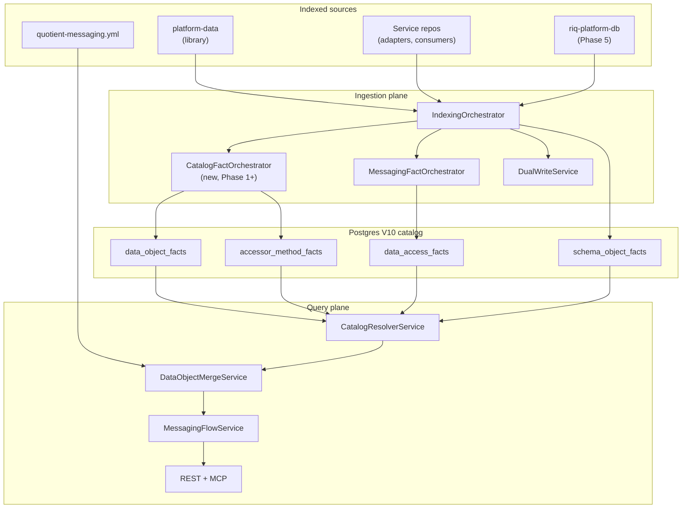
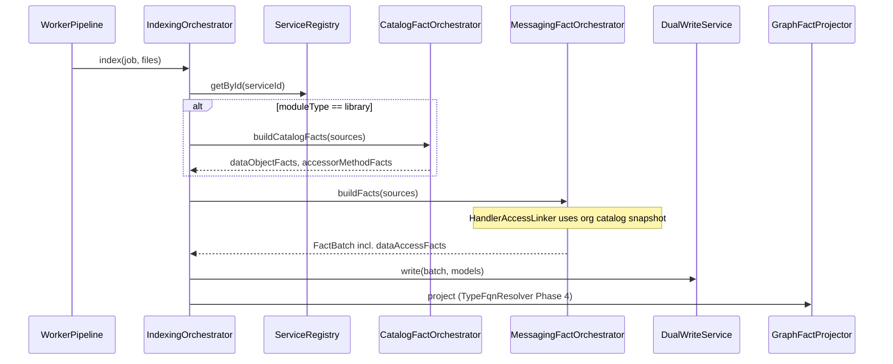
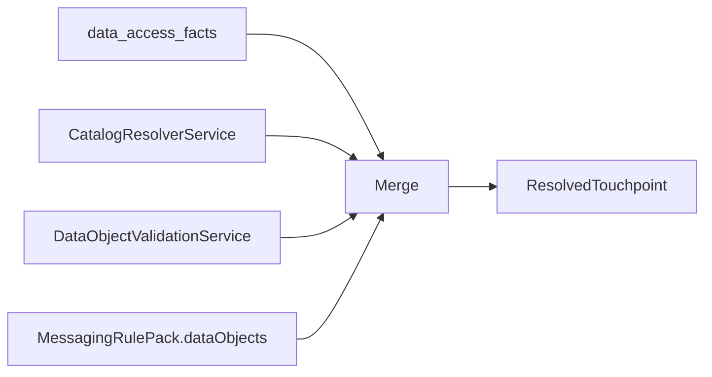
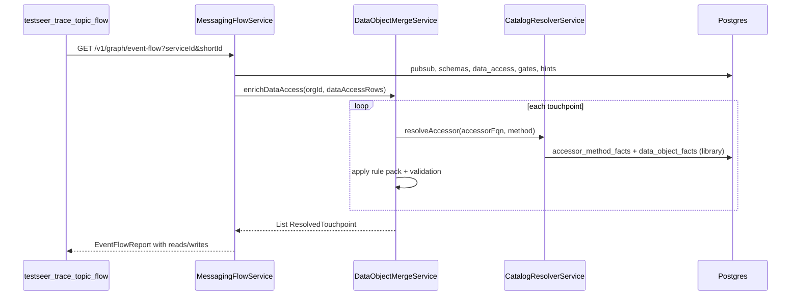

# TestSeer — Data Object Catalog Design (Phases 1–5)

> **Status:** Implemented (Phases 1–5 shipped; see caveats doc)  
> **Last updated:** 2026-06-12  
> **Feature spec:** [features/10-data-object-catalog.md](features/10-data-object-catalog.md)  
> **Implementation caveats:** [TestSeer_Data_Object_Catalog_Implementation_Caveats.md](TestSeer_Data_Object_Catalog_Implementation_Caveats.md)  
> **Extends:** Option C C-P3, Graph `USES_TYPE`, Messaging rule pack

---

## 1. Purpose

Build a **static persistence topology** for Quotient/Optimus services:

```
Handler (consumer/adapter)
  → Accessor (DAO / Repo / Template)
    → Domain type (optional)
      → Entity / document
        → Store (MARIADB | CASSANDRA | MONGODB | BIGQUERY)
          → Physical name (table / collection / BQ table)
            → [optional] DDL confirmation + QA poll hint
```

This design covers **how** each phase fits into existing TestSeer ingestion, storage, graph, and query planes — not just **what** tables to add.

---

## 2. Design principles

| Principle | Rationale |
|-----------|-----------|
| **Catalog lives in library index** | Entities/DAOs are in `platform-data`; handlers are in service repos. |
| **Join at query time by org + FQN** | Handlers and catalog rarely share `service_id`. |
| **Facts are immutable per commit** | Same pattern as V8 messaging facts; freshness via `analysis_runs`. |
| **Tiered confidence + evidence_source** | Every inferred link cites how it was derived. |
| **Non-breaking evolution** | Extend `data_access_facts`; deprecate hardcoded `MARIADB` in code paths. |
| **Rule pack is overlay, not source of truth** | Code catalog first; YAML fills gaps and adds poll SQL. |

---

## 3. System context



### 3.1 Relationship to Option C

Option C today: `MessagingFactOrchestrator` → `DataAccessExtractor` → `data_access_facts`.

After this design:

| Concern | Owner |
|---------|--------|
| Pub/Sub, schemas, gates | `MessagingFactOrchestrator` (unchanged) |
| Library entity catalog | `CatalogFactOrchestrator` (library index only) |
| Handler touchpoints | `HandlerAccessLinker` replaces/enhances `DataAccessExtractor` |
| Enriched event-flow reads/writes | `MessagingFlowService` + `CatalogResolverService` + `DataObjectMergeService` |

---

## 4. Package layout (new code)

```
io.testseer.backend.ingestion.catalog
  CatalogFactOrchestrator          # Phase 1–3 library pipeline
  EntityCatalogExtractor           # Phase 1
  RepoGenericExtractor             # Phase 1
  StoreTypeInferencer              # Shared store detection
  DaoMethodExtractor               # Phase 2
  DomainEntityLinker               # Phase 2 mapDomainToEntity heuristics
  MongoAccessExtractor             # Phase 3
  CassandraQueryExtractor          # Phase 3
  MirrorStoreExtractor             # Phase 3 @LogForBigQuerySync
  SchemaDdlExtractor               # Phase 5

io.testseer.backend.ingestion.resolution
  ImportIndex                      # Phase 4 per-file import map
  TypeFqnResolver                  # Phase 4 replaces GraphFactProjector hack
  LibraryClasspathBuilder          # Phase 4 optional SymbolSolver

io.testseer.backend.ingestion.messaging
  HandlerAccessLinker              # Phase 2 (may supersede DataAccessExtractor)
  DataAccessExtractor              # Deprecated path; delegate to linker

io.testseer.backend.query.catalog
  CatalogQueryController           # /v1/catalog/*
  CatalogResolverService           # Cross-service FQN joins
  DataObjectMergeService           # Phase 5 rule pack + validation overlay
  DataObjectGapService             # Phase 5 /v1/gaps/data-objects

io.testseer.backend.config
  MessagingRulePack                # + dataObjects map (Phase 5)
  DataObjectRule                   # record type for YAML
```

---

## 5. Core domain model (Java records)

### 5.1 `CatalogEntry` (in-memory, index time)

```java
record CatalogEntry(
    String entityFqn,
    String domainFqn,           // nullable
    StoreType storeType,
    String physicalName,
    String catalogOrKeyspace,
    TableKind kind,             // TABLE | COLLECTION | CQL_TABLE
    double confidence,
    String evidenceSource,
    List<MirrorLink> mirrors,
    List<AccessorRef> accessors
) {}

record AccessorRef(
    AccessorKind kind,          // DAO | REPO | TEMPLATE
    String accessorFqn,
    String methodName,
    Operation operation,
    String entityFqn,
    String domainFqn
) {}

record MirrorLink(
    StoreType storeType,
    String physicalName,
    String via,                 // @LogForBigQuerySync
    List<String> keyFields,
    SyncMode syncMode           // ASYNC_MIRROR | DIRECT
) {}
```

### 5.2 `StoreType` enum

`MARIADB`, `CASSANDRA`, `MONGODB`, `BIGQUERY`, `UNKNOWN`

### 5.3 `ResolvedTouchpoint` (query time)

Merge of `data_access_facts` + catalog + rule pack + validation:

```java
record ResolvedTouchpoint(
    String handlerClassFqn,
    String handlerMethod,
    Operation operation,
    StoreType storeType,
    String physicalName,
    String entityFqn,
    String domainFqn,
    String accessorFqn,
    AccessorKind accessorKind,
    String daoMethod,
    List<String> correlationKeys,
    List<MirrorLink> secondaryStores,
    String pollHint,
    ValidationKind validationKind,
    String evidenceSource,
    double confidence
) {}
```

---

## 6. Index-time architecture

### 6.1 Orchestration split



**Library index** (`optimus-platform-framework`):

1. Parse all Java under `platform-data/src/main/java`.
2. `CatalogFactOrchestrator.build()` → `data_object_facts`, `accessor_method_facts`.
3. Still emit `symbol_facts` for `USES_TYPE` / shared-type lookup.

**Service index** (`riq-partner-adapter-suite`, etc.):

1. Standard `MessagingFactOrchestrator` path.
2. `HandlerAccessLinker` loads **latest library catalog for org** (in-process cache or SQL) to resolve accessor FQNs.
3. Emits enriched `data_access_facts`.

**Schema index** (`riq-platform-db`, Phase 5):

1. Treat as library with `sourceRoots` pointing at `Renew/MariaDB`, `Cassandra`, `ODS`.
2. `SchemaDdlExtractor` only — no Java catalog.

### 6.2 `CatalogFactOrchestrator` (Phase 1–3)

```java
public CatalogBatch buildCatalogFacts(
        String orgId, String repo, String serviceId, String commitSha,
        List<SourceFile> javaFiles) {

    var entities = entityCatalogExtractor.extract(javaFiles);
    var repos    = repoGenericExtractor.extract(javaFiles);
    var daoMethods = daoMethodExtractor.extract(javaFiles);      // Phase 2
    var mirrors  = mirrorStoreExtractor.extract(javaFiles);      // Phase 3

    return CatalogBatch.merge(entities, repos, daoMethods, mirrors);
}
```

**Merge rules:**

- Repo generic links `accessorFqn` → `entityFqn` on matching `CatalogEntry`.
- `DaoMethodExtractor` adds/refines `AccessorRef` rows; confirms `domainFqn` from method signatures and `mapDomainToEntity` bodies.
- `MirrorStoreExtractor` appends to `CatalogEntry.mirrors` and matching `AccessorRef`.

### 6.3 `StoreTypeInferencer` (shared)

Decision tree used by entity and repo extractors:

```
IF @Document present                          → MONGODB
ELSE IF package contains "/data/mongo/"       → MONGODB
ELSE IF extends BaseNoSqlRepository / CassandraRepository
     OR package contains "/data/nosql/"        → CASSANDRA
ELSE IF @Entity + JPA @Table                  → MARIADB
ELSE IF package contains "/data/rdb/" or "/mariadb/" → MARIADB
ELSE                                          → UNKNOWN (emit unsupported if used)
```

Cassandra vs JPA `@Table`: disambiguate by package + presence of `org.springframework.data.cassandra`.

---

## 7. Phase designs

### Phase 1 — Library catalog + repo generics

#### 7.1.1 `EntityCatalogExtractor`

**Input:** `List<SourceFile>` with `ParsedModel` + raw content.

**Algorithm:**

```
FOR each file where class has @Entity OR @Document OR (@Table AND nosql package):
  entityFqn = parsedModel.classFqn
  IF @Entity:
    physicalName = @Table.name OR camelToSnake(className minus Entity)
    catalog = @Table.catalog OR null
    storeType = MARIADB
  IF @Document:
    physicalName = @Document.collection OR class simple name
    storeType = MONGODB
  IF Cassandra entity:
    physicalName = @Table value
    storeType = CASSANDRA
  domainFqn = inferDomainFqn(entityFqn)  // heuristic, Phase 1
  EMIT data_object_fact
```

**`inferDomainFqn` heuristic:**

```
com.quotient.platform.data.rdb...PartnerOfferCallRecorderEntity
  → com.quotient.platform.domain.offer.PartnerOfferCallRecorder
  (replace .data.{segment}. with .domain., strip Entity suffix)
```

Confidence: 0.70 for heuristic domain; upgraded to 0.95 when Phase 2 confirms via mapper method.

#### 7.1.2 `RepoGenericExtractor`

**Patterns (regex + light AST on interface declarations):**

| Pattern | Entity type param |
|---------|-------------------|
| `extends JpaRepository<(\w+),` | group 1 |
| `extends MongoRepository<(\w+),` | group 1 |
| `extends BaseNoSqlRepository<(\w+)>` | group 1 |
| `extends CassandraRepository<(\w+),` | group 1 |

Emit `attributes.accessors[]` on `data_object_facts` or separate staging list merged into catalog.

#### 7.1.3 Dual-write

Add to `DualWriteService`:

- `writeDataObjectFacts(batch)` — DELETE+INSERT or upsert per service+commit scope (match V8 pattern).
- Idempotent unique keys per V10 migration.

#### 7.1.4 Graph

No new edge types. Library classes appear as `graph_nodes` with `module_type=library` (existing).

#### 7.1.5 Query (Phase 1)

`CatalogQueryController`:

- `GET /v1/catalog/data-objects?serviceId=&storeType=&physicalName=`
- Freshness: library service's `analysis_runs` (same as `/v1/facts/class`).

---

### Phase 2 — DAO indirection tracing

#### 7.2.1 Problem statement

Handlers call **DAO interfaces**, not repos:

```
HyveeOfferAdapter → partnerOfferCallRecorderDao.saveToDb(domain)
PartnerOfferCallRecorderDaoImpl → writeRepo.save(entity)
```

#### 7.2.2 `DaoMethodExtractor` (library index)

**Scan targets:** `*Dao.java`, `*DaoImpl.java`, `*Repository.java` (concrete).

**Interface pass:** For each public method:

| Method shape | operation | domainFqn | Notes |
|--------------|-----------|-----------|-------|
| `void saveToDb(DomainX x)` | WRITE | param type | |
| `Boolean is*(...)` | READ | — | |
| `Optional<...> get*(...)` | READ | — | |
| `void mark*(...)` | WRITE | — | often @Modifying |

**Impl pass:** Walk method body for:

- `(\w+Repo|\w+Repository)\.(save|delete|insert|update\w*)\(`
- `mapDomainToEntity(DomainType` → record **confirmed** domainFqn ↔ entityFqn pair on `DomainEntityLinker` registry

Emit `accessor_method_facts` with foreign key logic to `entity_fqn` via catalog lookup.

#### 7.2.3 `HandlerAccessLinker` (service index)

Replaces regex-only `DataAccessExtractor`:

```
FOR each java source file (handler/consumer):
  imports = ImportIndex.build(content)                    // Phase 4 fully; Phase 2 simple regex on import lines
  FOR each method call matching ACCESSOR_CALL pattern:
    accessorSimple = group 1
    methodName = group 2
    accessorFqn = imports.resolve(accessorSimple) OR samePackageGuess
    enclosingMethod = innermost public method containing call
    LOOKUP accessor_method_facts WHERE accessor_fqn AND method_name (org-scoped library)
    LOOKUP data_object_facts BY entity_fqn FROM accessor row
    EMIT data_access_fact with full linkage
```

**ACCESSOR_CALL pattern (Phase 2):**

```regex
(\w+(?:Repo|Dao|Repository|Template))\.(\w+)\s*\(
```

No restriction on method name (captures `saveToDb`, `markAllPendingAsProcessed`).

#### 7.2.4 Cross-org catalog resolution

`CatalogResolverService` configuration:

```yaml
# config/workspace.yml (new optional block)
catalogLibraries:
  - repo: optimus-platform-framework
    moduleName: platform-data
    sourceRoots:
      - platform-data/src/main/java
```

Resolver API:

```java
Optional<CatalogEntry> findEntityByFqn(String orgId, String entityFqn);
Optional<AccessorMethod> findAccessorMethod(String orgId, String accessorFqn, String methodName);
List<CatalogEntry> findByPhysicalName(String orgId, StoreType store, String physicalName);
```

**Library commit selection:** Latest `analysis_runs` where `status=COMPLETE` for configured library `service_id`. If library STALE, propagate `freshnessStatus` on merged response.

#### 7.2.5 Event-flow integration

`MessagingFlowService.buildSteps()` today joins `dataAccess` by `handlerClassFqn`. No change to join key; `DataAccessView` carries richer fields after merge step (Phase 5) or direct SQL SELECT of new columns (Phase 2).

---

### Phase 3 — Multi-store & mirror annotations

#### 7.3.1 `MirrorStoreExtractor`

**Scan:** All Java in library for `@LogForBigQuerySync(`.

Parse annotation members:

- `tableName` → BIGQUERY physical name
- `keyFields` → string array
- `operation` → optional

Link to enclosing method's declaring type (repo FQN) and primary entity via repo generic catalog.

**Write path:**

1. Add mirror to `data_object_facts.attributes.mirrors[]` for primary CASSANDRA/MARIADB entity.
2. Copy to `data_access_facts.secondary_stores` when handler touchpoint resolves to that accessor method.

#### 7.3.2 `CassandraQueryExtractor`

For repo interfaces with `@Query("UPDATE \"TableName\" ...")`:

- operation = WRITE (UPDATE/DELETE) or READ (SELECT)
- physicalName = quoted table in CQL
- storeType = CASSANDRA

Merge into `accessor_method_facts` for methods that aren't captured by DaoImpl walk.

#### 7.3.3 `MongoAccessExtractor`

Detect:

- `mongoTemplate.insert(` / `save(` / `find(`
- `segmentOffersRepo.save(` where repo is MongoRepository

Join to Mongo `CatalogEntry` by entity type param.

#### 7.3.4 Direct BigQuery (service repos)

On services like `platform-sales-trans-bigquery-consumer`:

- `BigQueryUtil` method calls → emit `data_access_facts` with `storeType=BIGQUERY`
- May lack entityFqn; physicalName from nearest string literal or config key (lower confidence)

---

### Phase 4 — Import-aware type resolution

#### 7.4.1 `ImportIndex`

Per compilation unit, build map:

```java
Map<String, String> simpleToFqn  // PartnerOfferCallRecorderDao → com.quotient...Dao
Set<String> starImports        // excluded from simple resolve
String packageName
```

Parse `import com.foo.Bar;` lines (regex sufficient for Phase 4a; JavaParser ImportDeclaration for 4b).

#### 7.4.2 `TypeFqnResolver`

Replace `GraphFactProjector.resolveTypeFqn`:

```java
public String resolve(String typeName, CompilationContext ctx) {
  if (typeName.contains(".")) return stripGenerics(typeName);
  if (ctx.imports().containsKey(typeName)) return ctx.imports().get(typeName);
  Optional<String> sym = symbolFactLookup(ctx.serviceId(), typeName);
  if (sym.isPresent()) return sym.get();
  return ctx.packageName() + "." + typeName;  // fallback, confidence 0.5
}
```

#### 7.4.3 `LibraryClasspathBuilder` (optional Phase 4b)

For unresolved types:

1. Collect Maven coordinates from indexed service `pom.xml` (future) or static config for `platform-data`.
2. Add library source roots to `CombinedTypeSolver`.
3. Resolve field type of `partnerOfferCallRecorderDao` to interface FQN.

**Integration point:** Extend `JavaParserService.parse()` to accept optional `TypeSolver` — default null preserves current behavior.

#### 7.4.4 Graph impact

`USES_TYPE` edges from handler class → library class node when `findLibraryTypeNode(resolvedFqn)` hits.

Enables `GET /v1/graph/shared-type?symbolFqn=...PartnerOfferCallRecorderDao` to list dependent services.

---

### Phase 5 — Schema validation + rule pack merge

#### 7.5.1 `SchemaDdlExtractor`

**Input files:** `*.sql`, `*.cql` from configured roots.

**MariaDB SQL (minimal parser):**

```regex
CREATE\s+TABLE\s+(?:IF\s+NOT\s+EXISTS\s+)?[`"]?(\w+)[`"]?
```

Extract optional schema/database from file path: `Renew/MariaDB/Quotient/Tables/Offer.sql` → catalog hint `Quotient`.

**Cassandra CQL:**

```regex
CREATE\s+TABLE\s+(?:IF\s+NOT\s+EXISTS\s+)?(?:"(\w+)"|(\w+))
```

Keyspace from `USE keyspace;` or path `CouponsNextgenActivation`.

Emit `schema_object_facts` only — no Java linkage at index time.

#### 7.5.2 Validation (materialized or query-time)

`DataObjectValidationService.validate(orgId, catalogEntry)`:

```
match = schemaObjectFacts.find(storeType, physicalName, catalogOrKeyspace)
IF match → DDL_CONFIRMED
ELSE IF storeType in (MARIADB, CASSANDRA) → INFERRED_NOT_IN_DDL
```

Reverse index for gaps API:

```
FOR each schema object WITHOUT catalog entry → DDL_UNREFERENCED
```

#### 7.5.3 Rule pack extension

Add to `MessagingRulePack`:

```java
Map<String, DataObjectRule> dataObjects  // key = physicalName or logical alias
```

`DataObjectRule` fields: `storeType`, `physicalName`, `entityFqn`, `domainFqn`, `accessorFqn`, `methods`, `correlationKeys`, `pollHint`, `flowSteps`, `mirrors`, `pollNote`.

Load in `MessagingRulePackLoader` alongside `dbTableHints`.

**Backward compat:** Existing `dbTableHints` entries auto-migrate to minimal `DataObjectRule` (pollHint only) at load time.

#### 7.5.4 `DataObjectMergeService` (query time)



**Merge precedence (highest wins for conflicting names):**

1. Rule pack explicit `entityFqn` / `physicalName`
2. Catalog `data_object_facts`
3. Inferred `data_access_facts` columns
4. Legacy `table_or_entity` guess

**Tags:** `evidenceSource` concatenates sources, e.g. `DAO_IMPL+DDL_CONFIRMED+RULE_PACK`.

#### 7.5.5 `ValidationHintBuilder` extension

Today: lookup `dbTableHints.get(normalizeTable(tableOrEntity))`.

After Phase 5:

```
hint = mergeService.resolve(...).pollHint()
     OR legacy dbTableHints fallback
EMIT validation_hint_fact kind=DB_POLL
```

#### 7.5.6 Gaps API

`GET /v1/gaps/data-objects?orgId=&bundle=quotient-full`

| Gap code | Meaning |
|----------|---------|
| `HANDLER_WITHOUT_CATALOG` | data_access row, accessor not in library catalog |
| `INFERRED_NOT_IN_DDL` | catalog object, no DDL |
| `DDL_UNREFERENCED` | DDL object, no Java catalog |
| `RULE_OVERRIDE_APPLIED` | informational |
| `LIBRARY_NOT_INDEXED` | org missing platform-data index |

---

## 8. Query-time sequence (event-flow trace)



---

## 9. Storage & migration (V10)

Single Flyway migration `V10__data_object_catalog.sql` (V9 is reserved for `external_endpoint_facts` / `external_call_site_facts`):

1. CREATE `data_object_facts`, `accessor_method_facts`, `schema_object_facts`
2. ALTER `data_access_facts` ADD columns (nullable for backfill)
3. Indexes as in feature spec

**Clear semantics** (`IndexClearService`):

| Scope | Deletes |
|-------|---------|
| `service` clear | That service's catalog/accessor/data_access rows |
| `MESSAGING` clear | data_access only (unchanged) |
| `org` clear | all V10 catalog tables for org |

**Backfill:** Re-index library + bundle; no SQL backfill script required.

---

## 10. Caching & freshness

| Query | Cache key | Invalidation |
|-------|-----------|----------------|
| `/v1/catalog/data-objects` | `catalog:{orgId}:{libraryId}:{paramsHash}` | library index complete |
| Event-flow with merge | `event-flow:{serviceId}:{shortId}:{env}` | service OR library index complete |

**Stale join rule:** If handler service is CURRENT but library catalog is STALE, response `freshnessStatus=STALE` with message `"library catalog older than 60m"`.

---

## 11. Configuration

### 11.1 `config/workspace.yml`

```yaml
catalogLibraries:
  - repo: optimus-platform-framework
    serviceName: platform-data
    sourceRoots:
      - platform-data/src/main/java

schemaCatalogs:
  - repo: riq-platform-db
    sourceRoots:
      - Renew/MariaDB
      - Cassandra
      - ODS
```

### 11.2 Recommended index order

`config/workspace.yml` → `bundles.quotient-full.indexOrder`:

1. `optimus-platform-framework` (library) — **first**
2. `optimus-platform-msg-framework`, `optimus-offer-services-suite`, `riq-partner-adapter-suite`, ...
3. `riq-platform-db` (Phase 5 schema)

---

## 12. OpenAPI additions (summary)

| Schema | Key fields |
|--------|------------|
| `DataObjectView` | entityFqn, domainFqn, storeType, physicalName, catalogOrKeyspace, mirrors, accessors, confidence |
| `AccessorMethodView` | accessorFqn, methodName, operation, entityFqn, domainFqn |
| `SchemaObjectView` | storeType, physicalName, ddlPath |
| `DataAccessView` | (extended) all `ResolvedTouchpoint` fields |
| `DataObjectGap` | gapCode, physicalName, serviceId, detail |

Export via existing OpenAPI governance test after implementation.

---

## 13. Testing strategy

| Layer | Phase | Approach |
|-------|-------|----------|
| Unit | 1 | Golden files: `PartnerOfferCallRecorderEntity.java` snippet → expected catalog row |
| Unit | 2 | `PartnerOfferCallRecorderDaoImpl` + `OfferBaseAdapter` → touchpoint rows |
| Unit | 3 | Repo with `@LogForBigQuerySync` → mirrors JSON |
| Unit | 4 | Source with imports → TypeFqnResolver cases |
| Unit | 5 | Sample `.sql`/`.cql` from riq-platform-db; YAML merge |
| Integration | 2+ | Testcontainers: index fixture dirs, query event-flow |
| Regression | all | `DataAccessExtractorTest` expectations updated to real table names |

---

## 14. Rollout phases (engineering order)

| Sprint | Ship | User-visible |
|--------|------|--------------|
| S1 | V10 migration + Phase 1 + catalog API | Browse entities in platform-data |
| S2 | Phase 2 + extended data-access + event-flow | Hyvee adapter DB writes in trace |
| S3 | Phase 3 | Cassandra/Mongo/BQ mirrors |
| S4 | Phase 4 | Accurate USES_TYPE / fewer unresolved accessors |
| S5 | Phase 5 + gaps API + rule pack | Poll hints + DDL validation |

Feature flags (optional): `testseer.catalog.enabled=true`, `testseer.catalog.merge-rules=true`.

---

## 15. Reference walkthrough: PartnerOfferCallRecorder

### Index library (`platform-data`)

| Step | Component | Output |
|------|-----------|--------|
| 1 | EntityCatalogExtractor | entity `PartnerOfferCallRecorderEntity`, MARIADB, `PartnerOfferCallRecorder`, catalog `coupons_nextgen` |
| 2 | RepoGenericExtractor | WriteRepo → entity link |
| 3 | DaoMethodExtractor | `PartnerOfferCallRecorderDao.saveToDb` WRITE, domain `PartnerOfferCallRecorder` |

### Index service (`riq-partner-adapter-suite`)

| Step | Component | Output |
|------|-----------|--------|
| 4 | HandlerAccessLinker | `OfferBaseAdapter.recordSubmission` → `saveToDb`, `markAllPendingAsProcessed` |
| 5 | Join catalog | entityFqn, storeType, physicalName populated |

### Query trace

| Step | Component | Output |
|------|-----------|--------|
| 6 | MessagingFlowService | HYVEE_ADAPTER step |
| 7 | DataObjectMergeService | pollHint from rule pack |
| 8 | Validation | DDL_CONFIRMED if `riq-platform-db` indexed |

---

## 16. ADRs

### ADR-DOC-001: Catalog in library service_id, join by org

**Decision:** Do not duplicate catalog rows into each consumer service index.  
**Consequence:** Query must resolve library `service_id` via config; stale library index affects all consumers.

### ADR-DOC-002: Query-time merge for rule pack

**Decision:** Rule pack overlays at query time, not index time.  
**Consequence:** Rule changes apply without re-index; reproducibility requires rule pack version in response metadata (future: `rulePackHash` in envelope).

### ADR-DOC-003: Deprecate hardcoded MARIADB in DataAccessExtractor

**Decision:** Phase 2 linker becomes sole writer of new touchpoints; old regex path removed after parity tests.  
**Consequence:** One PR breaks legacy tests expecting `partner_offer_call`.

---

## 17. Related documents

- [features/10-data-object-catalog.md](features/10-data-object-catalog.md) — requirements & acceptance criteria
- [features/07-option-c-messaging-flow.md](features/07-option-c-messaging-flow.md)
- [features/04-graph-projection.md](features/04-graph-projection.md)
- [TestSeer_Observability_Design.md](TestSeer_Observability_Design.md) — log merge fields: `entityFqn`, `storeType` in worker logs (future)
