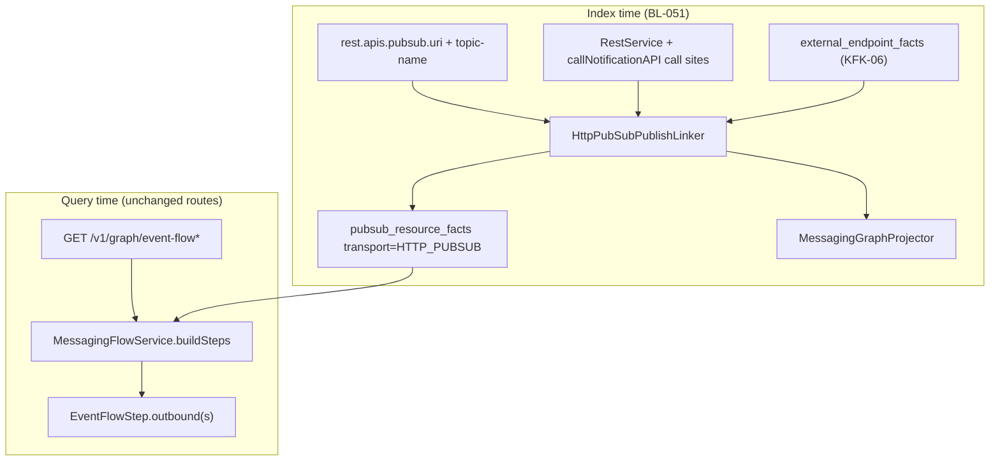

# TestSeer — HTTP Pub/Sub Notification Exit as Event-Flow Hop

> **Status:** Implemented (backend P1–P2; viz `HTTP_PUBSUB` badge optional follow-up)  
> **Backlog:** BL-051 · extends [BL-050](TestSeer_BL050_Kafka_Messaging_Graph_Design.md) KFK-06  
> **Pilot:** `transaction-eval-consumer` — manual exit **X7**  
> **Evidence:** [TransactionEvalConsumer_ServiceGraph_Manual.md](../../../DesignDocuments/Docs/TransactionEvalConsumer_ServiceGraph_Manual.md) § exits  
> **Date:** 2026-06-15

---

## 1. Executive summary

Quotient services often publish to GCP Pub/Sub **indirectly**: a Spring `RestService` subclass POSTs to an internal **pubsub publish HTTP API**, with the logical topic name in the JSON body (`PublishRequest.withTopicName`). This is **not** the same as:

- Native `pubsub.publisher.topicId.*` in yaml (Option C today), or  
- Kafka `kafka.topics.*` (BL-050).

KFK-06 partially indexes the **HTTP surface** (`external_endpoint_facts`, `outbound_call_facts`). That does **not** make the path appear as an **event-flow hop** keyed by topic (`DEV_T.NOTIFICATION_REQ`), so cross-repo trace cannot walk eval → affiliate notification consumers.

**BL-051** introduces **virtual messaging publish facts**: same `pubsub_resource_facts` + `EventFlowStep.outbound` model as Kafka/GCP, with `transport=HTTP_PUBSUB` and `shortId` = yaml `topic-name`. One hop card shows **both** the logical topic and the HTTP publish URI.

---

## 2. Problem statement

### 2.1 Manual graph (authoritative)

| ID | Channel | Logical target | Publisher | Config |
|----|---------|----------------|-----------|--------|
| **X7** | HTTP POST | `DEV_T.NOTIFICATION_REQ` (env alias) | `PubSubNotificationClient.callNotificationAPI` | `rest.apis.pubsub.uri` + `topic-name` |
| **X3** | Kafka | `QUOT.REBATE.REWARD-STATUS.EVENTS` | `TransactionHelper.postRewardNotifications` | `kafka.topics.*` |

`ReceiptTxnEvalProcessor` / `CorrectedTxnEvalProcessor` can emit **both** X7 and X3 from `postNotifications` — they are separate egress channels.

### 2.2 Runtime shape (code)

```java
@ConfigurationProperties("rest.apis.pubsub")
public class PubSubNotificationClient extends RestService<Void, PublishRequest> {
    private String topicName;  // from yaml: rest.apis.pubsub.topic-name

    public void callNotificationAPI(...) {
        callWithRetry(prepareRestRequest(...), Void.class);
    }
    // PublishRequest.withTopicName(topicName).withMessageBody(...)
}
```

Yaml (dev):

```yaml
rest:
  apis:
    pubsub:
      uri: http://10.212.11.202:80/pubsub/service/publish
      method: POST
      topic-name: DEV_T.NOTIFICATION_REQ
```

### 2.3 TestSeer today (after BL-050 P2)

| Surface | X7 captured? | Event-flow hop? |
|---------|--------------|-----------------|
| `facts/outbound` | Partial (`RestService` + `callWithRetry`) | No |
| `facts/external-endpoints` | Partial (`rest.apis.pubsub.uri`, `topicName` in attributes) | No — only `EventFlowStep.externalEndpoints[]` sidecar |
| `pubsub_resource_facts` PUBLISH | No | No |
| `GET /v1/graph/event-flow?shortId=DEV_T.NOTIFICATION_REQ` | No steps | No |
| Cross-repo trace from notification topic | `NO_PUBLISHER` | No |

### 2.4 Why `externalEndpoints` alone is insufficient

`MessagingFlowService.attachExternalEndpoints()` attaches HTTP metadata to a handler step **by class FQN**. It does not:

1. Key the hop by **topic short id** (needed for cross-repo and viz topic columns).
2. Participate in `traceCrossRepo()` BFS (which groups `pubsub_resource_facts` by `short_id`).
3. Distinguish **multiple egress** from one processor (X3 Kafka + X7 HTTP) — today `EventFlowStep` allows only **one** `OutboundMsg`.

Agents asking “what happens after eval publishes `NOTIFICATION_REQ`?” need a **topic-centric hop**, not only a partner HTTP row.

---

## 3. Design goals

| ID | Goal | Must |
|----|------|------|
| HPS-01 | Index HTTP pubsub publish as `pubsub_resource_facts` with `role=PUBLISH`, `shortId=topic-name` | Must |
| HPS-02 | Link publisher to `PubSubNotificationClient` and **caller** processors that invoke `callNotificationAPI` | Must |
| HPS-03 | Surface in `GET /v1/graph/event-flow` as `EventFlowStep.outbound` (or `outbounds[]`) | Must |
| HPS-04 | `traceCrossRepo` finds publishers/subscribers on `*_T.NOTIFICATION_REQ` without `NO_PUBLISHER` when eval indexed | Must |
| HPS-05 | `transport=HTTP_PUBSUB` distinct from `KAFKA` and native `PUBSUB` in API + viz | Should |
| HPS-06 | Coexist with `external_endpoint_facts` (HTTP URI detail) — not replace | Must |
| HPS-07 | Env topic aliases (`DEV_T` / `QA_T` / `PDN_T`) via rule pack | Should |

### Non-goals

- Proving HTTP delivery or GCP message arrival at runtime.
- Modeling the pubsub **publish microservice** internals (black box at HTTP boundary).
- Merging X7 with X3 into one hop (they remain separate channels).

---

## 4. Recommended approach: virtual messaging publish (extend Option C)

**Do not fork** a parallel “notification facts” table. Reuse `pubsub_resource_facts` with enriched attributes:

```json
{
  "transport": "HTTP_PUBSUB",
  "topicName": "DEV_T.NOTIFICATION_REQ",
  "publishUri": "http://10.212.11.202:80/pubsub/service/publish",
  "httpMethod": "POST",
  "configKey": "rest.apis.pubsub.uri",
  "clientClass": "com.quotient.platform.transaction.eval.client.PubSubNotificationClient",
  "eventType": "NOTIFICATION_EVENT"
}
```

| Field | Value |
|-------|--------|
| `resourceKind` | `TOPIC` |
| `shortId` | `DEV_T.NOTIFICATION_REQ` (from yaml `topic-name`) |
| `role` | `PUBLISH` |
| `fullResourceId` | HTTP URI (publish API) |
| `linkedClassFqn` | Caller processor FQN (e.g. `ReceiptTxnEvalProcessor`) or client if no caller resolved |
| `linkedMethod` | `postNotifications` or `callNotificationAPI` |
| `evidenceSource` | `HTTP_PUBSUB_LINKER` |

This plugs into existing:

- `MessagingFlowService.buildSteps()` → `OutboundMsg(shortId, "PUBLISH", fullResourceId)`
- `MessagingGraphProjector` → `PUBLISHES_TO` edge class → TOPIC node
- `traceCrossRepo()` → publisher list for topic

---

## 5. Architecture



### 5.1 Index component: `HttpPubSubPublishLinker`

**Input:**

- `external_endpoint_facts` where `config_key` matches `rest.apis.pubsub.uri` (or rule-pack list).
- `external_call_site_facts` where `http_client_method=callWithRetry` and client is `PubSubNotificationClient`.
- `ParsedModel` list for `extends RestService` + `@ConfigurationProperties("rest.apis.pubsub")`.
- Yaml flatten map: sibling `topic-name`, `method` under same `rest.apis.pubsub` prefix.

**Algorithm:**

1. For each env yaml file, read `rest.apis.pubsub.topic-name` → `topicShortId`.
2. Match `PubSubNotificationClient` class FQN from models.
3. Find **callers**: methods that contain `pubSubNotificationClient.callNotificationAPI` (field name heuristic).
4. Emit one `PubSubResourceFact` per `(topic, env, yaml_path, caller class)` with attributes above. Linker dedupe key includes `sourcePath` from `YamlConfigUtils.expandAndFlatten` so ConfigMap embedded `application.yaml` and outer wrapper do not collapse distinct yaml paths.
5. Confidence: `0.94` when yaml topic + client + call site; `0.80` yaml + client only.

**Storage (Flyway V21):** Unique index `uq_pubsub_resource` must include `COALESCE(linked_class_fqn,'')` so multiple caller classes can publish the same logical topic from one yaml file (e.g. `ReceiptTxnEvalProcessor` + `CorrectedTxnEvalProcessor`, or receipt-service `WebhooksService` + `ProcessReceiptProcess` on `T.NOTIFICATION_REQ`). Pre-V21 schema allows only one row per `(topic, env, spring_key, yaml_path)` and indexing fails with `duplicate key value violates unique constraint "uq_pubsub_resource"`. `DualWriteService.writePubSubResourceFacts` deletes by `(service_id, commit_sha)`, dedupes in-batch on the V21 key, and normalizes null `spring_key` / `linked_class_fqn` to `''` on insert.

**Wire:** `MessagingFactOrchestrator.buildFacts()` after `ExternalEndpointLinker.link()`:

```java
pubsub.addAll(httpPubSubPublishLinker.link(
    external.endpoints(), external.callSites(), models, yamlFiles));
```

### 5.2 Rule pack additions (`quotient-messaging.yml`)

```yaml
httpPubSubPublishLinks:
  - configUriKey: rest.apis.pubsub.uri
    configTopicKey: rest.apis.pubsub.topic-name
    clientClass: PubSubNotificationClient
    callerPattern: callNotificationAPI
    flowStep: EVAL_NOTIFICATION
    topicAliases:
      DEV_T.NOTIFICATION_REQ: [QA_T.NOTIFICATION_REQ, PDN_T.NOTIFICATION_REQ, PROD_T.NOTIFICATION_REQ]
```

Topic aliases enable cross-env trace when bundle indexes multiple lanes.

### 5.3 Multi-outbound per handler

**Problem:** `ReceiptTxnEvalProcessor` publishes to Kafka reward-status **and** HTTP notification topic.

**Recommendation (Phase 1):** extend `EventFlowStep`:

```java
public record EventFlowStep(
    ...
    List<OutboundMsg> outbounds,  // new — replace single outbound
    ...
) {
    /** Backward compat: first outbound or null */
    public OutboundMsg outbound() { ... }
}
```

Extend `OutboundMsg`:

```java
public record OutboundMsg(
    String topicOrType,
    String role,
    String payloadOrResource,
    String transport   // KAFKA | PUBSUB | HTTP_PUBSUB
) {}
```

`buildSteps()` appends to `outbounds` list instead of overwriting.

**Alternative (deferred):** separate `EventFlowStep` rows per egress — duplicates reads/writes; avoid unless viz requires it.

---

## 6. Query & API behavior

### 6.1 Single-service event-flow

`GET /v1/graph/event-flow?serviceId={eval}&shortId=DEV_T.NOTIFICATION_REQ&includeExternal=true`

**Expected step** (after index):

```json
{
  "order": 3,
  "handler": "com.quotient.platform.transaction.eval.processors.ReceiptTxnEvalProcessor",
  "outbounds": [
    {
      "topicOrType": "DEV_T.NOTIFICATION_REQ",
      "role": "PUBLISH",
      "payloadOrResource": "http://10.212.11.202:80/pubsub/service/publish",
      "transport": "HTTP_PUBSUB"
    }
  ],
  "externalEndpoints": [
    {
      "endpointId": "quotient:pubsub_notification",
      "operation": "PUBSUB_NOTIFICATION",
      "urlResolved": "http://10.212.11.202:80/pubsub/service/publish",
      "configKey": "rest.apis.pubsub.uri"
    }
  ]
}
```

HTTP detail stays in `externalEndpoints`; hop identity is **topic**.

### 6.2 Cross-repo trace

`GET /v1/graph/event-flow/cross-repo?orgId=quotient&shortId=DEV_T.NOTIFICATION_REQ&env=dev`

| Hop | Publishers | Subscribers |
|-----|------------|-------------|
| 1 | `transaction-eval-suite` / `ReceiptTxnEvalProcessor`, `CorrectedTxnEvalProcessor` | `affiliate-notifications` (if indexed on same topic) |

`CrossRepoHop.transport` = `HTTP_PUBSUB` (restore `MessagingTransportUtil.resolveHopTransport` from participant `transport` field on `PubSubOrgView`).

### 6.3 Transport taxonomy

| `transport` | Meaning | `shortId` source |
|-------------|---------|------------------|
| `PUBSUB` | Native GCP publisher/subscription in yaml | `pubsub.publisher.topicId.*` |
| `KAFKA` | Kafka topic in yaml | `kafka.topics.*.topic-name` |
| `HTTP_PUBSUB` | HTTP publish API + body topic | `rest.apis.pubsub.topic-name` |

`MessagingTransportUtil.fromAttributes()`:

```java
if (attrs.contains("HTTP_PUBSUB")) return "HTTP_PUBSUB";
if (attrs.contains("KAFKA")) return "KAFKA";
return "PUBSUB";
```

### 6.4 Viz (BL-048 follow-up)

Customer Journey hop card:

- Badge: **HTTP_PUBSUB** (not hardcoded `PUBSUB`).
- Primary label: `DEV_T.NOTIFICATION_REQ`.
- Sub-label: `POST → /pubsub/service/publish`.
- Link `externalEndpoints[0]` in detail panel.

---

## 7. Graph projection

| Edge | From | To |
|------|------|-----|
| `PUBLISHES_TO` | CLASS (`ReceiptTxnEvalProcessor`) | TOPIC (`DEV_T.NOTIFICATION_REQ`) |
| (optional) `OUTBOUND_TO` | CLASS | EXTERNAL endpoint node from `external_endpoint_facts` |

TOPIC node id: `{orgId}:topic:{env}:{DEV_T.NOTIFICATION_REQ}` — same as GCP/Kafka topics.

---

## 8. Pilot acceptance criteria

After index of `platform-transaction-eval-consumer` (suite module):

| AC | Check |
|----|--------|
| AC-1 | `facts/pubsub` includes row `shortId=DEV_T.NOTIFICATION_REQ`, `role=PUBLISH`, attributes `transport=HTTP_PUBSUB` |
| AC-2 | `linked_class_fqn` = `ReceiptTxnEvalProcessor` or `CorrectedTxnEvalProcessor` |
| AC-3 | `GET /v1/graph/event-flow?shortId=DEV_T.NOTIFICATION_REQ` → non-empty `steps[].outbounds` with `transport=HTTP_PUBSUB` |
| AC-4 | `GET /v1/graph/event-flow/cross-repo?shortId=DEV_T.NOTIFICATION_REQ` → **no** `NO_PUBLISHER` for eval service |
| AC-5 | Same handler step can show **both** Kafka `QUOT.REBATE.REWARD-STATUS.EVENTS` and HTTP `DEV_T.NOTIFICATION_REQ` outbounds |
| AC-6 | `facts/external-endpoints` still lists `quotient:pubsub_notification` (KFK-06 unchanged) |

---

## 9. Implementation phasing

| Phase | Delivers | Status |
|-------|----------|--------|
| **P1** | `HttpPubSubPublishLinker`, rule pack `httpPubSubPublishLinks`, `pubsub_resource_facts`, graph `PUBLISHES_TO` | **Done** |
| **P1b** | `List<OutboundMsg> outbounds` on `EventFlowStep` + `buildSteps` merge | **Done** |
| **P2** | `transport` on `OutboundMsg` / `CrossRepoHop`, `MessagingTransportUtil.resolveHopTransport` | **Done** |
| **P2b** | Topic alias map + multi-env trace | Partial (aliases in rule pack attributes; query alias expansion deferred) |
| **P2 viz** | `HTTP_PUBSUB` badge in `/viz.html` hop cards | Open |

**Dependency:** BL-050 KFK-06 (yaml uri + RestService outbound) — **done**.

### Shipped components (2026-06-15)

| Component | Location |
|-----------|----------|
| `HttpPubSubPublishLinker` | `ingestion/messaging/HttpPubSubPublishLinker.java` |
| Rule pack | `config/rule-packs/quotient-messaging.yml` → `httpPubSubPublishLinks` |
| Orchestrator wire | `MessagingFactOrchestrator.buildFacts()` after `ExternalEndpointLinker` |
| Query model | `EventFlowStep.outbounds[]`, `OutboundMsg.transport`, `MessagingTransportUtil` |
| Unit tests | `HttpPubSubPublishLinkerTest`, `MessagingFlowServiceBuildStepsTest`, `MessagingTransportUtilTest` |

**Pilot verification:** Re-index workspace service `quotient/transaction-eval-suite` (repo `platform-transaction-eval-consumer`) or `platform-receipt-service` (confirm Flyway V21 applied), then run acceptance criteria §8 against `DEV_T.NOTIFICATION_REQ` / `T.NOTIFICATION_REQ`. Expect **two** `HTTP_PUBSUB` publish rows for eval (`ReceiptTxnEvalProcessor`, `CorrectedTxnEvalProcessor`) when both call `callNotificationAPI`.

---

## 10. Alternatives considered

| Option | Pros | Cons | Verdict |
|--------|------|------|---------|
| **A. externalEndpoints only** | No schema change | No topic hop, no cross-repo | Reject as sole solution |
| **B. New `notification_publish_facts` table** | Clean separation | Forks Option C, duplicates query | Reject |
| **C. Synthetic kafka topic facts** | Reuses Kafka path | Misleading transport semantics | Reject |
| **D. Virtual `pubsub_resource_facts` (recommended)** | One hop model, cross-repo works | Slightly overloads table name | **Adopt** |
| **E. Post-query synthesizer in `MessagingFlowService`** | No index change | Fragile, no graph edges, repeats linker logic | Reject |

---

## 11. Quotient pattern generalization

Same linker applies wherever:

- `@ConfigurationProperties("rest.apis.pubsub")` + `extends RestService`
- Or `rest-clients.pubsub.*.uri` + `topic-name`
- Call pattern: `callWithRetry` / `callNotificationAPI`

Known producers (non-exhaustive): `transaction-eval-consumer`, `receipt-service`, `platform-receipt-service`, sales-transaction paths using `notificationReqTopic`.

---

## 12. Test plan

| Layer | Tests |
|-------|--------|
| Unit | `HttpPubSubPublishLinkerTest` — yaml + client + caller → fact shape |
| Unit | `MessagingFlowServiceBuildStepsTest` — multiple outbounds on one handler |
| Unit | `MessagingTransportUtilTest` — HTTP_PUBSUB detection |
| Integration | Index eval consumer fixture; assert AC-1–AC-6 via REST |
| Regression | Hyvee adapter native Pub/Sub unchanged (`transport` absent or `PUBSUB`) |

---

## 13. References

- Manual X7: `DesignDocuments/Docs/TransactionEvalConsumer_ServiceGraph_Manual.md`
- Gap analysis: `DesignDocuments/Docs/TransactionEvalConsumer_ServiceGraph_GapAnalysis.md`
- BL-050: [TestSeer_BL050_Kafka_Messaging_Graph_Design.md](TestSeer_BL050_Kafka_Messaging_Graph_Design.md) §7.8
- Option C: [features/07-option-c-messaging-flow.md](features/07-option-c-messaging-flow.md)
- Viz: [features/22-event-flow-viz-redesign.md](features/22-event-flow-viz-redesign.md)
