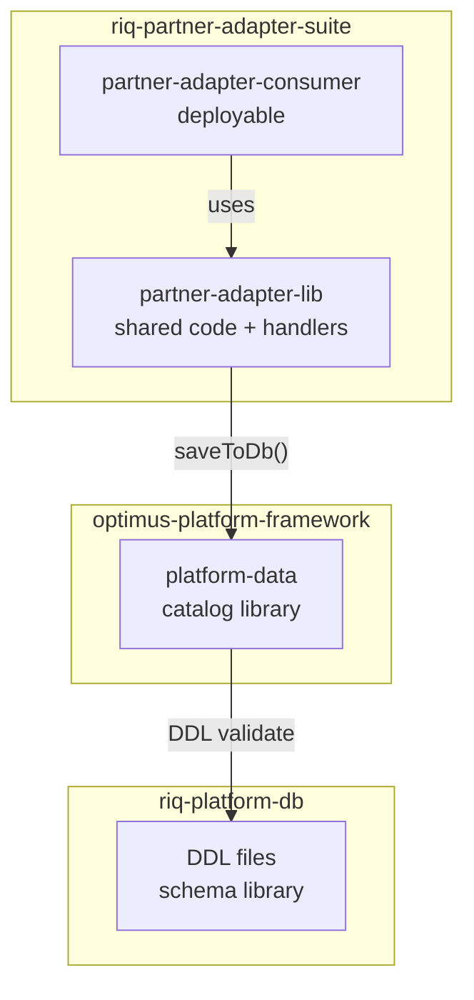
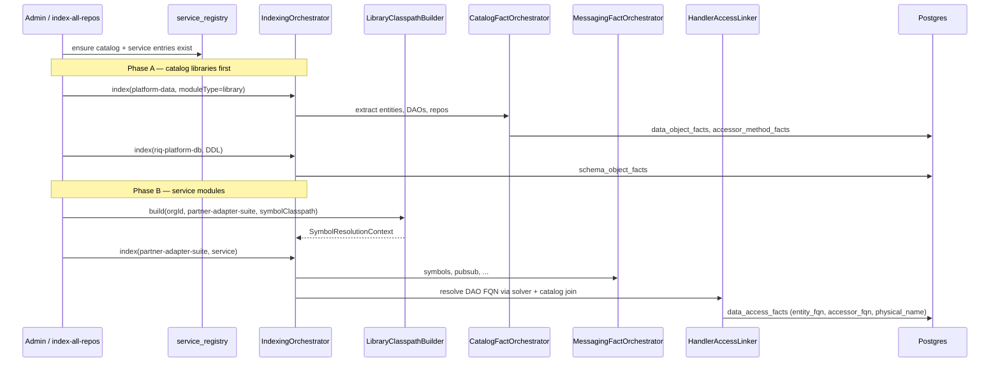
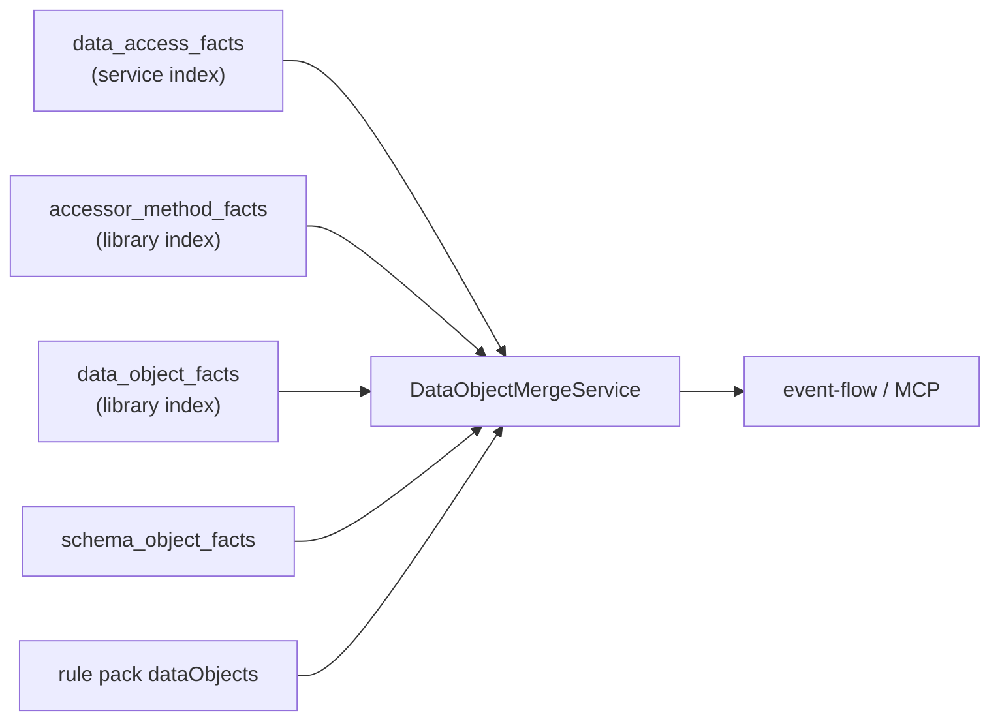

# TestSeer — Multi-Module Catalog & Cross-Repo Symbol Resolution

> **Status:** Requirements (P1–P4 shipped; P5–P6 deferred)  
> **Last updated:** 2026-06-12  
> **Extends:** [TestSeer_Data_Object_Catalog_Design.md](TestSeer_Data_Object_Catalog_Design.md) · [features/10-data-object-catalog.md](features/10-data-object-catalog.md) · [TestSeer_Data_Object_Catalog_Implementation_Caveats.md](TestSeer_Data_Object_Catalog_Implementation_Caveats.md)  
> **Related registry:** [REQUIREMENTS.md](../../docs/REQUIREMENTS.md) REG-03/04, WRK-18–24

---

## 1. Problem

Quotient repos are **Maven multi-module**. A single git repo often contains:

| Module kind | Example | Contains |
|-------------|---------|----------|
| **Platform persistence lib** | `optimus-platform-framework/platform-data` | `@Entity`, `*Dao`, Spring repos |
| **In-repo shared lib** | `riq-partner-adapter-suite/partner-adapter-lib` | `HyveeOfferAdapter`, mappers (calls platform DAOs) |
| **Deployable service** | `partner-adapter-consumer` | Pub/Sub consumer, Spring Boot entry |
| **Local persistence lib** | `platform-nre-suite/libs/mongo` | `@Document` models (Kotlin) |
| **Schema repo** | `riq-platform-db` | DDL only |

TestSeer today:

- Registers **one row per repo**, default `moduleType: service`, default `sourceRoots: [src/main/java]`.
- Runs **entity/DAO catalog** only when `moduleType = library`.
- Does **not** auto-detect Maven modules or distinguish catalog libs from shared code libs.
- Resolves handler field types with **import + DB guess**, not a **library classpath**.
- Joins catalog at query time by org + FQN, but **without pinning** which library `service_id` to use.

**Result:** Event-flow DB steps often show snake_case table guesses instead of `PartnerOfferCallRecorder`, because the chain **service handler → platform DAO → entity → table** spans repos and modules.

---

## 2. Goals

| ID | Goal |
|----|------|
| G-CAT-01 | Index **all configured persistence modules** (cross-repo and in-repo) into `data_object_facts` / `accessor_method_facts`. |
| G-CAT-02 | Index **handler surfaces** (including in-repo `*-lib` modules) as `service` and emit enriched `data_access_facts`. |
| G-CAT-03 | Resolve injected types (e.g. `PartnerOfferCallRecorderDao`) to **library FQNs** via symbol classpath, not same-package guess. |
| G-CAT-04 | Join handler touchpoints to catalog using **pinned library registrations**, deterministic per org. |
| G-CAT-05 | Express configuration in **`workspace.yml`** (bundles, catalog libs, service modules) — no hardcoded repo list in Java. |
| G-CAT-06 | Surface **gap codes** when library missing, join failed, or confidence below threshold. |

---

## 3. Non-goals

| ID | Non-goal |
|----|----------|
| NG-CAT-01 | Full Maven reactor build or dependency resolution from Artifactory. |
| NG-CAT-02 | Runtime proof of DB writes (integration tests / live SQL). |
| NG-CAT-03 | Kotlin-first catalog in Phase 1 (Java persistence modules first). |
| NG-CAT-04 | Auto-register every `*-lib` folder without config review. |
| NG-CAT-05 | Replace human-curated rule pack `dataObjects` for E2E poll hints. |

---

## 4. Terminology

| Term | Definition |
|------|------------|
| **Git repo** | GitHub repository (e.g. `riq-partner-adapter-suite`). |
| **Maven module** | Subdirectory with its own `pom.xml` (e.g. `partner-adapter-lib`). |
| **Registry entry** | Row in `service_registry` — one **logical index target** (not always one repo). |
| **Catalog library** | Registry entry with `moduleType: library` — emits entity/DAO/schema catalog facts. |
| **Service entry** | Registry entry with `moduleType: service` — emits messaging, handlers, `data_access_facts`. |
| **Shared code module** | In-repo lib scanned as part of a **service** index (handlers, types); not a separate catalog unless it owns persistence. |
| **Symbol classpath** | Set of source roots loaded into JavaParser `CombinedTypeSolver` when indexing a service. |
| **Pinned library** | Catalog library whose `service_id` is authoritative for org-scoped catalog joins. |

### 4.1 Module roles (Quotient offer-event example)



**Runtime call order:** `HyveeOfferAdapter` (PAL) → `PartnerOfferCallRecorderDao` (PD) → entity → MariaDB table.

**Index order:** PD (+ DDL) **first**, then adapter service (PAL + PAC roots).

---

## 5. How it works

### 5.1 Configuration plane (`workspace.yml`)

Three config blocks work together:

```yaml
githubDir: ~/Documents/GitHub
defaultOrgId: quotient

# Persistence + schema — indexed as moduleType=library (catalog facts)
catalogLibraries:
  - id: platform-data                    # logical name (stable key)
    repo: optimus-platform-framework
    serviceName: platform-data           # registry service_name (optional match)
    sourceRoots:
      - platform-data/src/main/java
    indexDdl: false

  - id: riq-platform-db
    repo: riq-platform-db
    serviceName: riq-platform-db
    sourceRoots:
      - Renew/MariaDB
      - Cassandra
    indexDdl: true                       # schema_object_facts

# Optional: in-repo persistence not in platform-data
  - id: nre-mongo
    repo: platform-nre-suite
    serviceName: nre-mongo-lib
    sourceRoots:
      - libs/mongo/src/main/kotlin        # future: Kotlin extractor

# Deployable / handler index targets — moduleType=service
serviceModules:
  - id: partner-adapter-suite
    repo: riq-partner-adapter-suite
    sourceRoots:
      - partner-adapter-lib/src/main/java    # handlers (HyveeOfferAdapter)
      - partner-adapter-consumer/src/main/java
      - partner-adapter-ns/src/main/java
    symbolClasspath:
      - repo: riq-partner-adapter-suite
        roots: [partner-adapter-lib/src/main/java]
      - catalogLibrary: platform-data       # resolve platform DAO types

  - id: offer-ingestion-ns
    repo: optimus-offer-services-suite
    sourceRoots:
      - optimus-offer-ingestion-ns/src/main/java
    symbolClasspath:
      - catalogLibrary: platform-data

bundles:
  quotient-full:
    indexOrder:                            # recommended catalog-first order (workspace.yml)
      - catalogLibrary: platform-data
      - catalogLibrary: riq-platform-db
      - serviceModule: partner-adapter-suite
      - repo: optimus-platform-msg-framework
      - repo: optimus-offer-services-suite
    trace:
      shortId: PDN_T.RIQ_OFFER_EVENT
      env: pdn
```

**Rules:**

1. Every `catalogLibrary` must have a matching **registry entry** (auto-created on first index or explicit `POST /registry/services`).
2. `serviceModules` replace implicit “index whole repo as one service” for monorepos.
3. `symbolClasspath` for a service **must** include all `catalogLibrary` roots its code imports from (minimum: `platform-data` for Optimus services).
4. Bundle `indexOrder` lists catalog libs **before** consumers.

---

### 5.2 Registry model (unchanged schema, new usage)

Multiple rows per git repo are allowed (different `service_id`):

| service_id | repo | service_name | module_type | source_roots |
|------------|------|--------------|-------------|--------------|
| `platform-data` | optimus-platform-framework | platform-data | **library** | `[platform-data/src/main/java]` |
| `riq-platform-db` | riq-platform-db | riq-platform-db | **library** | `[Renew/MariaDB, Cassandra]` |
| `partner-adapter-suite` | riq-partner-adapter-suite | partner-adapter-suite | **service** | `[partner-adapter-lib/..., consumer/...]` |

**REG-03 preserved:** `library` entries skip endpoint/outbound extraction; they run `CatalogFactOrchestrator` only (+ DDL when configured).

**REG-04 preserved:** `sourceRoots` pin Maven modules within a repo.

**New behavior:** `CatalogResolverService` joins use **pinned `service_id`** from `catalogLibraries` config, not “latest row in org matching FQN.”

---

### 5.3 Index-time flow



#### 5.3.1 Catalog library index (`moduleType = library`)

| Step | Component | Output |
|------|-----------|--------|
| 1 | `EntityCatalogExtractor` | `data_object_facts` per `@Entity` / `@Document` / Cassandra `@Table` |
| 2 | `RepoGenericExtractor` | Repo → entity links in attributes |
| 3 | `DaoMethodExtractor` | `accessor_method_facts` (`saveToDb` → domain + entity) |
| 4 | `MirrorStoreExtractor` / Cassandra / Mongo | Multi-store edges |
| 5 | `SchemaDdlExtractor` (if DDL roots) | `schema_object_facts` |

#### 5.3.2 Service module index (`moduleType = service`)

| Step | Component | Output |
|------|-----------|--------|
| 1 | `LibraryClasspathBuilder` | `CombinedTypeSolver` = service roots + shared lib roots + catalog library roots |
| 2 | `JavaParserService` + solver | Resolved field/constructor types on handlers |
| 3 | `HandlerAccessLinker` | Match `MethodCallExpr` on `*Dao/*Repo` |
| 4 | `TypeFqnResolver` tier `SYMBOL_SOLVER` (0.92) | `PartnerOfferCallRecorderDao` FQN from platform-data |
| 5 | `CatalogResolverService` | Join `(accessorFqn, methodName)` → library `accessor_method_facts` |
| 6 | Enriched row | `entity_fqn`, `domain_fqn`, `physical_name`, `confidence ≥ 0.93` |

**Fallback policy (CAT-RES-04):** If solver + catalog join both fail, emit touchpoint with `evidenceSource=HANDLER_LINKER` and **gap flag** — do not silently present snake_case table as authoritative.

---

### 5.4 Query-time flow

Query time does **not** re-parse Java. It joins indexed facts:



**Join keys:** `org_id` + pinned library `service_id` + `accessor_fqn` + `method_name` (+ optional `entity_fqn`).

**Freshness:** Response `STALE` if handler service is CURRENT but any pinned catalog library is older than threshold (design: 60m).

---

### 5.5 Symbol resolution tiers (updated)

| Tier | Strategy | Confidence | When |
|------|----------|------------|------|
| 1 | Qualified name in source | 0.95 | Type already FQN |
| 2 | Explicit import | 0.95 | `import com.quotient...Dao` |
| 3 | **SymbolSolver** on classpath | **0.92** | Field type resolved against catalog library roots |
| 4 | Same-service `symbol_facts` | 0.85 | Type defined in indexed service |
| 5 | Catalog simple-name disambiguation | 0.80 | Match against pinned library `accessor_method_facts` / symbols |
| 6 | Same-package fallback | 0.50 | **Unsupported for data-access emit** unless no DAO call |

**Disambiguation (CAT-RES-03):** When tier 5 returns multiple FQNs, prefer candidate present in pinned library's `accessor_method_facts`.

---

## 6. Functional requirements

### 6.1 Configuration (CFG)

| ID | Requirement | Priority |
|----|-------------|----------|
| CFG-CAT-01 | `workspace.yml` supports `catalogLibraries[]` with `id`, `repo`, `sourceRoots`, optional `serviceName`, `indexDdl`. | Must | **Done** |
| CFG-CAT-02 | `workspace.yml` supports `serviceModules[]` with `id`, `repo`, `sourceRoots`, `symbolClasspath[]`. | Must | **Done** |
| CFG-CAT-03 | Bundle config supports `indexOrder[]` mixing `catalogLibrary`, `serviceModule`, and legacy `repo`. | Must | **Done** |
| CFG-CAT-04 | `WorkspaceConfigLoader` exposes catalog libs and service modules to backend services. | Must | **Done** |
| CFG-CAT-05 | `config/workspace.example.yml` documents Quotient `quotient-full` defaults. | Should | **Done** |
| CFG-CAT-06 | Postgres V13 stores per-org catalog config (`workspace_*` tables). | Must | **Done** |
| CFG-CAT-07 | `OrgWorkspaceConfigResolver` — DB overrides YAML for orgs with DB rows. | Must | **Done** |
| CFG-CAT-08 | REST CRUD `/v1/workspace/catalog-libraries`, `/v1/workspace/service-modules` (`?orgId=`). | Must | **Done** |
| CFG-CAT-09 | `POST /v1/workspace/import-from-yaml` seeds DB from YAML bootstrap. | Should | **Done** |
| CFG-CAT-10 | `POST .../catalog-libraries/{id}/register` creates registry `moduleType=library` row. | Should | **Done** |

### 6.2 Registry & discovery (REG)

| ID | Requirement | Priority |
|----|-------------|----------|
| REG-CAT-01 | Allow **multiple registry entries** per git repo (unique `service_id`). | Must (exists — document + tooling) |
| REG-CAT-02 | Auto-register from config on index: create library/service rows with correct `moduleType` and `sourceRoots`. | Must |
| REG-CAT-03 | Org discovery (`POST /admin/discover`) **must not** overwrite manually configured catalog library entries. | Should |
| REG-CAT-04 | Local index auto-register uses config profile when repo matches `serviceModules` or `catalogLibraries`. | Must |
| REG-CAT-05 | Optional: Maven `pom.xml` module scan suggests candidates; human approves via config. | Future |

### 6.3 Symbol classpath (SYM)

| ID | Requirement | Priority |
|----|-------------|----------|
| SYM-CAT-01 | `LibraryClasspathBuilder` builds `CombinedTypeSolver` from `githubDir` + configured roots. | Must |
| SYM-CAT-02 | Service index passes `SymbolResolutionContext` into `JavaParserService`, `FieldTypeIndex`, `HandlerAccessLinker`. | Must |
| SYM-CAT-03 | Classpath includes: service `sourceRoots` + same-repo shared modules + all referenced `catalogLibraries`. | Must |
| SYM-CAT-04 | Cache solver context per `(orgId, serviceId, libraryCommitSet)`; invalidate on library index complete. | Should |
| SYM-CAT-05 | Webhook index path prefetches catalog library sources at pinned commit before service index. | Should |

### 6.4 Catalog join (JOIN)

| ID | Requirement | Priority |
|----|-------------|----------|
| JOIN-CAT-01 | `CatalogResolverService` accepts pinned library `service_id` from config for all lookups. | Must |
| JOIN-CAT-02 | `findAccessorMethod`, `findEntityByFqn`, `findTypeFqnBySimpleName` filter `module_type = library` **and** pinned id when configured. | Must |
| JOIN-CAT-03 | Handler linker prefers catalog join over `inferStoreType` / `inferTableFromAccessor` fallbacks. | Must |
| JOIN-CAT-04 | Emit `HANDLER_WITHOUT_CATALOG` gap when accessor FQN not in library catalog after index. | Must |

### 6.5 Index orchestration (IDX)

| ID | Requirement | Priority |
|----|-------------|----------|
| IDX-CAT-01 | Bulk index covers all workspace repos; catalog libs indexed via `catalogLibraries` profiles where configured. | Must |
| IDX-CAT-02 | Document + enforce: catalog libraries before dependent service modules. | Must |
| IDX-CAT-03 | Re-index catalog library triggers recommendation to re-index dependent services (log / admin API). | Should |
| IDX-CAT-04 | Monorepo local index: fetch Java only under configured `sourceRoots`, not whole repo walk (when serviceModules defined). | Should |

### 6.6 Gaps & observability (GAP)

| ID | Requirement | Priority |
|----|-------------|----------|
| GAP-CAT-01 | `GET /v1/gaps/data-objects` includes `LIBRARY_NOT_INDEXED` for missing pinned catalog lib. | Must |
| GAP-CAT-02 | `HANDLER_WITHOUT_CATALOG` for touchpoints with no accessor/entity join. | Must |
| GAP-CAT-03 | `LOW_CONFIDENCE_TOUCHPOINT` for `confidence < 0.85` or fallback evidence only. | Should |
| GAP-CAT-04 | Event-flow step includes `catalogLibraryId`, `resolutionTier`, `freshnessStatus` metadata. | Should |

### 6.7 Quotient defaults (DOC)

| ID | Requirement | Priority |
|----|-------------|----------|
| DOC-CAT-01 | Document default catalog library: `optimus-platform-framework` / `platform-data`. | Must |
| DOC-CAT-02 | Document partner-adapter `serviceModules` including `partner-adapter-lib` in service roots. | Must |
| DOC-CAT-03 | `quotient-full` bundle `indexOrder` includes `platform-data` + `riq-platform-db` before consumers. | Must | **Done** |

---

## 7. Persistence chain requirements (end-to-end)

For each handler DB touchpoint in a trace, the merged view **should** provide:

| Field | Source | Required when |
|-------|--------|---------------|
| `handlerClassFqn` | Service index | Always |
| `handlerMethod` | Service index | Always |
| `accessorFqn` | Symbol solver + import | Always for DAO calls |
| `daoMethod` | AST / call site | Always |
| `domainFqn` | `accessor_method_facts` (DAO param) | When DAO takes domain type |
| `entityFqn` | Catalog join | Always for platform DAO path |
| `storeType` | `data_object_facts` | Always |
| `physicalName` | `data_object_facts` | Always |
| `catalogOrKeyspace` | `@Table(catalog=...)` | When MariaDB |
| `validationKind` | DDL join | When schema lib indexed |
| `pollHint` | Rule pack merge | When curated in YAML |
| `confidence` | Tiered | ≥ 0.93 for “green” touchpoints |
| `evidenceSource` | Provenance chain | e.g. `SYMBOL_SOLVER+CATALOG+DAO_IMPL` |

---

## 8. Acceptance criteria (offer-event / Hyvee)

After full implementation and workspace bulk index:

1. Registry contains `platform-data` (`library`) and `partner-adapter-suite` (`service`) with correct `sourceRoots`.
2. `GET /v1/catalog/data-objects?serviceId=platform-data` returns `PartnerOfferCallRecorderEntity`.
3. `GET /v1/facts/data-access` for partner-adapter shows `recordSubmission` / `saveToDb` with:
   - `accessorFqn` = `...PartnerOfferCallRecorderDao`
   - `entityFqn` = `...PartnerOfferCallRecorderEntity`
   - `physicalName` = `PartnerOfferCallRecorder` (not snake_case)
   - `confidence` ≥ 0.93
4. `GET /v1/graph/event-flow/cross-repo?shortId=PDN_T.RIQ_OFFER_EVENT` HYVEE_ADAPTER step shows enriched reads/writes.
5. `GET /v1/gaps/data-objects` returns **zero** `LIBRARY_NOT_INDEXED` / `HANDLER_WITHOUT_CATALOG` for configured org after green index.
6. Removing `import PartnerOfferCallRecorderDao` from a fixture still resolves via symbol classpath (integration test).

---

## 9. Phased delivery

| Phase | Scope | Requirements | User-visible | Status |
|-------|-------|--------------|--------------|--------|
| **P1** | Config + pinned joins | CFG-CAT-01/04, JOIN-CAT-01/02, DOC-CAT-01/03 | Correct joins when imports present + manual registry | **Done** |
| **P2** | Symbol classpath (local index) | SYM-CAT-01–03, JOIN-CAT-03 | Hyvee adapter resolves platform DAO without import | **Done** |
| **P3** | Bundle index order + auto-register | IDX-CAT-01/02, REG-CAT-02/04 | `workspace.yml` `indexOrder` + `index-all-repos.sh` | **Done** |
| **P3b** | Org-scoped config API | CFG-CAT-06–10 | CRUD catalog libs via `/v1/workspace/*` | **Done** |
| **P4** | Gaps + metadata | GAP-CAT-01–03, CAT-RES-04 | Visible broken joins | **Done** |
| **P5** | Webhook prefetch + solver cache | SYM-CAT-04/05 | GitHub webhook path parity | Deferred |
| **P6** | Kotlin / in-repo mongo catalog | NG-CAT-03 lifted | NRE mongo collections | Partial |

---

## 10. Mapping to existing WRK IDs

| Existing | Extension |
|----------|-----------|
| WRK-18–19 | Unchanged — run on each **catalog library** entry, not whole repo |
| WRK-20 | Handler linker uses pinned join + symbol solver |
| WRK-22 | Becomes SYM-CAT-* (SymbolSolver + classpath) |
| WRK-23–24 | Unchanged — DDL + rule pack merge |
| REG-03/04 | Multi-entry per repo; catalog vs service separation |

**Proposed new IDs in REQUIREMENTS.md:** `CFG-CAT-*`, `SYM-CAT-*`, `JOIN-CAT-*`, `IDX-CAT-*`, `GAP-CAT-*` (or WRK-25–29 bundle).

---

## 11. Related documents

- [TestSeer_Data_Object_Catalog_Design.md](TestSeer_Data_Object_Catalog_Design.md) — phase 1–5 extractors
- [TestSeer_Data_Object_Catalog_Implementation_Caveats.md](TestSeer_Data_Object_Catalog_Implementation_Caveats.md) — current gaps
- [features/06-admin-indexing.md](features/06-admin-indexing.md) — local index, bundles
- [features/01-service-registry.md](features/01-service-registry.md) — registry CRUD
