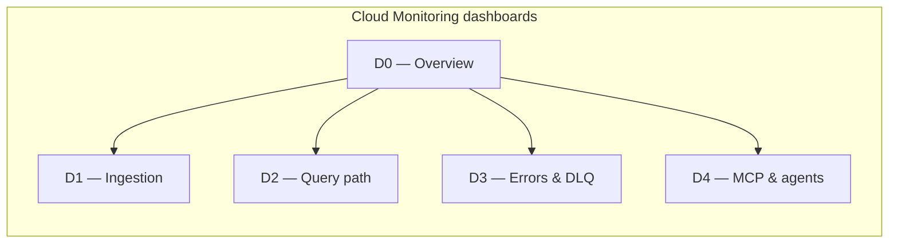
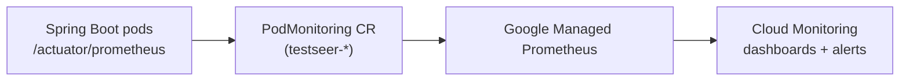

# BL-017 — TestSeer Observability Dashboards & SLO Alerts (Phase O5)

> **Backlog:** [BL-017](../../docs/BACKLOG.md)  
> **Status:** Eng prep shipped — Platform ops rollout pending  
> **Last updated:** 2026-06-15  
> **Prerequisites:** O1–O4 shipped ([TestSeer_Observability_Design.md](TestSeer_Observability_Design.md))  
> **Audience:** SRE, on-call, Engineering Lead

---

## 1. Purpose

Phase O1–O4 instrumented TestSeer (`TestSeerMetrics`, MDC logging, DLQ path, `/actuator/prometheus`). **O5 (BL-017)** turns those signals into:

1. **Dashboards** — answer the four operator questions from the observability design (indexing health, query speed, failure drill-down, freshness trust).
2. **SLO alerts** — Cloud Monitoring policies with runbook links, aligned to [TestSeer_Phase1_SystemDesign.md](TestSeer_Phase1_SystemDesign.md) §4.4.
3. **Local parity** — optional Grafana dashboard JSON for dev/staging scrape.

This is **operational rollout**, not application code. **Engineering prep** (metrics, `deploy/observability/` local Grafana/Prometheus, PromQL alert rules A-01–A-09) is shipped in this repo. **GCP artifacts** (Cloud Monitoring dashboards, alert policies, PodMonitoring) apply in the platform/infra repo once a GCP project and GKE cluster exist.

---

## 1b. Engineering prep (shipped in repo)

| Deliverable | Location | Status |
|-------------|----------|--------|
| `testseer_last_index_timestamp` + `testseer_gaps_count` gauges | `TestSeerMetrics.java`, `GapMetricsExporter.java` | Shipped |
| Index-complete hook | `WorkerJobProcessor` → `recordIndexComplete()` | Shipped |
| Local Grafana D0–D4 panels | `deploy/observability/grafana/dashboards/testseer-index-health.json` | Shipped |
| Local dev dashboard (ingestion/query/errors/MCP) | `deploy/observability/grafana/dashboards/testseer-local.json` | Shipped |
| Prometheus alert rules A-01–A-09 (+ D0 staleness) | `deploy/observability/alerts/testseer-slo.yml` | Shipped (local); import to Cloud Monitoring pending |
| Prometheus + Grafana compose | `deploy/observability/docker-compose.yml` | Shipped |

---

## 2. Scope

| In scope | Out of scope |
|----------|--------------|
| Cloud Monitoring dashboards + alert policies | OpenTelemetry distributed tracing |
| Prometheus scrape from GKE (`PodMonitoring`) | MCP stderr aggregation (developer machines) |
| Confluent Cloud Kafka lag panels | Product telemetry / classifier calibration (Step 12) |
| Log-based metrics for ERROR/WARN spikes | Custom freshness cron (defer to BL-016 nightly + future freshness job) |
| Runbook links on every P1/P2 alert | Full SRE on-call rotation setup |

---

## 3. Metric inventory (as shipped)

Source: [`TestSeerMetrics.java`](../src/main/java/io/testseer/backend/observability/TestSeerMetrics.java), [`RequestIdFilter.java`](../src/main/java/io/testseer/backend/observability/RequestIdFilter.java).

Micrometer exposes Prometheus names with `.` → `_` and counter `_total` suffix.

| Application metric | Prometheus name | Type | Labels |
|--------------------|-----------------|------|--------|
| `testseer.jobs.enqueued` | `testseer_jobs_enqueued_total` | Counter | `job_type`, `org_id` |
| `testseer.jobs.completed` | `testseer_jobs_completed_total` | Counter | `job_type`, `status` (`COMPLETE`, `FAILED`, `DLQ`) |
| `testseer.jobs.duration` | `testseer_jobs_duration_seconds_*` | Timer/histogram | `job_type` |
| `testseer.jobs.dlq` | `testseer_jobs_dlq` | Gauge | — (SQL count of `analysis_runs.status='DLQ'`) |
| `testseer.jobs.dlq.total` | `testseer_jobs_dlq_total` | Counter | — (increment on each DLQ move) |
| `testseer.analysis_runs.failed` | `testseer_analysis_runs_failed_total` | Counter | `org_id` |
| `testseer.query.duration` | `testseer_query_duration_seconds_*` | Timer/histogram | `endpoint` (normalized path) |
| `testseer.cache.hit` | `testseer_cache_hit_total` | Counter | — |
| `testseer.cache.miss` | `testseer_cache_miss_total` | Counter | — |
| `testseer.webhook.received` | `testseer_webhook_received_total` | Counter | `event` |
| `testseer.webhook.rejected` | `testseer_webhook_rejected_total` | Counter | `reason` |
| `testseer.mcp.requests` | `testseer_mcp_requests_total` | Counter | `tool`, `status` |

**Endpoint label values** (query timer): `/v1/facts/*`, `/v1/graph/*`, `/v1/status/*`, `/v1/jobs/*`, `/admin/index/*`, `/registry/*`, `/webhook/*`, `/actuator/*`.

**External metrics** (not from app; wire in dashboards):

| Signal | Source | Notes |
|--------|--------|-------|
| Kafka consumer lag | Confluent Cloud metrics → Cloud Monitoring | Groups: `testseer-workers-pr`, `testseer-workers-batch`; topics: `testseer.jobs.pr`, `testseer.jobs.batch` |
| DLQ topic depth | Confluent topic `testseer.jobs.dlq` | Complement to DB gauge |
| Postgres connections | Cloud SQL monitoring | Pool saturation > 90% |
| Redis memory / ops | Memorystore monitoring | Degraded cache path |
| Pub/Sub backlog | `testseer-index-complete-sub` | Delivery lag > 5 min |
| GKE pod restarts / CPU | Kubernetes metrics | Per deployment |

**Global tag:** `application=testseer-backend` (`application-prod.yml`).

---

## 4. SLO definitions

These SLOs drive alert thresholds and dashboard “budget” widgets.

| SLO ID | SLI | Target | Measurement window | Alert if |
|--------|-----|--------|-------------------|----------|
| **SLO-ING-01** | Job success rate | ≥ 99% jobs complete without DLQ | 24 h rolling | DLQ gauge > 0 for 5 m **or** DLQ counter rate > 0 sustained |
| **SLO-ING-02** | PR consumer lag | Lag < 500 messages | 2 m | Lag ≥ 500 for 2 m |
| **SLO-ING-03** | Job parse duration P95 | < 30 s | 15 m | P95 ≥ 30 s for 10 m |
| **SLO-QRY-01** | Query API latency P95 | < 250 ms | 15 m | P95 ≥ 250 ms for 10 m |
| **SLO-QRY-02** | Cache hit ratio | ≥ 30% (miss ≤ 70%) | 15 m | Miss rate > 70% for 15 m |
| **SLO-SEC-01** | Webhook signature validity | < 10 invalid / 5 m | 5 m | `reason=invalid_signature` rate > 10 in 5 m |
| **SLO-ERR-01** | Failed run spike | < 5 failures / 15 m | 15 m | `testseer_analysis_runs_failed_total` increase ≥ 5 in 15 m |

**Error budget (conceptual):** For SLO-QRY-01, if P95 exceeds 250 ms for more than 1% of 15-minute windows in a week, freeze feature work and investigate cache/Postgres.

---

## 5. Dashboard catalog

Five dashboards in Cloud Monitoring (folder: **TestSeer / Production**). Each dashboard uses template variables where noted.



| ID | Name | Primary audience | Refresh |
|----|------|------------------|---------|
| **D0** | TestSeer — Overview | On-call, leads | 1 m |
| **D1** | TestSeer — Ingestion | Ingestion/on-call | 1 m |
| **D2** | TestSeer — Query path | Query/on-call | 1 m |
| **D3** | TestSeer — Errors & DLQ | Incident response | 1 m |
| **D4** | TestSeer — MCP & agents | Platform QA, agent owners | 5 m |

**Template variables (all dashboards where applicable):**

| Variable | Source | Values |
|----------|--------|--------|
| `$project` | GCP project | e.g. `testseer-prod` |
| `$cluster` | GKE | `testseer-prod` |
| `$namespace` | K8s | `testseer-ingestion`, `testseer-query` |
| `$deployment` | K8s | `webhook-receiver`, `analysis-worker-pr`, `analysis-worker-batch`, `query-api` |

---

## 6. Dashboard specifications

### D0 — Overview (single pane of glass)

**Layout:** 4 rows × 12 columns. Top row = health tiles; remaining rows = sparklines with deep links to D1–D4.

| Row | Panel | Visualization | Query / source | Link on click |
|-----|-------|---------------|----------------|---------------|
| 1 | **System status** | Scorecard (green/yellow/red) | Composite: all P2+ alerts firing = red | Alert policy list |
| 1 | **DLQ depth** | Single stat | `testseer_jobs_dlq` | D3 |
| 1 | **PR lag** | Single stat | Confluent lag `testseer.jobs.pr` / group `testseer-workers-pr` | D1 |
| 1 | **Query P95** | Single stat | histogram_quantile(0.95, … `testseer_query_duration_seconds_bucket`) | D2 |
| 2 | **Jobs/min** | Time series | `rate(testseer_jobs_enqueued_total[5m]) * 60` by `job_type` | D1 |
| 2 | **Completion vs failure** | Time series | completed rate vs `rate(testseer_analysis_runs_failed_total[5m])` | D3 |
| 3 | **Cache hit %** | Gauge + trend | see §7.1 | D2 |
| 3 | **MCP requests/min** | Time series | `rate(testseer_mcp_requests_total[5m]) * 60` by `tool` | D4 |
| 4 | **Recent ERROR logs** | Logs panel | `resource.type="k8s_container" jsonPayload.level="ERROR" labels.k8s-pod-name=~"testseer.*"` limit 20 | Cloud Logging |

---

### D1 — Ingestion

| Panel | Type | PromQL / MQL | Notes |
|-------|------|--------------|-------|
| Jobs enqueued/min | Stacked area | `sum by (job_type) (rate(testseer_jobs_enqueued_total[5m])) * 60` | PR vs PUSH vs MANUAL vs LOCAL |
| Jobs completed/min | Line | `sum by (job_type) (rate(testseer_jobs_completed_total[5m])) * 60` | |
| Job duration P50/P95/P99 | Line | `histogram_quantile(0.95, sum by (le, job_type) (rate(testseer_jobs_duration_seconds_bucket[5m])))` | SLO-ING-03 line at 30s |
| PR consumer lag | Line | Confluent: `kafka.consumer.lag` filtered by topic + group | Threshold line 500 |
| Batch consumer lag | Line | Same for `testseer.jobs.batch` / `testseer-workers-batch` | |
| Webhook volume | Bar | `sum by (event) (increase(testseer_webhook_received_total[1h]))` | |
| Webhook rejects | Bar | `sum by (reason) (increase(testseer_webhook_rejected_total[1h]))` | Highlight `invalid_signature` |
| Worker pod CPU | Heatmap | GKE container CPU by `deployment=analysis-worker-pr` | Scale signal |
| Worker replicas | Stat | HPA current replicas | From K8s metrics |

**Drill-down runbook (panel annotation):**  
Lag high → scale `analysis-worker-pr` → check job P95 → GitHub rate limits → Postgres/Mongo write errors in logs (`jobId` MDC).

---

### D2 — Query path

| Panel | Type | PromQL | Notes |
|-------|------|--------|-------|
| Request rate | Line | `sum(rate(testseer_query_duration_seconds_count[5m]))` | All endpoints |
| Latency P50/P95 by endpoint | Line | quantile by `endpoint` label | SLO line 250ms on P95 |
| Cache hit ratio | Gauge + line | §7.1 | Target ≥ 30% hits |
| Cache ops/sec | Stacked | hit vs miss rates | |
| MCP share of traffic | Pie | `sum by (tool) (rate(testseer_mcp_requests_total[15m]))` | Only MCP-labeled requests |
| Query pod CPU / memory | Line | GKE metrics for `query-api` | |
| Postgres query time (infra) | Line | Cloud SQL `database/postgresql/insights/aggregate/latencies` | If Insights enabled |
| Redis hit rate (infra) | Stat | Memorystore metrics | Optional cross-check |

**Endpoint breakdown table:** Top 10 endpoints by P95 latency (last 1 h), sort descending.

---

### D3 — Errors & DLQ

| Panel | Type | Query | Notes |
|-------|------|-------|-------|
| DLQ gauge (DB) | Stat + history | `testseer_jobs_dlq` | Refreshed every 60s via `DlqDepthScheduler` |
| DLQ events rate | Line | `rate(testseer_jobs_dlq_total[5m])` | New DLQ moves |
| Kafka DLQ topic depth | Stat | Confluent topic `testseer.jobs.dlq` | Should track DB gauge |
| Failed runs / 15m | Stat | `increase(testseer_analysis_runs_failed_total[15m])` | Alert at ≥ 5 |
| Failed by org | Bar | `sum by (org_id) (increase(testseer_analysis_runs_failed_total[24h]))` | |
| ERROR log rate | Line | Log-based metric `testseer/error_count` | §8 |
| Top ERROR messages | Table | Logs: group by `jsonPayload.message` | Last 1 h |
| Dual-write failures | Logs panel | `"Mongo dual-write"` OR `"rollback"` severity ERROR | |
| DLQ log stream | Logs | `"DLQ message received"` OR `"moved to DLQ"` | Includes `jobId` |

**Incident checklist (text panel):**

1. `GET /v1/jobs/{jobId}` or SQL: `SELECT * FROM analysis_runs WHERE status='DLQ' ORDER BY completed_at DESC LIMIT 20`
2. Cloud Logging: `jsonPayload.jobId="<id>"`
3. Replay: `POST /admin/jobs/{jobId}/replay` (DLQ only)
4. If signature spike → rotate `testseer.github.webhook-secret` + GitHub webhook secret

---

### D4 — MCP & agents

| Panel | Type | Query | Notes |
|-------|------|-------|-------|
| MCP requests/min | Line | `sum by (tool) (rate(testseer_mcp_requests_total[5m])) * 60` | |
| MCP error rate | Line | `sum(rate(testseer_mcp_requests_total{status!~"2.."}[5m])) / sum(rate(testseer_mcp_requests_total[5m]))` | 4xx/5xx from HTTP status label |
| Tool latency proxy | Line | P95 of `/v1/facts/*`, `/v1/graph/*` when MCP header present | Approximate via endpoint timers |
| Top tools 24h | Bar | `sum by (tool) (increase(testseer_mcp_requests_total[24h]))` | Adoption |
| Freshness-related 404/202 | Stat | Filter query logs / metrics by `/v1/status/*` + status codes | Agents hitting stale data |
| Status code breakdown | Stacked bar | `sum by (status) (rate(testseer_mcp_requests_total[15m]))` | |

MCP stderr is **not** in Cloud Logging (stdio on developer machines). D4 uses backend proxy metrics only.

---

## 7. PromQL reference snippets

### 7.1 Cache hit ratio

```promql
sum(rate(testseer_cache_hit_total[5m]))
/
(sum(rate(testseer_cache_hit_total[5m])) + sum(rate(testseer_cache_miss_total[5m])))
```

Guard: if denominator = 0, show “N/A” (no query traffic).

### 7.2 Query P95 (all endpoints)

```promql
histogram_quantile(
  0.95,
  sum by (le) (rate(testseer_query_duration_seconds_bucket[5m]))
)
```

### 7.3 Query P95 by endpoint

```promql
histogram_quantile(
  0.95,
  sum by (le, endpoint) (rate(testseer_query_duration_seconds_bucket[5m]))
)
```

### 7.4 Job parse P95 by type

```promql
histogram_quantile(
  0.95,
  sum by (le, job_type) (rate(testseer_jobs_duration_seconds_bucket[5m]))
)
```

### 7.5 Ingestion success ratio

```promql
sum(rate(testseer_jobs_completed_total{status="COMPLETE"}[15m]))
/
sum(rate(testseer_jobs_completed_total[15m]))
```

Terminal outcomes only (`COMPLETE`, `FAILED`, `DLQ` on the completed counter). `FAILED` counts retry-eligible attempts; `DLQ` is terminal failure.

---

## 8. Log-based metrics (Cloud Logging)

Create user-defined metrics for patterns not yet counters:

| Metric name | Filter | Purpose |
|-------------|--------|---------|
| `testseer/error_count` | `resource.labels.container_name=~"testseer.*" severity>=ERROR` | ERROR spike alert |
| `testseer/webhook_signature_warn` | `jsonPayload.message=~"signature"` AND severity=WARN | SEC-01 backup |
| `testseer/dlq_log` | `textPayload=~"moved to DLQ" OR jsonPayload.message=~"DLQ message received"` | Cross-check gauge |
| `testseer/redis_cache_warn` | `jsonPayload.message=~"Redis"` AND severity=WARN | Cache bypass |

**Structured JSON fields to rely on** (prod `json-logging: true`): `requestId`, `jobId`, `serviceId`, `orgId`, `repo`, `jobType`.

**Example log query (incident):**

```
resource.type="k8s_container"
resource.labels.namespace_name="testseer-ingestion"
jsonPayload.jobId="550e8400-e29b-41d4-a716-446655440000"
```

---

## 9. Alert policies

Map 1:1 to SLOs. Notification channel: PagerDuty / Slack `#testseer-alerts` (ops choice).

| Policy ID | Name | Condition | Duration | Severity | Runbook |
|-----------|------|-----------|----------|----------|---------|
| **A-01** | DLQ non-empty | `testseer_jobs_dlq` > 0 | 5 m | P2 | D3 checklist |
| **A-02** | PR consumer lag | Confluent lag ≥ 500 | 2 m | P2 | Scale worker-pr; D1 |
| **A-03** | Query P95 high | PromQL SLO-QRY-01 | 10 m | P3 | D2 cache + Postgres |
| **A-04** | Cache miss high | miss ratio > 0.7 | 15 m | P3 | Redis + Pub/Sub sub lag |
| **A-05** | Failed runs spike | increase(failed) ≥ 5 | 15 m | P2 | D3 + GitHub token |
| **A-06** | Webhook signature failures | increase(rejected{reason="invalid_signature"}) ≥ 10 | 5 m | P1 | Rotate webhook secret |
| **A-07** | Job parse P95 high | SLO-ING-03 | 10 m | P3 | Large repo / parser |
| **A-08** | Pub/Sub delivery lag | subscription backlog > 5 m | 5 m | P3 | `testseer-index-complete-sub` |
| **A-09** | Postgres pool saturation | Cloud SQL connections > 90% max | 5 m | P2 | Scale pool / read replica |

**Alert documentation fields:** `documentation.content` = markdown link to this doc + SQL snippets; `documentation.subject` = policy name.

**Synthetic validation (staging acceptance):**

1. Force DLQ in staging → A-01 fires within 5 m.
2. Load-test query path with cache disabled → A-03/A-04 fire.
3. Send invalid webhook signature → A-06 fires.

---

## 10. Infrastructure wiring

### 10.1 Metric collection path (GKE)



| Workload | Namespace | Scrape path | Port |
|----------|-----------|-------------|------|
| `webhook-receiver` | `testseer-ingestion` | `/actuator/prometheus` | 8080 |
| `analysis-worker-pr` | `testseer-ingestion` | same | 8080 |
| `analysis-worker-batch` | `testseer-ingestion` | same | 8080 |
| `query-api` | `testseer-query` | same | 8080 |

**PodMonitoring example (apply in infra repo):**

```yaml
apiVersion: monitoring.googleapis.com/v1
kind: PodMonitoring
metadata:
  name: testseer-backend
  namespace: testseer-query
spec:
  selector:
    matchLabels:
      app: query-api
  endpoints:
    - port: http
      path: /actuator/prometheus
      interval: 30s
```

Duplicate for `testseer-ingestion` deployments (or one selector if shared label `app.kubernetes.io/name=testseer-backend`).

### 10.2 Confluent → Cloud Monitoring

Use Confluent Cloud integration (metric export) or Prometheus federation for:

- `kafka.consumer.lag` with labels `topic`, `consumer_group_id`
- Topic byte rate for `testseer.jobs.dlq`

### 10.3 Local / staging Grafana (optional)

Directory layout under `deploy/observability/` (shipped):

```
deploy/observability/
├── README.md
├── docker-compose.yml              # Prometheus + Grafana for local dev
├── prometheus.yml
├── alerts/
│   └── testseer-slo.yml            # A-01–A-09 PromQL rules (+ D0 staleness)
├── grafana/
│   ├── dashboards/
│   │   ├── testseer-local.json     # BL-017 local dashboard (ingestion/query/errors/MCP)
│   │   └── testseer-index-health.json  # D0–D4 index-health panels
│   └── provisioning/
│       ├── datasources/prometheus.yml
│       └── dashboards/dashboards.yml
└── terraform/                    # not in repo — apply in platform repo
    ├── dashboards.tf
    ├── alert_policies.tf
    └── log_metrics.tf
```

**Local scrape:** `prometheus.yml` static target `localhost:8080`, path `/actuator/prometheus`.

---

## 11. Rollout plan

| Step | Owner | Deliverable | Done when |
|------|-------|-------------|-----------|
| 1 | Platform | GCP project + GKE namespaces per architecture | Cluster live |
| 2 | Platform | PodMonitoring for all 4 deployments | Metrics visible in Metrics Explorer |
| 3 | Platform | Import D0–D4 (Terraform or UI) | Dashboards render non-empty in staging |
| 4 | Platform | Log-based metrics §8 | Appear in Metrics Explorer |
| 5 | Platform | Alert policies A-01–A-09 + notification channels | Synthetic tests pass |
| 6 | Eng | Runbook page (Confluence) linked from alerts | On-call sign-off |
| 7 | Eng | Update [BACKLOG.md](../../docs/BACKLOG.md) BL-017 → `done` | |

**Estimated effort:** 2–3 days platform ops (assuming GKE + Confluent already provisioned).

---

## 12. Gaps and follow-ups

| Gap | Impact | Recommendation |
|-----|--------|----------------|
| ~~`jobs.completed` lacks `FAILED`/`DLQ`~~ | — | **Fixed:** `JobFailureHandler` records `FAILED` (retry) and `DLQ` (terminal) |
| No `testseer.kafka.consumer.lag` in-app gauge | Dashboard depends on Confluent export | Accept external metric; optional Micrometer binder later |
| Freshness by `freshnessStatus` not materialized | D0 cannot show CURRENT/STALE counts | P2 cron or SQL scheduled query panel |
| MCP logs not centralized | D4 incomplete for client-side failures | Keep backend proxy metrics; document Cursor stderr for dev |
| Stackdriver Micrometer registry not in pom | Direct export vs scrape | Prefer PodMonitoring scrape (already have prometheus registry) |

---

## 13. Related documents

| Document | Relationship |
|----------|--------------|
| [TestSeer_Observability_Design.md](TestSeer_Observability_Design.md) | O1–O4 parent; §10 superseded by this doc for dashboards |
| [TestSeer_Phase1_SystemDesign.md](TestSeer_Phase1_SystemDesign.md) §4.4 | Original threshold source |
| [TestSeer_Phase1_Architecture.md](TestSeer_Phase1_Architecture.md) §5 | GKE deployment names |
| [DEPENDENCIES.md](../../docs/DEPENDENCIES.md) §5 | Kafka topics, Pub/Sub names |
| [features/02-ingestion-pipeline.md](features/02-ingestion-pipeline.md) | Job lifecycle, DLQ |

---

## 14. Acceptance criteria (BL-017 done)

### Engineering prep (repo)

- [x] Index freshness + gap metrics exported from backend
- [x] Local Grafana dashboards with D0–D4 panels (`testseer-index-health.json`) and dev overview (`testseer-local.json`)
- [x] PromQL alert rules A-01–A-09 in `deploy/observability/alerts/testseer-slo.yml`

### Platform ops (GCP — pending)

- [ ] D0–D4 visible in Cloud Monitoring for staging and prod projects
- [ ] All nine alert policies configured with notification channels and doc links
- [ ] On-call runbook covers DLQ, lag, and signature failure paths
- [ ] Staging synthetic: forced DLQ triggers A-01; invalid signature triggers A-06
- [ ] Engineering Lead can answer “is indexing healthy?” from D0 in < 30 s
- [ ] Query/MCP incident: P95 + cache + logs reachable from D2/D3 without ad-hoc PromQL
- [ ] [BACKLOG.md](../../docs/BACKLOG.md) BL-017 → `done`
