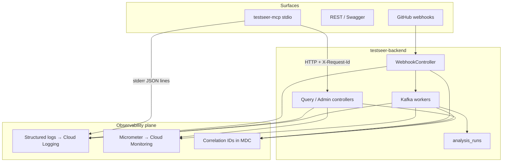
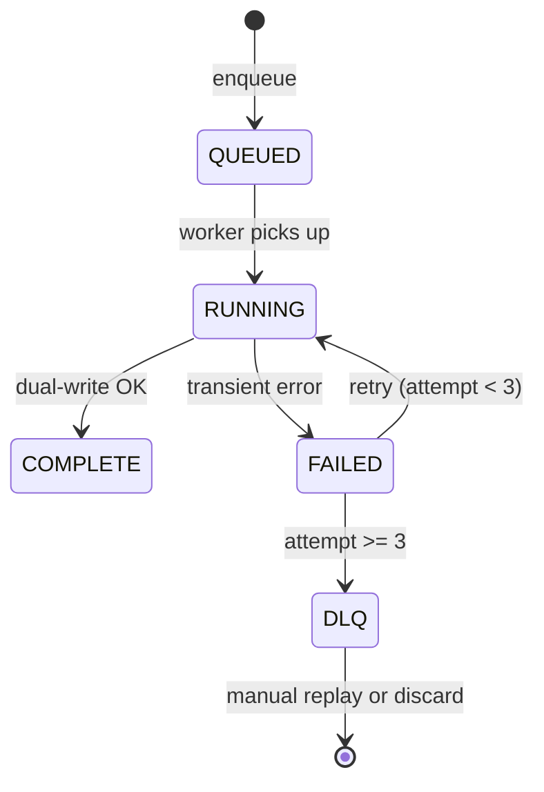

# TestSeer — Logging & Observability Design

> **Status:** Implemented (O1–O4 code; GCP alert Terraform out of repo)  
> **Last verified:** 2026-06-12  
> **Scope:** `testseer-backend`, `testseer-mcp`, production GCP deployment  
> **Complements:** [TestSeer_Phase1_SystemDesign.md](TestSeer_Phase1_SystemDesign.md) §4.4, [REQUIREMENTS.md](../../docs/REQUIREMENTS.md) §8, [08-mcp-agent-integration.md](features/08-mcp-agent-integration.md)

---

## 1. Purpose

TestSeer operators and engineering leads need to answer four questions reliably:

1. **Is indexing healthy?** — jobs completing, DLQ empty, freshness within SLO.
2. **Is the query path fast?** — cache hit rate, graph/fact API latency.
3. **Why did a specific job or tool call fail?** — correlated logs from webhook → Kafka → worker → API.
4. **Can agents trust stale data?** — freshness surfaced consistently on REST and MCP.

This document defines the **platform observability** plan (logs, metrics, traces, alerts). It is separate from **product telemetry** (usage analytics, classifier calibration, opt-in plugin metrics) covered in [TestSeer_Completion_Execution_Plan.md](../../docs/TestSeer_Completion_Execution_Plan.md) Step 12.

---

## 2. Current baseline (2026-06-12)

| Area | Shipped | Gap |
|------|---------|-----|
| Backend logging | SLF4J at `INFO` for `io.testseer`; Spring Boot default text format | No JSON, no MDC; `requestId` in `ApiError` body (P16 R2) |
| Job lifecycle | `analysis_runs` table; `AnalysisRunTracker` | DLQ topic exists; no retry cap → DLQ routing |
| Freshness API | `GET /v1/status/{serviceId}`; `ResponseEnvelope.freshnessStatus`; `FreshnessHttp` 404/202/200 on queries (P16 R3) | No job-by-id status endpoint |
| Tracing | `jobId` in Kafka envelope + DB; `X-Request-Id` echoed; `ApiError.requestId` on errors | No OpenTelemetry export |
| Metrics | None | No Actuator, Micrometer, or Cloud Monitoring wiring |
| MCP | Errors parsed from `ApiError` JSON; `TESTSEER_MCP_LOG` stderr audit (O1–O4) | No centralized MCP log aggregation |
| Alerting | Design only | No dashboards or alert policies in repo |

**Partial ingestion items** (from [REQUIREMENTS.md](../../docs/REQUIREMENTS.md)): nightly scheduler, DLQ consumer/alerting.

---

## 3. Goals and non-goals

### Goals

| ID | Goal |
|----|------|
| G-01 | **Structured logs** — JSON in production; grep-friendly key=value in local dev |
| G-02 | **End-to-end correlation** — `jobId` for ingestion; `requestId` for query/MCP calls |
| G-03 | **SLO-aligned metrics** — latency, lag, DLQ depth, cache miss rate, failed runs |
| G-04 | **Actionable alerts** — Cloud Monitoring policies for production; documented runbook links |
| G-05 | **MCP debuggability** — stderr logs for tool invocations without breaking stdio MCP protocol |
| G-06 | **No silent failures** — every failed job, webhook reject, and dual-write rollback is observable |

### Non-goals (Phase 1 observability)

- Full distributed tracing across GitHub and external repos (defer OpenTelemetry export until GKE deploy).
- Product usage telemetry / opt-in analytics (separate Step 12 workstream).
- Log aggregation for local Cursor MCP sessions (developer machine only; optional `TESTSEER_MCP_LOG=debug`).
- Real-time streaming of index progress to MCP (long-poll or SSE deferred).

---

## 4. Architecture overview



### 4.1 Three observability planes

| Plane | Backend | MCP | Production sink |
|-------|---------|-----|-----------------|
| **Logs** | SLF4J + Logback JSON | `console.error` JSON lines | Cloud Logging |
| **Metrics** | Micrometer + Actuator | Optional counters via backend proxy | Cloud Monitoring |
| **Traces (Phase 1 lite)** | MDC fields, not full OTel | Propagate `X-Request-Id` to backend | Log-based trace queries |

---

## 5. Correlation model

### 5.1 Identifiers

| ID | Format | Created by | Propagated via |
|----|--------|------------|----------------|
| `jobId` | UUID | Webhook, admin index, local index | Kafka `IngestionJob`, `analysis_runs`, worker logs, index-complete Pub/Sub payload |
| `requestId` | UUID | Query/admin controllers, MCP client | HTTP header `X-Request-Id`, SLF4J MDC, MCP stderr logs |
| `serviceId` | UUID | Registry | All service-scoped logs and metrics labels |
| `orgId` / `repo` | strings | Registry / webhook | High-cardinality log fields; low-cardinality metric labels where bounded |

### 5.2 Ingestion trace (target)

```
GitHub webhook
  → WebhookController  [requestId, deliveryId from X-GitHub-Delivery]
  → KafkaJobPublisher   [jobId per IngestionJob]
  → PrWorkerConsumer    [jobId, serviceId, jobType]
  → WorkerPipeline      [jobId, orgId, repo, commitSha]
  → DualWriteService    [jobId, factCounts]
  → analysis_runs COMPLETE | FAILED | DLQ
  → IndexCompleteNotifier [jobId, serviceId] → Pub/Sub
  → CacheInvalidationListener [orgId, repo, serviceId]
```

### 5.3 Query / MCP trace (target)

```
Cursor agent
  → MCP CallTool          [toolName, requestId generated in MCP]
  → client.ts fetch       [Header: X-Request-Id]
  → Spring filter         [MDC requestId, serviceId from query params]
  → Controller response   [Optional: X-Request-Id echo]
  → MCP stderr            [{ level, tool, requestId, durationMs, status }]
```

### 5.4 Response headers (backend)

| Header | When set | Purpose |
|--------|----------|---------|
| `X-Request-Id` | Every REST response | Client/MCP log correlation |
| `X-Job-Id` | Admin index trigger responses; optional on impact when commit matches latest run | Tie API call to ingestion job |

---

## 6. Backend logging design

### 6.1 Log format

**Production (`spring.profiles.active=prod`):** JSON lines via Logback `LogstashEncoder` or Spring Boot 3.4+ structured logging.

**Local dev (default):** Pattern layout with MDC:

```
2026-06-12T10:15:30.123 INFO  [requestId=abc jobId=def serviceId=...] i.t.b.ingestion.WorkerPipeline - Job def complete: 42 java files
```

### 6.2 Standard MDC fields

| Field | Set on | Required |
|-------|--------|----------|
| `requestId` | HTTP entry | Query/admin paths |
| `jobId` | Worker, webhook publish, local index | Ingestion paths |
| `serviceId` | When known | Ingestion + service-scoped queries |
| `orgId` | Webhook, jobs | Ingestion |
| `repo` | Webhook, jobs | Ingestion |
| `jobType` | Worker | `PR`, `PUSH`, `MANUAL`, `LOCAL`, `NIGHTLY` |
| `toolName` | N/A on backend | Set only if `X-MCP-Tool` header present |

### 6.3 Log levels by package

| Package / event | Level | Notes |
|-----------------|-------|-------|
| `io.testseer` default | INFO | Current baseline |
| Webhook signature failure | WARN | Include `event`, not payload body |
| Job complete | INFO | Include counts: symbols, pubsub facts, duration |
| Job failed (before DLQ) | ERROR | Include `jobId`, stack trace |
| Redis read/write failure | WARN | Cache bypass; not fatal |
| Mongo dual-write failure | ERROR | Triggers rollback; include `jobId` |
| Graph projection | DEBUG | Verbose; off in prod |
| GitHub fetch truncation | WARN | Large repo signal |

### 6.4 Redaction rules

Never log:

- `GITHUB_TOKEN`, webhook secret
- Full GitHub webhook payload bodies (log `deliveryId`, `orgId`, `repo`, `prNumber` only)
- Java source file contents

---

## 7. Backend metrics design

### 7.1 Dependencies

Add to `testseer-backend/pom.xml`:

- `spring-boot-starter-actuator`
- `micrometer-registry-prometheus` (local/GKE scrape)
- Optional: `micrometer-registry-stackdriver` for Cloud Monitoring export

Expose:

- `/actuator/health` — liveness/readiness (Postgres, Redis, Kafka optional)
- `/actuator/prometheus` — scrape target (internal network only)
- `/actuator/metrics` — dev inspection

### 7.2 Metric catalog

| Metric name | Type | Labels | Alert (prod) |
|-------------|------|--------|--------------|
| `testseer.jobs.enqueued` | Counter | `job_type`, `org_id` | — |
| `testseer.jobs.completed` | Counter | `job_type`, `status` | — |
| `testseer.jobs.duration` | Timer | `job_type` | P95 > 30s |
| `testseer.jobs.dlq` | Gauge | — | > 0 |
| `testseer.kafka.consumer.lag` | Gauge | `topic`, `group` | PR lag > 500 for 2m |
| `testseer.query.duration` | Timer | `endpoint` | P95 > 250ms |
| `testseer.cache.hit` | Counter | — | — |
| `testseer.cache.miss` | Counter | — | miss rate > 70% |
| `testseer.webhook.received` | Counter | `event` | — |
| `testseer.webhook.rejected` | Counter | `reason` | Spike in `invalid_signature` |
| `testseer.analysis_runs.failed` | Counter | `org_id` | > 5 in 15m |

**Kafka lag:** Prefer Confluent/Cloud Monitoring Kafka metrics for consumer groups `testseer-workers-pr` and `testseer-workers-batch`; mirror in Micrometer if broker JMX not available.

### 7.3 Health checks

| Component | Readiness | Degrade behaviour |
|-----------|-----------|-------------------|
| Postgres | Required | 503 on query; workers retry |
| MongoDB | Required for workers | Worker fails; no offset commit |
| Redis | Optional | Query bypasses cache; WARN log |
| Kafka | Required for webhook path | Webhook returns 503; GitHub retries |
| Pub/Sub | Optional (`PUBSUB_ENABLED`) | TTL cache fallback only |

---

## 8. DLQ and retry design (close ingestion gap)

### 8.1 Current behaviour

Workers catch exceptions, log, and **do not acknowledge** — Kafka redelivers indefinitely. DLQ topic `testseer.jobs.dlq` is declared but unused.

### 8.2 Target behaviour



| Step | Implementation |
|------|----------------|
| Retry cap | `@RetryableTopic` or manual attempt counter on `IngestionJob` / `analysis_runs.attempt` |
| DLQ publish | On final failure, publish to `testseer.jobs.dlq`; set `analysis_runs.status = 'DLQ'` |
| DLQ consumer | Read-only logging consumer OR Cloud Monitoring alert on topic depth |
| Replay | Admin endpoint `POST /admin/jobs/{jobId}/replay` (Future) |

---

## 9. MCP observability design

### 9.1 Constraints

- MCP uses **stdio** for protocol traffic — must not write non-JSON-RPC lines to stdout.
- All diagnostic output goes to **stderr** only.
- MCP is process-per-Cursor-session — no central MCP log aggregation in Phase 1.

### 9.2 MCP log format (stderr)

One JSON object per line when `TESTSEER_MCP_LOG` is `info` or `debug` (default: `info`):

```json
{
  "ts": "2026-06-12T18:30:00.123Z",
  "level": "info",
  "component": "testseer-mcp",
  "event": "tool_call",
  "tool": "testseer_get_impact",
  "requestId": "550e8400-e29b-41d4-a716-446655440000",
  "serviceId": "abc-123",
  "durationMs": 142,
  "backendStatus": 200,
  "freshnessStatus": "CURRENT",
  "error": null
}
```

### 9.3 MCP client changes (`client.ts`)

| Change | Purpose |
|--------|---------|
| Generate `requestId` per HTTP call | Correlate with backend logs |
| Send `X-Request-Id`, optional `X-MCP-Tool` | Backend MDC |
| Send `X-TestSeer-Client: testseer-mcp/1.0.0` | Identify traffic source in metrics |
| Wrap `fetch` with timing | `durationMs` in stderr log |

### 9.4 MCP tool handler wrapper (`index.ts`)

Central wrapper around all `handle*` functions:

```typescript
// Pseudocode — implement in src/observability.ts
async function withToolObservability(tool: string, fn: () => Promise<T>): Promise<T> {
  const requestId = crypto.randomUUID();
  const start = Date.now();
  try {
    const result = await fn();
    logToolCall({ tool, requestId, durationMs: Date.now() - start, error: null });
    return result;
  } catch (err) {
    logToolCall({ tool, requestId, durationMs: Date.now() - start, error: String(err) });
    throw err;
  }
}
```

### 9.5 MCP metrics (optional Phase 1b)

No Prometheus endpoint on MCP. Instead:

- Backend increments `testseer.mcp.requests` when `X-TestSeer-Client` header present.
- Label: `tool` (from `X-MCP-Tool`), `status`.

### 9.6 Developer troubleshooting guide

| Symptom | Check |
|---------|-------|
| Tool returns `TestSeer API error 503` | Backend `/actuator/health`; Postgres up |
| `NOT_INDEXED` | `testseer_get_service_status`; run `testseer_trigger_index` |
| GitHub errors in `testseer_get_changed_endpoints` | `GITHUB_TOKEN` in MCP env |
| MCP silent / no tools | Cursor MCP logs; stderr from `node dist/index.js` |
| Slow cross-repo trace | Backend query timer metrics; Redis hit rate |

---

## 10. Alerting and dashboards (GCP production)

From [TestSeer_Phase1_SystemDesign.md](TestSeer_Phase1_SystemDesign.md) §4.4 and [DEPENDENCIES.md](../../docs/DEPENDENCIES.md).

### 10.1 Alert policies

| Alert | Condition | Severity | Runbook action |
|-------|-----------|----------|----------------|
| DLQ non-empty | `testseer.jobs.dlq` messages > 0 for 5m | P2 | Inspect `analysis_runs` where `status='DLQ'`; check worker logs by `jobId` |
| PR consumer lag | lag > 500 for 2m | P2 | Scale PR workers; check parse duration |
| Query P95 latency | > 250ms for 10m | P3 | Check cache miss rate; Postgres slow queries |
| Cache miss rate | > 70% for 15m | P3 | Verify Pub/Sub invalidation; Redis connectivity |
| Failed runs spike | > 5 FAILED in 15m | P2 | GitHub token expiry; Mongo/Postgres outage |
| Webhook signature failures | > 10 in 5m | P1 | Secret rotation mismatch |

### 10.2 Dashboard panels (Cloud Monitoring)

**Detailed spec:** [TestSeer_Observability_Dashboards_BL017.md](TestSeer_Observability_Dashboards_BL017.md) (BL-017, Phase O5).

Summary — five dashboards:

1. **D0 Overview** — health tiles, DLQ, lag, query P95, ERROR log tail
2. **D1 Ingestion** — jobs/min, duration P95, consumer lag, webhooks
3. **D2 Query path** — latency by endpoint, cache hit ratio, MCP share
4. **D3 Errors & DLQ** — DLQ gauge/topic, failed runs, dual-write logs, replay checklist
5. **D4 MCP & agents** — tool traffic, error rate, status breakdown

Freshness-by-status panel deferred until org-wide freshness job (P2).

---

## 11. API additions for observability

| Endpoint | Method | Purpose | Priority |
|----------|--------|---------|----------|
| `/v1/jobs/{jobId}` | GET | Job status, timestamps, error_detail | P1 |
| `/actuator/health` | GET | K8s probes | P1 |
| `/actuator/prometheus` | GET | Metrics scrape | P1 |
| `/admin/jobs/{jobId}/replay` | POST | DLQ replay | P2 |
| `/v1/status` | GET | Org-wide freshness summary | P2 |

**OpenAPI:** Extend `openapi.yaml` when `/v1/jobs/{jobId}` ships.

---

## 12. Implementation phases

### Phase O1 — Local debuggability (1–2 days)

| Task | Component |
|------|-----------|
| Add `RequestIdFilter` + MDC | Backend |
| Echo `X-Request-Id` on responses | Backend |
| MCP `requestId` header + stderr JSON logging | MCP |
| Document env vars in MCP README | Docs |

**Acceptance:** One MCP tool call produces matching `requestId` in MCP stderr and backend log line.

### Phase O2 — Metrics and health (2–3 days)

| Task | Component |
|------|-----------|
| Actuator + Micrometer + custom timers | Backend |
| `@Timed` on controllers and `WorkerPipeline` | Backend |
| Cache hit/miss counters in `CacheService` | Backend |
| Job completion timer + counters | Backend |

**Acceptance:** `/actuator/prometheus` exposes catalog metrics; Grafana or curl scrape works locally.

### Phase O3 — DLQ and job API (2–3 days)

| Task | Component |
|------|-----------|
| Retry cap + DLQ publish | Backend |
| `GET /v1/jobs/{jobId}` | Backend |
| DLQ depth gauge metric | Backend |
| Integration test: forced failure → DLQ status | Backend |

**Acceptance:** REQUIREMENTS ingestion 14/14; AC on DLQ observable.

### Phase O4 — Production hardening (GKE deploy)

| Task | Component |
|------|-----------|
| JSON log encoder | Backend |
| Cloud Monitoring alert policies (Terraform) | Infra (out of repo or `deploy/`) |
| Stackdriver Micrometer registry | Backend |
| `X-Job-Id` on index trigger responses | Backend |

**Acceptance:** Alert fires in staging on synthetic DLQ message; on-call runbook linked.

### Phase O5 — Dashboards & SLO alerts (BL-017)

**Status:** Eng prep shipped in repo; GCP rollout pending.

| Task | Component | Status |
|------|-----------|--------|
| PodMonitoring scrape for all GKE deployments | Infra | Pending |
| Cloud Monitoring dashboards D0–D4 | Infra | Pending |
| Alert policies A-01–A-09 + notification channels | Infra | Pending (PromQL rules in `deploy/observability/alerts/`) |
| Log-based metrics (ERROR, DLQ log lines) | Infra | Pending |
| Local Grafana + Prometheus under `deploy/observability/` | Eng | Shipped |
| Index/gap metrics (`TestSeerMetrics`, `GapMetricsExporter`) | Eng | Shipped |

**Acceptance:** See [BL-017 acceptance criteria](TestSeer_Observability_Dashboards_BL017.md#14-acceptance-criteria-bl-017-done).

---

## 13. Product telemetry (separate track)

Do **not** mix with platform observability. Tracked under Step 12:

- Opt-in usage events (`evidence_source`, tool adoption)
- Classifier calibration CI artifacts
- Safe-bail reason code counts

If implemented, use a separate endpoint or offline export with explicit opt-in — not application logs.

---

## 14. Configuration reference

### Backend (`application.yml` additions)

```yaml
management:
  endpoints:
    web:
      exposure:
        include: health, prometheus, metrics
  endpoint:
    health:
      show-details: when_authorized

testseer:
  observability:
    request-id-header: X-Request-Id
    job-id-header: X-Job-Id
    json-logging: ${JSON_LOGGING:false}
```

### MCP (`.cursor/mcp.json` env)

| Variable | Default | Description |
|----------|---------|-------------|
| `TESTSEER_MCP_LOG` | `info` | `off` \| `info` \| `debug` — stderr verbosity |
| `TESTSEER_URL` | `http://localhost:8080` | Backend base URL |

---

## 15. Open decisions

| Decision | Options | Recommendation |
|----------|---------|----------------|
| OpenTelemetry vs log-only trace | Full OTel vs MDC | MDC + requestId for Phase 1; OTel when multi-replica GKE |
| DLQ replay | Manual SQL vs admin API | Admin API in O3 |
| MCP log default | `off` vs `info` | `info` — low volume, high debug value |
| Freshness org dashboard | Cron poll vs materialized view | Defer to P2; use SQL ad hoc until scale |

---

## 16. Related documents

| Document | Relationship |
|----------|--------------|
| [02-ingestion-pipeline.md](features/02-ingestion-pipeline.md) | Job lifecycle, Kafka topics |
| [03-fact-query-api.md](features/03-fact-query-api.md) | `ResponseEnvelope`, freshness |
| [08-mcp-agent-integration.md](features/08-mcp-agent-integration.md) | MCP tool catalog |
| [TestSeer_REST_API_Design.md](TestSeer_REST_API_Design.md) | `ApiError.requestId`, error model, freshness HTTP |
| [CURRENT_STATUS.md](../../docs/CURRENT_STATUS.md) | Shipped vs gap snapshot |
| [DEPENDENCIES.md](../../docs/DEPENDENCIES.md) | Production infra including Cloud Monitoring |
