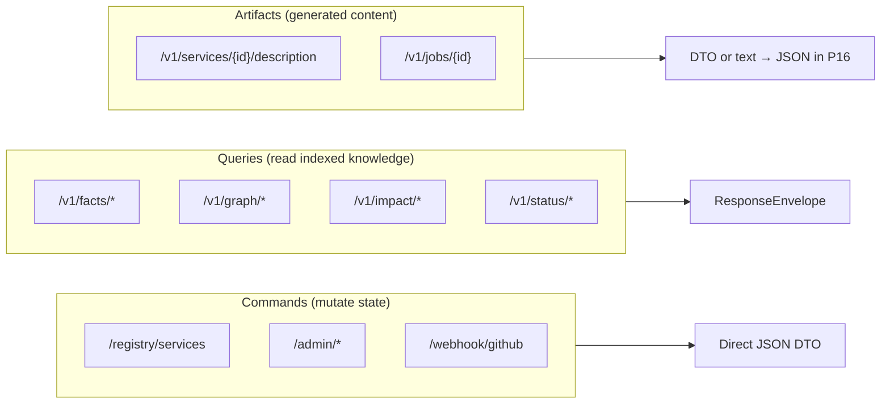

# TestSeer — REST API Design & Conventions

> **Status:** Implemented (R1–R3 shipped; R4 header versioning planned)  
> **Last verified:** 2026-06-12  
> **Scope:** `testseer-backend`, `testseer-mcp`, `openapi.yaml`  
> **Implementation plan:** [archive/plans/2026-06-12-p16-rest-api-hardening.md](archive/plans/2026-06-12-p16-rest-api-hardening.md)  
> **Complements:** [TestSeer_Observability_Design.md](TestSeer_Observability_Design.md), [features/03-fact-query-api.md](features/03-fact-query-api.md), Optimus `DesignDocuments/Docs/REST_API_Guidelines.md` (reference only — separate repo)

---

## 1. Purpose

TestSeer exposes a REST API for MCP agents, local tooling, and (eventually) IDE plugins. Conventions are **consistent on query endpoints** and **unified on errors and freshness HTTP** after P16 R1–R3 (2026-06-12).

This document defines:

1. **TestSeer-native REST conventions** (not Optimus `RestErrorCodes`).
2. **Target architecture** for errors, envelopes, and versioning.
3. **Gap analysis** against pre-P16 code (2026-06-12 audit) — see §17 for what shipped.
4. **Phased migration** — R1–R3 complete; R4 (header versioning) planned.

### Questions this design answers

| Question | Answer (target state) |
|----------|----------------------|
| What error shape do clients assert on? | Canonical `ApiError` JSON with stable `error` enum |
| When is HTTP 404 vs 200 with `NOT_INDEXED` in body? | Query APIs: **404** + envelope when service never indexed; status endpoint always **200** with envelope |
| Do all query endpoints use `ResponseEnvelope`? | Yes, including messaging (`/v1/facts/pubsub`, `/v1/graph/event-flow*`) |
| Is OpenAPI authoritative? | Generated from springdoc; checked in via `OpenApiExportTest`; CI diff gate |
| How does this relate to Optimus guidelines? | Adopts HTTP semantics and observability principles; **does not** adopt numeric `errorCode` taxonomy |

---

## 2. Relationship to Optimus REST guidelines

TestSeer is an **internal developer tool**, not a partner-facing Optimus service behind NGW. Applying Optimus guidelines literally would add cost without benefit (no `RestErrorCodes`, no partner scope, no OIS multi-error).

| Optimus principle | TestSeer adoption |
|-------------------|-------------------|
| Nouns in paths, correct HTTP verbs | **Adopt** |
| Status code = signal (no 200 on hard failure) | **Adopt** |
| Stable machine-readable errors | **Adopt** — `ApiError.error` enum, not numeric codes |
| `errorCode` / `RestErrorCodes` ranges | **Reject** — use string enum + HTTP status |
| 401/403 partner auth | **Defer** — optional API key in P16 Phase 4 |
| OpenAPI contract-first | **Adopt** — with springdoc export CI gate |
| Async honesty (202 Accepted) | **Adopt** — already on index trigger and indexing queries |

---

## 3. Pre-P16 baseline (audit summary)

**32 live endpoints** across 12 controllers. Audit date: 2026-06-12 (before R1–R3).

### Gaps identified (and resolution)

| ID | Gap | Resolution (P16) |
|----|-----|------------------|
| G-01 | OpenAPI drift — missing routes, wrong impact schema | **R1** — regenerated `openapi.yaml`; `OpenApiGovernanceTest` CI gate |
| G-02 | Inconsistent error bodies | **R2** — `ApiError` + `TestSeerExceptionHandler` |
| G-03 | Per-controller exception handlers | **R2** — global `@RestControllerAdvice`; removed inline handlers |
| G-04 | Messaging freshness always 200 | **R3** — `FreshnessHttp` in `MessagingQueryController` |
| G-05 | Mixed URL versioning | **R4 planned** — header `X-TestSeer-Api-Version`; no URL migration |
| G-06 | Description API plain text | **R3** — `ServiceDescriptionResponse` JSON |
| G-07 | `POST /admin/index/clear` verb semantics | **Open** — DELETE shortcut exists for single service only |

### What already works well

- `ResponseEnvelope` with `schemaVersion`, `freshnessStatus`, `indexedAt`, `commitSha` on core query APIs.
- Registry: 201 Created + `Location`, 204 on disable, PATCH for metadata.
- Index trigger: 202 Accepted, 409 on duplicate job.
- `RequestIdFilter`: echoes `X-Request-Id` on every response.
- Webhook: 401 on invalid HMAC, 202 on queued work.

---

## 4. API surface taxonomy

TestSeer APIs fall into three classes with **different response rules**:



| Class | Response wrapper | Freshness rules | Error shape |
|-------|------------------|-----------------|-------------|
| **Commands** | Direct DTO (`ServiceEntry`, `IndexTriggerResponse`, …) | N/A | `ApiError` on 4xx/5xx |
| **Queries** | Always `ResponseEnvelope<T>` | §6 below | `ApiError` or envelope with `NOT_INDEXED` |
| **Artifacts** | JSON body (description text in field, not raw string) | Optional freshness on description cache | `ApiError` |

---

## 5. URL layout

### 5.1 Current paths (v0 — shipped)

| Prefix | Controllers | Versioned |
|--------|-------------|-----------|
| `/registry/services` | `ServiceRegistryController` | No |
| `/admin/index`, `/admin/discover` | Admin controllers | No |
| `/v1/facts`, `/v1/graph`, `/v1/impact`, `/v1/status`, `/v1/jobs`, `/v1/services` | Query / analysis | Yes |
| `/webhook/github` | `WebhookController` | No (external contract) |

### 5.2 Path stability (no `/v1` prefix migration)

**Decision:** Do **not** add `/v1/registry` or `/v1/admin` URL prefixes. Paths stay as shipped; see §5.3 for contract versioning via header.

| Prefix | Notes |
|--------|-------|
| `/registry/*`, `/admin/*` | Unversioned paths — canonical |
| `/v1/facts`, `/v1/graph`, … | **Legacy URL prefix** — kept for backward compatibility; same handler as unversioned aliases where applicable |
| `/webhook/github` | External GitHub config; always implicit API version `1` |

New endpoints should use **unversioned resource paths** (e.g. `/facts/class`, `/registry/services`) plus the API version header. Existing `/v1/...` routes remain as aliases until a future major cleanup.

### 5.3 API contract versioning — header (canonical)

API **contract** version (breaking JSON shape, error model, freshness rules) is carried by header, not URL.

| Header | Direction | Value | Required |
|--------|-----------|-------|----------|
| `X-TestSeer-Api-Version` | Request | `1` (default if omitted) | No — defaults to `1` |
| `X-TestSeer-Api-Version` | Response | Negotiated version | Always echoed |

**Rules:**

1. **Omitted header → version `1`** — all existing clients (MCP, curl, scripts) keep working.
2. **Unsupported version → `400`** with `ApiError`:

```json
{
  "error": "VALIDATION_ERROR",
  "message": "Unsupported X-TestSeer-Api-Version: 99",
  "hint": "Supported values: 1",
  "requestId": "..."
}
```

3. **Webhooks** (`POST /webhook/github`) — no version header from GitHub; server treats as version `1`.
4. **Do not confuse** with `ResponseEnvelope.schemaVersion` (`"1.0"`) — that versions the **query payload wrapper**, not the HTTP API contract. Both may appear on the same response.

**Implementation:** `ApiVersionFilter` (same order as `RequestIdFilter`) reads header, validates, sets MDC `apiVersion`, echoes on response. Spring controllers stay unversioned in `@RequestMapping`.

**MCP:** `testseer-mcp/client.ts` sends `X-TestSeer-Api-Version: 1` on every request (explicit, future-proof).

**When to bump to version `2`:** Breaking change to `ApiError` shape, removal of `/v1/` URL aliases, or incompatible `ResponseEnvelope` — not for additive fields.

**Alternatives considered:**

| Approach | Verdict |
|----------|---------|
| URL prefix `/v1/...` everywhere | Rejected — duplicates paths, breaks bookmarks, high MCP churn |
| `Accept: application/vnd.testseer.v1+json` | Valid but heavy for internal tool; defer |
| Query param `?apiVersion=1` | Rejected — pollutes cache keys and logs |

**Rules (all new endpoints):**

- Lowercase path segments; multi-word segments use kebab-case (`event-flow`).
- Path parameters for resource identity: `{serviceId}`, `{jobId}`.
- Query parameters for filters and operation inputs: `symbolFqn`, `env`, `commitSha`, `orgId`.
- RPC-style names allowed **only** under `/v1/graph/*` and `/v1/impact/*` (analytics queries, not CRUD resources).

---

## 6. Freshness HTTP contract (queries)

All endpoints that read **indexed** data must use `FreshnessResolver` and map status to HTTP as follows:

| `freshnessStatus` | HTTP | `data` field |
|-------------------|------|--------------|
| `CURRENT` | **200** | Full result |
| `STALE` | **200** | Full result (client checks `indexedAt`) |
| `INDEXING` | **202** | Empty or last-known (document per endpoint) |
| `NOT_INDEXED` | **404** | `null` with envelope present |

**Exception:** `GET /v1/status/{serviceId}` always returns **200** with envelope — the status endpoint *reports* freshness; it does not fail when not indexed.

**Exception:** `GET /v1/status` (org summary) returns **200** with per-service freshness in list items — not wrapped in `ResponseEnvelope` (portfolio DTO).

### Controllers requiring alignment (G-04)

| Controller | Today | Target |
|------------|-------|--------|
| `FactQueryController` | ✅ 404/202/200 | No change |
| `GraphQueryController` | ✅ (most); shared-type/type-fanout skip service check | Document: global graph queries may omit service freshness |
| `MessagingQueryController` | ⚠️ Always 200 when indexed | Apply same 404/202 rules as facts |
| `ImpactAnalysisController` | ✅ | No change |

---

## 7. HTTP methods and status codes

| Operation | Method | Success | Error examples |
|-----------|--------|---------|----------------|
| Read query | GET | 200 / 202 / 404 | 400 missing param |
| Read registry | GET | 200 | 404 `NOT_FOUND` |
| Create service | POST | **201** + `Location` | 400 validation, 409 duplicate |
| Update metadata | PATCH | 200 | 404 |
| Disable service | DELETE | **204** | 404 |
| Enqueue index job | POST | **202** + `jobId` | 404, 409 conflict |
| Sync local index | POST | 200 | 400 |
| Clear index | POST (v0) → DELETE (v1) | 200 / 204 | 400 |
| Org discovery | POST | 200 | 400 missing orgId |
| Webhook | POST | 202 queued; 200 ignored | 401 bad signature; 500 internal |
| LLM description | GET / POST | 200 | 404, 503 |

### Anti-patterns (forbidden after P16)

| Anti-pattern | Fix |
|--------------|-----|
| HTTP 200 + body indicating hard failure | Use 4xx/5xx + `ApiError` |
| Plain string error body on 400/404/409 | Use `ApiError` JSON |
| Empty 404 body | Return `ApiError` with `hint` |
| OpenAPI documents wrong response schema | Regenerate + CI gate |

---

## 8. Response shapes

### 8.1 Query envelope (unchanged structure)

```json
{
  "schemaVersion": "1.0",
  "indexedAt": "2026-06-12T10:00:00.000Z",
  "commitSha": "abc123def456",
  "freshnessStatus": "CURRENT",
  "data": { }
}
```

Record: `io.testseer.backend.query.ResponseEnvelope<T>` — no schema version bump for P16.

### 8.2 Command DTOs (unchanged)

Registry and admin endpoints continue returning typed records (`ServiceEntry`, `IndexTriggerResponse`, `DiscoveryResult`, …).

### 8.3 Canonical error — `ApiError` (new)

```json
{
  "error": "NOT_FOUND",
  "message": "Service 'optimus-offer-services-suite' not registered",
  "hint": "Register via POST /registry/services",
  "requestId": "f47ac10b-58cc-4372-a567-0e02b2c3d479"
}
```

| Field | Required | Description |
|-------|----------|-------------|
| `error` | Yes | Stable enum string (machine-readable) |
| `message` | Yes | Human-readable explanation |
| `hint` | No | Actionable next step for agents |
| `requestId` | Yes | Echo of `X-Request-Id` from response header |

#### Error enum (v1)

| `error` | HTTP | When |
|---------|------|------|
| `VALIDATION_ERROR` | 400 | Bean validation, malformed JSON, missing required param |
| `NOT_FOUND` | 404 | Unknown service, job, or commit |
| `NOT_INDEXED` | 404 | Query against service with no completed index run |
| `CONFLICT` | 409 | Job already in flight, duplicate service registration |
| `SERVICE_UNAVAILABLE` | 503 | LLM disabled, required dependency down |
| `INTERNAL_ERROR` | 500 | Unexpected failure; generic message only |

**Note:** For query `NOT_INDEXED`, prefer `ResponseEnvelope` with `freshnessStatus: NOT_INDEXED` **and** HTTP 404. Error body may be omitted when envelope is present (client checks envelope first).

### 8.4 Service description (target)

Replace raw `text/plain` responses with:

```json
{
  "serviceId": "optimus-offer-services-suite",
  "description": "Handles offer lifecycle events…",
  "generatedAt": "2026-06-12T09:00:00Z",
  "model": null
}
```

Errors use `ApiError`. MCP client updated to read JSON field.

---

## 9. Exception handling architecture

### 9.1 Current (fragmented)

```
RegistryExceptionHandler     → registry only
IndexTriggerController       → inline @ExceptionHandler
IndexClearController         → inline @ExceptionHandler
LocalIndexTriggerController  → inline @ExceptionHandler
(Spring default)             → everything else
```

### 9.2 Target (centralized)

```
TestSeerExceptionHandler (@RestControllerAdvice)
  ├── ServiceNotFoundException        → 404 ApiError
  ├── DuplicateServiceException       → 409 ApiError
  ├── JobAlreadyInFlightException     → 409 ApiError
  ├── MethodArgumentNotValidException → 400 ApiError (+ field details extension)
  ├── IllegalArgumentException        → 400 ApiError
  ├── MissingServletRequestParameter  → 400 ApiError
  └── Exception (catch-all)           → 500 ApiError (log full trace server-side)
```

**New package:** `io.testseer.backend.api`

| Class | Role |
|-------|------|
| `ApiError` | Error response record |
| `ApiErrorCode` | Enum for `error` field |
| `TestSeerExceptionHandler` | Global handler |
| `RequestIdHolder` | Read current request ID from MDC for error bodies |

Remove inline `@ExceptionHandler` from controllers after migration. Deprecate `RegistryExceptionHandler` (merge into global handler).

---

## 10. OpenAPI governance

### 10.1 Source of truth

1. **Runtime:** springdoc at `/v3/api-docs.yaml`
2. **Checked-in:** `docs/openapi.yaml` via `OpenApiExportTest`
3. **CI gate (new):** fail PR if committed `openapi.yaml` differs from export without explicit override

### 10.2 Schema components to add (P16)

```yaml
components:
  schemas:
    ApiError:
      type: object
      required: [error, message, requestId]
      properties:
        error:
          type: string
          enum: [VALIDATION_ERROR, NOT_FOUND, NOT_INDEXED, CONFLICT, SERVICE_UNAVAILABLE, INTERNAL_ERROR]
        message:
          type: string
        hint:
          type: string
        requestId:
          type: string
    ServiceDescriptionResponse:
      type: object
      properties:
        serviceId: { type: string }
        description: { type: string }
        generatedAt: { type: string, format: date-time }
        model: { type: string }
```

Document `ApiError` on all 4xx/5xx responses. Fix `GET /v1/impact/pr` 200 schema to `ResponseEnvelopeImpactReport`.

### 10.3 Drift items to close immediately (Phase 1)

| Endpoint | Issue |
|----------|-------|
| `GET /v1/status` | Missing from OpenAPI |
| `GET /v1/jobs/{jobId}` | Missing from OpenAPI |
| `GET /v1/impact/pr` | 200 response schema wrong |
| All 4xx/5xx | Missing `ApiError` refs (Phase 2) |

---

## 11. Observability integration

Aligns with [TestSeer_Observability_Design.md](TestSeer_Observability_Design.md):

| Concern | P16 action |
|---------|------------|
| `X-Request-Id` | Already echoed; include in `ApiError.requestId` |
| `X-TestSeer-Api-Version` | Request optional (default 1), response always echoed (R4) |
| `X-Job-Id` | Add on `POST /admin/index/{serviceId}` 202 response (optional header) |
| Structured logs | Log `error` enum + `requestId` on 4xx/5xx in `TestSeerExceptionHandler` |
| Metrics | Increment `testseer.api.errors` counter by `error` label |

---

## 12. MCP client impact

`testseer-mcp/src/client.ts` today assumes:

- Query responses are JSON with envelope fields at top level.
- Some errors may be plain text or empty bodies.

### Required MCP changes (by phase)

| Phase | MCP change |
|-------|------------|
| P16-R1 (OpenAPI only) | None |
| P16-R2 (ApiError) | Parse `error` field on non-2xx; surface in MCP `isError` text |
| P16-R3 (description JSON) | Update `testseer_get_service_description` to read `description` field |
| P16-R4 (API version header) | Send `X-TestSeer-Api-Version: 1` on all MCP requests |

---

## 13. Phased delivery

| Phase | Name | Breaking? | Deliverables |
|-------|------|-----------|--------------|
| **R1** | OpenAPI sync | No | Export spec; add missing routes; fix impact schema; CI diff script |
| **R2** | Unified errors | Soft | `ApiError`, `TestSeerExceptionHandler`; retire per-controller handlers |
| **R3** | Freshness parity | No | Messaging controller 404/202; description JSON |
| **R4** | API version header | No | `ApiVersionFilter`; MCP sends header; echo on response |

Detailed tasks: [2026-06-12-p16-rest-api-hardening.md](archive/plans/2026-06-12-p16-rest-api-hardening.md).

---

## 14. Architecture decision records

### ADR-R1: String error enum vs Optimus numeric codes

**Decision:** Use `ApiError.error` string enum, not `RestErrorCodes`.

**Rationale:** TestSeer has no NGW gateway, no partner adapters, no REST Assured suite asserting numeric codes. String enums are grep-friendly and sufficient for MCP agents.

**Consequences:** Cannot drop-in reuse Optimus `RestExceptionHandler`; must maintain separate handler.

---

### ADR-R2: Query NOT_INDEXED returns HTTP 404

**Decision:** Keep HTTP 404 + `ResponseEnvelope` with `freshnessStatus: NOT_INDEXED`.

**Rationale:** MCP and scripts can branch on HTTP status without parsing envelope first. Matches fact/graph controllers today.

**Alternatives rejected:** Always 200 with envelope only (Optimus sometimes uses 200 + business error — rejected for queries).

---

### ADR-R3: Header-based API versioning (not URL prefix)

**Decision:** Contract version via `X-TestSeer-Api-Version` header; default `1` when omitted. Do not migrate `/registry` or `/admin` to `/v1/...`.

**Rationale:** Unifies versioning without doubling routes or breaking MCP path strings. GitHub webhooks cannot send version headers — implicit v1 is fine. Aligns with observability pattern (`X-Request-Id` already header-based).

**Consequences:** Clients must send header when targeting v2+ in future; OpenAPI documents the header globally. Existing `/v1/facts/...` URL prefix remains as legacy alias only.

**Alternatives rejected:** URL-only versioning (P16 R4 original) — too much path churn for marginal benefit.

---

### ADR-R4: OpenAPI generated from code

**Decision:** springdoc is source; checked-in YAML via test export; CI enforces sync.

**Rationale:** Annotations on controllers already exist; manual YAML editing caused drift (G-01).

---

## 15. Success criteria

| ID | Criterion | Verification |
|----|-----------|--------------|
| SC-01 | All live endpoints documented in `openapi.yaml` | OpenAPI path count = controller route count |
| SC-02 | CI fails on OpenAPI drift | `scripts/openapi-governance-check.sh` in PR pipeline |
| SC-03 | All 4xx/5xx return `ApiError` JSON (except envelope-only 404 on queries) | Integration tests per controller |
| SC-04 | Messaging queries use same freshness HTTP as facts | `MessagingQueryControllerTest` |
| SC-05 | MCP tools handle new error shape | Manual Cursor test + unit tests in `client.ts` |
| SC-06 | No plain-text error bodies on API endpoints | Grep audit: `ResponseEntity.*body("` on controllers |
| SC-07 | CHANGELOG entry for any contract change | Governance script |

---

## 16. Out of scope (P16)

- Full Optimus `RestErrorCodes` adoption
- API key / OAuth auth (design stub only in R4 doc)
- `GET /v1/gaps` portfolio report (P12 — separate plan)
- GraphQL or gRPC alternate surfaces
- Rate limiting and quota headers

---

## 17. Implementation record (R1–R3 shipped 2026-06-12)

### R1 — OpenAPI governance

| Artifact | Path |
|----------|------|
| Drift gate test | `src/test/java/io/testseer/backend/openapi/OpenApiGovernanceTest.java` |
| Export test | `src/test/java/io/testseer/backend/openapi/OpenApiExportTest.java` |
| CI script | `scripts/openapi-governance-check.sh` |
| Committed spec | `docs/openapi.yaml` |

**Runbook:** After any controller annotation or route change → `mvn test -Dtest=OpenApiExportTest` → commit `openapi.yaml` + `CHANGELOG.md`. CI runs `../scripts/openapi-governance-check.sh`.

### R2 — Unified errors

| Artifact | Path |
|----------|------|
| Error model | `src/main/java/io/testseer/backend/api/ApiError.java` |
| Error enum | `src/main/java/io/testseer/backend/api/ApiErrorCode.java` |
| Global handler | `src/main/java/io/testseer/backend/api/TestSeerExceptionHandler.java` |
| Request ID | `src/main/java/io/testseer/backend/api/RequestIdHolder.java` |
| Handler tests | `src/test/java/io/testseer/backend/api/TestSeerExceptionHandlerTest.java` |

**Removed:** `registry/RegistryExceptionHandler.java`; inline `@ExceptionHandler` on admin controllers.

**Breaking change:** duplicate registry → `409` with `"error": "CONFLICT"` (was `DUPLICATE_SERVICE`).

### R3 — Freshness parity + description JSON

| Artifact | Path |
|----------|------|
| Freshness HTTP helper | `src/main/java/io/testseer/backend/query/FreshnessHttp.java` |
| Description DTO | `src/main/java/io/testseer/backend/analysis/ServiceDescriptionResponse.java` |
| Messaging controller | Uses `FreshnessHttp` (404/202/200) |
| MCP client | `testseer-mcp/src/client.ts`, `testseer-mcp/src/tools/services.ts` |

**Breaking change:** `GET /v1/services/{id}/description` returns JSON object, not plain text.

### R4 — Not yet implemented

- `ApiVersionFilter` for `X-TestSeer-Api-Version: 1`
- MCP sends version header on all requests
- OpenAPI global header parameter

### Verification

```bash
cd testseer-backend && ./mvn21 test   # includes OpenApiGovernanceTest, FreshnessHttpTest, controller tests
../scripts/openapi-governance-check.sh
cd testseer-mcp && npm test
```

---

## 18. Document history

| Date | Change |
|------|--------|
| 2026-06-12 | Initial design from REST audit and conventions proposal |
| 2026-06-12 | ADR-R3 revised: header-based API version instead of `/v1` URL prefix migration |
| 2026-06-12 | R1–R3 implemented; §17 implementation record added |
