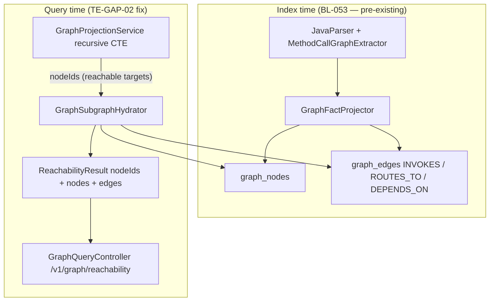

# TE-GAP-02 — Reachability subgraph hydration (KFK-04)

> **Status:** Shipped (2026-06-16)  
> **Backlog:** BL-050 P0 Step 1 · **Req:** KFK-04, GRP-12  
> **Issue registry:** [28-transaction-eval-graph-gap-issues.md](features/28-transaction-eval-graph-gap-issues.md)  
> **Parent:** [TestSeer_BL050_P0_Implementation_Design.md](TestSeer_BL050_P0_Implementation_Design.md)  
> **Pilot:** `transaction-eval-suite` · `serviceId` `3756095a-e423-4aeb-b11a-fe6d3340fca5`  
> **Last verified:** 2026-06-16 (code + pilot curl + `TransactionEvalSuiteGraphIT`)

---

## 1. Problem statement

Agents and viz consumers called `GET /v1/graph/reachability?type=class&symbolFqn=...` and received a large `nodeIds` list but **empty `nodes[]` and `edges[]`**, even though `graph_edges` contained `INVOKES` rows from BL-053 indexing.

**Symptom (pre-fix pilot):**

```bash
GET /v1/graph/reachability?type=class&symbolFqn=...TransactionEvalConsumer
# → nodeIds: 121, nodes: [], edges: []
```

**Misdiagnosis to avoid:** Missing index extraction. `GraphFactProjector` and `MethodCallGraphExtractor` were already persisting `INVOKES` / `ROUTES_TO` to `graph_edges`. The gap was **query-layer hydration only**.

---

## 2. Root cause (confirmed in code)

### 2.1 Historical query path

Before BL-050 P0 Step 1, `GraphProjectionService` recursive CTEs returned reachable **IDs** from `graph_nodes`, then discarded hydrated subgraph data:

```java
// Historical anti-pattern (replaced)
return new ReachabilityResult(ids, List.of());
```

`ReachabilityResult` had `nodeIds` and `nodes` but **no `edges` field**.

### 2.2 Index path (unchanged — already worked)

| Stage | Class | Output |
|-------|-------|--------|
| Parse | `MethodCallGraphExtractor` | `ParsedModel.methodCalls` on public handler methods |
| Project | `GraphFactProjector` | `graph_nodes` CLASS/METHOD + `graph_edges` `INVOKES`, `DEPENDS_ON`, `ROUTES_TO` |
| Replace | `IncrementalEdgeUpdater` | Per-class edge replacement on re-index |

Class reachability CTE walks edge types: `DEPENDS_ON`, `INVOKES`, `ROUTES_TO` (`CLASS_EDGE_TYPES` in `GraphProjectionService`).

### 2.3 Query path (fix)

| Component | Responsibility |
|-----------|----------------|
| `GraphProjectionService` | CTE → `List<String> reachableIds` → `hydrator.hydrate(anchor, ids)` |
| `GraphSubgraphHydrator` | Union anchor into load set; `findByIds` + `findEdgesBetween` |
| `GraphNodeRepository.findByIds` | `SELECT * FROM graph_nodes WHERE id IN (:ids)` |
| `GraphEdgeRepository.findEdgesBetween` | Edges where **both** endpoints ∈ load set (optional `edge_type` filter) |
| `GraphQueryController.reachability` | Resolve anchor via `GraphNodeIds`; cache key `type\|nodeId\|depth` |

---

## 3. Architecture



---

## 4. `ReachabilityResult` contract

```java
public record ReachabilityResult(
    List<String> nodeIds,   // CTE reachable targets only (anchor excluded)
    List<GraphNode> nodes,  // hydrated rows: anchor ∪ nodeIds
    List<GraphEdge> edges   // edges with both ends in load set
) {}
```

| Field | Semantics | Backward compatible |
|-------|-----------|---------------------|
| `nodeIds` | Reachable **target** node IDs from traversal (not including start anchor) | Yes — existing clients |
| `nodes` | Full `graph_nodes` rows for anchor + all `nodeIds` | New consumers / viz |
| `edges` | Subgraph edges between loaded nodes | New consumers / viz |

**Anchor rule:** CTEs return forward reachable targets, not the start node. `GraphSubgraphHydrator` unions `anchorNodeId` into the load set so the response includes the queried class/method/service node in `nodes[]` even when it has no outgoing edges in the subgraph.

---

## 5. Hydrated vs `idsOnly` endpoints

| `GraphProjectionService` method | REST (if any) | Hydration |
|--------------------------------|---------------|-----------|
| `serviceCallsServiceForward` | `reachability?type=service` | **Yes** |
| `classDependsOnClassForward` | `reachability?type=class` | **Yes** |
| `methodForward` | `reachability?type=method` | **Yes** |
| `endpointCallsOutbound` | internal | **Yes** |
| `reverseReachability` | `/v1/graph/impact` | **Yes** |
| `immediateNeighborhood` | `/v1/graph/neighborhood` | **Yes** |
| `crossServiceBoundary` | `/v1/graph/cross-service-boundary` | **Yes** |
| `sharedTypeResolution` | `/v1/graph/shared-type` | **No** (`idsOnly`) |
| `typeUsageFanOut` | `/v1/graph/type-fanout` | **No** (`idsOnly`) |

Default hydrated edge types (`GraphSubgraphHydrator.DEFAULT_EDGE_TYPES`):

`CALLS`, `DEPENDS_ON`, `INVOKES`, `ROUTES_TO`, `OUTBOUND_TO`, `USES_TYPE`, `PUBLISHES_TO`, `SUBSCRIBES_TO`, `GUARDED_BY`, `TRIGGERED_BY`

---

## 6. REST API behavior

### 6.1 `GET /v1/graph/reachability`

**Anchor resolution** (`GraphQueryController.resolveReachabilityStartNode`):

| `type` | Required params | Resolved `nodeId` |
|--------|-----------------|-------------------|
| `service` (default) | `serviceId` | `{serviceId}` |
| `class` | `serviceId` + `symbolFqn` or `nodeId` | `{serviceId}::class::{fqn}` |
| `method` | `serviceId` + `symbolFqn` + `methodName` | `{serviceId}::method::{fqn#method}` |

**GRP-12:** `type=class` with **only** bare `serviceId` UUID → **400**. Intra-service call graph requires `symbolFqn` or full `nodeId`.

**Freshness:** 404 `NOT_INDEXED`, 202 `INDEXING`, 200 `CURRENT`/`STALE` (P16).

**Cache:** Redis key `testseer:{orgId}:{repo}:{serviceId}:graph:reachability:{type|nodeId|depth}`. Invalidate on index complete or delete keys after deploy if stale empty subgraph cached.

### 6.2 Example response shape

```json
{
  "schemaVersion": "1.0",
  "freshnessStatus": "CURRENT",
  "data": {
    "nodeIds": ["{svc}::class::...TransactionEvaluationService", "..."],
    "nodes": [
      {
        "id": "{svc}::class::...TransactionEvalConsumer",
        "nodeType": "CLASS",
        "symbolFqn": "com.quotient.platform.transaction.eval.consumer.TransactionEvalConsumer"
      }
    ],
    "edges": [
      {
        "fromNode": "{svc}::class::...TransactionEvalConsumer",
        "toNode": "{svc}::class::...TransactionEvaluationService",
        "edgeType": "INVOKES",
        "confidence": 0.9,
        "evidenceSource": "javaparser"
      }
    ]
  }
}
```

---

## 7. Pilot acceptance (transaction-eval)

### 7.1 Manual orchestration target

Consumer ingress path (manual graph ED001–ED003 subset):

```
TransactionEvalConsumer
  --INVOKES--> TransactionEvaluationService
  --INVOKES--> ProcessorFactory
  --ROUTES_TO--> DefaultTxnEvalProcessor | ReceiptTxnEvalProcessor | CorrectedTxnEvalProcessor
```

Full suite index produces many more reachable classes (helpers, producers) — pilot curl validates scale, not only this chain.

### 7.2 Validation curl

```bash
ORG=quotient
BASE=http://localhost:8080
SVC=3756095a-e423-4aeb-b11a-fe6d3340fca5
CONSUMER=com.quotient.platform.transaction.eval.consumer.TransactionEvalConsumer

curl -s "$BASE/v1/graph/reachability?orgId=$ORG&serviceId=$SVC&type=class&symbolFqn=$CONSUMER" \
  | jq '{nodeIds: (.data.nodeIds|length), nodes: (.data.nodes|length), edges: (.data.edges|length),
         evalEdge: ([.data.edges[]? | select(.toNode|contains("TransactionEvaluationService"))] | length)}'
```

| Metric | Pass (pilot 2026-06-16) | Threshold |
|--------|-------------------------|-----------|
| `nodes` | 121 | ≥ 5 |
| `edges` | 405 | ≥ 4 |
| Edges to `TransactionEvaluationService` | 4 | ≥ 1 |
| `nodeIds` with empty `nodes` | — | **Fail** |

### 7.3 Method anchor (optional)

```bash
curl -s "$BASE/v1/graph/reachability?orgId=$ORG&serviceId=$SVC&type=method\
&symbolFqn=$CONSUMER&methodName=processSalesCanonicalEvent&depth=4" \
  | jq '.data.edges[0:3]'
```

---

## 8. Test matrix (code-derived)

| Test class | Method | Fixture | Expected behavior |
|------------|--------|---------|-------------------|
| `GraphSubgraphHydratorTest` | `hydrate_keepsReachableIdsWithoutAnchor_butLoadsAnchorForEdges` | Mock repos | `nodeIds` = reachable only; `nodes` includes anchor + callee; `edges` populated |
| `GraphSubgraphHydratorTest` | `hydrate_includesAnchorInNodesButNotInNodeIds` | Mock | Anchor in `nodes`, absent from `nodeIds` when CTE returns empty |
| `GraphSubgraphHydratorTest` | `hydrate_emptyLoadSet_returnsEmptyTriple` | Mock | All three lists empty |
| `GraphSubgraphHydratorTest` | `hydrate_passesEdgeTypeFilterToRepository` | Mock | Custom edge type list forwarded to `findEdgesBetween` |
| `GraphProjectionIntegrationTest` | `forwardReachability_classes_findsTransitiveDependencies` | `GraphFixture` | `nodeIds` contains dep; `nodes` and `edges` non-empty |
| `GraphProjectionIntegrationTest` | `graphFactProjector_projectsParsedModels_andReverseReachabilityWorks` | Live projection | `INVOKES`/`DEPENDS_ON` indexed → reverse impact finds controller |
| `TransactionEvalSuiteGraphIT` | `classReachability_fromConsumer_hydratesNodesAndEdgesToEvalService` | `TransactionEvalGraphFixture` | ≥4 nodes, ≥3 edges; `INVOKES` → `TransactionEvaluationService` |
| `TransactionEvalSuiteGraphIT` | `restReachability_fromConsumer_returnsHydratedEnvelope` | Same + HTTP | 200 envelope; `nodes`/`edges` hydrated via controller + cache |
| `GraphProjectionIntegrationTest` | `sharedTypeResolution_findsCanonicalLibraryDefinition` | `GraphFixture` | `nodeIds` populated; `nodes`/`edges` remain empty (`idsOnly`) |

**Run:**

```bash
cd testseer-backend
./mvn21 test -Dtest=GraphSubgraphHydratorTest,TransactionEvalSuiteGraphIT,GraphProjectionIntegrationTest
```

---

## 9. Implementation map

| File | Role |
|------|------|
| `graph/ReachabilityResult.java` | Adds `edges` list; 2-arg ctor defaults empty edges |
| `graph/GraphSubgraphHydrator.java` | Hydration logic |
| `graph/GraphProjectionService.java` | All traversal methods call `hydrate()` except `sharedType*` |
| `graph/GraphNodeRepository.java` | `findByIds` |
| `graph/GraphEdgeRepository.java` | `findEdgesBetween` |
| `query/GraphQueryController.java` | REST + anchor resolution + cache |
| `test/.../TransactionEvalGraphFixture.java` | Minimal pilot chain fixture |
| `test/.../TransactionEvalSuiteGraphIT.java` | Service + REST acceptance |

---

## 10. Out of scope (TE-GAP-02)

| Item | Track elsewhere |
|------|-----------------|
| Kafka publish hops (X1–X5) | TE-GAP-01 |
| Reverse entry-flow impact | TE-GAP-03 |
| Cross-repo `NO_SUBSCRIBER` | TE-GAP-04 |
| Maven GAV dependency tree | [BL-058](TestSeer_BL058_Maven_Dependency_Tree_Design.md) (not KFK-04) |
| Hydrate `shared-type` / `type-fanout` | Optional BL-054+ |
| Full manual ED001–ED028 parity | Extraction limits + BL-054 flow-diagram |

---

## 11. Operational notes

1. **Diagnose layer first:** `nodeIds > 0` + empty `nodes` → hydration/cache (Layer A). `nodeIds == 0` → indexing/linkage (Layer B).
2. **SQL spot-check:**

```sql
SELECT count(*) FROM graph_edges
WHERE from_node LIKE '%TransactionEvalConsumer%'
  AND edge_type = 'INVOKES';
```

3. **Cache:** After hydration deploy, clear Redis keys for affected `serviceId` or re-index to invalidate.

---

## 12. Related docs

- [04-graph-projection.md](features/04-graph-projection.md)
- [STORAGE_AND_API_MAP.md](../../docs/STORAGE_AND_API_MAP.md) §7.1
- [TestSeer_BL053_Processor_Routing_CallGraph_Design.md](TestSeer_BL053_Processor_Routing_CallGraph_Design.md) — index-time `INVOKES` / `ROUTES_TO`
