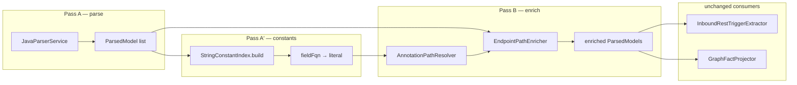

# TestSeer UP-GAP-01 — Resolve `String` constants in `@*Mapping` path attributes

> **Status:** Implemented (2026-06-16)  
> **Backlog:** **BL-062** · **Requirement:** **TRG-18-R**  
> **Gap:** UP-GAP-01 from [UserProfileService_ServiceGraph_GapAnalysis.md](../../../../Downloads/DesignDocuments/Docs/UserProfileService_ServiceGraph_GapAnalysis.md)  
> **Pilot evidence:** `platform-user-profile` · `serviceId` `bd1b4101-ac6f-4b57-92ce-a3371ecc4ffd`  
> **Pattern reference:** [TestSeer_RS_Phase5_Implementation_Design.md](TestSeer_RS_Phase5_Implementation_Design.md) (REST ingress hardening) · [11-entry-triggers.md](features/11-entry-triggers.md)  
> **Author / date:** 2026-06-16

---

## 1. Executive summary

`JavaParserService.annotationValue()` stringifies Spring mapping annotation expressions with `.toString().replace("\"", "")`. When controllers use a **field reference** instead of a string literal, TestSeer stores the **identifier** as `pathPattern` — breaking entry-trigger lookup, rule-pack path matching, and entry-flow queries.

| Pilot symptom | Indexed `pathPattern` | Expected |
|---------------|----------------------|----------|
| UP-GAP-01 | `/USER_OFFER_TRANSACTION_API_URL` | `/offer/transaction/history` |

**Fix:** Add a repo-scoped **string constant index** + **annotation path resolver** that evaluates `NameExpr` / `FieldAccessExpr` in `@RequestMapping` / `@*Mapping` `value`/`path` attributes to compile-time `String` literals before endpoint facts are emitted.

**Deliverables:**

| Step | Component | Closes |
|------|-----------|--------|
| 1 | `StringConstantIndex` (index pass) | — |
| 2 | `StaticImportIndex` extension | static `Constants.*` imports |
| 3 | `AnnotationPathResolver` | UP-GAP-01 |
| 4 | Wire into `JavaParserService.extractEndpoints` | UP-GAP-01 |
| 5 | Optional post-link pass on stored triggers | re-index without full parser change |
| 6 | Tests + `UserProfileServiceGraphIT` acceptance | UP-GAP-01 |

**Out of scope (v1):** SpEL, concatenation, non-`String` types, cross-module constants from external JARs without source, `${property}` placeholders.

---

## 2. Problem statement

### 2.1 Production code (user-profile E5)

```java
// UserHistoryApiController.java
import static com.quotient.platform.userprofile.util.Constants.*;

@RequestMapping(value = USER_OFFER_TRANSACTION_API_URL, method = RequestMethod.POST)
public ResponseEntity<...> getUserOfferTransactionHistory(...) { ... }

// Constants.java
public static final String USER_OFFER_TRANSACTION_API_URL = "/offer/transaction/history";
```

### 2.2 Current indexer behavior

```423:436:testseer/testseer-backend/src/main/java/io/testseer/backend/ingestion/JavaParserService.java
    private static String annotationValue(AnnotationExpr ann, String defaultValue) {
        if (ann.isSingleMemberAnnotationExpr()) {
            return ann.asSingleMemberAnnotationExpr().getMemberValue().toString()
                    .replace("\"", "");
        }
        if (ann.isNormalAnnotationExpr()) {
            return ann.asNormalAnnotationExpr().getPairs().stream()
                    .filter(p -> p.getNameAsString().equals("value")
                              || p.getNameAsString().equals("path"))
                    .map(p -> p.getValue().toString().replace("\"", ""))
                    .findFirst().orElse(defaultValue);
        }
        return defaultValue;
    }
```

For `value = USER_OFFER_TRANSACTION_API_URL`, JavaParser emits `NameExpr` → `.toString()` → `USER_OFFER_TRANSACTION_API_URL` (no leading `/`). `InboundRestTriggerExtractor.normalizePath()` then prefixes `/` → **`/USER_OFFER_TRANSACTION_API_URL`**.

### 2.3 Downstream impact

| Surface | Failure mode |
|---------|----------------|
| `GET /v1/facts/entry-triggers` | Wrong `pathPattern`; agents cannot grep `/offer/transaction/history` |
| Rule pack `pathPrefix` match | Misses offer-history ingress |
| `GET /v1/graph/entry-flow?path=...` | No match on real runtime path |
| Manual ↔ TestSeer gap analysis | False **Partial** on E5 |
| OpenAPI / viz path labels | Misleading graph |

### 2.4 Platform prevalence

Same idiom appears outside user-profile (static-imported URL constants on `@RequestMapping`):

- `platform-notifications` — `USER_REWARD_PAYOUT_NOTIFICATIONS_API_URL`
- Other Quotient services using `util.Constants` URL fields

Fix is **horizontal** (parser/index), not a one-off rule-pack override.

---

## 3. Root cause

| Layer | Gap |
|-------|-----|
| **Expression handling** | `annotationValue` treats all non-literal values as opaque text |
| **Static imports** | `ImportIndex` skips `import static pkg.Constants.*` (wildcard branch) |
| **Cross-file lookup** | Per-file `parse()` has no visibility into `Constants.java` field initializers |
| **Constant shape** | No index of `public static final String X = "..."` in repo |

---

## 4. Requirements (proposed TRG-18-R)

| ID | Requirement | Priority |
|----|-------------|----------|
| TRG-18-R1 | When `@*Mapping(value\|path)` references a `static final String` field indexed in the same repo, `pathPattern` MUST be the resolved literal path | Must |
| TRG-18-R2 | Support `NameExpr` via static single-field import, static wildcard import (`import static ...Constants.*`), same-package field, and `Type.FIELD` qualified access | Must |
| TRG-18-R3 | Class-level + method-level path composition unchanged: `normalizePath(classPrefix + methodPath)` after resolution | Must |
| TRG-18-R4 | Unresolved references keep current behavior but set `attributes.pathResolution = UNRESOLVED` and lower confidence (≤ 0.75) | Should |
| TRG-18-R5 | Resolved paths record `attributes.pathSourceFieldFqn` for traceability | Should |
| TRG-18-R6 | No regression on literal paths, class prefixes, or `params` extraction (RS-GAP-01c) | Must |

---

## 5. Target behavior

### 5.1 Baseline vs target (user-profile)

```bash
ORG=quotient
SVC=bd1b4101-ac6f-4b57-92ce-a3371ecc4ffd
BASE=http://localhost:8080
```

| Check | Baseline | Target |
|-------|----------|--------|
| Offer history `pathPattern` | `/USER_OFFER_TRANSACTION_API_URL` | `/offer/transaction/history` |
| `triggerId` contains | `user-offer-transaction-api-url` | `offer-transaction-history` |
| `entry-flow?path=/offer/transaction/history` | no match / wrong trigger | matches E5 handler |
| Literal paths (`/shopping/history`, etc.) | correct | unchanged |
| Trigger count | 10 | 10 (no new duplicates) |

### 5.2 Validation curls

```bash
# Primary pass
curl -s "$BASE/v1/facts/entry-triggers?orgId=$ORG&serviceId=$SVC" \
  | jq '.data[] | select(.pathPattern|test("offer")) | {path: .pathPattern, handler: .linkedHandlerFqn, method: .httpMethod}'

# Must emit path "/offer/transaction/history", method POST, handler UserHistoryApiController

# Negative — no literal constant name left
curl -s "$BASE/v1/facts/entry-triggers?orgId=$ORG&serviceId=$SVC" \
  | jq '[.data[] | select(.pathPattern|test("USER_OFFER"))] | length'
# Must be 0
```

---

## 6. Architecture

### 6.1 Two-pass indexing (within existing orchestrator)

```
Pass A — parse all Java files (existing WorkerPipeline)
         └─> emit ParsedModel per file (unchanged API)

Pass A′ — build StringConstantIndex from all ParsedModels + raw AST scan
         └─> Map<fieldFqn, String literal value>
         └─> Map<staticImportSimpleName, fieldFqn> per compilation unit

Pass B — re-resolve endpoint paths OR resolve during parse when index is injected
         └─> preferred: inject index into JavaParserService before extractEndpoints
```

**Recommended integration point:** Build `StringConstantIndex` in `IndexingOrchestrator` (or `WorkerPipeline`) **after** all `ParsedModel`s for a service are collected, then run **`EndpointPathEnricher.enrich(models, index)`** that replaces `EndpointDef.path` on each model in memory **before** `EntryTriggerOrchestrator` and `GraphFactProjector`.

This avoids changing `JavaParserService.parse(String, String)` signature for unit tests while keeping production index correct.

```
IndexingOrchestrator.indexLocal(...)
  models = workerPipeline.parseAll(files)
  constantIndex = StringConstantIndex.build(models, fileContents)
  models = EndpointPathEnricher.enrich(models, constantIndex, fileContents)
  entryTriggerOrchestrator.extract(models, ...)
  graphProjector.project(models, ...)
```

### 6.2 Component diagram



---

## 7. Component design

### 7.1 `StringConstantIndex`

**Package:** `io.testseer.backend.ingestion.catalog`

**Build input:** `List<ParsedModel>` + optional `Map<filePath, sourceContent>` for AST re-parse of constant-only files.

**Extraction rules (v1):**

| Pattern | Index key | Value |
|---------|-----------|-------|
| `public static final String FOO = "/path";` | `com.example.Constants#FOO` | `/path` |
| `static final String FOO = "/path";` (package-private) | same | `/path` |
| `private static final String FOO = "/path";` | same | `/path` (needed for same-file use) |
| `String FOO = "/path"` (non-final) | skip | — |
| `static final String FOO = OTHER` (chain) | resolve one hop if `OTHER` in same class | optional v1.1 |
| String concat `"a" + "/b"` | skip v1 | — |

**Implementation sketch:**

```java
public final class StringConstantIndex {
    private final Map<String, String> fieldFqnToLiteral; // Class#field → value

    public static StringConstantIndex build(List<ParsedModel> models, Map<String, String> sources) { ... }

    public Optional<String> resolveField(String fieldFqn) { ... }
}
```

Use JavaParser `FieldDeclaration` + `VariableDeclarator` with `StringLiteralExpr` initializer.

### 7.2 `StaticImportIndex` (extend `ImportIndex` or sibling)

**Current gap:** `import static com.foo.Constants.*` is discarded.

**Add:**

```java
public final class StaticImportIndex {
    // simpleName → owning type FQN for "import static pkg.Type.*"
    private final Map<String, String> wildcardStaticTypes;
    // simpleName → fieldFqn for "import static pkg.Type.FIELD"
    private final Map<String, String> staticFields;
}
```

Build from same source file as controller:

| Import line | Maps |
|-------------|------|
| `import static ...Constants.*` | `USER_OFFER_TRANSACTION_API_URL` → lookup field on `...Constants` |
| `import static ...Constants.USER_OFFER_TRANSACTION_API_URL` | direct fieldFqn |

### 7.3 `AnnotationPathResolver`

**Package:** `io.testseer.backend.ingestion.catalog`

```java
public final class AnnotationPathResolver {

    public record ResolvedPath(String path, String fieldFqn, ResolutionKind kind) {}

    public enum ResolutionKind { LITERAL, FIELD, UNRESOLVED }

    public ResolvedPath resolve(
            Expression expr,
            StringConstantIndex constants,
            StaticImportIndex imports,
            String compilationUnitPackage);
}
```

**Expression cases:**

| AST | Resolution |
|-----|------------|
| `StringLiteralExpr` | literal value |
| `NameExpr` (`USER_OFFER_TRANSACTION_API_URL`) | static field import → wildcard type + field name → `StringConstantIndex` |
| `FieldAccessExpr` (`Constants.USER_OFFER_TRANSACTION_API_URL`) | resolve scope type via `ImportIndex.resolve("Constants")` → fieldFqn |
| `EnclosedExpr` | unwrap |
| other | `UNRESOLVED`, return `.toString()` fallback |

**Path normalization:** delegate to existing `InboundRestTriggerExtractor.normalizePath` after resolution (single place).

### 7.4 `EndpointPathEnricher`

For each `ParsedModel` with endpoints:

1. Re-read annotation AST from `filePath` source (or store raw path expr in `EndpointDef` during parse — see §7.5).
2. For class-level and method-level mapping annotations, run `AnnotationPathResolver`.
3. Replace `EndpointDef.path` with resolved literal.
4. Attach metadata on `ParsedModel` or new `EndpointDef` fields:

```java
public record EndpointDef(
    String httpMethod,
    String path,
    String methodName,
    String requestParams,
    String pathSourceFieldFqn,  // new, nullable
    String pathResolution       // LITERAL | FIELD | UNRESOLVED
) {}
```

### 7.5 Alternative: resolve inside `JavaParserService` (test-friendly)

Pass `StringConstantIndex` into `parse(filePath, source, constantIndex)`:

- Unit tests supply a pre-built index map.
- Production orchestrator builds index first, then second parse pass — **doubles parse cost**.

**Recommendation:** Prefer **enricher pass** with stored annotation expression string in `EndpointDef` to avoid double full parse:

```java
// During extractEndpoints — store unresolved expr token for later
String rawPathExpr = pair.getValue().toString();
String path = annotationValue(ann, ""); // legacy fast path for literals
```

Enricher re-parses only mapping annotations via lightweight snippet parse, or stores `Expression` JSON — **simplest v1:** enricher re-opens `sourceContent` for files that have any endpoint whose `path` matches `^[A-Z_]+$` heuristic.

---

## 8. Implementation steps

| Step | Component | Status |
|------|-----------|--------|
| 1 | `StringConstantIndex` | Done |
| 2 | `StaticImportIndex` | Done |
| 3 | `AnnotationPathResolver` | Done |
| 4 | `ResolvedEndpointExtractor` + `EndpointPathEnricher` | Done |
| 5 | `IndexingOrchestrator` wire-up | Done |
| 6 | `InboundRestTriggerExtractor` path attributes | Done |
| 7 | Unit tests (`ingestion/catalog/*`) | Done |
| 8 | Issue registry + gap doc update | Done |

### Files added/changed

| File | Change |
|------|--------|
| `ingestion/catalog/StringConstantIndex.java` | **new** |
| `ingestion/catalog/StaticImportIndex.java` | **new** |
| `ingestion/catalog/AnnotationPathResolver.java` | **new** |
| `ingestion/catalog/ResolvedEndpointExtractor.java` | **new** |
| `ingestion/catalog/EndpointPathEnricher.java` | **new** |
| `ingestion/ParsedModel.java` | `EndpointDef` + `pathSourceFieldFqn`, `pathResolution` |
| `ingestion/IndexingOrchestrator.java` | enrich pass after parse |
| `ingestion/triggers/InboundRestTriggerExtractor.java` | attributes + confidence bump |
| `test/.../catalog/*Test.java` | **new** (4 test classes) |
| `docs/features/31-user-profile-graph-gap-issues.md` | **new** |

---

## 9. Edge cases & limits

| Case | v1 behavior |
|------|-------------|
| Constant in dependency JAR (no source) | `UNRESOLVED` — document; optional rule-pack override later |
| `static final String PATH = BASE + "/suffix"` | `UNRESOLVED` |
| `@RequestMapping(Constants.FOO)` where FOO is inherited | skip unless field in indexed class |
| Feign client `@GetMapping(FOO)` | same resolver — improves outbound path facts too |
| Multiple constants same simple name across static imports | rare; first match wins + log debug |
| `path` attribute vs `value` attribute | resolver checks both (existing filter) |

**Security:** Only compile-time string literals from repo source — no evaluation of runtime expressions.

---

## 10. Non-goals (defer)

| Item | Reason |
|------|--------|
| `${server.servlet.context-path}` / property placeholders | needs config overlay (BL-052 domain) |
| OpenAPI path reconciliation | BL-046 |
| Kotlin `@GetMapping` | separate parser |
| Enum constant paths | uncommon for REST mapping in Quotient codebase |

---

## 11. Effort estimate

| Step | Estimate |
|------|----------|
| 1–3 core resolver | 1.0 d |
| 4 orchestrator wire-up | 0.5 d |
| 5–6 tests + IT | 0.5 d |
| 7 docs + re-index validation | 0.25 d |
| **Total** | **~2.25 d** |

Low risk: additive index pass; no DB migration (path stored in existing `path_pattern` column).

---

## 12. Rollout

1. Implement behind no flag (correctness fix).
2. Re-index `platform-user-profile` locally.
3. Run validation curls (§5.2).
4. Spot-check `platform-notifications` for second constant URL.
5. Update [UserProfileService_ServiceGraph_GapAnalysis.md](../../../../Downloads/DesignDocuments/Docs/UserProfileService_ServiceGraph_GapAnalysis.md) UP-GAP-01 → **Closed**.

---

## 13. Related gaps

| Gap | Relationship |
|-----|----------------|
| UP-GAP-02 (Kafka outbound) | independent |
| RS-GAP-01 (interface vs impl) | orthogonal; both affect entry-trigger accuracy |
| RS-GAP-01c (`params`) | keep `requestParams` extraction unchanged |

---

## 14. References

**Pilot manual E5:**

```102:105:platform-user-profile/src/main/java/com/quotient/platform/userprofile/web/api/UserHistoryApiController.java
    @RequestMapping(value = USER_OFFER_TRANSACTION_API_URL,
            produces = { MediaType.APPLICATION_JSON_VALUE },
            consumes = { MediaType.APPLICATION_JSON_VALUE },
            method = RequestMethod.POST)
```

**Constant definition:**

```50:50:platform-user-profile/src/main/java/com/quotient/platform/userprofile/util/Constants.java
    public static final String USER_OFFER_TRANSACTION_API_URL = "/offer/transaction/history";
```

**Current broken extractor output (2026-06-16 index):**

```
REST_INBOUND /USER_OFFER_TRANSACTION_API_URL -> UserHistoryApiController
```
