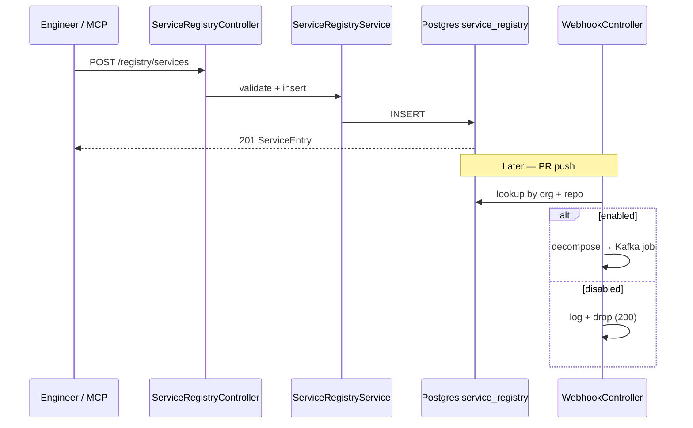

# Feature: Service Registry

> **Status:** Shipped  
> **Package:** `io.testseer.backend.registry`

## Problem

TestSeer must know which Git repos and Java source roots to index before webhook ingestion or admin triggers can run. The registry is the authoritative configuration for org → repo → service mapping.

## Goals

- Register, list, update, and soft-disable services
- Validate required fields and prevent duplicate `(org_id, repo, service_name)` tuples
- Gate webhook job publication (`enabled = false` → skip silently)

## Non-goals

- Auto-provision GCP resources
- Cascade-delete indexed facts on disable (facts remain; use [Index Clear](06-admin-indexing.md) to wipe)

## End-to-end flow



## Data model

**Table:** `service_registry` (V1)

| Column | Purpose |
|--------|---------|
| `service_id` | Primary key — typically repo name for local index |
| `org_id` | Tenant (e.g. `quotient`) |
| `repo` | GitHub repo name |
| `service_name` | Logical service label within repo |
| `module_type` | `service` \| `library` |
| `build_tool` | `MAVEN` \| `GRADLE` |
| `source_roots` | Java paths for changed-file matching |
| `test_roots` | Test class discovery for impact analysis |
| `enabled` | Soft-delete flag |

## REST API

| Method | Path | Behavior |
|--------|------|----------|
| `POST` | `/registry/services` | Register; 409 on duplicate |
| `GET` | `/registry/services` | List all |
| `GET` | `/registry/services/{serviceId}` | Get one; 404 if missing |
| `PATCH` | `/registry/services/{serviceId}` | Update fields / disable |
| `DELETE` | `/registry/services/{serviceId}` | Sets `enabled = false` |

**Not cached** — registry reads always hit Postgres.

### Error responses (P16)

| HTTP | `error` | When |
|------|---------|------|
| 400 | `VALIDATION_ERROR` | Missing/invalid fields |
| 404 | `NOT_FOUND` | Unknown `serviceId` |
| 409 | `CONFLICT` | Duplicate `(org_id, repo, service_name)` |

Example 409 body:

```json
{
  "error": "CONFLICT",
  "message": "Service already registered for org acme / repo orders",
  "requestId": "..."
}
```

## MCP integration

| Tool | Mapping |
|------|---------|
| `testseer_list_services` | `GET /registry/services` |
| `testseer_detect_service` | Reads `.testseer/config.yml` + git remote → registry lookup |

## Key implementation

| Class | Role |
|-------|------|
| `ServiceRegistryController` | REST layer |
| `ServiceRegistryService` | Validation, CRUD |
| `ServiceRegistryRepository` | JDBC access |
| `ServiceEntry` | Record type |

Local index auto-registers on first `POST /admin/index/local` if the repo path is not yet registered.

## Operational notes

- Bulk indexing via `scripts/index-all-repos.sh` assumes `service_id` = repo folder name
- Org discovery (`POST /admin/discover`) bulk-inserts from GitHub org scan — see [Admin Indexing](06-admin-indexing.md)

## Limitations

- No versioning of registry config history
- Disable does not stop in-flight Kafka jobs

## Related

- [02-ingestion-pipeline.md](02-ingestion-pipeline.md) — webhook uses registry for job decomposition
- [06-admin-indexing.md](06-admin-indexing.md) — local index + discovery
