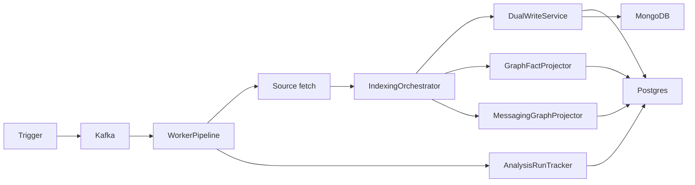

# Feature: Ingestion Pipeline

> **Status:** Shipped  
> **Packages:** `io.testseer.backend.webhook`, `io.testseer.backend.ingestion`

## Problem

When Java source or config changes, TestSeer must asynchronously fetch files, parse them, extract structured facts, and persist to Postgres + MongoDB without blocking GitHub webhooks.

## Goals

- Accept GitHub PR/push events and admin triggers
- Decompose events into per-service `IngestionJob` records
- Parse Java with JavaParser; extract symbols, outbound HTTP, peripherals
- Run Option C messaging extractors on YAML + proto + Java (see [07-option-c-messaging-flow.md](07-option-c-messaging-flow.md))
- Dual-write facts atomically; commit Kafka offset only after success

## Non-goals

- Real-time sub-second indexing (target: minutes)
- Index non-Java languages in Phase 1

## End-to-end flow



### Triggers

| Source | Job type | Topic | Fetcher |
|--------|----------|-------|---------|
| GitHub PR webhook | `PR` | `testseer.jobs.pr` | `GitHubSourceFetcher` (changed files) |
| GitHub push (default branch) | `PUSH` | `testseer.jobs.batch` | GitHub (changed or full) |
| `POST /admin/index/{serviceId}` | `MANUAL` | batch | GitHub Trees API |
| `POST /admin/index/local` | `LOCAL` | inline (no Kafka) | `LocalDirectoryFetcher` + `ConfigFileFetcher` |
| Nightly (planned) | `NIGHTLY` | batch | GitHub (all files) |

### Processing steps (per job)

1. **Fetch** — `.java` files under registered `source_roots`; for local index also `application*.yaml` and `*.proto`
2. **Parse** — `JavaParserService` + `SymbolSolver`
3. **Extract core facts** — `FactExtractor`: endpoints, dependencies, outbound calls
4. **Extract messaging facts** — `MessagingFactOrchestrator` (yaml, proto, gates, DB access, validation hints); `MessagingClassLinker` resolves pub/sub → Java (module-local, service-wide, rule-pack `pubSubClassLinks`)
5. **Peripheral detection** — `PeripheralDetector` tiers 1–3 → `peripheral_facts`
6. **Normalize** — `FactBatch` (schema-versioned lists)
7. **Dual-write** — `DualWriteService.write(batch, models)` → Postgres + Mongo `parsed_models`
8. **Extract Maven facts** — `MavenFactOrchestrator` from `pom.xml` (+ optional `mvn dependency:tree`); `InternalArtifactLinker` sets `linkedServiceId` (BL-058 / AC-MVN-4)
9. **Project graph** — `GraphFactProjector` (HTTP deps) + `MessagingGraphProjector` (Pub/Sub edges) + `MavenGraphProjector` (`DEPENDS_ON_ARTIFACT`, `OWNED_BY`)
10. **Track run** — `analysis_runs` status `COMPLETE` / `FAILED`
11. **Invalidate cache** — `CacheService.invalidate(orgId, repo, serviceId)`

## Data written

| Store | Content |
|-------|---------|
| Postgres | `symbol_facts`, `outbound_call_facts`, `peripheral_facts`, `unsupported_construct_facts`, Option C tables (V8), `graph_nodes`, `graph_edges` |
| MongoDB | `parsed_models` — raw AST per file |
| Postgres | `analysis_runs` — job lifecycle |

## Kafka envelope (`IngestionJob`)

```json
{
  "jobId": "uuid",
  "jobType": "PR | PUSH | NIGHTLY | MANUAL | LOCAL",
  "orgId": "quotient",
  "repo": "optimus-offer-services-suite",
  "serviceId": "optimus-offer-services-suite",
  "commitSha": "abc123",
  "changedFiles": ["src/main/java/..."],
  "prNumber": 42,
  "enqueuedAt": "2026-06-12T10:00:00Z",
  "attempt": 1
}
```

## Failure handling

| Failure | Behavior |
|---------|----------|
| Invalid webhook signature | 401, drop |
| Unregistered repo | 200, log, drop |
| JavaParser error on file | `unsupported_construct_facts`; continue other files |
| Write failure | No Kafka offset commit → redelivery |
| Max retries | Dead-letter topic `testseer.jobs.dlq` |

## Key implementation

| Class | Role |
|-------|------|
| `WebhookController` | Signature validation, job publish |
| `JobDecomposer` | Changed files → affected services |
| `PrWorkerConsumer` / `BatchWorkerConsumer` | Kafka consumers |
| `WorkerPipeline` | Orchestrates fetch → index → track |
| `IndexingOrchestrator` | Single entry for parse + extract + write + project |
| `DualWriteService` | Postgres upsert + Mongo replace; `pubsub_resource_facts` delete-by-commit + V21-key dedupe on re-index (see [07-option-c-messaging-flow.md](07-option-c-messaging-flow.md)) |
| `ConfigFileFetcher` | YAML + proto for local/GitHub index |

## Operational notes

- Local index is synchronous — no Kafka; suitable for dev bulk runs (`scripts/index-all-repos.sh`)
- PR webhook only re-indexes config files **in the PR diff**; run local index for full yaml/proto scan
- Docker Compose stack: Postgres, Mongo, Redis, Kafka (see backend README)

## Limitations

- No nightly scheduler wired in repo
- GitHub rate limits on large tree fetches
- Incremental graph update for messaging replaces service-scoped edges only

## Related

- [01-service-registry.md](01-service-registry.md)
- [04-graph-projection.md](04-graph-projection.md)
- [07-option-c-messaging-flow.md](07-option-c-messaging-flow.md)
