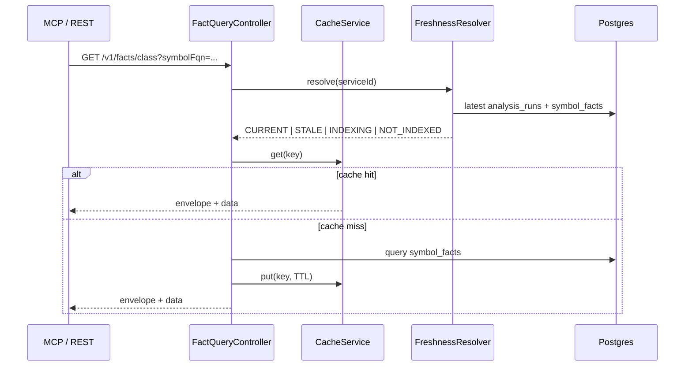

# Feature: Fact Query API

> **Status:** Shipped  
> **Package:** `io.testseer.backend.query`

## Problem

Agents and tools need read access to indexed Java facts with freshness metadata — without re-parsing source on every request.

## Goals

- Serve symbol, outbound HTTP, and file-scoped facts
- Return standard `ResponseEnvelope` with `freshnessStatus`
- Cache hot queries in Redis; invalidate on index complete

## End-to-end flow



## REST endpoints

| Method | Path | Returns |
|--------|------|---------|
| `GET` | `/v1/facts/class` | Facts for `symbolFqn` + `serviceId` |
| `GET` | `/v1/facts/by-file` | Symbols in one or more file paths |
| `GET` | `/v1/facts/outbound` | Outbound HTTP calls for a service |
| `GET` | `/v1/status/{serviceId}` | Index status, last commit, timestamps |

Option C fact endpoints are documented in [07-option-c-messaging-flow.md](07-option-c-messaging-flow.md).

## Response envelope

```json
{
  "schemaVersion": "1.0",
  "indexedAt": "2026-06-12T10:05:00Z",
  "commitSha": "abc123",
  "freshnessStatus": "CURRENT",
  "data": { }
}
```

### Freshness logic

| Status | Condition |
|--------|-----------|
| `CURRENT` | Latest index within stale threshold (default 60 min) |
| `STALE` | Index exists but older than threshold |
| `INDEXING` | `analysis_runs` has `QUEUED` or `RUNNING` |
| `NOT_INDEXED` | No facts for serviceId |

### Freshness HTTP (P16)

Service-scoped fact endpoints use `FreshnessHttp`:

| `freshnessStatus` | HTTP | Body |
|-------------------|------|------|
| `NOT_INDEXED` | **404** | `ResponseEnvelope` with `freshnessStatus: NOT_INDEXED` |
| `INDEXING` | **202** | Envelope with partial/last-known data |
| `CURRENT` / `STALE` | **200** | Full envelope |

`GET /v1/status/{serviceId}` always returns **200** (status is informational, not a hard failure).

## Data sources

| Table | Query use |
|-------|-----------|
| `symbol_facts` | Class/method/endpoint symbols |
| `outbound_call_facts` | Cross-service HTTP edges source |
| `peripheral_facts` | Test prerequisite hints (tier 1–3) |
| `analysis_runs` | Freshness + INDEXING detection |

## Caching

- **Key pattern:** `testseer:{orgId}:{repo}:{serviceId}:{queryType}:{paramsHash}`
- **TTL:** 1 hour (safety net)
- **Invalidation:** `CacheService.invalidate()` on index complete (local index + worker pipeline)
- **Not cached:** registry, status freshness fields read from Postgres

## MCP integration

| Tool | Endpoint |
|------|----------|
| `testseer_get_changed_endpoints` | GitHub PR files + `GET /v1/facts/by-file` |
| `testseer_get_service_status` | `GET /v1/status/{serviceId}` |

## Key implementation

| Class | Role |
|-------|------|
| `FactQueryController` | REST endpoints |
| `FreshnessHttp` | Maps freshness → HTTP 404/202/200 |
| `FactQueryService` | SQL queries |
| `FreshnessResolver` | Status computation |
| `CacheService` | Redis get/put/invalidate |
| `ResponseEnvelope` | Standard wrapper |

## Limitations

- No full-text search across symbols
- `by-file` requires exact path match as indexed

## Related

- [02-ingestion-pipeline.md](02-ingestion-pipeline.md)
- [04-graph-projection.md](04-graph-projection.md)
