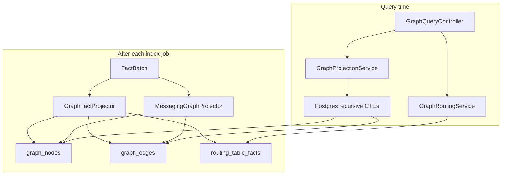

# Feature: Graph Projection

> **Status:** Shipped (extended BL-053 2026-06-15)  
> **Package:** `io.testseer.backend.graph`  
> **Processor routing design:** [TestSeer_BL053_Processor_Routing_CallGraph_Design.md](../TestSeer_BL053_Processor_Routing_CallGraph_Design.md)

## Problem

Test impact and dependency analysis requires traversing service, class, and HTTP call relationships faster than re-parsing Java on each query.

## Goals

- Materialize nodes and edges in Postgres from fact tables
- Support recursive CTE traversals (reachability, impact, neighborhood)
- Project both HTTP dependency graph and Option C messaging graph
- **(BL-053)** Intra-service call graph, factory `ROUTES_TO`, processor routing facts

## End-to-end flow

## Node types

| `node_type` | Example id |
|-------------|------------|
| `SERVICE` | service name or serviceId |
| `CLASS` | `{serviceId}::class::{fqn}` |
| `METHOD` | `{serviceId}::method::{fqn#method}` |
| `ENDPOINT` | HTTP endpoint node |
| `SHARED_TYPE` | Library type FQN |
| `TOPIC` | Pub/Sub topic short_id |
| `SUBSCRIPTION` | Pub/Sub subscription short_id |

## Edge types

### HTTP / code dependency (GraphFactProjector)

| Edge | Meaning |
|------|---------|
| `CALLS` | Service → service transitive call |
| `DEPENDS_ON` | Class → class constructor/field dep |
| `INVOKES` | Class or method → class (field use + method calls) |
| `ROUTES_TO` | Factory class → processor impl (BL-053) |
| `OUTBOUND_TO` | Endpoint → endpoint HTTP call |
| `USES_TYPE` | Service → shared library type |

### Messaging (MessagingGraphProjector)

| Edge | Meaning |
|------|---------|
| `PUBLISHES_TO` | Publisher class → TOPIC |
| `SUBSCRIBES_TO` | Subscriber class → SUBSCRIPTION |
| `GUARDED_BY` | Handler → gate node |

### Maven artifacts (`MavenGraphProjector` — BL-058 / AC-MVN-4)

| Node | Edge | Meaning |
|------|------|---------|
| `MAVEN_MODULE` | `CONTAINS_MODULE` | Reactor parent → child module |
| `ARTIFACT` | `DEPENDS_ON_ARTIFACT` | Module → GAV (direct or transitive) |
| `ARTIFACT` | `OWNED_BY` | Cross-repo internal artifact → owning `SERVICE` |

Separate from class `DEPENDS_ON`. See [BL-058 design](../TestSeer_BL058_Maven_Dependency_Tree_Design.md) · [AC-MVN-4](../TestSeer_AC_MVN_4_Internal_Artifact_Link_Design.md).

## REST endpoints

| Method | Path | Traversal |
|--------|------|-----------|
| `GET` | `/v1/graph/reachability` | Forward from node — `type=service\|class\|method`; use `symbolFqn` / `nodeId` for class/method anchors |
| `GET` | `/v1/graph/routing` | Factory processor routing table (BL-053) |
| `GET` | `/v1/graph/impact` | Reverse reachability |
| `GET` | `/v1/graph/neighborhood` | Depth-1 neighbors |
| `GET` | `/v1/graph/shared-type` | Library type lookup |
| `GET` | `/v1/graph/type-fanout` | Reverse USES_TYPE |

**Reachability fix (BL-053):** `type=class` with only `serviceId` returns **400**. Pass `symbolFqn` or `nodeId` (`{serviceId}::class::{fqn}`).

**Internal only:** `GraphProjectionService.crossServiceBoundary()` — exposed at `GET /v1/graph/cross-service-boundary`.

Event-flow endpoints live under [07-option-c-messaging-flow.md](07-option-c-messaging-flow.md):
- `GET /v1/graph/event-flow`
- `GET /v1/graph/event-flow/cross-repo`

Entry-flow `processorRouting[]` — see [11-entry-triggers.md](11-entry-triggers.md) and BL-053 design.

**Freshness HTTP (P16):** service-scoped graph endpoints use `FreshnessHttp` — **404** when `NOT_INDEXED`, **202** when `INDEXING`, **200** otherwise. See [03-fact-query-api.md](03-fact-query-api.md).

## Incremental update

On re-index for a service:
1. Delete edges from affected symbol nodes
2. Insert new edges from fresh facts
3. Replace `routing_table_facts` for service commit
4. Messaging projector replaces service-scoped Pub/Sub edges

Clear-by-service removes nodes where `service = serviceId OR service = serviceName OR id LIKE serviceId::%`.

## Caching

`GraphQueryController` delegates through `CacheService` (Redis cache-aside) before Postgres CTEs. Same contract as [03-fact-query-api.md](03-fact-query-api.md):

- **Key pattern:** `testseer:{orgId}:{repo}:{serviceId}:{queryType}:{paramsHash}` (e.g. `graph:reachability`, `graph:impact`)
- **TTL:** 1 hour
- **Invalidation:** `CacheService.invalidate()` on index complete or admin clear
- **Not cached:** `freshnessStatus` / `indexedAt` — always from `FreshnessResolver` + Postgres

If Redis is unavailable, queries still succeed (cache bypass with WARN log).

## Performance (Phase 0 spike, ~40 services)

| Query | p95 |
|-------|-----|
| Forward reachability | ~3 ms |
| Reverse impact | ~2 ms |
| Neighborhood | ~1 ms |

Re-evaluate if portfolio exceeds 200 services or p95 > 50 ms (ADR-001).

## Key implementation

| Class | Role |
|-------|------|
| `GraphFactProjector` | HTTP/code edges, INVOKES, ROUTES_TO, routing facts |
| `MethodCallGraphExtractor` | Field injections + method calls (BL-053) |
| `FactoryRoutingExtractor` | PostConstruct map routing (BL-053) |
| `MessagingGraphProjector` | Pub/Sub edges from V8 facts |
| `GraphProjectionService` | CTE query implementations |
| `GraphQueryController` | REST + `CacheService` wrapper |
| `CacheService` | Redis get/put/invalidate |
| `GraphRoutingService` | `/v1/graph/routing` |
| `GraphNodeRepository` / `GraphEdgeRepository` | JDBC |
| `IncrementalEdgeUpdater` | Per-file edge replacement |

## Related reading

- [graph-database-explained.md](../graph-database-explained.md) — CTE patterns vs Cypher
- [TestSeer_BL053_Processor_Routing_CallGraph_Design.md](../TestSeer_BL053_Processor_Routing_CallGraph_Design.md)

## Limitations

- Shared TOPIC nodes may survive partial service clear (by design)
- `GraphFactProjector` uses `serviceName`; `MessagingGraphProjector` uses `serviceId` — clear logic handles both
- Method call graph is bounded (200 calls/method); not full points-to analysis
- Processor routing requires re-index after BL-053 deploy
- **No composed flow diagram yet** — use separate APIs (`reachability`, `routing`, `entry-flow`) or wait for [BL-054](../TestSeer_BL054_Service_Flow_Diagram_Design.md) `GET /v1/graph/flow-diagram`
- **`reachability?type=service`** traverses cross-service `CALLS` only; intra-service paths require `type=class` or `type=method` with `symbolFqn` (BL-053)

## Related

- [03-fact-query-api.md](03-fact-query-api.md)
- [05-impact-analysis.md](05-impact-analysis.md)
- [07-option-c-messaging-flow.md](07-option-c-messaging-flow.md)
- [24-kafka-messaging-and-graph-gaps.md](24-kafka-messaging-and-graph-gaps.md)
