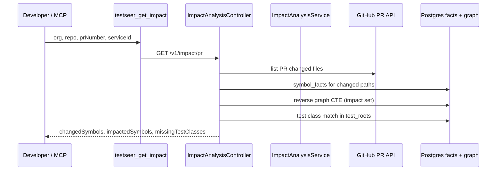

# Feature: Impact Analysis

> **Status:** Shipped  
> **Package:** `io.testseer.backend.analysis`

## Problem

When a PR changes production code, QA needs to know which test classes should run and which symbols were touched — without manual repo archaeology.

## Goals

- Diff PR changed files against indexed symbols
- Reverse graph traversal for blast radius
- Match affected production classes to test classes in `test_roots`
- Expose via REST and MCP for Cursor agents

## End-to-end flow



## REST API

```
GET /v1/impact/pr?serviceId={id}&org={org}&repo={repo}&prNumber={n}&commitSha={optional}
```

### Response fields (typical)

| Field | Meaning |
|-------|---------|
| `changedFiles` | Paths from GitHub PR |
| `changedSymbols` | Symbols in those files from index |
| `impactedSymbols` | Reverse graph reachability from changed symbols |
| `suggestedTestClasses` | Test classes referencing impacted symbols |
| `missingTestClasses` | Impacted areas with no matching test class |
| `artifactImpact[]` | **Shipped (BL-058 P4b)** — downstream services on same `groupId:artifactId` when PR changes `pom.xml` |

## Caching

`ImpactAnalysisController` caches the assembled `ImpactReport` via `CacheService`:

- **Query type:** `impact:pr`
- **Params hash:** `commitSha`
- **Key pattern:** `testseer:{orgId}:{repo}:{serviceId}:impact:pr:{commitSha}`
- **TTL:** 1 hour; invalidated on index complete for that service

Freshness (`freshnessStatus`, commit validation) is resolved from Postgres before returning the envelope — not taken from the cached body alone. See [03-fact-query-api.md](03-fact-query-api.md#caching).

## MCP integration

| Tool | Notes |
|------|-------|
| `testseer_get_impact` | Primary PR analysis tool |
| `testseer_get_gaps` | **Blocked** — calls unimplemented `GET /v1/gaps`; use `missingTestClasses` from impact instead |

`testseer_get_changed_endpoints` combines GitHub PR diff with `GET /v1/facts/by-file` for REST endpoint-focused review.

## Key implementation

| Class | Role |
|-------|------|
| `ImpactAnalysisController` | REST + `CacheService` |
| `ImpactAnalysisService` | Orchestrates diff + graph + matcher |
| `CacheService` | Redis cache for `impact:pr` reports |
| `TestClassMatcher` | Maps production symbols → test classes |
| `CommitIndexValidator` | Ensures index commit matches PR head (warn if stale) |
| `GraphProjectionService` | Reverse reachability queries |

## Prerequisites

- Service registered and indexed (`freshnessStatus` not `NOT_INDEXED`)
- `test_roots` configured in registry for test class discovery
- `GITHUB_TOKEN` in MCP env for PR file list

## Limitations

- Portfolio-wide gap report (`GET /v1/gaps`, P12) **shipped** (BL-020)
- Impact is commit-scoped, not runtime behavior proof
- Cross-repo Java deps across unindexed libraries may be incomplete
- Maven GAV cross-repo impact uses `maven_dependency_facts` + `linkedServiceId` on consumers — see [29-maven-dependency-tree.md](29-maven-dependency-tree.md)

## Related

- [04-graph-projection.md](04-graph-projection.md)
- [08-mcp-agent-integration.md](08-mcp-agent-integration.md)
