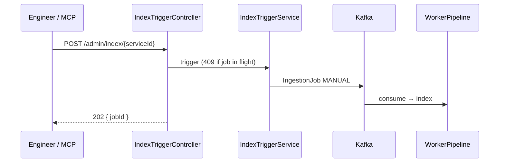

# Feature: Admin Indexing & Clear

> **Status:** Shipped  
> **Package:** `io.testseer.backend.admin`

## Problem

Engineers need to trigger indexing outside GitHub webhooks — local dev repos, on-demand re-index, org-wide discovery, and clean wipes before re-index.

## Goals

- On-demand GitHub re-index via Kafka
- Synchronous local filesystem index (bulk scripts)
- GitHub org auto-registration
- Clear indexed facts by service, messaging-only, or org scope

## End-to-end flows

### A. GitHub on-demand index



### B. Local filesystem index

```
POST /admin/index/local
{ "orgId": "quotient", "path": "/Users/.../optimus-offer-services-suite",
  "catalogLibraryId": "platform-data", "serviceModuleId": "optimus-offer-services-suite" }
```

Optional `catalogLibraryId` / `serviceModuleId` select a workspace profile from `config/workspace.yml` (`catalogLibraries`, `serviceModules`). Bulk script `./scripts/index-all-repos.sh` passes these automatically per `bundles.quotient-full.indexOrder`.

Runs **inline** (no Kafka): `LocalDirectoryFetcher` + `ConfigFileFetcher` → `IndexingOrchestrator`. Auto-registers service if missing.

### C. Org discovery

```
POST /admin/discover
{ "orgId": "quotient", "githubOrg": "quotient-tech" }
```

`GitHubOrgScanner` lists repos → bulk register Java/Maven services.

### D. Index clear

```
POST /admin/index/clear
{ "scope": "SERVICE|MESSAGING|ORG", "serviceId": "...", "orgId": "...", "includeRegistry": false }
```

Or shortcut: `DELETE /admin/index/{serviceId}`

| Scope | Deletes |
|-------|---------|
| `SERVICE` | All fact tables, graph nodes/edges for service, Mongo `parsed_models`, cache invalidate |
| `MESSAGING` | V8 tables only (pubsub, schema, data-access, gates, validation hints) |
| `ORG` | All facts + graph for org; optional registry wipe |

## REST summary

| Method | Path | Description |
|--------|------|-------------|
| `POST` | `/admin/index/{serviceId}` | Queue GitHub re-index (202) |
| `POST` | `/admin/index/local` | Sync local path index |
| `POST` | `/admin/discover` | Scan GitHub org |
| `POST` | `/admin/index/clear` | Scoped clear |
| `DELETE` | `/admin/index/{serviceId}` | Full service clear shortcut |
| `POST` | `/admin/maven/backfill-links` | Re-run Maven `linkedServiceId` linker (AC-MVN-4) |

### Error responses (P16)

Admin and index endpoints return **`ApiError` JSON** (no plain-string bodies):

| HTTP | `error` | Typical cause |
|------|---------|---------------|
| 400 | `VALIDATION_ERROR` | Invalid clear scope, bad local path |
| 404 | `NOT_FOUND` | Unknown `serviceId` |
| 409 | `CONFLICT` | Index job already in flight |

Successful index trigger returns **202** with `IndexTriggerResponse` body (not `ApiError`).

## Shell scripts

```bash
# Bulk local index — full workspace (quotient-full: 93 catalog-first steps, 74 repos)
./scripts/index-all-repos.sh quotient http://localhost:8080

# Clear then re-index
./scripts/clear-index.sh ORG quotient
./scripts/index-all-repos.sh quotient http://localhost:8080

# Full reset (facts + deregister all services)
./scripts/clear-all.sh quotient
./scripts/index-all-repos.sh quotient http://localhost:8080

# Clear only
./scripts/clear-index.sh ORG quotient
./scripts/clear-index.sh SERVICE optimus-offer-services-suite
```

## MCP integration

| Tool | Endpoint |
|------|----------|
| `testseer_trigger_index` | `POST /admin/index/{serviceId}` |
| `testseer_clear_index` | `POST /admin/index/clear` |

## Key implementation

| Class | Role |
|-------|------|
| `IndexTriggerController` / `IndexTriggerService` | GitHub Kafka trigger |
| `LocalIndexTriggerController` / `LocalIndexTriggerService` | Filesystem index |
| `DiscoveryController` / `GitHubOrgScanner` | Org discovery |
| `IndexClearController` / `IndexClearService` | Scoped delete + cache invalidate |
| `LocalDirectoryFetcher` | Walk repo for `.java` |
| `ConfigFileFetcher` | YAML + proto files |

## Operational notes

- Local index can take minutes per large monorepo; use adequate curl timeouts for bulk runs
- Run `clear-index.sh ORG` before re-index to clear org facts but **keep** registry rows
- Clear does not remove shared TOPIC graph nodes referenced by other services
- **`uq_pubsub_resource` duplicate key on index:** Backend must have Flyway **V21** (index includes `linked_class_fqn`). Symptom: `DuplicateKeyException` on `pubsub_resource_facts` for `HTTP_PUBSUB_LINKER` rows when two+ processor classes publish the same notification topic from one config-map yaml — e.g. `quotient/transaction-eval-suite` + `DEV_T.NOTIFICATION_REQ` (`ReceiptTxnEvalProcessor` / `CorrectedTxnEvalProcessor`), or `platform-receipt-service` + `T.NOTIFICATION_REQ`. Fix: restart backend so Flyway runs, or apply `V21__pubsub_resource_unique_with_linked_class.sql` manually — see [07-option-c-messaging-flow.md](07-option-c-messaging-flow.md).

## Limitations

- No index progress streaming (poll `GET /v1/status/{serviceId}`)
- Nightly batch scheduler not wired

## Related

- [02-ingestion-pipeline.md](02-ingestion-pipeline.md)
- [07-option-c-messaging-flow.md](07-option-c-messaging-flow.md)
