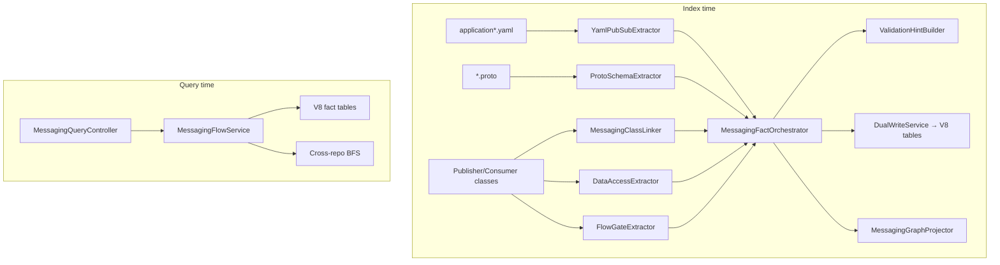

# Feature: Option C — Messaging Flow Inventory

> **Status:** Shipped (MSG-10 v1 live GCP verify — see [19-live-pubsub-verify.md](19-live-pubsub-verify.md))  
> **Packages:** `io.testseer.backend.ingestion.messaging`, `io.testseer.backend.query`

## Problem

Event-driven platform flows (Pub/Sub topics, protobuf payloads, DB writes, config gates) span multiple repos and YAML files. QA and agents need a **static topology map** for test planning, gap detection, and cross-repo tracing — without reading every consumer class manually.

## Goals (C-P1 through C-P6)

| Phase | Delivers |
|-------|----------|
| C-P1 | Pub/Sub topic/subscription inventory from YAML + Java linkage |
| C-P2 | Message schema facts from proto files + `.unpack()` heuristics |
| C-P3 | DB read/write touchpoints on event handlers |
| C-P4 | Validation hints for test assertions |
| C-P5 | Messaging gap detection (missing subscriber, schema, gate) |
| C-P6 | Flow gates (config flags, business-rule guards) |
| Cross-repo | BFS trace across services by `short_id` + env |

## Non-goals

- Runtime **message delivery** proof (use integration tests / logs)
- Live `system_configuration` DB snapshot — see [15-live-flow-gates.md](15-live-flow-gates.md) (MSG-11 shipped)

**MSG-10 (live GCP topology verify)** is an opt-in query-time overlay — see [19-live-pubsub-verify.md](19-live-pubsub-verify.md). v1: cross-repo trace with `?liveVerify=true`; subscription existence + topic attach; reconcile writes `exists_in_gcp` when `PUBSUB_LIVE_VERIFY=true`.

## End-to-end flow



### Index inputs

| Source | Extractor | Output table |
|--------|-----------|--------------|
| `spring.cloud.gcp.pubsub.*` YAML | `YamlPubSubExtractor` | `pubsub_resource_facts` |
| `*.proto` in resources | `ProtoSchemaExtractor` | `message_schema_facts` |
| `@BasicPublishSubscribeConsumer`, publishers | `MessagingClassLinker` | links on pubsub + schema rows (`linked_class_fqn`, `linked_method`, `evidence_source`) |
| JPA/Repository/DAO in handlers | `DataAccessExtractor` | `data_access_facts` |
| `@Value`, config checks, `InsertedBy` gates, `SystemConfigKeys` (BL-052) | `FlowGateExtractor` | `flow_gate_facts` |
| Derived from above | `ValidationHintBuilder` | `validation_hint_facts` |

`EnvLaneResolver` maps Spring profiles → env lanes (`pdn`, `prod`, `qa`).

### Pub/Sub → Java class linkage (`MessagingClassLinker`)

YAML rows start with `linked_class_fqn = null`. At index time the linker resolves handler classes in tiers:

| Tier | Scope | Match signal | `evidence_source` |
|------|-------|--------------|-------------------|
| 1 | Same Maven module (`module_name`) | Consumer class / publisher heuristics | `JAVA_INFERRED` |
| 2 | All Java in service index batch | Cross-module search (e.g. consumer YAML → lib publisher) | `JAVA_INFERRED` |
| 3 | Spring key leaf | `freedomumo`, `partneradapter` in class body | `JAVA_INFERRED` |
| 4 | Rule pack `pubSubClassLinks` | Curated override when inference misses | `RULE_PACK` |

Publisher heuristics include `*Publisher`, `*PublishService` with `PubSubMsgGateway` / `publishGateway` in source.

**Multi-module services:** `workspace.yml` `serviceModules.*.sourceRoots` (e.g. `partner-adapter-lib`, `partner-adapter-consumer`, `partner-adapter-ns`) index as one service. `LocalDirectoryFetcher` prefixes repo-relative paths so `EnvLaneResolver` groups Java under the correct module name.

**Re-index:** `DualWriteService.writePubSubResourceFacts` deletes existing pub/sub rows for `(service_id, commit_sha)` before insert, then dedupes in-memory on the same key as unique index `uq_pubsub_resource` (V21). That lets `linked_class_fqn` and HTTP_PUBSUB caller rows update on re-index without a full service clear. Use `./scripts/clear-index.sh SERVICE <id>` when stale rows from an **older commit** remain.

**Unique index (V21, BL-051):** `uq_pubsub_resource` is `(service_id, commit_sha, resource_kind, short_id, env_lane, role, COALESCE(spring_key,''), yaml_path, COALESCE(linked_class_fqn,''))`. Required when multiple classes call `callNotificationAPI` against the same yaml topic — e.g. workspace service `quotient/transaction-eval-suite` (`ReceiptTxnEvalProcessor` + `CorrectedTxnEvalProcessor` on `DEV_T.NOTIFICATION_REQ`), or `platform-receipt-service` (`WebhooksService` + `ProcessReceiptProcess` on `T.NOTIFICATION_REQ`). If Flyway V21 is missing, the second publisher insert fails with `duplicate key value violates unique constraint "uq_pubsub_resource"`. Restart the backend or apply `V21__pubsub_resource_unique_with_linked_class.sql`; verify with `SELECT indexdef FROM pg_indexes WHERE indexname = 'uq_pubsub_resource'` (must include `linked_class_fqn`).

Rule pack example (`config/rule-packs/quotient-messaging.yml`):

```yaml
pubSubClassLinks:
  - springKeyLeaf: freedomumo
    role: PUBLISH
    classFqn: com.quotient.platform.partneradapter.lib.service.FreedomOfferUpdateEventPublisher
    method: sendUpdateManageOfferEvent
  - springKeyLeaf: partneradapter
    role: PUBLISH
    classFqn: com.quotient.platform.partneradapter.service.PartnerAdapterPublishService
    method: publishEvent
```

## Data model (V8 + V21)

| Table | Key columns |
|-------|-------------|
| `pubsub_resource_facts` | `resource_kind`, `short_id`, `env_lane`, `role` (PUBLISH/SUBSCRIBE), `spring_key`, `yaml_path`, `linked_class_fqn`, `workload_name`, `attributes` JSON (`transport`: `KAFKA` / `HTTP_PUBSUB`; absent ⇒ `PUBSUB`). **Unique (V21):** `uq_pubsub_resource` on `(service_id, commit_sha, resource_kind, short_id, env_lane, role, spring_key, yaml_path, linked_class_fqn)` with null `spring_key` / `linked_class_fqn` coerced to `''` on insert |
| `message_schema_facts` | `payload_proto`, `payload_fields`, `direction`, `topic_short_id`, `unpack_expression` |
| `data_access_facts` | `handler_class_fqn`, `operation`, `table_or_entity`, `correlation_keys` |
| `flow_gate_facts` | `guarded_symbol_fqn`, `gate_kind`, `gate_key`, `required_value`, `effect_when_fail` |
| `validation_hint_facts` | Assertion suggestions per handler hop |
| `pubsub_verification_facts` | BL-015 index + live GCP reconcile when enabled — [19-live-pubsub-verify.md](19-live-pubsub-verify.md) |

## REST API

| Method | Path | Phase |
|--------|------|-------|
| `GET` | `/v1/facts/pubsub` | C-P1 |
| `GET` | `/v1/facts/message-schema` | C-P2 |
| `GET` | `/v1/facts/data-access` | C-P3 |
| `GET` | `/v1/facts/validation-hints` | C-P4 |
| `GET` | `/v1/gaps/messaging` | C-P5 |
| `GET` | `/v1/facts/gates` | C-P6 |
| `GET` | `/v1/graph/event-flow` | Single-service trace |
| `GET` | `/v1/graph/event-flow/cross-repo` | Org-wide BFS |

**Freshness HTTP (P16):** service-scoped endpoints return **404** when `NOT_INDEXED`, **202** when `INDEXING`, **200** when `CURRENT`/`STALE` — same rules as `/v1/facts/class`.

### Cross-repo linking

Each Git repo = separate `service_id`. Join at **query time**:

| Join key | Links |
|----------|-------|
| `short_id` + `env_lane` | Same topic across services |
| Topic stem heuristic | `PDN_T.OFFER_UPDATE` → subs matching `*OFFER_UPDATE*` |
| `payload_proto` FQN | Consumer unpack + proto catalog repo |
| `linked_class_fqn` | In-repo publisher/consumer class |

**Offer-event bundle** (minimum repos):

1. `optimus-platform-msg-framework` — protos
2. `optimus-offer-services-suite` — core pipeline
3. `riq-partner-adapter-suite` — Hyvee adapter
4. `platform-argocd-manifest` — workload names

```bash
./scripts/clear-index.sh ORG quotient
./scripts/index-all-repos.sh quotient http://localhost:8080
curl 'http://localhost:8080/v1/graph/event-flow/cross-repo?orgId=quotient&shortId=PDN_T.RIQ_OFFER_EVENT&env=pdn'
```

### Cross-repo trace algorithm

1. Start at topic `shortId` + `env`
2. Find publishers and subscribers from `pubsub_resource_facts` org-wide
3. For each subscriber service, find topics that service publishes
4. BFS until max hops or no new topics
5. Attach schemas, DB access, gates, gaps, and `consistencyHints[]` per publisher/subscriber hop (deduplicated on report root)

### Response fields — transport (BL-050 / BL-051 / viz P4)

Query layer exposes **`transport`** on inventory and hop views (additive, non-breaking):

| View | Field | Values |
|------|-------|--------|
| `PubSubView` / `PubSubOrgView` | `transport` | `PUBSUB` (default), `KAFKA`, `HTTP_PUBSUB` |
| `CrossRepoHop` | `transport` | Resolved from topic row or hop participants |
| `OutboundMsg` | `transport` | Same taxonomy on each egress in `EventFlowStep.outbounds[]` |

Source: `MessagingTransportUtil.fromAttributes(pubsub_resource_facts.attributes)`. Kafka indexing writes `"transport":"KAFKA"`; HTTP pubsub notification linker writes `"transport":"HTTP_PUBSUB"` ([BL-050 design](../TestSeer_BL050_Kafka_Messaging_Graph_Design.md), [BL-051 design](../TestSeer_HTTP_PubSub_EventFlow_Hop_Design.md)).

**Event Flow viz (BL-048 P4.1):** participant detail in `/viz.html` lazy-loads message-schema facts and renders **`payloadFields`** as a proto field table (#, name, type). See [22-event-flow-viz-redesign.md](22-event-flow-viz-redesign.md) §Phase 4.

### HTTP Pub/Sub publish hop (BL-051)

Services that POST to an internal pubsub publish API (`rest.apis.pubsub.uri` + `topic-name` in body, e.g. `PubSubNotificationClient.callNotificationAPI`) are indexed as **virtual** `pubsub_resource_facts`:

| Field | Value |
|-------|--------|
| `shortId` | yaml `rest.apis.pubsub.topic-name` (e.g. `DEV_T.NOTIFICATION_REQ`) |
| `role` | `PUBLISH` |
| `transport` | `HTTP_PUBSUB` |
| `evidenceSource` | `HTTP_PUBSUB_LINKER` |
| `linkedClassFqn` | Caller processor (e.g. `ReceiptTxnEvalProcessor`, `CorrectedTxnEvalProcessor`, `WebhooksService`) — **one row per caller class** per `(topic, env, yaml_path)` |
| `springKey` | `rest.apis.pubsub.topic-name` |

`HttpPubSubPublishLinker` dedupes by `(topic, env_lane, yaml_path, caller class)` so the same handler is not emitted twice from ConfigMap `#application.yaml` unwrap vs root flatten. `DualWriteService` deletes prior rows for `(service_id, commit_sha)`, dedupes in-batch on the V21 key, and coerces null `spring_key` / `linked_class_fqn` to `''` before insert.

Rule pack: `quotient-messaging.yml` → `httpPubSubPublishLinks`. Coexists with `external_endpoint_facts` (`quotient:pubsub_notification`) from KFK-06.

**Pilot services:** workspace `quotient/transaction-eval-suite` (repo `platform-transaction-eval-consumer`; `DEV_T.NOTIFICATION_REQ`), `platform-receipt-service` (`T.NOTIFICATION_REQ` across receipt + consumer modules).

```bash
curl -s "$BASE/v1/graph/event-flow?serviceId=$EVAL_SVC&shortId=DEV_T.NOTIFICATION_REQ&includeExternal=true"
curl -s "$BASE/v1/graph/event-flow/cross-repo?orgId=quotient&shortId=DEV_T.NOTIFICATION_REQ&env=dev"
```

### Cross-repo consistency hints

`CrossRepoFlowReport` includes:

- `hops[].publishers[].consistencyHints[]` and `hops[].subscribers[].consistencyHints[]` — per linked handler (dual-write, mirrors, rule-pack matches; delegate expansion for consumer → adapter DB writes)
- `consistencyHints[]` on the report root — deduplicated union across **all** hops by `scenarioId`

See [12-data-consistency-hints.md](12-data-consistency-hints.md).

## MCP integration

| Tool | Backend |
|------|---------|
| `testseer_get_pubsub_inventory` | `/v1/facts/pubsub` |
| `testseer_trace_topic_flow` | `/v1/graph/event-flow` or `/cross-repo` |
| `testseer_get_flow_gates` | `/v1/facts/gates` |
| `testseer_clear_index` | Wipe before re-index (scope `MESSAGING` or `ORG`) |

Example:

```
testseer_trace_topic_flow({
  crossRepo: true,
  orgId: "quotient",
  shortId: "PDN_T.RIQ_OFFER_EVENT",
  env: "pdn"
})
```

## Graph edges

| Edge | From → To |
|------|-----------|
| `PUBLISHES_TO` | Publisher class → TOPIC node |
| `SUBSCRIBES_TO` | Subscriber class → SUBSCRIPTION node |
| `GUARDED_BY` | Handler → gate |

## Key PDN short IDs (reference)

| Short ID | Role |
|----------|------|
| `PDN_T.RIQ_OFFER_EVENT` | OIS offer create/update event |
| `PDN_T.OFFER_UPDATE` | Internal offer update fan-out |
| `PDN_S.OFFER_UPDATE.PARTNER_NOTIFY` | Partner notify subscription |
| `PDN_T.PARTNER_NOTIFICATION` | Partner notification topic |
| `PDN_T.UMO_EVENT` | UMO / Freedom path |

## Limitations

- PR index only includes yaml/proto **in the diff** — use local index for full scan
- Proto/Java linkage uses `.unpack()` / `Any.pack()` heuristics
- External CPA notifier repo shows `NO_SUBSCRIBER` if not indexed
- Maven imports ≠ Pub/Sub hops

## Related

- [02-ingestion-pipeline.md](02-ingestion-pipeline.md)
- [04-graph-projection.md](04-graph-projection.md)
- [06-admin-indexing.md](06-admin-indexing.md)
- [15-live-flow-gates.md](15-live-flow-gates.md) — MSG-11 live config overlay
- [26-flow-gate-manual-s9.md](26-flow-gate-manual-s9.md) — BL-052 `SystemConfigKeys` / manual §9 gate extraction
- [19-live-pubsub-verify.md](19-live-pubsub-verify.md) — MSG-10 live GCP Pub/Sub verify
- Legacy runbook: [Option_C_Messaging_Flow.md](../Option_C_Messaging_Flow.md) (query examples)
