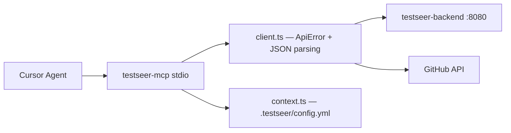

# Feature: MCP Agent Integration

> **Status:** Shipped (18 tools)  
> **Last updated:** 2026-06-16  
> **Package:** `testseer-mcp` (Node/TypeScript)

## Problem

Cursor agents need structured, typed access to TestSeer analysis without hand-crafting REST calls or knowing every endpoint parameter.

## Goals

- Expose backend capabilities as MCP tools over stdio
- Auto-detect `serviceId` from workspace when possible
- Return JSON text payloads agents can parse

## Architecture



### REST client behavior (P16)

- Non-2xx responses: parse `ApiError` JSON (`error`, `message`, `hint`, `requestId`); surface in MCP `isError` text
- `testseer_get_service_description`: reads `description` field from `ServiceDescriptionResponse` JSON (not plain text)
- Sends `X-Request-Id` on backend requests for log correlation — see [TestSeer_Observability_Design.md](../TestSeer_Observability_Design.md)

## Setup

```bash
../scripts/build-mcp.sh   # from testseer-mcp/
```

Cursor `.cursor/mcp.json`:

```json
{
  "mcpServers": {
    "testseer": {
      "command": "node",
      "args": ["dist/index.js"],
      "cwd": "/absolute/path/to/testseer-mcp",
      "env": {
        "TESTSEER_URL": "http://localhost:8080",
        "GITHUB_TOKEN": "ghp_..."
      }
    }
  }
}
```

## Tool catalog (end-to-end)

| Tool | Backend / external | Feature doc |
|------|-------------------|-------------|
| `testseer_detect_service` | `.testseer/config.yml` + registry | [01-service-registry](01-service-registry.md) |
| `testseer_list_services` | `GET /registry/services` | [01-service-registry](01-service-registry.md) |
| `testseer_get_service_status` | `GET /v1/status/{id}` | [03-fact-query-api](03-fact-query-api.md) |
| `testseer_get_service_description` | `GET /v1/services/{id}/description` | [09-service-description](09-service-description.md) |
| `testseer_trigger_index` | `POST /admin/index/{id}` | [06-admin-indexing](06-admin-indexing.md) |
| `testseer_clear_index` | `POST /admin/index/clear` | [06-admin-indexing](06-admin-indexing.md) |
| `testseer_get_impact` | `GET /v1/impact/pr` | [05-impact-analysis](05-impact-analysis.md) |
| `testseer_get_gaps` | `GET /v1/gaps` | [05-impact-analysis](05-impact-analysis.md) |
| `testseer_get_changed_endpoints` | GitHub PR + `/v1/facts/by-file` | [03-fact-query-api](03-fact-query-api.md) |
| `testseer_get_pubsub_inventory` | `GET /v1/facts/pubsub` | [07-option-c-messaging-flow](07-option-c-messaging-flow.md) |
| `testseer_trace_topic_flow` | `/v1/graph/event-flow*` | [07-option-c-messaging-flow](07-option-c-messaging-flow.md) |
| `testseer_get_flow_gates` | `GET /v1/facts/gates` | [07-option-c-messaging-flow](07-option-c-messaging-flow.md) |
| `testseer_get_consistency_scenarios` | `GET /v1/consistency/scenarios` | [12-data-consistency-hints](12-data-consistency-hints.md) |
| `testseer_get_entry_triggers` | `GET /v1/facts/entry-triggers` (+ impact when `handlerFqn`) | [11-entry-triggers](11-entry-triggers.md), [20-trg-13](20-trg-13-reverse-impact.md) |
| `testseer_trace_entry_flow` | `GET /v1/graph/entry-flow` (+ TRG-12 chain flags) | [21-trg-12](21-trg-12-entry-flow-chain.md) |
| `testseer_get_external_endpoints` | `GET /v1/facts/external-endpoints` | [03-fact-query-api](03-fact-query-api.md) |
| `testseer_get_service_flow_diagram` | `GET /v1/graph/flow-diagram` | [27-service-flow-diagram](27-service-flow-diagram.md) |
| `testseer_get_maven_dependencies` | `GET /v1/facts/maven-dependencies` | [29-maven-dependency-tree](29-maven-dependency-tree.md) |
| `testseer_get_dependency_tree` | `GET /v1/graph/dependency-tree` | [29-maven-dependency-tree](29-maven-dependency-tree.md) |

## Typical agent workflows

### PR review — what tests to run?

```
testseer_detect_service()
testseer_get_impact({ serviceId, org, repo, prNumber })
→ review changedSymbols, missingTestClasses, artifactImpact[]
testseer_get_maven_dependencies({ serviceId, scope: "runtime" })
testseer_get_dependency_tree({ serviceId, hydrate: "true" })
```

### Offer event flow — cross-repo trace

```
testseer_clear_index({ scope: "ORG", orgId: "quotient" })   # optional
# (run index-all-repos.sh separately)
testseer_trace_topic_flow({
  crossRepo: true,
  orgId: "quotient",
  shortId: "PDN_T.RIQ_OFFER_EVENT",
  env: "pdn"
})
→ review hops, gaps, gates
```

### Inbound trigger → full journey (TRG-12)

```
testseer_get_entry_triggers({ serviceId, env: "pdn", triggerKind: "PUBSUB_SUBSCRIBE" })
testseer_trace_entry_flow({
  serviceId,
  triggerId: "<from list>",
  env: "pdn",
  includeMessaging: "true",
  crossRepo: "true",
  orgId: "quotient"
})
→ steps[] (handler reads/writes/gates) + messagingFlow + crossRepoFlow
```

For reverse impact after a handler change, use `testseer_get_entry_triggers({ orgId, handlerFqn })` instead.

### Stale index recovery

```
testseer_get_service_status({ serviceId })
testseer_trigger_index({ serviceId })
# or ask user to run scripts/index-all-repos.sh for bulk local index
```

## Source layout

| File | Role |
|------|------|
| `src/index.ts` | MCP server, tool dispatch |
| `src/client.ts` | HTTP client for backend + GitHub |
| `src/context.ts` | Workspace serviceId detection |
| `src/tools/*.ts` | One module per tool family |
| `src/tools/maven-dependencies.ts` | Maven facts |
| `src/tools/dependency-tree.ts` | Maven dependency-tree graph |

### Cross-repo trace with consistency hints

```
testseer_trace_topic_flow({
  orgId: "quotient",
  shortId: "PDN_T.RIQ_OFFER_EVENT",
  env: "pdn",
  crossRepo: true
})
```

Response includes `consistencyHints` on subscriber hops and on the report root (same as `GET /v1/graph/event-flow/cross-repo`).

## Limitations

- No streaming / partial results for long indexes
- Requires backend running locally or reachable via `TESTSEER_URL`

## Observability

MCP runs over stdio; diagnostics go to **stderr** only. See [TestSeer_Observability_Design.md](../TestSeer_Observability_Design.md) §9 for `requestId` correlation, tool-call logging, and backend header propagation.

## Related

- [testseer-mcp/README.md](../../../testseer-mcp/README.md) — setup troubleshooting
- [TestSeer_Observability_Design.md](../TestSeer_Observability_Design.md) — logging and metrics plan
- All feature docs in this folder
