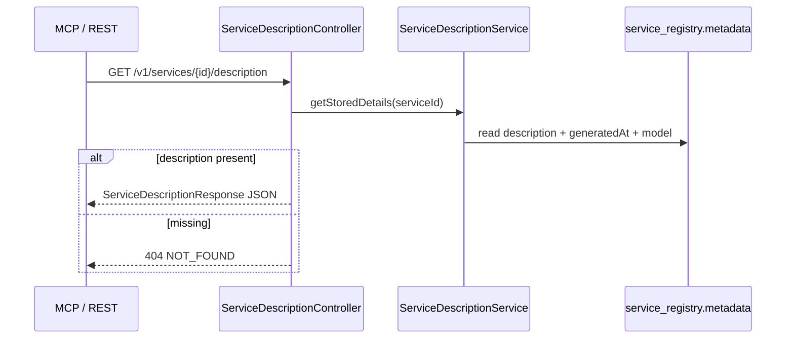

# Feature: Service Description (cached)

> **Status:** Shipped (read-only)  
> **Package:** `io.testseer.backend.analysis`

## Problem

Agents benefit from a concise natural-language summary of what a service does when one has been stored on the service record.

## Goals

- Return cached descriptions from `service_registry.metadata`
- Expose via REST and MCP

## End-to-end flow



## REST API

| Method | Path | Behavior |
|--------|------|----------|
| `GET` | `/v1/services/{serviceId}/description` | Return cached JSON (`ServiceDescriptionResponse`) |

**Response shape (200):**

```json
{
  "serviceId": "optimus-offer-services-suite",
  "description": "Handles offer lifecycle…",
  "generatedAt": "2026-06-12T10:00:00Z",
  "model": null
}
```

Errors use `ApiError` JSON (`NOT_FOUND`).

## MCP integration

```
testseer_get_service_description({ serviceId: "optimus-offer-services-suite" })
```

## Storage

Descriptions are stored in `service_registry.metadata`:

- `description`
- `descriptionGeneratedAt`
- `descriptionModel` (optional)

## Limitations

- No server-side generation endpoint; descriptions must be written to metadata externally
- Not a substitute for architecture docs or Option C flow traces

## Related

- [03-fact-query-api.md](03-fact-query-api.md)
- [08-mcp-agent-integration.md](08-mcp-agent-integration.md)
