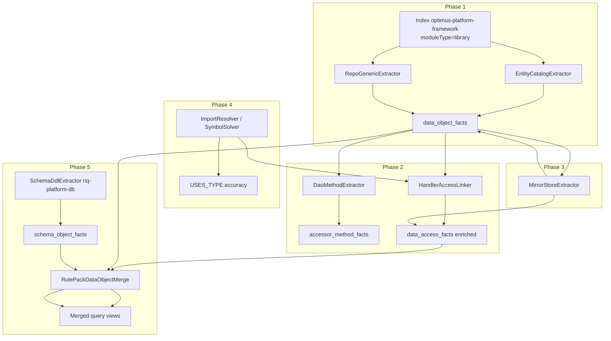

# Feature: Data Object Catalog & Persistence Linking (WRK-18 — Phases 1–5)

> **Status:** Phase 1–5 shipped  
> **Last updated:** 2026-06-12  
> **Architecture design:** [TestSeer_Data_Object_Catalog_Design.md](../TestSeer_Data_Object_Catalog_Design.md)  
> **Implementation caveats:** [TestSeer_Data_Object_Catalog_Implementation_Caveats.md](../TestSeer_Data_Object_Catalog_Implementation_Caveats.md)  
> **Packages:** `io.testseer.backend.ingestion.catalog`, `io.testseer.backend.ingestion.messaging`, `io.testseer.backend.query`  
> **Extends:** [07-option-c-messaging-flow.md](07-option-c-messaging-flow.md) C-P3, [04-graph-projection.md](04-graph-projection.md) `USES_TYPE`  
> **Workspace config:** [16-workspace-catalog-config.md](16-workspace-catalog-config.md) — org-scoped catalog library API  
> **Rule pack:** `config/rule-packs/quotient-messaging.yml`

## Problem

Option C `data_access_facts` today:

- Hardcodes `store_type = MARIADB` for all repo/DAO calls.
- Guesses `table_or_entity` from repo field names or a local `@Table` in the handler file.
- Misses common Quotient patterns: `*Dao.saveToDb(...)`, Cassandra `@Query` updates, Mongo `@Document`, BigQuery mirrors via `@LogForBigQuerySync`.
- Does not link touchpoints to **entity FQN**, **domain type**, or authoritative physical names in `platform-data`.

QA and agents need a **static map**: handler → accessor (DAO/repo) → entity → store → physical table/collection, with optional test poll hints — without connecting to live databases.

## Goals

| ID | Goal |
|----|------|
| G-01 | Build a **data object catalog** from indexed library source (`platform-data` and peers). |
| G-02 | Link event-handler touchpoints to catalog entries with **entityFqn** and optional **domainFqn**. |
| G-03 | Infer **store type** (MARIADB, CASSANDRA, MONGODB, BIGQUERY) with tiered confidence. |
| G-04 | Surface links on REST (`/v1/facts/data-access`, event-flow) and MCP (`testseer_trace_topic_flow`). |
| G-05 | Validate inferred names against **riq-platform-db** DDL where available (Phase 5). |
| G-06 | Merge **rule pack** poll hints and overrides for E2E flows (Phase 5). |

## Non-goals

- Runtime proof that a row was persisted (integration tests, logs, DB poll).
- Live JDBC/CQL/BigQuery connections during index or query.
- Full Hibernate metamodel export or Spring context boot.
- Replacing `Freedom_Offer_Database_Representation.md` or Confluence — this is machine-readable index data.

## Phase overview

| Phase | Name | Primary deliverable | Depends on |
|-------|------|---------------------|------------|
| **1** | Library catalog + repo generics | `data_object_facts` from entities + repo interfaces | `platform-data` indexed as `library` |
| **2** | DAO indirection tracing | `accessor_method_facts` + enriched `data_access_facts` | Phase 1 |
| **3** | Multi-store & mirror annotations | Mongo, Cassandra, BQ mirror edges | Phase 1 |
| **4** | Import-aware type resolution | Fix FQN resolution; strengthen `USES_TYPE` | Phases 1–2 |
| **5** | Schema validation + rule pack merge | `schema_object_facts` + curated `dataObjects` | Phases 1–3 |



---

## Prerequisites (all phases)

### Library registration

Register and index at least:

| Service | Repo | `moduleType` | Source roots |
|---------|------|--------------|--------------|
| `platform-data` | `optimus-platform-framework` | `library` | `platform-data/src/main/java` |

Bulk indexing (`scripts/index-all-repos.sh`) walks `bundles.quotient-full.indexOrder` — catalog libraries (e.g. `optimus-platform-framework` / `platform-data`) before service modules and legacy repos.

### Quotient package conventions (detection hints)

| Package segment | Default store |
|-----------------|---------------|
| `.../data/rdb/...`, `.../data/mariadb/...` | MARIADB |
| `.../data/nosql/...` | CASSANDRA |
| `.../data/mongo/...` | MONGODB |
| `.../domain/...` | Domain type (not a store) |

---

## Data model (Flyway V10)

New tables. Extend existing `data_access_facts` (additive columns).

### `data_object_facts` (Phase 1+)

Canonical catalog entry — one row per persisted object identity (entity/document), not per accessor.

```sql
CREATE TABLE data_object_facts (
    id                BIGSERIAL PRIMARY KEY,
    org_id            VARCHAR(100)  NOT NULL,
    repo              VARCHAR(255)  NOT NULL,
    service_id        VARCHAR(255)  NOT NULL REFERENCES service_registry(service_id),
    commit_sha        VARCHAR(40)   NOT NULL,
    snapshot_type     VARCHAR(10)   NOT NULL,
    entity_fqn        VARCHAR(500)  NOT NULL,
    domain_fqn        VARCHAR(500),
    store_type        VARCHAR(20)   NOT NULL,
    physical_name     VARCHAR(255)  NOT NULL,
    catalog_or_keyspace VARCHAR(100),
    collection_or_table_kind VARCHAR(20),  -- TABLE | COLLECTION | CQL_TABLE
    evidence_source   VARCHAR(50)   NOT NULL,
    confidence        FLOAT         NOT NULL,
    attributes        JSONB,        -- mirrors[], packageHint, annotation raw
    indexed_at        TIMESTAMPTZ   NOT NULL DEFAULT now()
);

CREATE UNIQUE INDEX uq_data_object ON data_object_facts (
    service_id, commit_sha, entity_fqn, store_type, physical_name
);
CREATE INDEX idx_data_object_physical ON data_object_facts(store_type, physical_name);
CREATE INDEX idx_data_object_domain ON data_object_facts(domain_fqn);
```

### `accessor_method_facts` (Phase 2)

Maps DAO/repo interface methods to entity + operation.

```sql
CREATE TABLE accessor_method_facts (
    id                BIGSERIAL PRIMARY KEY,
    org_id            VARCHAR(100)  NOT NULL,
    repo              VARCHAR(255)  NOT NULL,
    service_id        VARCHAR(255)  NOT NULL REFERENCES service_registry(service_id),
    commit_sha        VARCHAR(40)   NOT NULL,
    snapshot_type     VARCHAR(10)   NOT NULL,
    accessor_kind     VARCHAR(20)   NOT NULL,  -- DAO | REPO | TEMPLATE
    accessor_fqn      VARCHAR(500)  NOT NULL,
    method_name       VARCHAR(255)  NOT NULL,
    operation         VARCHAR(10)   NOT NULL,  -- READ | WRITE
    entity_fqn        VARCHAR(500),
    domain_fqn        VARCHAR(500),
    store_type        VARCHAR(20)   NOT NULL,
    physical_name     VARCHAR(255),
    evidence_source   VARCHAR(50)   NOT NULL,
    confidence        FLOAT         NOT NULL,
    indexed_at        TIMESTAMPTZ   NOT NULL DEFAULT now()
);

CREATE UNIQUE INDEX uq_accessor_method ON accessor_method_facts (
    service_id, commit_sha, accessor_fqn, method_name
);
```

### `data_access_facts` extensions (Phases 2–3)

```sql
ALTER TABLE data_access_facts
    ADD COLUMN entity_fqn        VARCHAR(500),
    ADD COLUMN domain_fqn        VARCHAR(500),
    ADD COLUMN accessor_fqn      VARCHAR(500),
    ADD COLUMN accessor_kind     VARCHAR(20),
    ADD COLUMN catalog_ref       VARCHAR(100),
    ADD COLUMN secondary_stores  JSONB;   -- [{ storeType, physicalName, via }]
```

Replace hardcoded `MARIADB` default in application code; retain column for backward compatibility.

### `schema_object_facts` (Phase 5)

Physical objects from `riq-platform-db` DDL.

```sql
CREATE TABLE schema_object_facts (
    id                BIGSERIAL PRIMARY KEY,
    org_id            VARCHAR(100)  NOT NULL,
    repo              VARCHAR(255)  NOT NULL,
    service_id        VARCHAR(255)  NOT NULL REFERENCES service_registry(service_id),
    commit_sha        VARCHAR(40)   NOT NULL,
    store_type        VARCHAR(20)   NOT NULL,
    physical_name     VARCHAR(255)  NOT NULL,
    catalog_or_keyspace VARCHAR(100),
    ddl_path          VARCHAR(500)  NOT NULL,
    evidence_source   VARCHAR(50)   NOT NULL DEFAULT 'DDL_FILE',
    indexed_at        TIMESTAMPTZ   NOT NULL DEFAULT now()
);

CREATE UNIQUE INDEX uq_schema_object ON schema_object_facts (
    service_id, commit_sha, store_type, physical_name,
    COALESCE(catalog_or_keyspace, '')
);
```

### `data_object_validation_facts` (Phase 5, optional)

Drift and merge outcomes computed at index or query time; may be materialized for gaps API.

| `validation_kind` | Meaning |
|-------------------|---------|
| `DDL_CONFIRMED` | `physical_name` in both catalog and schema |
| `INFERRED_NOT_IN_DDL` | Java catalog entry, no DDL match |
| `DDL_UNREFERENCED` | DDL exists, no catalog entry |
| `RULE_OVERRIDE` | Rule pack corrected inferred name |

---

## Phase 1 — Library catalog + repo generics

### Objective

Scan indexed **library** Java and emit authoritative `data_object_facts` for every persistence entity/document.

### Extractors

| Class | Input | Output |
|-------|-------|--------|
| `EntityCatalogExtractor` | Classes with `@Entity`, `@Document`, Cassandra `@Table` | `data_object_facts` |
| `RepoGenericExtractor` | `JpaRepository<E,I>`, `MongoRepository<E,I>`, `BaseNoSqlRepository<E>`, `CassandraRepository<E,I>` | Links repo FQN → `entity_fqn`; confirms store |

### Detection rules (Tier 1)

| Signal | store_type | physical_name source | confidence |
|--------|------------|----------------------|------------|
| JPA `@Table(name=..., catalog=...)` on `@Entity` | MARIADB | `name`, `catalog` | 0.95 |
| `@Document(collection=...)` | MONGODB | collection | 0.95 |
| Cassandra entity `@Table` in `nosql` package | CASSANDRA | table name | 0.90 |
| Repo generic `JpaRepository<FooEntity, ...>` | MARIADB | from linked entity | 0.92 |

### domain_fqn (best-effort in Phase 1)

| Heuristic | Example |
|-----------|---------|
| Strip `Entity` suffix + map to `.../domain/...` package | `PartnerOfferCallRecorderEntity` → `com.quotient.platform.domain.offer.PartnerOfferCallRecorder` |
| Confirmed in Phase 2 via `mapDomainToEntity` in DaoImpl |

### Orchestration

- Run inside `IndexingOrchestrator` when `moduleType = library`.
- For `moduleType = service`, skip catalog extractors (catalog lives in library service_id).
- Persist via `DualWriteService.writeDataObjectFacts`.

### Acceptance criteria

- [ ] Index `optimus-platform-framework` produces `PartnerOfferCallRecorderEntity` → MARIADB / `PartnerOfferCallRecorder` / `coupons_nextgen`.
- [ ] `UserOfferActivatedEntity` (Cassandra) and `SegmentOfferEntity` (Mongo) cataloged with correct `store_type`.
- [ ] `PartnerOfferCallRecorderWriteRepo` linked to entity via repo generic row in `attributes` or join table.
- [ ] Unit tests: `EntityCatalogExtractorTest`, `RepoGenericExtractorTest`.

### API (Phase 1)

| Method | Path | Returns |
|--------|------|---------|
| `GET` | `/v1/catalog/data-objects?serviceId={libraryId}` | List `DataObjectView` |
| `GET` | `/v1/catalog/data-objects/{entityFqn}` | Single object + accessors (when Phase 2 shipped) |

MCP (optional Phase 1): `testseer_get_data_objects`.

---

## Phase 2 — DAO indirection tracing

### Objective

Close the gap between **handlers** (adapter services) and **persistence** (library DAOs/repos), including domain types.

### Extractors

| Class | Scans | Emits |
|-------|-------|-------|
| `DaoMethodExtractor` | `*DaoImpl`, `*Repository` impl bodies | `accessor_method_facts` |
| `HandlerAccessLinker` | Handler/consumer classes | enriched `data_access_facts` |

### DAO method rules

Parse public methods on `*Dao` interfaces and `*DaoImpl` classes:

| Pattern | operation | entity/domain resolution |
|---------|-----------|--------------------------|
| `saveToDb(DomainType)` | WRITE | domainFqn from param; follow body to `repo.save(entity)` → entityFqn |
| `markAllPendingAsProcessed(...)` | WRITE | `@Modifying` / update query → table from `@Query` or repo |
| `find*` / `get*` / `is*` | READ | entity from return type or repo call |
| `JpaRepository.save(entity)` in impl | WRITE | entity from arg type |

### Handler linker rules

Broaden call detection beyond current regex:

```regex
(\w+(?:Repo|Dao|Repository|Template))\.(\w+)\s*\(
```

Join `(accessor_fqn, method_name)` → `accessor_method_facts` → `data_object_facts`.

**Example end state:**

| Field | Value |
|-------|-------|
| `handler_class_fqn` | `...HyveeOfferAdapter` |
| `handler_method` | `recordSubmission` |
| `accessor_fqn` | `...PartnerOfferCallRecorderDao` |
| `dao_method` | `saveToDb` |
| `domain_fqn` | `...domain.offer.PartnerOfferCallRecorder` |
| `entity_fqn` | `...PartnerOfferCallRecorderEntity` |
| `store_type` | `MARIADB` |
| `table_or_entity` | `PartnerOfferCallRecorder` |
| `operation` | `WRITE` |
| `confidence` | `0.93` |

### Cross-service join at query time

Handler `service_id` (e.g. `riq-partner-adapter-suite`) joins catalog by **org_id + accessor FQN or entity FQN**, not by handler service_id.

```sql
-- Pseudocode: resolve catalog from library service in same org
SELECT d.* FROM data_object_facts d
JOIN service_registry lib ON lib.org_id = :orgId AND lib.module_type = 'library'
  AND lib.repo = 'optimus-platform-framework'
WHERE d.entity_fqn = :entityFqn
ORDER BY d.indexed_at DESC LIMIT 1
```

### Acceptance criteria

- [ ] `OfferBaseAdapter.recordSubmission` → `saveToDb` + `markAllPendingAsProcessed` both appear in `data_access_facts`.
- [ ] `table_or_entity` = `PartnerOfferCallRecorder` (not `partner_offer_call`).
- [ ] `domain_fqn` populated for DAO methods taking domain types.
- [ ] Event-flow trace shows enriched reads/writes on Hyvee adapter step.
- [ ] Tests: `DaoMethodExtractorTest`, `HandlerAccessLinkerTest`, integration with indexed fixture repos.

---

## Phase 3 — Multi-store & mirror annotations

### Objective

Cover Mongo/Cassandra-specific access and **secondary stores** (especially BigQuery mirrors).

### Extractors

| Class | Signal | Output |
|-------|--------|--------|
| `MongoAccessExtractor` | `MongoTemplate`, `MongoRepository` method calls | `data_access_facts` store_type=MONGODB |
| `CassandraQueryExtractor` | `@Query` on Cassandra repos, `CassandraTemplate` | store_type=CASSANDRA |
| `MirrorStoreExtractor` | `@LogForBigQuerySync(tableName, keyFields, operation)` | `secondary_stores` JSON on accessor or data_object |

### Mirror link model

```json
{
  "storeType": "BIGQUERY",
  "physicalName": "UserOfferActivated",
  "via": "@LogForBigQuerySync",
  "syncMode": "ASYNC_MIRROR",
  "keyFields": ["PartnerId", "UserId", "ActivationId"]
}
```

Attach to:

- `accessor_method_facts` for annotated repo methods, and/or
- `data_object_facts.attributes.mirrors[]` on primary Cassandra object.

### BigQuery direct writes

| Signal | store_type |
|--------|------------|
| `BigQueryUtil`, `TableId`, `insertAll` | BIGQUERY |
| `@LogForBigQuerySync` only | BIGQUERY mirror (secondary) |

### Acceptance criteria

- [ ] `UserOfferActivatedRepo.updateVisibilityFlag` → CASSANDRA write + BIGQUERY in `secondary_stores`.
- [ ] `SegmentOffersRepo.save` → MONGODB with collection from `@Document`.
- [ ] `platform-sales-trans-bigquery-consumer` direct BQ writes cataloged when indexed.
- [ ] Tests mirror extraction from `platform-data` fixtures.

---

## Phase 4 — Import-aware type resolution

### Objective

Fix incorrect FQN guessing (`resolveTypeFqn` same-package hack) so handler field types resolve to library types and `USES_TYPE` edges are accurate.

### Current gap

```java
// field: PartnerOfferCallRecorderDao partnerOfferCallRecorderDao
// resolveTypeFqn → com.quotient.platform.partneradapter.lib.adapter.PartnerOfferCallRecorderDao (WRONG)
```

### Deliverables

| Component | Change |
|-----------|--------|
| `ImportIndex` | Per compilation unit: simple name → fully qualified from `import` statements |
| `TypeFqnResolver` | Replace `GraphFactProjector.resolveTypeFqn` for injection/constructor types |
| `CombinedTypeSolver` (optional) | Add indexed library source roots to JavaParser classpath |
| `HandlerAccessLinker` | Use resolved FQN for accessor join |

### Tiered resolution

| Tier | Strategy | confidence |
|------|----------|------------|
| 1 | Explicit import | 0.95 |
| 2 | Same-module `symbol_facts` lookup | 0.85 |
| 3 | Library catalog `accessor_fqn` prefix match | 0.80 |
| 4 | Same-package fallback (current behavior) | 0.50 — emit `UnsupportedConstructFact` if used for data access |

### Acceptance criteria

- [x] `OfferBaseAdapter` → `USES_TYPE` edge to library node for real `PartnerOfferCallRecorderDao` FQN.
- [x] Handler linker joins succeed without Phase 2-style string heuristics when import present.
- [x] No regression on graph projection tests.

---

## Phase 5 — Schema validation + rule pack merge

### Objective

Validate inferred physical names against DDL; merge curated QA hints for E2E flows.

### Part A — `riq-platform-db` schema catalog

| Class | Input | Output |
|-------|-------|--------|
| `SchemaDdlExtractor` | `*.sql` (MariaDB), `*.cql` (Cassandra) | `schema_object_facts` |

Register `riq-platform-db` as `moduleType: library` (or dedicated `schema` type if added).

**DDL parsing (minimal):**

| File pattern | Extract |
|--------------|---------|
| `CREATE TABLE \`Name\`` / `CREATE TABLE Name` | MARIADB table |
| `CREATE TABLE IF NOT EXISTS "Name"` (CQL) | CASSANDRA table + keyspace from path or statement |

### Validation join

At index-complete or query time for each `data_object_facts` row:

```
IF schema_object_facts match on (store_type, physical_name) → validation_kind = DDL_CONFIRMED, confidence += 0.05
ELSE IF store_type IN (MARIADB, CASSANDRA) → INFERRED_NOT_IN_DDL (warning)
```

Reverse scan: DDL rows with no catalog → `DDL_UNREFERENCED` (informational gap).

### Part B — Rule pack `dataObjects`

Extend `config/rule-packs/quotient-messaging.yml`:

```yaml
dataObjects:
  PartnerOfferCallRecorder:
    storeType: MARIADB
    physicalName: PartnerOfferCallRecorder
    entityFqn: com.quotient.platform.data.rdb.dataaccess.offer.entities.offer.PartnerOfferCallRecorderEntity
    domainFqn: com.quotient.platform.domain.offer.PartnerOfferCallRecorder
    accessorFqn: com.quotient.platform.data.rdb.dataaccess.offer.dao.PartnerOfferCallRecorderDao
    methods: [saveToDb, markAllPendingAsProcessed]
    correlationKeys: [partnerId, offerId]
    pollHint: "SELECT * FROM PartnerOfferCallRecorder WHERE PartnerId=? AND OfferId=?"
    flowSteps: [HYVEE_ADAPTER]

  UserOfferActivated:
    storeType: CASSANDRA
    physicalName: UserOfferActivated
    pollHint: "Poll activation by PartnerId, UserId, ActivationId"
    mirrors:
      - storeType: BIGQUERY
        physicalName: UserOfferActivated
        pollNote: "Async mirror; prefer Cassandra for test timing"
    flowSteps: [FREEDOM_UMO]
```

### Merge algorithm (`DataObjectMergeService` at query time)

For each `DataAccessView` / event-flow step:

1. Start with inferred fact (Phases 1–3).
2. Overlay rule pack match on `physicalName` or `entityFqn` (rule wins on conflict; tag `RULE_OVERRIDE`).
3. Attach `pollHint`, `correlationKeys`, `flowSteps` from rule pack.
4. If schema validation exists, attach `validationKind`.
5. Feed merged result to `ValidationHintBuilder` (extend beyond `dbTableHints`).

### Acceptance criteria

- [x] `PartnerOfferCallRecorder` confirmed against MariaDB DDL when present in `riq-platform-db`.
- [x] `UserOfferActivated` confirmed against CQL in `Cassandra/CouponsNextgenActivation/Tables/`.
- [x] MCP event-flow step for HYVEE_ADAPTER includes rule pack `pollHint`.
- [x] Gap report lists `INFERRED_NOT_IN_DDL` for deliberate test cases.
- [x] Tests: `SchemaDdlExtractorTest`, `DataObjectMergeServiceTest`.

---

## Query & MCP surfaces (cumulative)

### REST

| Method | Path | Phase |
|--------|------|-------|
| `GET` | `/v1/catalog/data-objects` | 1 |
| `GET` | `/v1/catalog/accessors` | 2 |
| `GET` | `/v1/facts/data-access` | 2+ (extended schema) |
| `GET` | `/v1/catalog/schema-objects` | 5 |
| `GET` | `/v1/gaps/data-objects` | 5 (drift + unreferenced) |
| `GET` | `/v1/graph/event-flow` | 2+ (enriched reads/writes) |

### Response fields (`DataAccessView` extended)

```json
{
  "handlerClassFqn": "...",
  "handlerMethod": "recordSubmission",
  "operation": "WRITE",
  "storeType": "MARIADB",
  "physicalName": "PartnerOfferCallRecorder",
  "tableOrEntity": "PartnerOfferCallRecorder",
  "entityFqn": "...PartnerOfferCallRecorderEntity",
  "domainFqn": "...domain.offer.PartnerOfferCallRecorder",
  "accessorFqn": "...PartnerOfferCallRecorderDao",
  "accessorKind": "DAO",
  "daoMethod": "saveToDb",
  "correlationKeys": ["partnerId", "offerId"],
  "secondaryStores": [],
  "pollHint": "SELECT * FROM PartnerOfferCallRecorder WHERE ...",
  "validationKind": "DDL_CONFIRMED",
  "evidenceSource": "DAO_IMPL+RULE_PACK",
  "confidence": 0.95
}
```

### MCP

| Tool | Change |
|------|--------|
| `testseer_trace_topic_flow` | Include extended reads/writes (automatic via API) |
| `testseer_get_data_objects` | New (Phase 1+) — optional catalog browse |

---

## Requirements mapping (REQUIREMENTS.md)

| ID | Requirement | Phase |
|----|-------------|-------|
| WRK-18 | Entity catalog from library source | 1 |
| WRK-19 | Repo generic → entity linking | 1 |
| WRK-20 | DAO method map + handler join | 2 |
| WRK-21 | Multi-store + BQ mirror extraction | 3 |
| WRK-22 | Import-aware FQN resolution | 4 |
| WRK-23 | DDL schema catalog + validation | 5 |
| WRK-24 | Rule pack `dataObjects` merge | 5 |

---

## Test plan

| Area | Tests |
|------|-------|
| Phase 1 | Entity/repo extractors; dual-write to `data_object_facts`; catalog API |
| Phase 2 | DaoImpl fixtures from `PartnerOfferCallRecorderDaoImpl`; handler linker; cross-service join integration |
| Phase 3 | `@LogForBigQuerySync`, Mongo, Cassandra `@Query` fixtures |
| Phase 4 | Import resolution unit tests; graph `USES_TYPE` integration |
| Phase 5 | DDL parser on sample `riq-platform-db` files; merge service; gaps endpoint |
| Regression | Existing `DataAccessExtractorTest` updated — no silent hardcoded MARIADB |

### Fixture services (integration)

Index local paths in CI:

1. `optimus-platform-framework/platform-data` (library)
2. `riq-partner-adapter-suite/partner-adapter-lib` (service)
3. `riq-platform-db` (schema, Phase 5)

---

## Rollout & indexing

| Step | Action |
|------|--------|
| 1 | Add `platform-data` to registry; `POST /admin/index/local` |
| 2 | Re-index `quotient-full` with `--clear-first` optional for messaging-only |
| 3 | Verify `GET /v1/catalog/data-objects?serviceId=...` |
| 4 | Trace `testseer_trace_topic_flow` for `PDN_T.RIQ_OFFER_EVENT` / HYVEE_ADAPTER |
| 5 | Phase 5: register + index `riq-platform-db`; extend `quotient-messaging.yml` |

Ensure `workspace.yml` `catalogLibraries` and `bundles.quotient-full.indexOrder` include `optimus-platform-framework` and `riq-platform-db`.

---

## Known limitations (all phases)

See **[TestSeer_Data_Object_Catalog_Implementation_Caveats.md](../TestSeer_Data_Object_Catalog_Implementation_Caveats.md)** for the full implementation-backed list (regex gaps, FQN ambiguity, fallback heuristics, gaps API scope, operational indexing order).

| Limitation | Mitigation |
|------------|------------|
| Raw SQL / `JdbcTemplate` | Future: SQL table regex; rule pack |
| Dynamic table names | Low confidence + manual rule |
| Async BQ lag | Rule pack `pollNote`; not runtime timing |
| Cross-org catalog | Partition by `org_id` only |
| Library version skew | Freshness on library service_id; stale warning on join |

---

## Related

- [07-option-c-messaging-flow.md](07-option-c-messaging-flow.md) — C-P3 `data_access_facts` baseline
- [04-graph-projection.md](04-graph-projection.md) — `USES_TYPE`
- [06-admin-indexing.md](06-admin-indexing.md) — local index, `MESSAGING` clear scope
- `config/rule-packs/quotient-messaging.yml` — flow steps + `dbTableHints`
- DesignDocuments: `Freedom_Offer_Database_Representation.md`, `Hyvee_PDN_Offer_Lifecycle_E2E_Test_Plan.md` — human source for Phase 5 curation
