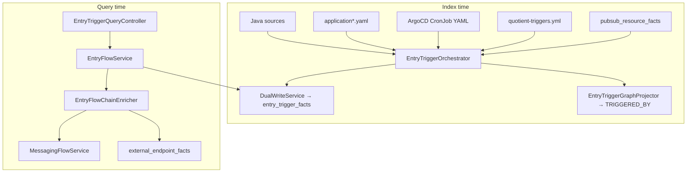

# Feature: Entry Triggers (Inbound Flow Starts)

> **Status:** P1–P4 core shipped (REST/webhook, GCS/cron/K8s/Pub/Sub/Airflow triggers, query API, forward/reverse trace, Option C chain) — see [21-trg-12-entry-flow-chain.md](21-trg-12-entry-flow-chain.md), [20-trg-13-reverse-impact.md](20-trg-13-reverse-impact.md), [18-trg-14-first-hop-trigger-enrichment.md](18-trg-14-first-hop-trigger-enrichment.md)  
> **Requirements:** [REQUIREMENTS.md §7.12](../../../docs/REQUIREMENTS.md#712-entry-triggers-inbound)  
> **Packages:** `io.testseer.backend.ingestion.triggers`, `io.testseer.backend.query`

## Problem

TestSeer indexes REST endpoints as undifferentiated `ENDPOINT` symbols and models **outbound** partner HTTP in `external_endpoint_facts`. QA still cannot answer:

- **What can start work in this service?** (partner POST, webhook, GCS drop, CronJob, Pub/Sub delivery)
- **Where does an E2E test begin?** (OIS create vs topic vs Freedom callback)
- **Which ingress points fan into a changed handler?** (reverse impact from entry triggers)

Option C covers **async message hops** after a subscriber receives a message, but not **REST/webhook/scheduled/file** entry points as first-class facts.

## Definitions

**Inbound (entry trigger):** a stimulus that **enters a service boundary** and **starts or resumes** processing. Direction is always **into** the indexed workload.

| Term | Meaning |
|------|---------|
| **Inbound** | Partner REST, vendor webhook, GCS/object trigger, CronJob/`@Scheduled`, Pub/Sub delivery to consumer |
| **Outbound** | Service calls or pushes **out** (Hyvee sync, DG notify, `NotificationUrl`) — stays in `external_endpoint_facts` |
| **Internal inbound** | Platform-owned caller, but still an entry point for **that** service (e.g. Partner Adapter `POST /partner/adapter/...`) |

### Not the same as existing “inbound” wording

| Existing usage | Actual meaning |
|----------------|----------------|
| `InboundMsg` in event-flow trace | Pub/Sub payload arriving at a subscriber for one hop |
| Graph “inbound edges” | Reverse adjacency in `graph_edges` |
| `ENDPOINT` symbol facts | Any `@RestController` mapping — no direction |
| `external_endpoint_facts.boundary=EXTERNAL` | Outbound URL host classification |

## Goals

| Phase | Delivers |
|-------|----------|
| P1 | `entry_trigger_facts` + REST/WEBHOOK inbound + rule pack + query API |
| P2 | GCS file-drop + Spring `@Scheduled` + K8s CronJob from manifests |
| P3 | Unify Pub/Sub subscribers as triggers + `TRIGGERED_BY` graph + entry-flow trace + Option C chain (TRG-12) |
| P4 | Airflow DAG triggers — see [14-airflow-entry-triggers.md](14-airflow-entry-triggers.md) (BL-025) |

## Non-goals

- Runtime proof that cron, Airflow, or GCS events actually fired
- Replacing Option C Pub/Sub inventory (link/unify instead)
- Storing outbound partner webhook URLs in entry triggers
- Modeling auth/signature validation — handler presence only

## Trigger taxonomy (`trigger_kind`)

| Kind | Inbound because | Primary evidence |
|------|-----------------|------------------|
| `REST_INBOUND` | Partner/CPA HTTP into platform API | Java `@*Mapping` + rule pack |
| `WEBHOOK_INBOUND` | External system pushes status/event | Java heuristics + rule pack |
| `PUBSUB_SUBSCRIBE` | Message delivered to consumer | Link `pubsub_resource_facts` (SUBSCRIBE) |
| `FILE_DROP_GCS` | Object appearance starts batch/read | Java `gs://`, bucket `@Value`, yaml |
| `CRON_K8S` | K8s CronJob starts workload | `platform-argocd-manifest` YAML |
| `CRON_SPRING` | `@Scheduled` in running pod | Java annotation |
| `AIRFLOW_DAG` | DAG run starts downstream step | DAG repo / ops catalog (future) |
| `SPRING_BOOT_MAIN` | JVM start wires Spring context (deploy only) | Java `@SpringBootApplication` + `main` |
| `BATCH_LAUNCHER` | Spring Batch one-shot main (often + CronJob) | Java + manifest link |

## Quotient examples

| Flow step | Direction | Model |
|-----------|-----------|-------|
| CPA `POST /ois/offer` | Inbound `REST_INBOUND` | `entry_trigger_facts` |
| Freedom `POST /payout/status/update` | Inbound `WEBHOOK_INBOUND` | `entry_trigger_facts` |
| Parquet job reads `gs://bkt-uot-prod/...` | Inbound `FILE_DROP_GCS` | `entry_trigger_facts` |
| `partner-adapter-retry-job` CronJob | Inbound `CRON_K8S` | manifest + job module link |
| Pub/Sub `PDN_T.RIQ_OFFER_EVENT` → consumer | Inbound `PUBSUB_SUBSCRIBE` | link Option C |
| Hyvee offer sync POST to retailer | **Outbound** | `external_endpoint_facts` |
| DG notify to `PartnerWebhookUrl` | **Outbound** | `external_endpoint_facts` |
| `POST /partner/adapter/offer/HyveeOfferAdapter` | Inbound `REST_INBOUND`, `boundary=INTERNAL` | `entry_trigger_facts` |

## End-to-end flow (shipped)



### Index inputs (shipped)

| Source | Extractor | Output |
|--------|-----------|--------|
| `@RestController` / `@*Mapping` | `InboundRestTriggerExtractor` | `entry_trigger_facts` |
| `*Webhook*`, path heuristics | same + rule pack | `WEBHOOK_INBOUND` rows |
| `gs://`, bucket keys in yaml | `GcsTriggerExtractor` | `FILE_DROP_GCS` |
| `kind: CronJob` in manifest repo | `K8sCronTriggerExtractor` | `CRON_K8S` |
| `@Scheduled` | `SpringCronTriggerExtractor` | `CRON_SPRING` |
| `pubsub_resource_facts` (SUBSCRIBE) | view/link at query or index | `PUBSUB_SUBSCRIBE` |
| `config/rule-packs/quotient-triggers.yml` | `TriggerRulePackLoader` | actor, kind, flowStep overrides |

## Data model (V11 — shipped)

**Table:** `entry_trigger_facts`

| Column | Purpose |
|--------|---------|
| `trigger_id` | Stable id, e.g. `freedom:payout-status-webhook` |
| `trigger_kind` | Taxonomy value above |
| `direction` | Always `INBOUND` for this table |
| `env_lane` | `pdn`, `prod`, `qa` |
| `actor` | `freedom`, `cpa`, `hyvee`, `numerator`, `internal`, `scheduler`, `unknown` |
| `boundary` | `EXTERNAL` or `INTERNAL` |
| `schedule_or_pattern` | HTTP path, cron, `gs://prefix`, topic `short_id` |
| `linked_handler_fqn` | Controller / consumer / job runner class |
| `linked_method` | Handler method name |
| `flow_step` | Optional join to Option C / rule pack |
| `source_ref` | yaml path, manifest path, java file |
| `evidence_source` | `JAVA`, `YAML`, `K8S_MANIFEST`, `RULE_PACK`, `AIRFLOW_DAG` |
| `confidence` | 0.7–0.95 |
| `attributes` | JSON metadata |

**Graph edge:** `TRIGGERED_BY` from trigger node → handler symbol.

**Layering:**

```
[Entry trigger: REST / WEBHOOK / GCS / CRON / PUBSUB_SUBSCRIBE]
        --TRIGGERED_BY--> [Handler]
        --(existing)--> Pub/Sub, data_access, gates
        --(existing outbound only)--> external_endpoint_facts
```

## REST API (shipped)

| Method | Path | Notes |
|--------|------|-------|
| `GET` | `/v1/facts/entry-triggers` | List triggers; filters: `triggerKind`, `actor`, `boundary`, `env` |
| `GET` | `/v1/graph/entry-flow` | Forward trace by `triggerId` or `path`; optional chain flags below |
| `GET` | `/v1/graph/entry-flow/impact` | Reverse lookup: `handlerFqn` → inbound triggers ([TRG-13](20-trg-13-reverse-impact.md)) |

**`/v1/graph/entry-flow` params:** `serviceId` (required), `triggerId` or `path`, `env` (default `unknown`).

**TRG-12 chain flags** (default off — backward compatible):

| Param | Default | Purpose |
|-------|---------|---------|
| `includeMessaging` | `false` | Attach `messagingFlow` (Option C `EventFlowReport`) |
| `includeExternal` | `false` | Attach handler-scoped `externalEndpoints` |
| `crossRepo` | `false` | Attach `crossRepoFlow` (requires `includeMessaging`) |
| `orgId` | — | Org for cross-repo; resolved from service when omitted |
| `maxHops` | `12` | Cross-repo BFS depth |

Response adds: `messagingTopicShortId`, `messagingFlow`, `crossRepoFlow`, `externalEndpoints`. See [21-trg-12-entry-flow-chain.md](21-trg-12-entry-flow-chain.md).

**BL-053 (additive):** `processorRouting[]` on every entry-flow response — `PROCESSOR_ROUTING` steps with `factoryFqn`, `selectorMethod`, `discriminatorType`, `possibleProcessors[]` when `routing_table_facts` exist for the service. See [TestSeer_BL053_Processor_Routing_CallGraph_Design.md](../TestSeer_BL053_Processor_Routing_CallGraph_Design.md).

Query params (list): `serviceId`, `triggerKind`, `actor`, `boundary`, `env`, `triggerId`, `path`.

Freshness: same as Option C — **404** `NOT_INDEXED`, **202** `INDEXING`, **200** `CURRENT`/`STALE`.

## MCP tools (shipped)

| Tool | Maps to |
|------|---------|
| `testseer_get_entry_triggers` | `GET /v1/facts/entry-triggers`; optional `handlerFqn` + `orgId` → impact API |
| `testseer_trace_entry_flow` | `GET /v1/graph/entry-flow`; optional `includeMessaging`, `includeExternal`, `crossRepo`, `orgId`, `maxHops` |

## Rule pack sketch (`config/rule-packs/quotient-triggers.yml`)

```yaml
inboundRestTriggers:
  - match: FreedomWebhookController
    triggerKind: WEBHOOK_INBOUND
    actor: freedom
    flowStep: PAYOUT_STATUS
  - match: OfferIngestionController#ingestOffer
    triggerKind: REST_INBOUND
    actor: cpa
    flowStep: OIS_CREATE
  - pathPrefix: /partner/adapter
    triggerKind: REST_INBOUND
    actor: internal
    boundary: INTERNAL
    flowStep: PARTNER_ADAPTER_INGRESS
```

Loaded via `testseer.triggers.rule-pack-path` (mirrors messaging rule pack).

## Implementation phasing

| Phase | Requirements | Unblocks |
|-------|--------------|----------|
| **P1** | TRG-01–03, 09–11, 15–17 | Freedom webhook, OIS, redeem in test plans |
| **P2** | TRG-04–06 | Parquet/association batch, retry CronJobs |
| **P3** | TRG-07, 12–14, 18 | Full Hyvee E2E from REST or topic start — **TRG-12/13/14 shipped** |
| **P4** | TRG-08 | Airflow → platform pipelines — [design](14-airflow-entry-triggers.md) |

## Related

- [21-trg-12-entry-flow-chain.md](21-trg-12-entry-flow-chain.md) — trigger → handler → Option C → outbound
- [20-trg-13-reverse-impact.md](20-trg-13-reverse-impact.md) — handler → inbound triggers
- [18-trg-14-first-hop-trigger-enrichment.md](18-trg-14-first-hop-trigger-enrichment.md) — `inboundTriggers[]` on event-flow first hop
- [07-option-c-messaging-flow.md](07-option-c-messaging-flow.md) — async hops after subscribe
- [05-impact-analysis.md](05-impact-analysis.md) — PR symbol impact (distinct from TRG-13)
- [03-fact-query-api.md](03-fact-query-api.md) — `external_endpoint_facts` (outbound only)
- Outbound partner HTTP: V9 `external_endpoint_facts`, `config/rule-packs/quotient-messaging.yml`
