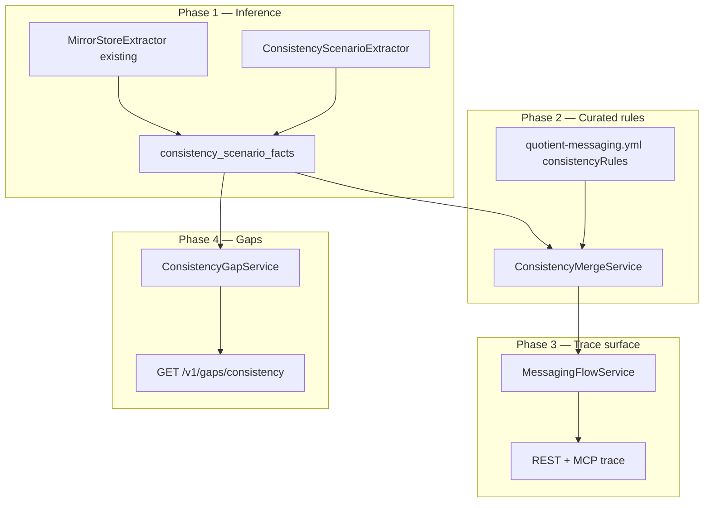

# Feature: Data Consistency Hints (CON — Phases 1–4)

> **Status:** Phases 1–4 core shipped; **S-01–S-12 catalog shipped** (2026-06-15)  
> **Last updated:** 2026-06-15  
> **Backlog:** [BACKLOG.md](../../../docs/BACKLOG.md) — BL-039–045 **Done** · **Unified design:** [TestSeer_Consistency_Catalog_S06_S12_Design.md](../TestSeer_Consistency_Catalog_S06_S12_Design.md)  
> **Depends on:** [10-data-object-catalog.md](10-data-object-catalog.md) (WRK-18–24 shipped), [07-option-c-messaging-flow.md](07-option-c-messaging-flow.md)  
> **Rule pack:** extends `config/rule-packs/quotient-messaging.yml`  
> **Platform scenarios:** Hy-Vee E2E plan, Freedom offer DB doc, `platform-data` BQ mirrors

## Problem

The data object catalog (Phases 1–5) answers **where** data is written and **which store** is authoritative for poll hints. QA and agents still lack machine-readable guidance for:

1. **Multi-store mirrors** — Cassandra write + async BigQuery mirror (`@LogForBigQuerySync`); which store to poll and expected lag class.
2. **Multi-write handlers** — same handler touching two tables or two DAO methods with shared correlation keys (e.g. `saveToDb` + `markAllPendingAsProcessed`).
3. **Projection consistency** — same logical offer represented differently in MariaDB columns, partner API (`offerRewards` / `offerConditions`), and eval `requirements`.
4. **Propagation consistency** — MariaDB authoritative row vs Elasticsearch/cache/API visibility (GALO preLive, publish filters).
5. **Co-table invariants** — e.g. `Offer` row requires matching `OfferPidMap` for discovery/eval.

Without structured hints, test plans and MCP traces repeat manual Confluence/docs archaeology and mis-assert on the wrong representation or store.

## Goals

| ID | Goal |
|----|------|
| CON-G01 | Emit **static consistency scenarios** per event-flow step or data object — not runtime proof |
| CON-G02 | Classify scenarios by **pattern** (mirror, dual-write, projection, propagation, co-table) |
| CON-G03 | Surface **authoritative store**, **secondary stores**, **correlation keys**, and **poll order** on REST + MCP |
| CON-G04 | Merge **inferred** scenarios (index-time) with **curated** rule pack overrides |

## Non-goals

| ID | Non-goal |
|----|----------|
| CON-NG01 | Live JDBC/CQL/BQ connections or row-level equality checks |
| CON-NG02 | Prove replication lag SLA in milliseconds — only document **lag class** (sync / async / propagation) |
| CON-NG03 | Replace integration tests, `ContinuityHelper` polling, or platform RCA playbooks |
| CON-NG04 | Model full CPA/Freedom business rules unless cited in rule pack or extractable from code |

---

## Scenario taxonomy (Quotient seed catalog)

These 12 classes were identified from `platform-data`, partner-adapter, offer-ingestion, test plans, and QA suites.

| ID | Pattern | Example | Stores / views | TestSeer today |
|----|---------|---------|----------------|----------------|
| **S-01** | `DUAL_WRITE_SAME_HANDLER` | `OfferBaseAdapter.recordSubmission` | MariaDB: `saveToDb` + `markAllPendingAsProcessed` on `PartnerOfferCallRecorder` | **Rule pack + inference** (BL-001) |
| **S-02** | `ASYNC_MIRROR` | `UserOfferActivatedRepo` + `@LogForBigQuerySync` | Cassandra → BQ (log pipeline) | **Rule pack + inference** (BL-001) |
| **S-03** | `PROJECTION_SPLIT` | OIS ingest → GALO/Hy-Vee vs eval | MariaDB `Offer` vs `offerRewards`/`offerConditions` vs `requirements` | **Rule pack + hop enrichment** (BL-038) |
| **S-04** | `CO_TABLE_INVARIANT` | Offer discoverability | MariaDB `Offer` + `OfferPidMap` | **Rule pack + hop enrichment** (BL-038) |
| **S-05** | `ASYNC_MIRROR` (family) | Redemption/rebate repos | Cassandra tables + BQ mirrors (~28 annotated methods in `platform-data`) | **Inference at index** (WRK-26) |
| **S-06** | `MULTI_TABLE_DOMAIN` | Continuity eval/redeem | `user_continuity_offer_progress` + `user_continuity_offer_history` + `UserOfferActivated` | **Index inference + rule pack** (BL-039) |
| **S-07** | `CROSS_STORE_WRITE` | User targeting | MariaDB `Offer` + Mongo `SegmentOfferEntity` | **Index inference + rule pack** (BL-040) |
| **S-08** | `PROPAGATION_LAG` | Post-ingest GALO | MariaDB → ES/cache → GALO API | **Query-time topology** (BL-041) |
| **S-09** | `DUAL_READ_FALLBACK` | User profile lookup | Cassandra + MariaDB user stores | **Index inference** (BL-042) |
| **S-10** | `BUSINESS_FLAG` | Freedom routing | `Offer.SourceName = 'Freedom'` | **Partial** — gates + rule anchor (BL-043) |
| **S-11** | `ASYNC_BATCH_INGEST` | Segment parquet job | GCS parquet → Mongo segments (parallel to OIS API path) | **Query-time enricher** (BL-044) |
| **S-12** | `PIPELINE_END_STATE` | STC retry RCA | MariaDB queue + Cassandra activation/reward/history | **Query-time enricher** (BL-045) |

**Shipped:** S-01–S-12 via index inference, rule pack, trace/cross-repo enrichment, `InvariantDeriver`, `HintOverlayService`, propagation/batch/pipeline enrichers (BL-039–045, 2026-06-15). Re-index `quotient-full` for new patterns in `consistency_scenario_facts`.

---

## Phase overview

| Phase | Name | Primary deliverable | Status |
|-------|------|---------------------|--------|
| **1** | Mirror + dual-write inference | `consistency_scenario_facts` + query API | **Shipped** (BL-001) |
| **2** | Projection + co-table rules | Rule pack `consistencyRules` + merge | **Shipped** — S-01–S-04 in YAML; flow-step-only matcher for curated hops |
| **3** | Trace + MCP surfaces | `consistencyHints[]` on event-flow/data-access/cross-repo | **Shipped** — subscribers + publishers; delegate expansion for multi-module handlers |
| **4** | Consistency gaps | `GET /v1/gaps/consistency` | **Shipped** (BL-026) |



---

## Data model (proposed Flyway V12)

### `consistency_scenario_facts`

One row per inferred or curated scenario instance (immutable per commit).

```sql
CREATE TABLE consistency_scenario_facts (
    id                  BIGSERIAL PRIMARY KEY,
    org_id              VARCHAR(100)  NOT NULL,
    repo                VARCHAR(255)  NOT NULL,
    service_id          VARCHAR(255)  NOT NULL REFERENCES service_registry(service_id),
    commit_sha          VARCHAR(40)   NOT NULL,
    snapshot_type       VARCHAR(10)   NOT NULL,
    scenario_id         VARCHAR(80)   NOT NULL,   -- stable slug e.g. hyvee-partner-recorder-dual-write
    pattern             VARCHAR(40)   NOT NULL,   -- ASYNC_MIRROR | DUAL_WRITE_SAME_HANDLER | ...
    scope_kind          VARCHAR(20)   NOT NULL,   -- HANDLER | DATA_OBJECT | FLOW_STEP | PORTFOLIO
    scope_ref           VARCHAR(500)  NOT NULL,   -- handler FQN, entity FQN, flow step id
    primary_store       VARCHAR(20),
    primary_physical    VARCHAR(255),
    correlation_keys    JSONB,
    participants        JSONB NOT NULL,           -- [{ storeType, physicalName, role, via, lagClass }]
    poll_strategy       JSONB,                      -- { order[], primaryPollHint, secondaryNotes }
    invariants          JSONB,                      -- [{ kind, description, sourceRef }] — Phase 2+
    evidence_source     VARCHAR(80)  NOT NULL,
    confidence          FLOAT         NOT NULL,
    attributes          JSONB,
    indexed_at          TIMESTAMPTZ   NOT NULL DEFAULT now()
);

CREATE UNIQUE INDEX uq_consistency_scenario ON consistency_scenario_facts (
    service_id, commit_sha, scenario_id
);
CREATE INDEX idx_consistency_pattern ON consistency_scenario_facts(org_id, pattern);
CREATE INDEX idx_consistency_scope ON consistency_scenario_facts(scope_kind, scope_ref);
```

### `participants` JSON (example — S-02)

```json
[
  {
    "storeType": "CASSANDRA",
    "physicalName": "UserOfferActivated",
    "role": "PRIMARY",
    "lagClass": "SYNC"
  },
  {
    "storeType": "BIGQUERY",
    "physicalName": "UserOfferActivated",
    "role": "MIRROR",
    "via": "@LogForBigQuerySync",
    "lagClass": "ASYNC_EVENTUAL",
    "keyFields": ["PartnerId", "UserId", "ActivationId"]
  }
]
```

### `poll_strategy` JSON (example)

```json
{
  "order": ["CASSANDRA", "BIGQUERY"],
  "primaryPollHint": "Poll activation by PartnerId, UserId, ActivationId",
  "notes": ["Do not assert BQ in timing-sensitive tests"]
}
```

---

## Phase 1 — Mirror + dual-write inference

### WRK-25: Dual-write handler detection

**Input:** `data_access_facts` grouped by `(handlerClassFqn, handlerMethod)`.

**Emit `DUAL_WRITE_SAME_HANDLER` when:**

- Same handler has ≥2 `WRITE` touchpoints in one method body, AND
- Same `storeType` (typically MARIADB) OR shared correlation key inference from DAO method names / rule pack.

**Seed:** `OfferBaseAdapter.recordSubmission` → scenario `partner-offer-call-recorder-dual-write`.

### WRK-26: Mirror scenario materialization

**Input:** existing `MirrorStoreExtractor` output + `data_object_facts.attributes.mirrors[]`.

**Emit `ASYNC_MIRROR` per entity/method** with participants PRIMARY + MIRROR and default `poll_strategy.order = [primary, BIGQUERY]`.

**Acceptance:**

- [ ] All `@LogForBigQuerySync` methods in indexed `platform-data` produce scenario rows.
- [ ] `UserOfferActivated` scenario links to `FREEDOM_UMO` flow step when handler touchpoint exists.
- [x] Unit tests: `ConsistencyScenarioExtractorTest`, `ConsistencyScenarioMatcherTest`, `ConsistencyGapServiceTest`, `ConsistencyHintEnricherTest`.

---

## Phase 2 — Rule pack + projection rules

### Rule pack extension (`consistencyRules`)

```yaml
consistencyRules:
  partner-offer-call-recorder-dual-write:
    pattern: DUAL_WRITE_SAME_HANDLER
    flowSteps: [HYVEE_ADAPTER]
    participants:
      - { storeType: MARIADB, physicalName: PartnerOfferCallRecorder, role: PRIMARY }
    invariants:
      - kind: ROW_EXISTS
        description: "New submission row after adapter POST"
        pollHint: "SELECT * FROM PartnerOfferCallRecorder WHERE PartnerId=? AND OfferId=?"
      - kind: STATE_TRANSITION
        description: "Prior pending rows marked processed for same partnerId+offerId"
    correlationKeys: [partnerId, offerId]

  offer-projection-split:
    pattern: PROJECTION_SPLIT
    flowSteps: [HYVEE_ADAPTER, GALO_READ, EVAL_STC]
    authoritative: { storeType: MARIADB, physicalName: Offer }
    projections:
      - { view: PARTNER_API, fields: [offerRewards, offerConditions], mapper: OfferControllerDomainMapper }
      - { view: EVAL_API, fields: [requirements], note: "Not interchangeable with partner API fields" }
    invariants:
      - kind: FIELD_MAP
        description: "RewardCategory maps to offerRewards.categoryName and offerConditions.offerType"

  offer-pidmap-gate:
    pattern: CO_TABLE_INVARIANT
    flowSteps: [OIS_INGEST, GALO_READ, EVAL_STC]
    participants:
      - { storeType: MARIADB, physicalName: Offer, role: PRIMARY }
      - { storeType: MARIADB, physicalName: OfferPidMap, role: REQUIRED_CHILD }
    invariants:
      - kind: ROW_EXISTS
        description: "OfferPidMap row for partnerId+offerId before discoverability/eval"
        pollHint: "SELECT IsDisabled, IsPublished FROM OfferPidMap WHERE OfferId=? AND PartnerId=?"
```

### CON-11: Merge algorithm (`ConsistencyMergeService`)

At query time for each event-flow step or `DataAccessView`:

1. Load inferred scenarios for handler / entity scope.
2. Overlay rule pack by `scenario_id` or `physicalName` + `pattern` (rule wins on conflict; tag `RULE_OVERRIDE`).
3. Attach to trace step as `consistencyHints[]`.

**Acceptance:**

- [ ] Hy-Vee trace step shows dual-write + poll hints.
- [ ] `offer-projection-split` appears on GALO/eval steps when rule pack loaded (curated-only OK for Phase 2).

---

## Phase 3 — Trace + MCP surfaces

### Response shape (`ConsistencyHintView`)

```json
{
  "scenarioId": "user-offer-activated-bq-mirror",
  "pattern": "ASYNC_MIRROR",
  "primaryStore": "CASSANDRA",
  "primaryPhysical": "UserOfferActivated",
  "correlationKeys": ["userId", "offerId"],
  "participants": [
    { "storeType": "CASSANDRA", "physicalName": "UserOfferActivated", "role": "PRIMARY", "lagClass": "SYNC" },
    { "storeType": "BIGQUERY", "physicalName": "user_offer_activated", "role": "MIRROR", "lagClass": "ASYNC_EVENTUAL" }
  ],
  "pollStrategy": { "order": ["CASSANDRA", "BIGQUERY"], "primaryPollHint": "Poll Cassandra first", "notes": [] },
  "invariants": [],
  "evidenceSource": "MIRROR_EXTRACTOR+RULE_PACK",
  "confidence": 0.92
}
```

`GET /v1/consistency/scenarios` still returns `participants` / `invariants` as JSON strings on `ConsistencyScenarioView`; trace surfaces use structured `ConsistencyHintView` above.

### Cross-repo hop enrichment (BL-038, 2026-06-16)

Cross-repo traces attach `consistencyHints[]` at query time via `ConsistencyHintEnricher.enrichCrossRepoHops`. Prerequisites:

| Prerequisite | Why |
|--------------|-----|
| Non-null `linkedClassFqn` on pub/sub row | Enricher skips nodes with no handler class |
| Indexed `data_access_facts` for the service | Direct or delegate touchpoints for matcher |
| Rule pack `consistencyRules` + `topicFlowSteps` | S-03/S-04 and `HYVEE_ADAPTER` flow-step resolution |

**Touchpoint resolution order** (when handler has no direct DB rows, e.g. `PartnerAdapterConsumer`):

1. Direct rows where `handler_class_fqn` equals `linkedClassFqn`
2. **Delegate expansion** — rows from other handlers sharing a flow step (e.g. `HyveeOfferAdapter#recordSubmission` when topic resolves to `HYVEE_ADAPTER`)
3. **Service fallback** — all service data-access rows when entry flow steps are known but delegates are empty

**Flow-step-only match:** `ConsistencyScenarioMatcher.flowStepOnlyRulePackMatch` attaches curated `PROJECTION_SPLIT` / `CO_TABLE_INVARIANT` scenarios when flow steps intersect rule pack `flowSteps` even before table touchpoints match.

**Publishers:** Publisher hops on a cross-repo trace are enriched the same way as subscribers (not subscriber-only).

**Trace root:** `CrossRepoFlowReport.consistencyHints` deduplicates hints from **all** publisher and subscriber hops by `scenarioId`.

**Hy-Vee verification** (after re-index):

```bash
./scripts/clear-index.sh SERVICE <partner-adapter-service-id>
curl -X POST http://localhost:8080/admin/index/local \
  -H 'Content-Type: application/json' \
  -d '{"orgId":"quotient","path":".../riq-partner-adapter-suite","serviceModuleId":"partner-adapter-suite"}'

curl 'http://localhost:8080/v1/graph/event-flow/cross-repo?orgId=quotient&shortId=PDN_T.RIQ_OFFER_EVENT&env=pdn&bundle=quotient-full' \
  | jq '[.data.hops[] | {topic: .topicShortId, subs: [.subscribers[] | {shortId, handler: .linkedClassFqn, hints: [.consistencyHints[].scenarioId]}]}]'
```

Expect `offer-projection-split`, `offer-pidmap-gate`, and `partner-offer-call-recorder-dual-write` on the `PDN_S.PARTNER_ADAPTER_NOTIFICATION` subscriber hop when catalog-linked data access is indexed.

### REST

| Method | Path | Phase |
|--------|------|-------|
| `GET` | `/v1/consistency/scenarios?serviceId=&pattern=&flowStep=` | 1 |
| `GET` | `/v1/graph/event-flow/cross-repo` | 3 — `consistencyHints` per **publisher and subscriber** hop **and** deduplicated on report root |
| `GET` | `/v1/facts/data-access` | 3 — `consistencyHints` per row |

`ConsistencyHintView` exposes `participants`, `invariants`, `correlationKeys`, and `pollStrategy` as structured JSON arrays/objects (not escaped JSON strings).

### MCP

| Tool | Change |
|------|--------|
| `testseer_trace_topic_flow` | Include `consistencyHints` per hop and on cross-repo report root (via API) |
| `testseer_get_consistency_scenarios` | New — browse scenarios by service/flow step |

---

## Phase 4 — Consistency gaps

| Gap type | Description |
|----------|-------------|
| `MIRROR_UNLINKED` | `@LogForBigQuerySync` method with no primary Cassandra catalog entry |
| `DUAL_WRITE_UNDOCUMENTED` | Handler with 2+ writes, no scenario fact or rule pack entry |
| `RULE_WITHOUT_TOUCHPOINT` | Rule pack `consistencyRules` entry with no matching handler in index |
| `PROJECTION_UNMAPPED` | Flow step tagged GALO/EVAL but no `PROJECTION_SPLIT` rule |

**API:** `GET /v1/gaps/consistency?orgId=&pattern=`

---

## Requirements mapping (REQUIREMENTS.md)

| ID | Requirement | Phase |
|----|-------------|-------|
| CON-G01–G04 | Goals | — |
| WRK-25 | Dual-write handler scenario extraction | 1 |
| WRK-26 | Mirror scenario materialization | 1 |
| CON-01 | `consistency_scenario_facts` storage | 1 |
| CON-02 | Dual-write + mirror inference orchestrator | 1 |
| CON-03 | `GET /v1/consistency/scenarios` | 1 |
| CON-04 | Rule pack `consistencyRules` schema + loader | 2 |
| CON-05 | `ConsistencyMergeService` at query time | 2 |
| CON-06 | Projection + co-table curated rules (S-03, S-04) | 2 |
| CON-07 | Enrich event-flow + data-access with `consistencyHints` | 3 |
| CON-08 | MCP `testseer_get_consistency_scenarios` | 3 |
| CON-09 | `GET /v1/gaps/consistency` | 4 |
| CON-10 | Seed Quotient scenario catalog (S-01–S-07 minimum) | 2 |

---

## Acceptance criteria (feature-level)

| # | Criterion | Verification |
|---|-----------|--------------|
| CON-AC-01 | Index `quotient-full` workspace + `platform-data`; mirror scenarios ≥ number of distinct `@LogForBigQuerySync` table names | SQL count vs grep baseline |
| CON-AC-02 | Cross-repo trace for `PDN_T.RIQ_OFFER_EVENT` Hy-Vee hop includes dual-write + S-03/S-04 hints | Re-index `partner-adapter-suite` + `platform-data`; `GET /v1/graph/event-flow/cross-repo` — look at `PDN_S.PARTNER_ADAPTER_NOTIFICATION` subscriber hop |
| CON-AC-03 | FREEDOM_UMO activation step includes ASYNC_MIRROR with Cassandra-first poll order | Trace + rule pack merge |
| CON-AC-04 | MCP trace returns same `consistencyHints` as REST | `testseer_trace_topic_flow` |
| CON-AC-05 | Gap report lists unlinked mirrors after deliberate fixture omission | `GET /v1/gaps/consistency` |

---

## Related platform documentation (human source of truth)

| Document | Scenarios |
|----------|-----------|
| Hy-Vee PDN E2E test plan (`DesignDocuments/Test Plans/Hyvee_PDN_Offer_Lifecycle_E2E_Test_Plan.md`) | S-03, S-04, S-08 |
| Freedom offer DB doc (`DesignDocuments/Docs/Freedom_Offer_Database_Representation.md`) | S-10 |
| Platform STC retry RCA / `debug-platform-issues` skill | S-12 |
| `stabilize-event-driven-tests` skill | Poll order, eventual consistency patterns |
