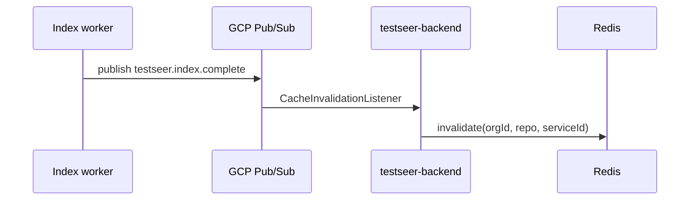
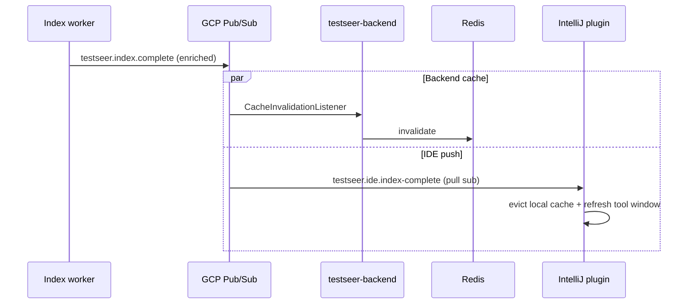

# Feature: IDE Cache Push Notification (BL-024)

> **Status:** Shipped (BL-024)  
> **Backlog:** [BL-024](../../../docs/BACKLOG.md) · **Req:** QRY-05 extension, IDE-04 (proposed)  
> **Depends on:** [06-admin-indexing.md](06-admin-indexing.md) (index complete events), [P15 IntelliJ plan](../archive/plans/2026-06-05-p15-intellij-impact-consumer.md)  
> **Related:** `CacheInvalidationListener`, `CacheService`, `intellij-plugin/`

## Problem

When TestSeer finishes indexing a service, **Redis** query cache is invalidated via optional GCP Pub/Sub (`testseer.index.complete` → `CacheInvalidationListener`). The **IntelliJ plugin** has no subscription path:

- Developers see stale impact/gap data until they manually refresh or poll `/v1/status/{serviceId}`.
- MCP agents in Cursor are stateless per request — less affected.
- Local PSI test-plan generation in the plugin does not know the backend index moved forward.

Today: backend-only invalidation. Plugin is **local PSI only** ([P15](../archive/plans/2026-06-05-p15-intellij-impact-consumer.md) not implemented).

## Goals

| ID | Goal |
|----|------|
| IDE-G01 | Notify IDE clients within seconds of `analysis_runs.status = COMPLETE` |
| IDE-G02 | Carry enough metadata to invalidate the right local cache slice (`orgId`, `repo`, `serviceId`, `commitSha`) |
| IDE-G03 | Work in Quotient GCP (Pub/Sub) and local dev (HTTP long-poll fallback) |
| IDE-G04 | Do not require IDE to hold GCP service account credentials in v1 |

## Non-goals

- Push full fact payloads over Pub/Sub (notification only; REST fetch on demand)
- Replacing Redis invalidation on the backend
- Real-time collaborative editing or file-watch sync
- MCP stdio transport changes (MCP stays pull-based)

## Current architecture (shipped)



**Existing payload** (from `CacheInvalidationListener`):

```json
{ "orgId": "quotient", "repo": "riq-partner-adapter-suite", "serviceId": "partner-adapter-suite" }
```

**Gap:** No fan-out to IDE; no `commitSha` in message today.

## Proposed architecture



### Option A (recommended): Dedicated IDE subscription on same topic

Reuse topic `testseer.index.complete` with a **second subscription** `testseer-ide-index-complete-sub` filtered by attribute `audience=ide` OR consume the same JSON with a lightweight IDE-side filter.

| Pros | Cons |
|------|------|
| One publish path from worker | IDE needs GCP creds or backend relay |
| Same contract as Redis invalidation | Desktop GCP auth is awkward |

### Option B (recommended for v1): Backend SSE / long-poll relay

Plugin opens `GET /v1/notifications/index-complete?serviceId=` (SSE) or long-poll. Backend bridges internal Pub/Sub → HTTP push. **No GCP creds in IDE.**

| Pros | Cons |
|------|------|
| Works local + prod with one code path | Extra connection per IDE instance |
| Reuses existing REST auth story | SSE through corporate proxies |

**Recommendation:** Ship **Option B v1**, add **Option A** for CI/agents with workload identity later.

## Event contract (enriched)

Extend publish payload from index worker (`AnalysisRunTracker.markComplete` or Kafka bridge):

```json
{
  "eventType": "INDEX_COMPLETE",
  "orgId": "quotient",
  "repo": "riq-partner-adapter-suite",
  "serviceId": "partner-adapter-suite",
  "commitSha": "abc123def",
  "indexedAt": "2026-06-12T18:00:00Z",
  "jobId": "uuid",
  "scope": "SERVICE"
}
```

| Field | Required | Use |
|-------|----------|-----|
| `eventType` | yes | `INDEX_COMPLETE` \| `INDEX_FAILED` \| `INDEX_CLEARED` |
| `serviceId` | yes | Registry key |
| `commitSha` | yes | IDE compares with local git HEAD |
| `scope` | no | `SERVICE` \| `ORG` (clear) |

Backward compatible: `CacheInvalidationListener` ignores unknown fields.

## REST surfaces (new)

| Method | Path | Purpose |
|--------|------|---------|
| `GET` | `/v1/notifications/index-events` | SSE stream filtered by `serviceId` (and optional `orgId`) |
| `GET` | `/v1/notifications/index-events/poll` | Long-poll fallback (`timeout=30s`, `after=timestamp`) |

Response envelope for poll:

```json
{
  "schemaVersion": "1.0",
  "data": [
    { "eventType": "INDEX_COMPLETE", "serviceId": "...", "commitSha": "...", "indexedAt": "..." }
  ]
}
```

**Freshness:** Always `CURRENT` for notification channel; not tied to index freshness of facts.

## IntelliJ plugin changes

| Component | Responsibility |
|-----------|----------------|
| `TestSeerConfigLoader` | Read `.testseer/config.yml` (`serviceId`, `apiBaseUrl`, `orgId`) |
| `IndexNotificationClient` | SSE or poll loop; reconnect with backoff |
| `LocalImpactCache` | In-memory map `(serviceId, commitSha) → ImpactReport`; evict on event |
| `ImpactToolWindowFactory` | Auto-refresh when `commitSha` on event ≠ cached |

**UX:**

1. Status bar: “TestSeer index updated (abc123)” — click to refresh impact panel.
2. If local git `HEAD` ≠ event `commitSha`, show hint: “Index is for different commit; push or re-index.”

## Configuration

| Key | Default | Description |
|-----|---------|-------------|
| `testseer.notifications.sse-enabled` | `true` | Enable SSE endpoint |
| `testseer.pubsub.enabled` | `false` | Existing; worker publish |
| `testseer.notifications.enrich-commit-sha` | `true` | Include `commitSha` in Pub/Sub payload |

Plugin `.testseer/config.yml`:

```yaml
serviceId: partner-adapter-suite
orgId: quotient
apiBaseUrl: http://localhost:8080
notifications:
  mode: sse   # sse | poll | off
```

## Security

- SSE scoped by `serviceId` — no cross-tenant leakage if `orgId` enforced server-side from registry lookup.
- Rate-limit connections per client IP (local dev).
- No secrets in push payload.

## Observability

| Metric | Alert |
|--------|-------|
| `testseer_notifications_sse_connections` | gauge |
| `testseer_notifications_events_sent_total` | counter by `eventType` |
| IDE plugin log: reconnect count | support triage |

See [TestSeer_Observability_Design.md](../TestSeer_Observability_Design.md) § cache invalidation.

## Phasing

| Phase | Delivers |
|-------|----------|
| **v1** | Enriched Pub/Sub payload + SSE relay + plugin poll client + local cache evict |
| **v2** | `INDEX_CLEARED` events; multi-service workspace in IDE |
| **v3** | Optional direct Pub/Sub pull in plugin via user OAuth / SA key (enterprise) |

## Acceptance criteria

- [ ] After `POST /admin/index/{serviceId}` completes, IDE connected via SSE receives event within 10s (p99).
- [ ] Plugin impact panel refreshes without manual action when `commitSha` matches local HEAD.
- [ ] Backend Redis invalidation unchanged when `PUBSUB_ENABLED=false` (local dev uses SSE only from `markComplete` in-process fan-out).
- [ ] MCP / REST clients unaffected.

## Open questions

1. **In-process fan-out for local dev:** When Pub/Sub disabled, should `AnalysisRunTracker.markComplete` publish to an in-memory `ApplicationEventPublisher` for SSE? (Recommended: yes.)
2. **Org-wide clear:** Does `POST /admin/index/clear` emit one event per service or `scope=ORG`?
3. **P15 dependency:** BL-024 can ship notification layer before full impact panel; notification is still useful for “re-fetch status” badge.

## References

- `CacheInvalidationListener.java` — existing Redis path
- [P15 IntelliJ impact consumer](../archive/plans/2026-06-05-p15-intellij-impact-consumer.md)
- [REQUIREMENTS.md §7.6](../../../docs/REQUIREMENTS.md) QRY-05
