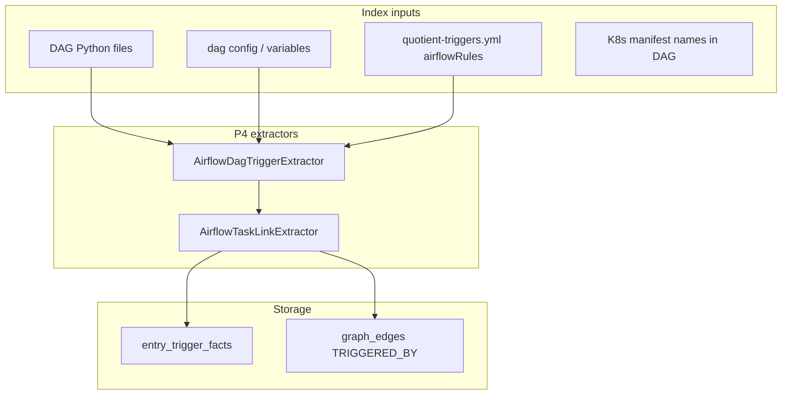

# Feature: Entry Triggers P4 — Airflow DAG (BL-025)

> **Status:** Shipped (BL-025)  
> **Backlog:** [BL-025](../../../docs/BACKLOG.md) · **Req:** [TRG-08](../../../docs/REQUIREMENTS.md)  
> **Extends:** [11-entry-triggers.md](11-entry-triggers.md) (P1–P3 shipped)  
> **Packages:** `io.testseer.backend.ingestion.triggers`

## Problem

Quotient batch and data pipelines are often orchestrated by **Airflow DAGs** (offer ingestion sweeps, parquet loads, reconciliation jobs). Entry triggers P1–P3 cover REST, webhooks, GCS drops, cron, and Pub/Sub — but not **“DAG run started task X.”**

QA questions still unanswered:

- Where does the **parquet → offer** path **begin** if the first code touched is a DAG task, not a REST call?
- Which **downstream service** does a DAG task invoke (K8s pod, Dataflow, HTTP)?
- Reverse impact: if `OfferIngestionHelper` changes, which **DAG tasks** should regression tests cover?

## Goals

| ID | Goal |
|----|------|
| TRG-A01 | Emit `entry_trigger_facts` with `trigger_kind = AIRFLOW_DAG` |
| TRG-A02 | Link DAG `dag_id` + `task_id` to indexed Java entrypoint or K8s workload where possible |
| TRG-A03 | Expose via existing `GET /v1/facts/entry-triggers` and `GET /v1/graph/entry-flow` |
| TRG-A04 | Seed Quotient DAG inventory via rule pack before full DAG repo indexing |

## Non-goals

- Proving a DAG run actually executed (runtime Airflow metadata DB)
- Replacing Airflow UI or Marquez lineage
- Indexing every Astronomer/Airflow internal operator — focus on **platform DAG repos** and known task→code links

## Trigger taxonomy (addition)

| Kind | Inbound because | Primary evidence |
|------|-----------------|------------------|
| `AIRFLOW_DAG` | Scheduled/triggered DAG run starts batch step | DAG Python/YAML + rule pack |

Already defined in [11-entry-triggers.md](11-entry-triggers.md); P4 implements extraction.

## Quotient examples (candidate)

| DAG / task | Linked workload | Entry semantics |
|------------|-----------------|-----------------|
| `offer_parquet_ingestion` → `trigger_dataflow` | `riq-parquet-file-ingestion-job` | DAG triggers batch job |
| `partner_adapter_retry` → `invoke_k8s_job` | `partner-adapter-retry-job` CronJob | DAG complements `CRON_K8S` |
| `daily_offer_sync` → `call_ois_api` | CPA OIS REST | Links to existing `REST_INBOUND` on target service |

*Exact DAG ids to be confirmed from ops repo or Confluence; rule pack seeds first.*

## Architecture



## Index-time design

### `AirflowDagTriggerExtractor`

**Inputs:**

- Python files under configured roots (e.g. `dags/`, `airflow/dags/`)
- Optional: `workspace.yml` catalog library entry `airflow-ops` repo

**Heuristics (regex + AST-lite):**

| Pattern | Extracted |
|---------|-----------|
| `DAG('offer_parquet_ingestion'` | `dag_id` |
| `dag_id='daily_offer_sync'` | `dag_id` |
| `@task` / `PythonOperator(task_id='...'` | `task_id` |
| `BashOperator(..., bash_command='... java -jar` | workload hint |
| `KubernetesPodOperator` / `GKEStartPodOperator` | `workload_name` from manifest ref |

**Output row:**

```text
trigger_id   = airflow:{dag_id}:{task_id}
trigger_kind = AIRFLOW_DAG
direction    = INBOUND
actor        = airflow
boundary     = INTERNAL
path_pattern = /dag/{dag_id}/task/{task_id}
linked_handler_fqn = null | Java main if resolvable
flow_step    = from rule pack
evidence     = AIRFLOW_DAG_PARSE | RULE_PACK
confidence   = 0.75–0.92
```

### Rule pack extension (`quotient-triggers.yml`)

```yaml
airflowRules:
  - match: "offer_parquet_ingestion.trigger_dataflow"
    dagId: offer_parquet_ingestion
    taskId: trigger_dataflow
    flowStep: PARQUET_INGEST
    linkedServiceModule: riq-parquet-file-ingestion-job
    actor: airflow
```

Rule pack overrides win over parse when `match` hits.

### `EntryTriggerOrchestrator` wiring

Extend existing orchestrator (P2/P3 shipped):

```java
merged.addAll(airflowDagTriggerExtractor.extract(
    models, contentByPath, configFiles, rulePackLoader.getRulePack(), defaultEnvLane));
```

**Index boundary:** Only run when `workspace.yml` includes an `airflow` catalog library OR repo contains `dags/` root.

### Graph projection

`EntryTriggerGraphProjector` (existing):

- `TRIGGERED_BY` edge: `AIRFLOW_DAG:{dag_id}` → `SERVICE:{linked module}` when rule pack provides `linkedServiceModule`
- Optional: `EXPOSES` edge to Java `main` class if extractor resolves entrypoint

## Data model

**No new Flyway migration** — reuse `entry_trigger_facts` (V11).

Optional `attributes` JSON:

```json
{
  "dagId": "offer_parquet_ingestion",
  "taskId": "trigger_dataflow",
  "schedule": "0 2 * * *",
  "linkedServiceModule": "riq-parquet-file-ingestion-job",
  "operatorType": "DataflowStartFlexTemplateOperator"
}
```

## Query-time design

No new REST routes — extend existing:

| API | Change |
|-----|--------|
| `GET /v1/facts/entry-triggers?triggerKind=AIRFLOW_DAG` | Filter support (may already work via DB column) |
| `GET /v1/graph/entry-flow` | Include DAG hops before REST/Pub/Sub steps |
| MCP `testseer_get_entry_triggers` | Document `AIRFLOW_DAG` in tool description |

**Entry-flow trace algorithm (addition):**

1. Start from `AIRFLOW_DAG` trigger if `flowStep` or `dagId` query param provided.
2. Follow `TRIGGERED_BY` to service module.
3. Merge with Option C event-flow from that service's Pub/Sub entry.

## Workspace configuration

```yaml
catalogLibraries:
  - id: airflow-quotient-ops
    repo: quotient-airflow-dags   # hypothetical
    serviceName: airflow-ops
    moduleType: library
    sourceRoots: ["dags"]
    indexDdl: false

bundles:
  quotient-full:
    indexOrder:
      - catalogLibrary: platform-data
      - catalogLibrary: airflow-quotient-ops   # optional P4
      - serviceModule: partner-adapter-suite
```

## Phasing

| Phase | Delivers |
|-------|----------|
| **P4a** | Rule-pack-only `AIRFLOW_DAG` rows (no DAG repo indexing) |
| **P4b** | `AirflowDagTriggerExtractor` on DAG Python repo |
| **P4c** | Entry-flow graph links DAG → service → topic trace |

## Acceptance criteria

- [ ] At least **3** Quotient DAG tasks seeded in `quotient-triggers.yml` with `flowStep` labels.
- [ ] `GET /v1/facts/entry-triggers?serviceId=X` returns `AIRFLOW_DAG` rows linked via rule pack to service module.
- [ ] `entry-flow` trace from `flowStep=PARQUET_INGEST` shows DAG trigger as step 0 when configured.
- [ ] No duplicate `PUBSUB_SUBSCRIBE` / `AIRFLOW_DAG` conflict for same logical start (document precedence: DAG orchestrates, Pub/Sub is service-internal).

## Risks

| Risk | Mitigation |
|------|------------|
| DAG repo not in `githubDir` | Rule pack seeds; optional manual registry of DAG paths |
| Dynamic `task_id` generation | Low confidence; rule pack override |
| Multiple Airflow instances (PDN vs prod) | `env_lane` on trigger row from rule pack |

## Open questions

1. Which repo holds Quotient Airflow DAGs today? (Needed for `workspace.yml` entry.)
2. Is Airflow metadata DB access ever allowed for **read-only** `dag_run` confirmation? (Out of scope v1; note for v2.)
3. Relationship to `CRON_K8S`: same CronJob triggered by DAG **and** K8s schedule — emit both with `attributes.primary=true` on one?

## References

- [11-entry-triggers.md](11-entry-triggers.md) — P1–P3 shipped (`SpringCronTriggerExtractor`, `PubSubSubscribeTriggerExtractor`, etc.)
- `EntryTriggerOrchestrator.java`
- [REQUIREMENTS.md TRG-08](../../../docs/REQUIREMENTS.md)
