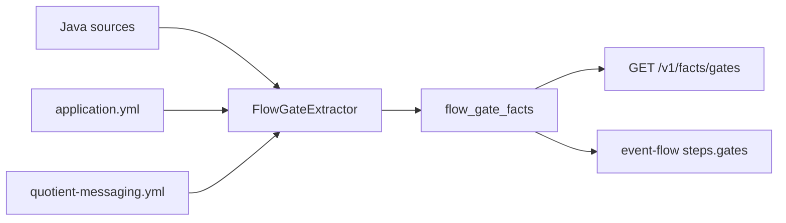
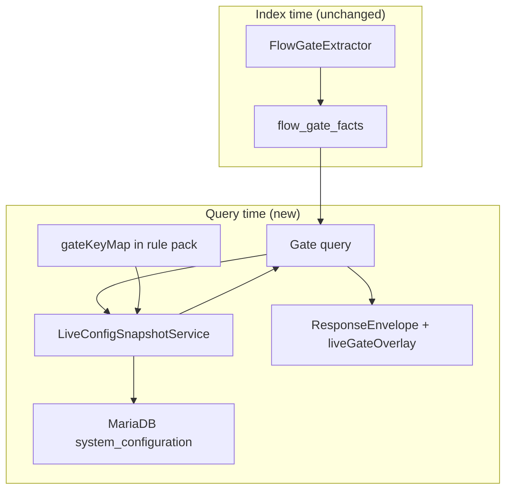

# Feature: Live Flow Gates — `system_configuration` Snapshot (BL-027)

> **Status:** Shipped (BL-027)  
> **Backlog:** [BL-027](../../../docs/BACKLOG.md) · **Req:** [MSG-11](../../../docs/REQUIREMENTS.md)  
> **Extends:** [07-option-c-messaging-flow.md](07-option-c-messaging-flow.md) (C-P6 static gates shipped)  
> **Packages:** `io.testseer.backend.query`, `io.testseer.backend.ingestion.messaging`

## Problem

**Flow gates** (`flow_gate_facts`) are extracted **at index time** from:

- Java: `@ConditionalOnProperty` (from source text — BL-052), `@Value`, `findByConfigKey("...")`, `isConfigEnabled` / `config(..., SystemConfigKeys.X)` (BL-052), AST stream filters (`IsDiscounted`, `IsPublished`, …)
- YAML: flattened flags via `YamlConfigUtils` including ConfigMap unwrap (BL-052)
- Rule pack: `codeGateRules`, `declaredGates`, `gateKeyAliases` in `quotient-messaging.yml`

This answers: **“What conditions does the code check?”**  
It does **not** answer: **“What is the live value in PDN right now?”**

QA and agents need both:

| Question | Static gates (shipped) | Live snapshot (BL-027) |
|----------|------------------------|-------------------------|
| Is there a gate on `galo.preLive`? | yes | — |
| Is `galo.preLive` **true** in PDN today? | no | **yes** |
| Should I skip Hy-Vee adapter tests? | precondition text | **actionable pass/fail** |

Quotient platform stores many flags in MariaDB **`system_configuration`** (and partner-specific config tables). Services read via config DAOs at runtime.

## Goals

| ID | Goal |
|----|------|
| MSG-L01 | At query time, attach **live config values** to gate rows where `gate_key` maps to `system_configuration.config_key` |
| MSG-L02 | Surface `liveStatus`: `PASS` \| `FAIL` \| `UNKNOWN` vs `required_value` from static gate |
| MSG-L03 | Never block index pipeline on DB connectivity — overlay is **optional** and degrades gracefully |
| MSG-L04 | Expose on `GET /v1/facts/gates`, event-flow `gates[]`, MCP `testseer_get_flow_gates` |

## Non-goals

- Writing to `system_configuration`
- Polling config on every index job (query-time only)
- Full partner config matrix (start with `system_configuration` + rule pack key map)
- Replacing TestNG env setup or `@Test(enabled=...)`

## Current architecture (shipped)



**`FlowGateView` today** (`MessagingFlowService`):

| Field | Meaning |
|-------|---------|
| `gateKey` | Property or config key |
| `requiredValue` | Expected value from code/rule pack |
| `effectWhenFail` | e.g. `SKIP_STEP` |
| `testPrecondition` | Human-readable hint |

**Missing:** `liveValue`, `liveStatus`, `snapshotAt`, `evidenceSource` for live read.

## Proposed architecture



### `LiveConfigSnapshotService`

**Responsibilities:**

1. Resolve `gate_key` → `config_key` (direct match or rule pack `gateKeyAliases`)
2. Batch-fetch config rows: `SELECT config_key, config_value, updated_at FROM system_configuration WHERE config_key IN (...)`
3. Compare `config_value` to `required_value` using gate `operator` (`eq`, `true`, `regex`)
4. Return overlay map keyed by `(serviceId, gateKey)`

**Connection:** Read-only JDBC datasource — **separate** from TestSeer Postgres (`testseer.live-config.*` properties). Not the indexed app's datasource; a **QA/PDN read replica** credential.

```yaml
testseer:
  live-config:
    enabled: ${LIVE_CONFIG_ENABLED:false}
    jdbc-url: ${LIVE_CONFIG_JDBC_URL:}
    username: ${LIVE_CONFIG_USERNAME:}
    password: ${LIVE_CONFIG_PASSWORD:}
    env-lane-default: pdn
    cache-ttl-seconds: 300
```

### Query overlay model

Extend `FlowGateView` (or parallel `LiveGateOverlay` on envelope):

```json
{
  "guardedSymbolFqn": "com.example.OfferPublishHandler",
  "gateKey": "galo.preLive",
  "requiredValue": "true",
  "liveValue": "false",
  "liveStatus": "FAIL",
  "liveSnapshotAt": "2026-06-12T20:00:00Z",
  "liveEvidence": "SYSTEM_CONFIGURATION",
  "testPrecondition": "Set galo.preLive=true in PDN or skip publish path"
}
```

| `liveStatus` | Rule |
|--------------|------|
| `PASS` | live value satisfies `required_value` + `operator` |
| `FAIL` | live value present but does not satisfy |
| `UNKNOWN` | DB disabled, key missing, or no mapping |

**Envelope-level:**

```json
{
  "freshnessStatus": "CURRENT",
  "data": [ "...gates..." ],
  "liveConfigStatus": "OK",
  "liveConfigEnv": "pdn"
}
```

When `LIVE_CONFIG_ENABLED=false`: `liveConfigStatus=DISABLED`, all `liveStatus=UNKNOWN`.

### Rule pack extension (`quotient-messaging.yml`)

```yaml
gateKeyAliases:
  galo.preLive:
    configTable: system_configuration
    configKey: galo.preLive
    envScoped: true
  offer.eval.retry.enabled:
    configKey: OFFER_EVAL_RETRY_ENABLED

liveGateDefaults:
  pdn:
    failClosed: false   # UNKNOWN does not flip test recommendation
```

### Integration points

| Surface | Change |
|---------|--------|
| `MessagingQueryController.getGates` | Call `LiveConfigSnapshotService.overlay(serviceId, env, gates)` |
| `MessagingFlowService.traceTopicFlow` | Overlay gates on each `EventFlowStep` |
| `ValidationHintBuilder` | Optional: emit hint when `liveStatus=FAIL` |
| MCP `testseer_get_flow_gates` | Show live column in formatted output |

### Caching

- **In-memory Caffeine** per `(envLane, configKey)` with TTL 300s (config changes are infrequent).
- Separate from Redis query cache — live config is **not** indexed facts.
- Metric: `testseer_live_config_fetch_duration`, `testseer_live_config_unknown_total`.

## Security & compliance

| Concern | Mitigation |
|---------|------------|
| PDN prod write access | Read-only DB user; no DDL/DML |
| Credential storage | K8s secret / env; never in repo |
| PII in config values | Return `liveValue` only for non-secret keys; rule pack `redact: true` masks value |
| Network | VPN / Cloud SQL Auth proxy required in prod |

## Phasing

| Phase | Delivers |
|-------|----------|
| **v1** | `LiveConfigSnapshotService` + overlay on `GET /v1/facts/gates` only |
| **v2** | Event-flow + MCP; rule pack `gateKeyAliases` for Quotient top 20 keys |
| **v3** | Partner-specific config tables; `liveStatus` drives `validation_hint_facts` |

## Acceptance criteria

- [ ] With `LIVE_CONFIG_ENABLED=true` and PDN JDBC, `GET /v1/facts/gates?serviceId=&env=pdn` returns `liveValue` for at least one known key (e.g. `galo.preLive`).
- [ ] With live config disabled, response identical to today plus `liveStatus=UNKNOWN` (no errors).
- [ ] Index pipeline does **not** call MariaDB.
- [ ] Documented key map in `quotient-messaging.yml` for Hy-Vee / Freedom flow steps from [Hyvee E2E test plan](../../../../Downloads/DesignDocuments/Test%20Plans/Hyvee_PDN_Offer_Lifecycle_E2E_Test_Plan.md).

## Example (Quotient)

Static gate from code (`FlowGateExtractor`):

```java
systemConfigurationDao.findByConfigKey("galo.preLive")
```

Rule pack (`codeGateRules`):

```yaml
- pattern: "galo.preLive"
  gateKey: galo.preLive
  requiredValue: "true"
  effectWhenFail: SKIP_PUBLISH
  testPrecondition: "Enable GALO preLive in PDN system_configuration"
```

Live overlay (query time):

```json
{
  "gateKey": "galo.preLive",
  "requiredValue": "true",
  "liveValue": "true",
  "liveStatus": "PASS"
}
```

## Risks

| Risk | Mitigation |
|------|------------|
| Config key drift vs code | Rule pack aliases; gap report `GATE_KEY_UNMAPPED` |
| Multi-env confusion | Require `env` query param; default from `testseer.live-config.env-lane-default` |
| Stale cache after manual DB edit | TTL 5m; `?refreshLive=true` admin param |

## Open questions

1. Exact `system_configuration` schema (column names, env scoping) — confirm against `riq-platform-db` or live PDN.
2. Which env lanes share one DB vs separate schemas?
3. Should `UNKNOWN` recommend running tests (optimistic) or skipping (pessimistic)? Rule pack `failClosed` per env.

## References

- `FlowGateExtractor.java` — `SYSTEM_CONFIG` (`findByConfigKey`, `SystemConfigKeys` — BL-052), `@ConditionalOnProperty` from source, `@Value`, rule pack gates
- [26-flow-gate-manual-s9.md](26-flow-gate-manual-s9.md) — BL-052 pillar summary
- `MessagingFlowService.FlowGateView`
- [07-option-c-messaging-flow.md](07-option-c-messaging-flow.md) C-P6
- [REQUIREMENTS.md MSG-11](../../../docs/REQUIREMENTS.md)
