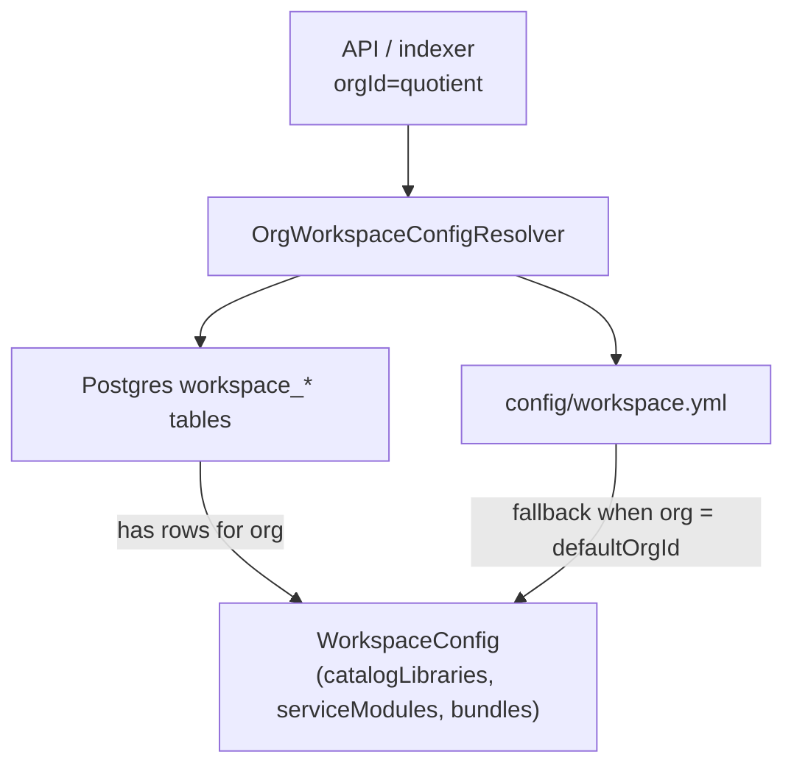

# Feature: Org-Scoped Workspace Catalog Config (CFG-CAT API)

> **Status:** Shipped  
> **Last updated:** 2026-06-15  
> **Requirements:** CFG-CAT-06–10 · extends [TestSeer_Multi_Module_Catalog_Requirements.md](../TestSeer_Multi_Module_Catalog_Requirements.md)  
> **Related:** [10-data-object-catalog.md](10-data-object-catalog.md) · [config/README.md](../../../config/README.md)  
> **Packages:** `io.testseer.backend.config.workspace`

## Problem

Multi-module catalog behavior (pinned library joins, symbol classpath, bundle index order) was configured only in **`config/workspace.yml`**, loaded once at startup. There was no way to:

- Add catalog libraries or service modules per org via API
- Override YAML bootstrap for a second tenant on the same deployment
- Register a library in `service_registry` from its catalog config in one step

## Goals

| ID | Goal |
|----|------|
| G-WS-01 | Store catalog config **per `orgId`** in Postgres (V13). |
| G-WS-02 | Expose CRUD REST API for catalog libraries and service modules. |
| G-WS-03 | Resolve config at runtime: **DB overrides YAML** for orgs with DB rows; YAML bootstrap for `defaultOrgId`. |
| G-WS-04 | Wire org-scoped resolution into indexing, classpath, and gap detection. |
| G-WS-05 | Import existing `workspace.yml` into DB for migration. |

## Configuration resolution



| Source | When used |
|--------|-----------|
| **Database** | Org has any row in `workspace_catalog_library`, `workspace_service_module`, `workspace_bundle`, or `workspace_org_settings` |
| **YAML** | Org matches `defaultOrgId` in `workspace.yml` and no DB rows for that section |
| **Empty** | Other orgs with no DB config |

Response field `source` on `GET /v1/workspace?orgId=` reports `database`, `yaml`, or `empty`.

## Data model (Flyway V13)

| Table | Purpose |
|-------|---------|
| `workspace_org_settings` | Per-org `github_dir`, `default_bundle` |
| `workspace_catalog_library` | Catalog lib: `library_id`, `repo`, `service_name`, `source_roots`, `index_ddl` |
| `workspace_service_module` | Service module: `module_id`, `repo`, `source_roots` |
| `workspace_symbol_classpath` | Pins `catalog_library_id` → service module |
| `workspace_bundle` | Bundle metadata + trace config |
| `workspace_bundle_index_order` | Ordered index targets (catalog lib / service module / repo) |

Primary key includes `org_id` on all tables.

## REST API

All endpoints require **`?orgId=`** query parameter.

| Method | Path | Purpose |
|--------|------|---------|
| GET | `/v1/workspace` | Resolved config + `source` |
| POST | `/v1/workspace/import-from-yaml` | Copy `workspace.yml` into DB (default org only) |
| GET | `/v1/workspace/catalog-libraries` | List catalog libs |
| POST | `/v1/workspace/catalog-libraries` | Create catalog lib |
| GET/PATCH/DELETE | `/v1/workspace/catalog-libraries/{libraryId}` | Read / update / delete |
| POST | `/v1/workspace/catalog-libraries/{libraryId}/register` | Create `moduleType=library` registry row |
| GET/POST | `/v1/workspace/service-modules` | List / create service modules |
| GET/PATCH/DELETE | `/v1/workspace/service-modules/{moduleId}` | Read / update / delete |

**Note:** PATCH/DELETE only affect **DB rows**. YAML-only entries are read-only until imported or recreated via POST.

OpenAPI tag: **Admin — Workspace Catalog**. Static spec: [openapi.yaml](../openapi.yaml).

## Example workflow

### Bootstrap from existing YAML

```bash
curl -X POST 'http://localhost:8080/v1/workspace/import-from-yaml?orgId=quotient'
```

### Add a catalog library via API

```bash
curl -X POST 'http://localhost:8080/v1/workspace/catalog-libraries?orgId=quotient' \
  -H 'Content-Type: application/json' \
  -d '{
    "id": "platform-data",
    "repo": "optimus-platform-framework",
    "serviceName": "platform-data",
    "sourceRoots": ["platform-data/src/main/java"],
    "indexDdl": false
  }'
```

### Register and index

```bash
# Register in service_registry (moduleType=library)
curl -X POST 'http://localhost:8080/v1/workspace/catalog-libraries/platform-data/register?orgId=quotient'

# Local index with workspace profile
curl -X POST 'http://localhost:8080/admin/index/local' \
  -H 'Content-Type: application/json' \
  -d '{
    "orgId": "quotient",
    "path": "/path/to/optimus-platform-framework",
    "catalogLibraryId": "platform-data"
  }'
```

### Add a service module with pinned catalog libs

```bash
curl -X POST 'http://localhost:8080/v1/workspace/service-modules?orgId=quotient' \
  -H 'Content-Type: application/json' \
  -d '{
    "id": "partner-adapter-suite",
    "repo": "riq-partner-adapter-suite",
    "sourceRoots": [
      "partner-adapter-lib/src/main/java",
      "partner-adapter-consumer/src/main/java"
    ],
    "catalogLibraryIds": ["platform-data", "platform-bigquery"]
  }'
```

## Runtime integration

| Component | Change |
|-----------|--------|
| `WorkspaceCatalogService` | All lookups take `orgId`; delegates to `OrgWorkspaceConfigResolver` |
| `HandlerAccessLinker` | `pinnedCatalogLibraryIdsForService(orgId, moduleId)` |
| `LibraryClasspathBuilder` | `findCatalogLibrary(orgId, libId)`, `resolveGithubRoot(orgId)` |
| `DataObjectGapService` | `config(orgId).catalogLibraries()` for `LIBRARY_NOT_INDEXED` |
| `LocalIndexTriggerService` | `resolveIndexProfile(orgId, repo, catalogLibraryId, serviceModuleId)` |
| `MessagingFlowService` | `workspaceCatalog.config(orgId)` for bundle missing-repo checks |

## Operational notes

1. **First API write switches org to DB mode** for that config section — YAML entries for that section are no longer merged once DB has rows.
2. **Import syncs YAML into DB** — upserts catalog libs and service modules from `workspace.yml`; always upserts bundles.
3. **`import-from-yaml`** only allowed for org matching `defaultOrgId` in YAML (typically `quotient`).
4. **Index order** — `bundles.quotient-full.indexOrder` in YAML lists catalog libraries before service modules, then legacy repos. Run `./scripts/index-all-repos.sh quotient` to index the full workspace with correct `catalogLibraryId` / `serviceModuleId` per step.

## Known gaps

| Gap | Notes |
|-----|-------|
| No MCP tools yet | REST only; **BL-047** (P3 icebox) — MCP wrapper for `/v1/workspace/*` |
| Bundle CRUD via REST | Bundles importable via YAML import; dedicated bundle POST not exposed yet |
| Webhook index prefetch | SYM-CAT-05 still deferred |

## Related documents

- [TestSeer_Multi_Module_Catalog_Requirements.md](../TestSeer_Multi_Module_Catalog_Requirements.md) — CFG-CAT-01–05 (YAML), CFG-CAT-06–10 (API)
- [10-data-object-catalog.md](10-data-object-catalog.md) — catalog fact extraction
- [config/README.md](../../../config/README.md) — YAML bootstrap and env overrides
