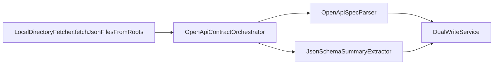

# Feature: Platform API Contract Ingestion (OpenAPI)

> **Status:** Phase 4 complete (BL-046)  
> **Source repo:** `riq-platform-apis-optimus`  
> **Requirements:** API-01–06 (proposed)  
> **Related:** [11-entry-triggers.md](11-entry-triggers.md) · [16-workspace-catalog-config.md](16-workspace-catalog-config.md)

## Problem

TestSeer indexes **Java implementation** endpoints (`symbol_facts`, `entry_trigger_facts`) but not the **partner contract of record** in `riq-platform-apis-optimus` (18 OpenAPI 3.1 specs, ~280 JSON Schema models, Stoplight-synced).

QA cannot answer:

- What partner APIs are documented vs implemented?
- What request/response fields does the Stoplight contract define?
- Which implementing service owns a spec domain (Offers, Rebate, Receipt)?

## Goals

| Phase | Delivers |
|-------|----------|
| **P1 (BL-046)** | Index OpenAPI operations + schema summaries; `GET /v1/facts/contract-operations` |
| **P2 (BL-046)** | `GET /v1/gaps/contract` reconciliation vs Java endpoints; MCP tools |
| **P3 (BL-046)** | GitHub PR webhook for apis repo; contract ↔ entry-trigger links + entry-flow trace |
| **P4 (BL-046)** | Nested schema walk; REST-Assured test HTTP call index; test coverage gaps |

## Configuration

### `workspace.yml` catalog library

```yaml
catalogLibraries:
  - id: optimus-platform-apis
    repo: riq-platform-apis-optimus
    serviceName: riq-platform-apis-optimus
    sourceRoots:
      - reference
      - Common/Models
      - Common/Parameters
    indexDdl: false
    indexOpenApi: true
```

Add to `bundles.quotient-full.indexOrder` **before** consumer services.

### Rule pack

`config/rule-packs/quotient-api-contracts.yml` — maps spec domain → implementing `serviceName` (registry name).

Loaded via `testseer.contracts.rule-pack-path`.

## Data model (V16)

| Table | Purpose |
|-------|---------|
| `contract_operation_facts` | One row per OpenAPI operation (method + path) |
| `contract_schema_facts` | JSON Schema summaries from `Common/Models/` |

Indexed under library `service_id` for `optimus-platform-apis`. `mapped_service_name` populated from rule pack at index time.

## Ingestion pipeline



Triggered when `indexOpenApi: true` on catalog library profile (`IndexingOrchestrator` library branch).

## REST API (P1)

| Method | Path | Params |
|--------|------|--------|
| `GET` | `/v1/facts/contract-operations` | `serviceId` and/or `specDomain` |

Returns `ContractOperationView` with path, method, summary, schema field summaries, `mappedServiceName`.

Freshness: standard `ResponseEnvelope` (`NOT_INDEXED` until apis catalog indexed).

## REST API (P2)

| Method | Path | Params |
|--------|------|--------|
| `GET` | `/v1/gaps/contract` | `serviceId`, optional `specDomain` |

Compares OpenAPI `path_normalized` + HTTP method to inbound `entry_trigger_facts` (`REST_INBOUND`, `WEBHOOK_INBOUND`).

| `gapType` | Meaning |
|-----------|---------|
| `CONTRACT_ONLY` | Documented in Stoplight/OpenAPI, no matching Java handler |
| `IMPLEMENTATION_ONLY` | Indexed inbound REST handler, not in contract for mapped service |

MCP: `testseer_get_contract_operations`, `testseer_get_contract_gaps`.

## REST API (P3)

| Method | Path | Params |
|--------|------|--------|
| `GET` | `/v1/facts/contract-operations/linked` | `serviceId`, optional `specDomain` |
| `GET` | `/v1/graph/contract-entry-flow` | `serviceId`, `operationId` or `httpMethod`+`path`, optional `env` |

**Webhook:** `POST /webhook/github` on `riq-platform-apis-optimus` PR/push events auto-registers the catalog library, fetches PR changed files via GitHub API when needed, and indexes OpenAPI JSON deltas.

**Link statuses:** `MATCHED`, `NO_HANDLER`, `IMPLEMENTATION_NOT_INDEXED`, `SERVICE_NOT_REGISTERED`, `NO_MAPPED_SERVICE`.

MCP: `testseer_trace_contract_entry_flow`.

## REST API (P4)

| Method | Path | Params |
|--------|------|--------|
| `GET` | `/v1/facts/contract-schemas` | `serviceId`, optional `schemaId` |
| `GET` | `/v1/gaps/contract-test-coverage` | `serviceId`, optional `testServiceId`, `specDomain` |

**Nested schemas:** `JsonSchemaNestedWalker` resolves `$ref` and stores dot-path field inventory in `contract_schema_facts.nested_field_paths`.

**Test HTTP calls:** When indexing a repo listed under `testseer.contracts.test-suite-repos` (default: `riq-qa-REST-Assured`), `RestAssuredHttpCallExtractor` parses RestAssured / `restAPIRequest` / `APIConstant` patterns into `test_http_call_facts`.

| `gapType` | Meaning |
|-----------|---------|
| `CONTRACT_UNTESTED` | OpenAPI operation has no matching REST-Assured test call |
| `TEST_UNDOCUMENTED` | Test HTTP call has no matching OpenAPI operation |

MCP: `testseer_get_contract_schemas`, `testseer_get_contract_test_coverage_gaps`.

## Non-goals (P1)

- Runtime HTTP contract validation
- Full JSON Schema semantic diff
- OpenAPI export for TestSeer itself (separate concern)

## Testing

| Test | Coverage |
|------|----------|
| `OpenApiSpecParserTest` | Fixture spec → operations + `$ref` resolution |
| `ContractQueryControllerTest` | REST wiring + freshness |
| `ContractReconciliationServiceTest` | Path/method matching logic |
| `ContractGapControllerTest` | Gap API wiring + freshness |
| `DatabaseMigrationTest` | V16 tables |

## Rollout

1. Index apis catalog: `curl -X POST .../admin/index/local -d '{"orgId":"quotient","path":".../riq-platform-apis-optimus","catalogLibraryId":"optimus-platform-apis"}'`
2. Query: `GET /v1/facts/contract-operations?specDomain=Offers`
3. P2: index implementing service, then `GET /v1/gaps/contract?serviceId=<offer-service>&specDomain=Offers`
