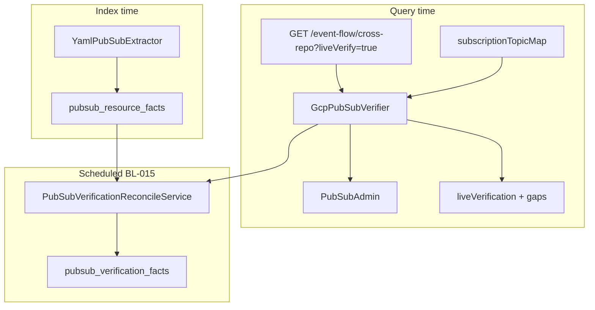

# Feature: Live GCP Pub/Sub Verification (MSG-10)

> **Status:** Shipped v1–v3 (BL-015 extended) — REST + MCP live overlay; multi-project admin  
> **Backlog:** [BL-015](../../../docs/BACKLOG.md) · **Req:** [MSG-10](../../../docs/REQUIREMENTS.md)  
> **Extends:** [07-option-c-messaging-flow.md](07-option-c-messaging-flow.md) (C-P1 static inventory shipped)  
> **Packages:** `io.testseer.backend.query`, `io.testseer.backend.verification`

## Problem

Option C indexes **Pub/Sub topology from YAML and Java** at index time. That answers:

| Question | Static index (shipped) | Live GCP (MSG-10) |
|----------|------------------------|-------------------|
| Does service X declare subscription `PDN_S.OFFER_UPDATE.PARTNER_NOTIFY`? | yes | — |
| Does that subscription **exist in GCP PDN**? | no | **yes / no** |
| Is it attached to topic `PDN_T.OFFER_UPDATE`? | heuristic (`_S.` → `_T.`) | **GCP truth** |
| Did someone repoint the sub to a stale topic? | invisible | **drift gap** |

QA and agents planning Hy-Vee / offer-event traces need to know when **indexed topology diverges from live infrastructure**.

## Goals

| ID | Goal | v1 |
|----|------|-----|
| MSG-V01 | Verify indexed subscriptions exist in GCP (opt-in) | ✅ cross-repo trace |
| MSG-V02 | Verify subscription attached to expected topic | ✅ |
| MSG-V03 | Surface on cross-repo trace + gaps | ✅ cross-repo + pubsub inventory |
| MSG-V04 | Persist in `pubsub_verification_facts` when reconcile + live enabled | ✅ |
| MSG-V05 | Never block index/default queries on GCP | ✅ `SKIPPED` / `DISABLED` |

## Non-goals

- Proving **message delivery** or payload correctness
- Creating or mutating GCP topics/subscriptions
- Verifying IAM, DLQ policies, or retention (future)

## Architecture (shipped v1)



| Component | Shipped (v1–v3) | Remaining |
|-----------|-----------------|-----------|
| `GcpPubSubVerifier` | Sub existence + topic attach; rule-pack map; cache; `SubscriptionAdminClient` cross-project | Emulator CI |
| `MessagingFlowService` | Cross-repo + inventory + single-service event-flow live overlay | — |
| `PubSubVerificationReconcileService` | Index linkage + live `exists_in_gcp` | — |
| REST | All messaging surfaces with `?liveVerify=true` | — |
| MCP | `liveVerify` on `testseer_get_pubsub_inventory` + `testseer_trace_topic_flow`; markdown summary | — |
| Tests | Backend unit + MCP handler tests | Emulator CI |

### `GcpPubSubVerifier`

1. Resolve expected topic: `subscriptionTopicMap` → hop topic → `_S.` → `_T.` heuristic
2. `pubSubAdmin.getSubscription(name)` → existence + `getTopic()`
3. Return `VerificationResult` with `Status`: `OK`, `SUBSCRIPTION_MISSING`, `TOPIC_MISMATCH`, `SKIPPED`, `ERROR`

### Query overlay

Per-subscriber `liveVerification` on cross-repo hops:

```json
{
  "liveVerification": {
    "status": "OK",
    "expectedTopicShortId": "PDN_T.RIQ_OFFER_EVENT",
    "liveTopicShortId": "PDN_T.RIQ_OFFER_EVENT",
    "verifiedAt": "2026-06-15T18:00:00Z",
    "evidenceSource": "GCP_PUBSUB_ADMIN"
  }
}
```

Envelope: `livePubSubStatus` (`DISABLED` | `OK` | `PARTIAL`), `livePubSubVerifiedCount`, `livePubSubSkippedCount`.

### Gap types

| Gap code | When |
|----------|------|
| `GCP_SUBSCRIPTION_MISSING` | Sub not found in GCP |
| `GCP_TOPIC_MISMATCH` | Sub exists; wrong topic attach |

### Rule pack (`quotient-messaging.yml`)

```yaml
subscriptionTopicMap:
  PDN_S.OFFER_UPDATE.PARTNER_NOTIFY:
    topicShortId: PDN_T.OFFER_UPDATE
  PDN_S.RIQ_OFFER_EVENT.HYVEE_ADAPTER:
    topicShortId: PDN_T.RIQ_OFFER_EVENT
```

### Integration points

| Surface | Status |
|---------|--------|
| `GET /v1/graph/event-flow/cross-repo?liveVerify=true` | ✅ Shipped |
| `GET /v1/facts/pubsub?liveVerify=true` | ✅ Shipped (v2) |
| `GET /v1/facts/pubsub/org?liveVerify=true` | ✅ Shipped (v2) |
| `GET /v1/graph/event-flow?liveVerify=true` | ✅ Shipped (v3) |
| `PubSubVerificationReconcileService` | ✅ when `PUBSUB_LIVE_VERIFY=true` |
| MCP `testseer_get_pubsub_inventory` / `testseer_trace_topic_flow` | ✅ Shipped (v3) |

**Precedence:** `?liveVerify=true` opts in when global flag off; `PUBSUB_LIVE_VERIFY=true` verifies by default on cross-repo.

### Config

```yaml
testseer:
  pubsub:
    live-verify-enabled: ${PUBSUB_LIVE_VERIFY:false}
```

```bash
PUBSUB_LIVE_VERIFY=true GOOGLE_APPLICATION_CREDENTIALS=/path/to/sa.json ./run.sh
```

Requires read-only SA (`roles/pubsub.viewer`) and `spring.cloud.gcp.pubsub.project-id`.

## Phasing

| Phase | Delivers | Status |
|-------|----------|--------|
| v0.1 | Subscription existence on cross-repo | ✅ |
| **v1** | Topic attach; `liveVerify`; cross-repo overlay; unit tests; reconcile GCP writes | ✅ |
| **v2** | Pubsub inventory overlay (`/v1/facts/pubsub`, `/org`); service tests | ✅ |
| **v3** | Single-service event-flow; MCP `liveVerify` + formatting; multi-project `SubscriptionAdminClient` | ✅ |
| v4 | Pub/Sub emulator CI | Planned |

## Acceptance criteria

- [x] `?liveVerify=true` on cross-repo trace with `liveVerification` overlay and envelope fields
- [x] `?liveVerify=true` on `/v1/facts/pubsub` and `/v1/facts/pubsub/org` with per-row `liveVerification` and envelope fields
- [x] `GCP_SUBSCRIPTION_MISSING` and `GCP_TOPIC_MISMATCH` gaps
- [x] `livePubSubStatus=DISABLED` when verify off (no GCP calls)
- [x] Reconcile skips GCP unless `PUBSUB_LIVE_VERIFY=true`
- [x] `GcpPubSubVerifierTest` (mocked `PubSubAdmin`)
- [x] Runbook in [Option_C_Messaging_Flow.md](../Option_C_Messaging_Flow.md)
- [x] MCP tools pass `liveVerify` and surface `livePubSubStatus` + GCP gaps in markdown summary
- [ ] Live PDN manual smoke with real credentials (operator)

## Examples

**Cross-repo trace:**

```bash
curl -s 'http://localhost:8080/v1/graph/event-flow/cross-repo?orgId=quotient&shortId=PDN_T.RIQ_OFFER_EVENT&env=pdn&liveVerify=true' \
  | jq '.livePubSubStatus, .data.gaps, .data.hops[0].subscribers[0].liveVerification'
```

**Pub/Sub inventory (v2):**

```bash
curl -s 'http://localhost:8080/v1/facts/pubsub?serviceId=offer-hydrator&env=pdn&liveVerify=true' \
  | jq '.livePubSubStatus, .livePubSubVerifiedCount, .data[] | select(.role=="SUBSCRIBE") | .liveVerification'
```

## References

- `GcpPubSubVerifier.java`, `MessagingFlowService.java`, `PubSubVerificationReconcileService.java`
- [15-live-flow-gates.md](15-live-flow-gates.md) — parallel live overlay pattern (MSG-11)
- [07-option-c-messaging-flow.md](07-option-c-messaging-flow.md)
- [REQUIREMENTS.md MSG-10](../../../docs/REQUIREMENTS.md)
