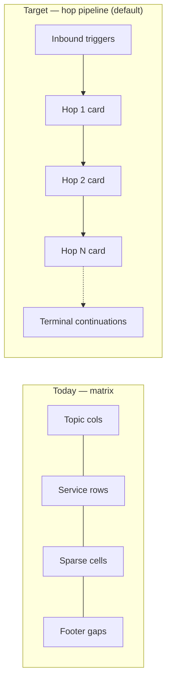
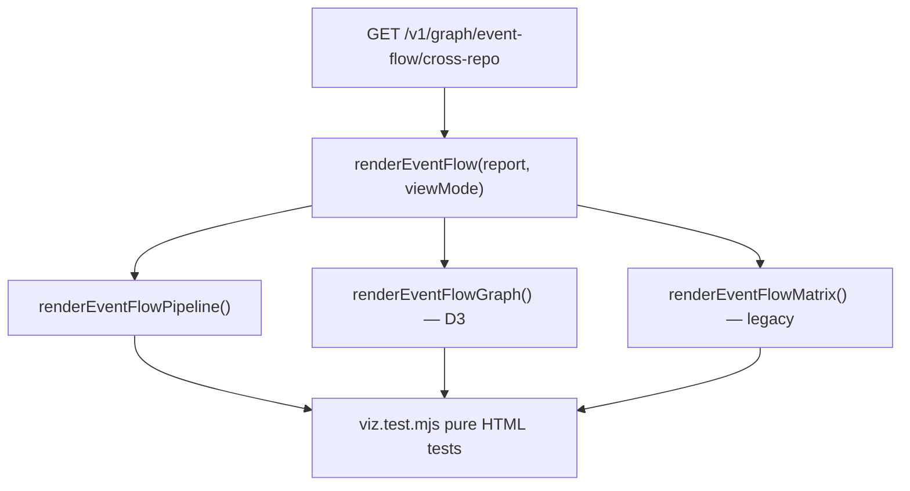
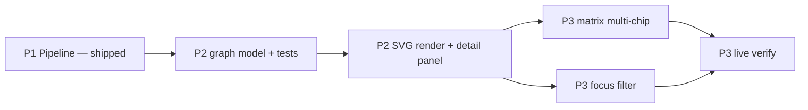

# Feature: Event Flow Visualization Redesign (VIZ-01)

> **Status:** P1–P3 shipped · **P4** transport + schema detail shipped (2026-06-15)  
> **Backlog:** [BL-048](../../../docs/BACKLOG.md) · **Req:** [VIZ-01–VIZ-32](../../../docs/REQUIREMENTS.md)  
> **Extends:** Customer Journey tab in `static/viz.html` (Event Flow mode)  
> **Depends on:** [07-option-c-messaging-flow.md](07-option-c-messaging-flow.md), [18-trg-14-first-hop-trigger-enrichment.md](18-trg-14-first-hop-trigger-enrichment.md), [19-live-pubsub-verify.md](19-live-pubsub-verify.md), [12-data-consistency-hints.md](12-data-consistency-hints.md), [24-kafka-messaging-and-graph-gaps.md](24-kafka-messaging-and-graph-gaps.md) (transport field on hops)

## Problem

The **Customer Journey → Event Flow** view renders cross-repo traces as a **service × hop matrix** (`swimlane-table` in `viz.html`). Topics are columns; services are rows; cells show pub/sub/both.

That layout answers *“which services touch this topic?”* but poorly answers the questions QA and agents actually ask when planning E2E tests:

| Question | Matrix view today | Needed |
|----------|-------------------|--------|
| What is the **sequence** of topics after `PDN_T.OFFER_UPDATE`? | Requires scanning column headers left-to-right with horizontal scroll | Obvious left-to-right hop chain |
| **Who hands off** to whom across hops? | Implicit — user must link subscriber at hop *N* to publisher at hop *N+1* | Explicit handoff arrows or cards |
| What **subscription** and **handler** consume each hop? | Often only `workloadName`; handler FQN in `title` tooltip | Visible labels on each participant |
| Where are **risks** (dual-write, terminal batch, GCP drift)? | Report-level `gaps` / `consistencyHints` footer, disconnected from hops | Inline on the hop or participant |
| What **starts** the first hop? | `inboundTriggers[]` on first-hop subscribers not rendered | Entry anchor before hop 1 (TRG-14) |
| What happens **after** a terminal hop? | `terminalContinuations[]` not rendered | Dashed continuation cards |

The **Entry Flow** mode already uses a **card pipeline** (`entry-pipeline`, `renderEntryFlow`) that is easier to read. Event Flow should align with that mental model and with MCP `testseer_trace_topic_flow` hop-by-hop markdown.

**Data is already available** on `GET /v1/graph/event-flow/cross-repo` for trace rendering. **Phase 4** adds a small additive API field (`transport` on hops and pub/sub inventory rows) plus client-side calls to existing `GET /v1/facts/message-schema` and `GET /v1/facts/gates` in the participant detail panel.

---

## Goals

| ID | Goal | Phase |
|----|------|-------|
| VIZ-G01 | Make cross-repo **message propagation** (hop sequence + handoffs) the primary visual story | P1 |
| VIZ-G02 | Surface indexed **risk signals** (gaps, consistency hints, live GCP verify, terminal continuations) **in context** | P1 |
| VIZ-G03 | Align Event Flow visual language with **Entry Flow** (cards, arrows, shared typography) | P1 |
| VIZ-G04 | Offer an optional **directed graph** view for fan-out, retries, and cross-service causality | P2 |
| VIZ-G05 | Retain **matrix / coverage** view as a secondary mode for power users | P3 |
| VIZ-G06 | Keep renderer logic **unit-testable** (pure HTML builders in `viz.test.mjs`) | P1–P3 |

---

## Non-goals

| ID | Non-goal |
|----|----------|
| VIZ-NG01 | New REST fields or trace algorithms — consume existing `CrossRepoFlowReport` |
| VIZ-NG02 | Runtime message delivery proof, lag metrics, or live Pub/Sub message sampling |
| VIZ-NG03 | Replacing MCP markdown output (viz is human UI; MCP stays text-first) |
| VIZ-NG04 | Single-service event-flow redesign in Phase 1 (cross-repo only; single-service may follow same components) |
| VIZ-NG05 | Mobile-first layout (desktop QA workflow is primary) |

---

## Personas & user stories

| Persona | Story |
|---------|-------|
| **QA Engineer** | As a QA engineer tracing `PDN_T.OFFER_UPDATE` on PDN, I see each hop as a card with all publishers and subscribers so I know which services to stub and in what order. |
| **QA Engineer** | As a QA engineer, I see `DUAL_WRITE_SAME_HANDLER` and `TERMINAL_BATCH_RETRY` on the hop they apply to, not only in a footer I might miss. |
| **Developer (Cursor)** | As a developer using the local viz after an MCP trace, I get the same hop narrative the agent described in markdown. |
| **Engineering Lead** | As a lead reviewing topology, I can switch to matrix view to see which services touch each topic in one glance. |

---

## Current vs target



---

## Data contract (existing API)

**Source:** `GET /v1/graph/event-flow/cross-repo?orgId=&shortId=&env=&maxHops=12`

Optional query params the viz **should** support when implemented:

| Param | Purpose |
|-------|---------|
| `liveVerify=true` | Subscriber GCP drift overlay (MSG-10) |
| `bundle=quotient-full` | Bundle-scoped trace when org default is insufficient |

**Report fields the renderer must consume** (stable per `VizGraphResponseShapeTest`):

| Field | Use in viz |
|-------|------------|
| `data.startTopic`, `data.orgId`, `data.envLane` | Header meta |
| `data.hops[]` | Primary sequence |
| `hops[].order`, `hops[].topicShortId`, `hops[].transport` | Hop label; `transport` = `PUBSUB` \| `KAFKA` (from `pubsub_resource_facts.attributes`) |
| `hops[].publishers[]`, `hops[].subscribers[]` | Participants per hop |
| `PubSubOrgView.shortId`, `serviceName`, `workloadName`, `linkedClassFqn`, `role`, `transport` | Chips / detail |
| `PubSubOrgView.consistencyHints[]` | Per-subscriber badges |
| `PubSubOrgView.inboundTriggers[]` | First-hop entry anchor (TRG-14) |
| `PubSubOrgView.liveVerification` | GCP status dot (MSG-10) |
| `hops[].terminalContinuations[]` | Post-terminal cards |
| `data.gaps[]` | Hop-scoped or report-scoped warnings |
| `data.consistencyHints[]` | Report-level aggregate badges |
| `data.missingBundleRepos[]` | Index coverage warning |
| `data.externalEndpoints[]` | Optional outbound row |
| Envelope `livePubSubStatus`, `livePubSubVerifiedCount` | Live verify summary line |

**Detail panel (Phase 4 — on participant click):** lazy-fetches existing fact APIs (no new routes):

| API | Use |
|-----|-----|
| `GET /v1/facts/message-schema?serviceId&topicShortId` | Payload proto, direction, `unpackExpression`, **`payloadFields`** (proto field JSON from index) |
| `GET /v1/facts/gates?serviceId&env` | Filter `gateKey === QMsgEvent.Type` for handler |

**Topic dropdown:** `GET /v1/facts/pubsub/org?orgId&resourceKind=TOPIC` — each row includes `transport`; viz labels Kafka topics with `· KAFKA` and dedupes by `env|transport|shortId`.

**No schema version bump required** — `transport` is additive on hop and inventory views.

---

## Functional requirements

### Phase 1 — Hop pipeline (default view)

| ID | Requirement | Priority |
|----|-------------|----------|
| VIZ-01 | Replace the default Event Flow layout with a **horizontal hop pipeline**: one card per `hops[]` entry, connected by `→` arrows (reuse `entry-pipeline` / `entry-step-card` styles) | Must |
| VIZ-02 | Each hop card shows **topic short ID** as primary title and **hop order** (`Hop N`) | Must |
| VIZ-03 | Each hop card lists **all publishers** and **all subscribers** as separate chips (no collapse to one cell per service) | Must |
| VIZ-04 | Subscriber chips show **`shortId`** (subscription) when `resourceKind=SUBSCRIPTION`; publisher chips show topic **`shortId`** or role label | Must |
| VIZ-05 | Each participant chip shows **service name** and **handler short name** derived from `linkedClassFqn` (same truncation rules as Entry Flow) | Must |
| VIZ-06 | **Pub** vs **sub** distinguished by color/icon consistent with current `lane-cell.pub` / `lane-cell.sub` palette | Must |
| VIZ-07 | When a service is both publisher and subscriber on the same hop, render **two chips** (not a single `↕ pub+sub` merged cell) | Must |
| VIZ-08 | Render **`inboundTriggers[]`** on first-hop subscribers as an **entry anchor** card before hop 1 (when present) | Should |
| VIZ-09 | Render **`terminalContinuations[]`** as dashed **continuation cards** after the last hop (when present) | Should |
| VIZ-10 | Attach **`consistencyHints[]`** from each subscriber as inline badges on that subscriber chip | Must |
| VIZ-11 | Attach report-level **`gaps[]`** inline on the hop they reference; gaps without hop scope remain in a summary strip below the pipeline | Should |
| VIZ-12 | Show **`missingBundleRepos[]`** in journey meta (unchanged behavior, keep visible) | Must |
| VIZ-13 | Click or hover on a participant opens a **detail panel** with full `linkedClassFqn`, `repo`, `evidenceSource`, `confidence`, and nested hints | Should |
| VIZ-14 | Pipeline scrolls horizontally; **no vertical service×hop matrix** in default mode | Must |

### Phase 2 — Directed graph view

| ID | Requirement | Priority |
|----|-------------|----------|
| VIZ-15 | Add view toggle: **Pipeline** (default) \| **Graph** \| **Matrix** (Phase 3) | Must |
| VIZ-16 | Graph mode uses existing **D3** (same dependency as Dependency Graph tab) | Must |
| VIZ-17 | Graph nodes: **topic** hub per hop + **service participant** nodes (pub/sub) | Must |
| VIZ-18 | Graph edges: publisher → topic → subscriber within hop; **dashed inter-hop edges** from subscribers at hop *N* to publishers at hop *N+1* when BFS linked the trace | Should |
| VIZ-19 | Graph supports zoom/pan controls consistent with Dependency Graph tab | Should |
| VIZ-20 | Selecting a node shows the same detail panel as pipeline mode | Should |
| VIZ-21 | Optional **“highlight trace path”** dims nodes not on the primary BFS chain | Could |

### Phase 3 — Matrix retention & filters

| ID | Requirement | Priority |
|----|-------------|----------|
| VIZ-22 | Retain current **swimlane matrix** as **Matrix** view mode (regression parity with today) | Must |
| VIZ-23 | Add **“Focus service”** filter: dims hops/participants not involving selected service | Should |
| VIZ-24 | Matrix view upgraded to show **multiple chips** per cell when multiple pub/sub rows exist (VIZ-03 parity) | Should |

### Live GCP overlay (cross-phase)

| ID | Requirement | Priority |
|----|-------------|----------|
| VIZ-25 | Event Flow trace request passes **`liveVerify=true`** when user enables a **“Verify GCP”** toggle (default off) | Should |
| VIZ-26 | Subscriber chips show **live verification status**: OK (green), `TOPIC_MISMATCH` / `SUBSCRIPTION_MISSING` (red), `SKIPPED`/`DISABLED` (gray) | Should |
| VIZ-27 | Envelope `livePubSubStatus` shown in journey meta when verify is on | Should |

### Phase 4 — Transport + message schema detail (Kafka-aware)

| ID | Requirement | Priority |
|----|-------------|----------|
| VIZ-28 | Show **`transport`** (`PUBSUB` \| `KAFKA` \| `HTTP_PUBSUB`) on topic dropdown, hop cards, matrix topic headers, and graph topic hubs | Must |
| VIZ-29 | Participant detail panel calls **`GET /v1/facts/message-schema`** for selected `serviceId` + hop `topicShortId` | Must |
| VIZ-30 | Detail panel surfaces **`QMsgEvent.Type`** from `GET /v1/facts/gates` where `gateKey === QMsgEvent.Type` (scoped to handler when `guardedSymbolFqn` present) | Should |
| VIZ-31 | Detail panel surfaces **`QMsgEvent.Type.*`** parsed from `message_schema_facts.unpackExpression` when present | Could |
| VIZ-32 | Detail panel renders **`payloadFields`** as a proto field table (#, field name, type; `repeated` prefix when applicable); truncate at 24 rows with “+ N more fields” | Should |

Backend: `MessagingTransportUtil` reads `attributes.transport` from `pubsub_resource_facts`; exposed on `PubSubView`, `PubSubOrgView`, `CrossRepoHop`, and `OutboundMsg` (see [BL-050](../TestSeer_BL050_Kafka_Messaging_Graph_Design.md) §9.1, [BL-051](../TestSeer_HTTP_PubSub_EventFlow_Hop_Design.md) §6.3). Viz may still label non-`PUBSUB`/non-`KAFKA` hops as `PUBSUB` until `HTTP_PUBSUB` badge styling is added. **`payloadFields`** is indexed by `ProtoSchemaExtractor` from `*.proto` at C-P2; viz parses the JSON client-side (`parsePayloadFields`, `renderProtoFieldsTable`).

---

## UI specification (Phase 1 hop card)

```
┌─ Hop 2 ─────────────────────────────────────┐
│  PDN_T.ACTIVATE_OFFER                      │
│  ─────────────────────────────────────────  │
│  ↑ optimus-offer-services-suite            │
│     com.example.OfferPublisher             │
│  ↓ riq-user-service · PDN_S...ACTIVATE   │
│     UserOfferActivateHandler               │
│     [DUAL_WRITE_SAME_HANDLER]              │
└────────────────────────────────────────────┘
        →
```

**Legend (reuse existing CSS tokens):**

| Element | Class / color |
|---------|----------------|
| Publisher chip | `lane-cell.pub` palette |
| Subscriber chip | `lane-cell.sub` palette |
| Consistency hint | `hint-badge` |
| Gap on hop | `gap-badge` |
| Terminal continuation | new `continuation-card` (dashed border, muted) |
| Entry trigger anchor | `entry-step-card` (Entry Flow) |

---

## Architecture



| Artifact | Change |
|----------|--------|
| `testseer-backend/src/main/resources/static/viz.html` | View mode toggle, pipeline/graph/matrix renderers, live verify toggle |
| `testseer-mcp/test/viz.test.mjs` | Extend tests for pipeline; keep matrix tests under `viewMode=matrix` |
| `VizGraphResponseShapeTest.java` | Extend assertions for `terminalContinuations`, `inboundTriggers`, `liveVerification` when viz starts reading them |
| `scripts/testseer-viz.html` | Sync if still used as standalone copy (or document single source of truth) |

---

## Phasing & delivery

| Phase | Delivers | Req IDs | Est. |
|-------|----------|---------|------|
| **P1** | Hop pipeline default; multi-participant chips; inline hints; entry/terminal cards | VIZ-01–VIZ-14 | 2–3 days |
| **P2** | D3 graph mode + view toggle | VIZ-15–VIZ-21 | 3–5 days |
| **P3** | Matrix as secondary mode; focus-service filter | VIZ-22–VIZ-24 | 1–2 days |
| **Live** | GCP verify toggle + status chips | VIZ-25–VIZ-27 | 1 day (shipped with P3) |
| **P4** | Transport badges + schema/gate detail panel | VIZ-28–VIZ-31 | 1 day |
| **P4.1** | Proto **`payloadFields`** table in detail panel | VIZ-32 | 0.5 day |

---

## Acceptance criteria

### P1 — Hop pipeline

- [x] Trace `PDN_T.OFFER_UPDATE` on `quotient` / `pdn` renders **hop cards left-to-right**, not a service×topic matrix, by default
- [x] A hop with 2 subscribers shows **2 subscriber chips**, not one collapsed cell
- [x] Subscriber chip displays **subscription `shortId`** and **handler short name**
- [x] First-hop `inboundTriggers[]` (when indexed) appears as entry card before hop 1
- [x] Hop with `terminalContinuations[]` shows continuation card(s) after the pipeline
- [x] Per-subscriber `consistencyHints[]` visible on the chip (e.g. `DUAL_WRITE`)
- [x] `viz.test.mjs` covers pipeline HTML structure; matrix tests pass under `viewMode=matrix`
- [x] No regression: Entry Flow mode unchanged
- [x] Participant click detail panel (VIZ-13) — shared panel; pipeline + graph node click
- [x] Graph mode (VIZ-15–VIZ-21) — layered D3 graph, handoff edges, trace-path highlight
- [x] Matrix multi-chip + focus service + live verify (VIZ-22–VIZ-27)
- [x] Transport badges on dropdown/hops/graph (VIZ-28)
- [x] Detail panel lazy-loads message-schema + QMsgEvent.Type gates (VIZ-29–VIZ-31)
- [x] Detail panel renders proto field table from `payloadFields` (VIZ-32)

## Phase 2 design — Directed graph view

### Why graph mode (vs pipeline alone)

Pipeline mode optimizes **sequential narration** — great for test walkthroughs. It under-emphasizes:

| Pattern | Pipeline weakness | Graph strength |
|---------|-----------------|----------------|
| **Fan-out** (one topic, many subscribers) | Chips stack vertically; handoffs to next hop are implicit | Topic hub with radiating edges |
| **Retry topics** (`*_RETRY`) | Looks like another card in the row | Visually distinct branch or dashed edge class |
| **Same service pub+sub on adjacent hops** | Two cards far apart | Direct dashed inter-hop edge |
| **Non-trace participants** on a hop | Shown equally | “On trace path” vs “also on topic” dimming |

Graph mode answers: *“How is this wired, and what is on the critical BFS path?”*

### Layout strategy: layered columns (not force simulation)

The **Dependency Graph** tab uses `d3.forceSimulation` for an organic service mesh. Event flow traces are a **bounded DAG with known hop order** — force layout fights readability on 9-hop Quotient traces.

**Decision:** Use a **layered column layout** (manual x/y from hop index), not force-directed.

```
Col 0          Col 1                    Col 2
[Entry]   →   [pub A]                  [pub B]
              (topic T1)               (topic T2)
              [sub B] ──handoff──→     [sub C]
```

| Column | Content | x position |
|--------|---------|------------|
| 0 | Entry trigger nodes (optional) | `margin + 0 * colW` |
| 1…N | Hop *i*: topic hub + publisher nodes above + subscriber nodes below | `margin + i * colW` |
| N+1 | Terminal continuation nodes (optional) | `margin + (N+1) * colW` |

Constants (tunable):

| Constant | Value | Notes |
|----------|-------|-------|
| `colW` | 220px | Fits topic label + 2 participant nodes |
| `rowH` | 56px | Vertical spacing between participants |
| `topicY` | center of column | Topic hub anchor |
| `pubOffsetY` | topicY − 80 | Publishers above topic |
| `subOffsetY` | topicY + 80 | Subscribers below topic |

Vertical stacking: when a hop has *k* publishers, center the group around `pubOffsetY`. Same for subscribers.

### Graph data model (pure function — unit testable)

Extract **`buildEventFlowGraphModel(report)`** returning `{ nodes, edges, tracePathNodeIds }`. No D3 in this function — tested in `viz.test.mjs` like pipeline HTML builders.

#### Node types

| `type` | ID pattern | Label | Shape |
|--------|------------|-------|-------|
| `entry` | `entry:{triggerId}` | `triggerKind` + path | Rounded rect (reuse entry card colors) |
| `topic` | `topic:{order}:{topicShortId}` | `topicShortId` (truncated) | Hexagon or double-circle hub |
| `publisher` | `pub:{order}:{serviceId}:{idx}` | `serviceName` | Circle, green stroke |
| `subscriber` | `sub:{order}:{serviceId}:{idx}` | `serviceName` | Circle, blue stroke |
| `terminal` | `term:{order}:{idx}` | `cronJobName` or `triggerKind` | Dashed rounded rect |
| `external` | `ext:{endpointId}` | partner slug (optional P2.1) | Gray diamond |

Each node carries **`payload`** — the original API object for the shared detail panel.

#### Edge types

| `kind` | From → To | Style | Meaning |
|--------|-----------|-------|---------|
| `publish` | `publisher` → `topic` | Solid green, `marker-end` | Declared publish |
| `subscribe` | `topic` → `subscriber` | Solid blue, `marker-end` | Declared subscribe |
| `handoff` | `subscriber@hopN` → `publisher@hopN+1` | Dashed amber, `marker-end` | Same `serviceId` continues trace |
| `entry` | `entry` → `subscriber@hop1` | Dotted gray | TRG-14 trigger fans into first consumer |
| `terminal` | `subscriber@hopN` → `terminal` | Dashed muted | Terminal continuation |

**Handoff inference algorithm** (client-side, no API change):

```javascript
for (let i = 0; i < hops.length - 1; i++) {
  const subs = hops[i].subscribers || [];
  const pubs = hops[i + 1].publishers || [];
  for (let si = 0; si < subs.length; si++) {
    for (let pi = 0; pi < pubs.length; pi++) {
      if (subs[si].serviceId === pubs[pi].serviceId) {
        edges.push({
          kind: 'handoff',
          source: `sub:${hops[i].order}:${subs[si].serviceId}:${si}`,
          target: `pub:${hops[i+1].order}:${pubs[pi].serviceId}:${pi}`,
        });
      }
    }
  }
}
```

**Trace path node set** (`tracePathNodeIds`): nodes touched by any `handoff` edge plus their adjacent topic/publish/subscribe nodes on hops 1…N. Used for VIZ-21 dimming.

#### Risk overlays on nodes

| Signal | Visual |
|--------|--------|
| `consistencyHints[]` on subscriber | Small amber badge on node (max 1 icon + count) |
| `liveVerification.status !== OK` | Red ring on subscriber |
| Hop `gaps[]` matching topic | Red exclamation on topic hub |
| Gap `TERMINAL_BATCH_RETRY` | Terminal node pre-highlighted |

### Rendering (`renderEventFlowGraph`)

**Container:** Dedicated `#event-flow-graph` inside `#journey-canvas` — separate from `#graph-svg` (Dependency Graph tab) to avoid simulation/state collisions.

```html
<div class="event-flow-graph-wrap">
  <svg id="event-flow-graph-svg" height="480">
    <defs><!-- reuse #arrow, #arrow-hl markers --></defs>
  </svg>
  <div class="graph-controls">…+ − ⌂…</div>
  <div id="event-flow-detail" class="detail-panel">…</div>
</div>
```

**D3 usage:**

1. `buildEventFlowGraphModel(report)` → nodes/edges
2. `layoutEventFlowGraph(model, width, height)` → assign `x`, `y` per layered rules
3. `d3.select('#event-flow-graph-svg')` — bind edges as `path` (curved for handoff), nodes as `g`
4. `d3.zoom` on SVG — copy scaleExtent `[0.2, 3]` from dependency graph
5. **No force simulation** — positions are deterministic from hop order

**Lifecycle:**

| Event | Action |
|-------|--------|
| User switches to Graph | If `lastEventFlowReport` set, call `mountEventFlowGraph(lastEventFlowReport)` |
| User switches away | `teardownEventFlowGraph()` — remove listeners, clear SVG |
| User re-traces | Rebuild model from new report |
| Window resize | Re-layout with debounced `resize` handler |

### Shared detail panel (VIZ-13 + VIZ-20)

Single **`showEventFlowDetail(nodeId)`** used by pipeline chip click and graph node click.

| Field | Source |
|-------|--------|
| Role | pub / sub / entry / terminal / topic |
| Transport | `hop.transport`, `PubSubOrgView.transport` |
| Service | `serviceName`, `serviceId`, `repo` |
| Resource | `shortId`, `fullResourceId` |
| Handler | `linkedClassFqn`, `workloadName` |
| Evidence | `evidenceSource`, `confidence` |
| Hints | `consistencyHints[]` expanded |
| Live GCP | `liveVerification` when present |
| Message schema | Lazy `GET /v1/facts/message-schema?serviceId&topicShortId` — proto, direction, unpack, **`payloadFields` field table** |
| Event type gates | Lazy `GET /v1/facts/gates?serviceId&env` — filter `QMsgEvent.Type`; also parse `unpackExpression` |
| Actions | “Show in Dependency Graph” → `highlightInGraph(serviceId)` |

Pipeline mode: add `onclick` on `.event-participant` with `data-node-id` matching graph IDs.

### View toggle (VIZ-15)

Extend existing toggle:

```
[ Pipeline ] [ Graph ] [ Matrix ]
```

`setEventFlowView(mode)` dispatches:

| mode | Renderer |
|------|----------|
| `pipeline` | `renderEventFlowPipeline` (HTML) |
| `graph` | `mountEventFlowGraph` (SVG) |
| `matrix` | `renderEventFlowMatrix` (HTML) |

Persist `ts-event-flow-view` in `sessionStorage` (already implemented for pipeline/matrix).

### Trace path highlight (VIZ-21 — Could, ship in P2.1)

Toggle **“Highlight trace path”** (default on):

- Nodes in `tracePathNodeIds`: full opacity
- Other nodes: `opacity: 0.35`
- `handoff` edges: full width; other edges: thin muted

### P2 deliverables & estimates

| Task | Est. |
|------|------|
| `buildEventFlowGraphModel` + unit tests | 1 day |
| Layered layout + SVG render + zoom | 1.5 days |
| Shared detail panel + pipeline click wiring | 0.5 day |
| Graph view toggle + lifecycle | 0.5 day |
| Manual QA on 9-hop `PDN_T.OFFER_UPDATE` | 0.5 day |
| **Total P2** | **~4 days** |

### P2 acceptance criteria

- [x] Graph button renders layered SVG for Quotient 9-hop trace without console errors
- [x] Every hop has a visible topic hub; all publishers/subscribers from API appear as nodes
- [x] Handoff dashed edges connect same-service sub@N → pub@N+1
- [x] Clicking a node opens detail panel with handler FQN and hints
- [x] Switching Pipeline ↔ Graph does not re-fetch API
- [x] `buildEventFlowGraphModel` covered by `viz.test.mjs` (nodes/edges counts, handoff pairs)

### P2 non-goals

- Editing graph layout by drag (positions are fixed by hop column)
- Merging Dependency Graph service mesh with event flow trace
- Edge routing around obstacles (straight/quadratic curves sufficient)

---

## Phase 3 design — Matrix hardening & cross-view filters

P1 shipped matrix as a **legacy parity** view. P3 makes matrix a deliberate **coverage instrument** and adds filters that work across all three views.

### Goals

| ID | Goal |
|----|------|
| VIZ-22 | Matrix remains available; behavior documented as “topic coverage map” |
| VIZ-23 | **Focus service** filter dims non-relevant hops/participants |
| VIZ-24 | Matrix cells show **all** pub/sub rows (parity with pipeline chips) |
| VIZ-25–27 | **Live GCP verify** toggle on trace form |

### Focus service filter (VIZ-23)

**Control:** `<select id="journey-focus-svc">` in Event Flow form row:

```
Focus service: [ All services ▾ ]  (populated after trace)
```

Options = unique `serviceId` from all publishers/subscribers in `lastEventFlowReport`, sorted by `serviceName`.

**Persistence:** `sessionStorage['ts-event-flow-focus']` — cleared when topic/org changes.

#### Behavior per view

| View | When focus = `svc-X` |
|------|----------------------|
| **Pipeline** | Hops with no participant `serviceId === svc-X`: `opacity: 0.2`, non-interactive. Within active hops, dim chips where `serviceId !== svc-X`. |
| **Graph** | Dim nodes not matching `svc-X` or not adjacent via one edge to `svc-X` on trace path (optional: strict vs inclusive toggle). |
| **Matrix** | Dim rows where `serviceId !== svc-X`. Dim columns (hops) where hop has no `svc-X` participant. |

**Inclusive mode (default):** show entire hop if *any* participant matches — highlights matching cells, dims others in that hop.

**Strict mode (optional checkbox):** hide hops with no `svc-X` entirely (pipeline collapses; matrix hides columns).

### Matrix multi-chip cells (VIZ-24)

Replace single `lane-cell` per service/hop with a **stack**:

```html
<td class="matrix-cell">
  <div class="matrix-chip pub">↑ orders-ns</div>
  <div class="matrix-chip sub">↓ PDN_S.FOO.HANDLER</div>
</td>
```

Rules:

- One chip per `publishers[]` / `subscribers[]` row (same data as pipeline)
- Chip shows `↑/↓`, truncated `shortId` or `workloadName`, handler short on second line
- `pub+sub` same service → two chips (never `↕ pub+sub` merged) — aligns with VIZ-07
- Cell min-height grows with chip count; row height = max chips in that hop column

Extract **`renderMatrixCell(pubs, subs, hopTopic)`** — unit tested.

### Live GCP verify (VIZ-25–27)

**Control:** Checkbox **“Verify GCP”** next to Trace button (Event Flow only, default off).

| State | API call |
|-------|----------|
| Off | `GET .../event-flow/cross-repo?orgId&shortId&env` |
| On | same + `&liveVerify=true` |

**UI overlays (all views):**

| `liveVerification.status` | Chip / node ring |
|---------------------------|------------------|
| `OK` | Green dot + tooltip with `liveTopicShortId` |
| `TOPIC_MISMATCH` | Red dot + tooltip expected vs live |
| `SUBSCRIPTION_MISSING` | Red hollow ring |
| `SKIPPED` / absent | No overlay |

**Journey meta line** when envelope `livePubSubStatus !== DISABLED`:

```
Live GCP: OK (verified=12, skipped=3)
```

Re-trace required when toggling checkbox (do not silently re-fetch on toggle alone — show “Re-trace to apply” or auto re-run if `lastEventFlowReport` exists).

### Optional backend improvement (BL-049 — not blocking P3)

`FlowGap` today is `(gapType, description)` only. Hop association uses substring match on `topicShortId` in `description` — fragile.

**Proposed optional field** (additive, non-breaking):

```json
{ "gapType": "TERMINAL_BATCH_RETRY", "description": "...", "hopOrder": 3, "topicShortId": "PDN_T.REDEEM_OFFER" }
```

Viz prefers `hopOrder` / `topicShortId` when present; falls back to substring match.

### Cross-view legend

Add compact legend below journey meta (all Event Flow views):

| Symbol | Meaning |
|--------|---------|
| ↑ green | Publisher |
| ↓ blue | Subscriber |
| --- amber | Inter-hop handoff (graph only) |
| 🔁 | Consistency hint |
| ⚠ | Gap |
| ● green / red | GCP verify OK / drift |

### P3 deliverables & estimates

| Task | Est. |
|------|------|
| Focus service dropdown + pipeline dimming | 0.5 day |
| Focus service in graph + matrix | 0.5 day |
| Matrix multi-chip cells + tests | 1 day |
| Live verify checkbox + subscriber overlays (3 views) | 1 day |
| Legend + polish | 0.5 day |
| **Total P3** | **~3.5 days** |

### P3 acceptance criteria

- [x] Focus service `riq-user-service` dims unrelated hops in pipeline; matching chips stay full opacity
- [x] Matrix cell with 2 subscribers shows 2 stacked chips with distinct `shortId`s
- [x] Matrix no longer uses merged `↕ pub+sub` cell when same service pub+sub on one hop
- [x] “Verify GCP” adds `liveVerify=true`; subscriber with `TOPIC_MISMATCH` shows red indicator
- [x] Focus + view mode + live verify prefs survive page refresh via `sessionStorage`

### P4 acceptance criteria

- [x] Topic dropdown shows `· KAFKA` suffix for Kafka-indexed topics; `data-transport` on `<option>`
- [x] Hop pipeline/matrix/graph topic labels include transport badge (`PUBSUB` blue, `KAFKA` amber)
- [x] Clicking pub/sub participant fetches message-schema rows for that service + topic
- [x] Detail panel lists `QMsgEvent.Type` gates and unpack-derived types when indexed
- [x] Detail panel renders `payloadFields` as proto field table (#, name, type; repeated prefix; truncate at 24)
- [x] `viz.test.mjs` covers `renderEventFlowFactsExtra` field table, repeated types, truncation
- [x] `VizGraphResponseShapeTest` asserts `hops[].transport`

---

## Implementation sequence (recommended)



| Order | Rationale |
|-------|-----------|
| P2 before P3 focus-on-graph | Detail panel and node IDs shared across views |
| P3 matrix chips before live verify | Overlay logic attaches to chip/node components once |
| BL-049 gap `hopOrder` anytime | Independent backend nicety |

---

## Test plan (P2 + P3)

| Layer | P2 | P3 |
|-------|----|----|
| Unit | `buildEventFlowGraphModel` node/edge counts; handoff pairs; layout x-ordering | `renderMatrixCell` multi-chip; `focusServiceFilter` dim sets |
| Integration | Manual 9-hop graph render | Manual focus + live verify on PDN |
| Contract | Extend `VizGraphResponseShapeTest` for `liveVerification` on subscribers | Same |

---

## Open questions (updated)

| # | Question | Recommendation |
|---|----------|----------------|
| 1 | Single-service event flow same components? | Yes — after P2, wire `GET /v1/graph/event-flow` to shared renderers |
| 2 | Gap hop association | Ship P3 with substring fallback; add BL-049 `hopOrder` when touching `FlowGap` |
| 3 | `scripts/testseer-viz.html` | Deprecate; add README note pointing to `static/viz.html` |
| 4 | Graph strict vs inclusive focus | Default **inclusive**; strict as checkbox |
| 5 | Auto re-trace on live verify toggle? | **Yes** if report loaded — better UX than orphan checkbox |

---

## References

- `viz.html` — `renderEventFlow()`, `renderEntryFlow()`, Customer Journey tab
- `VizGraphResponseShapeTest.java` — API ↔ viz field contract
- `messaging-format.ts` — MCP hop narrative (alignment target)
- [Option_C_Messaging_Flow.md](../Option_C_Messaging_Flow.md) — curl examples for manual QA
