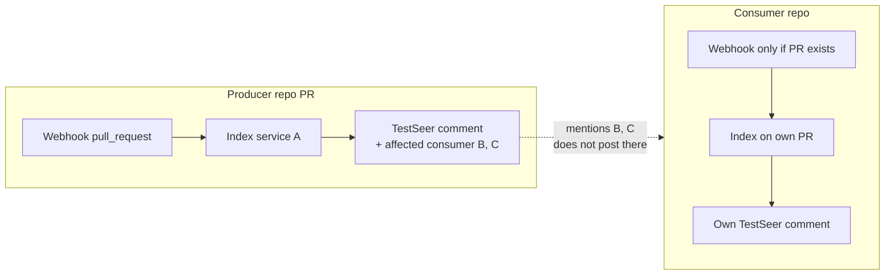
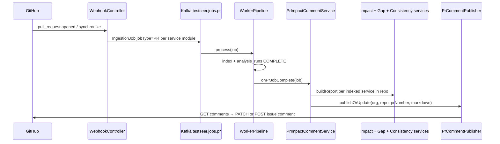

# Feature: GitHub PR Comment Bot (BL-022 / P14)

> **Status:** v1 shipped (2026-06-15) · cross-repo fan-out deferred  
> **Backlog:** [BL-022](../../../docs/BACKLOG.md) · **Req:** PRB-01–PRB-09 (v1), PRB-10–PRB-13 (v2)  
> **Depends on:** [02-ingestion-pipeline.md](02-ingestion-pipeline.md), [05-impact-analysis.md](05-impact-analysis.md), [12-data-consistency-hints.md](12-data-consistency-hints.md)  
> **Package:** `io.testseer.backend.github`

## Problem

PR authors and reviewers must leave GitHub to ask TestSeer (REST, MCP, or IDE) what changed, who is affected, and which tests are missing. Impact and gap APIs exist, but nothing surfaces that analysis **on the PR** where review happens.

At Quotient scale:

- **Monorepos** (`riq-partner-adapter-suite`, multi-module Maven trees) produce **multiple service jobs** per PR — reviewers need **one** comment, not N.
- **Cross-repo dependencies** mean a producer PR can break consumers in other repos — reviewers on the producer PR should see **downstream blast radius** even when consumer repos have no open PR.
- **Companion PRs** across repos (API change + client adaptation) are common — each repo gets its own GitHub PR; TestSeer must be explicit about what is and is not coordinated.

## Goals

| ID | Goal |
|----|------|
| PRB-G01 | After PR indexing completes, post a structured markdown summary on the PR |
| PRB-G02 | Reuse shipped analysis (`ImpactReport`, `GapReport`, consistency gaps) — no duplicate logic |
| PRB-G03 | Idempotent on `synchronize` — update one TestSeer comment, never spam |
| PRB-G04 | Aggregate **all services in the same repo** indexed at PR head SHA into one comment |
| PRB-G05 | Surface **cross-repo consumers** on the **producer** PR via existing impact graph |
| PRB-G06 | Fail safe — comment errors must not fail indexing jobs |

## Non-goals (v1)

| ID | Non-goal |
|----|----------|
| PRB-NG01 | Posting comments on **consumer repos** when only the producer has a PR (v2: PRB-10) |
| PRB-NG02 | Linking companion PRs across repos by Jira key or PR body parsing (v2: PRB-11) |
| PRB-NG03 | Inline review comments on diff lines |
| PRB-NG04 | New REST/MCP analysis endpoints for the bot |
| PRB-NG05 | GitLab / Bitbucket PR comments |
| PRB-NG06 | Running or scheduling tests from the comment |

---

## Scope matrix: one repo vs many repos

GitHub PRs are always **one repository, one issue number**. TestSeer scopes comments the same way.

| Scenario | v1 behavior | Notes |
|----------|-------------|-------|
| **Single-service repo** | One PR job → one comment section | e.g. `offer-ingestion` |
| **Monorepo, multiple registered services** | One comment, `###` section per indexed service | `JobDecomposer` splits files; comment rebuilds as each module finishes |
| **Producer PR, consumers in other repos** | Consumer names appear under **Affected services** on producer PR only | From `ImpactAnalysisService.findAffectedConsumers` (graph + `outbound_call_facts`) |
| **Consumer repo has its own open PR** | Separate webhook → separate comment on **that** PR | No automatic cross-link unless v2 PRB-11 |
| **Consumer repo, no open PR** | No comment on consumer repo | v2 PRB-10 may post advisory on default branch or skip |
| **Same PR number in two repos** | Unrelated | Keyed by `(orgId, repo, prNumber)` |



---

## End-to-end flow (v1 shipped)



**Trigger events:** `opened`, `synchronize`, `reopened` (same as ingestion webhook).

**Timing:** Comment runs **after** `runTracker.markComplete(jobId())` — never on webhook receipt (index may still be `INDEXING`).

---

## Functional requirements

### v1 — shipped

| ID | Requirement | Priority | Status |
|----|-------------|----------|--------|
| PRB-01 | On `jobType=PR` index complete, invoke PR comment orchestration | Must | Done |
| PRB-02 | Call `ImpactAnalysisService.buildReport(serviceId, commitSha)` in-process (not HTTP self-call) | Must | Done |
| PRB-03 | Include portfolio gaps via `GapDetectionService.buildReport(serviceId)` | Must | Done |
| PRB-04 | Include consistency hints via `ConsistencyGapService.computeGaps(orgId, serviceId)` | Should | Done |
| PRB-05 | Format markdown: changed symbols, affected consumers, suggested tests, gaps, consistency hints | Must | Done |
| PRB-06 | Mark comments with hidden HTML marker `<!-- testseer:pr-analysis -->` for idempotency | Must | Done |
| PRB-07 | On re-sync, **PATCH** existing TestSeer comment; never create duplicates | Must | Done |
| PRB-08 | For monorepos, aggregate all **enabled** `service_registry` entries matching `(orgId, repo)` where `commitSha` is `COMPLETE` | Must | Done |
| PRB-09 | Gate publishing on `testseer.github.comment-enabled=true` and non-blank `testseer.github.token` | Must | Done |
| PRB-10 | Log and swallow publish failures; do not fail `WorkerPipeline` | Must | Done |
| PRB-11 | Optional footer link via `testseer.github.comment-trace-base-url` | Should | Done |
| PRB-12 | Use GitHub Issues Comments API: `POST/PATCH /repos/{owner}/{repo}/issues/{pr}/comments` | Must | Done |

### v2 — deferred (cross-repo portfolio)

| ID | Requirement | Priority | Status |
|----|-------------|----------|--------|
| PRB-20 | **Consumer fan-out:** when producer impact lists `affectedConsumers` in repo R, post or update an **advisory** comment on open PRs in R (or single sticky issue comment template) | Should | Planned |
| PRB-21 | **Companion PR linking:** parse PR body / branch name for `org/repo#n` or ticket keys; cross-link producer ↔ consumer comments | Could | Planned |
| PRB-22 | **Per-service trace URLs** in footer (`…/viz.html?serviceId=&commitSha=`) | Could | Planned |
| PRB-23 | **Pub/Sub topics touched** section from changed handlers (`GET /v1/graph/event-flow/cross-repo` consumer) | Should | Planned |
| PRB-24 | **Rate limiting / debounce** for fan-out when one producer affects many consumer repos | Must (if PRB-20) | Planned |
| PRB-25 | **Org-level opt-out** list for repos that should not receive bot comments | Should | Planned |

### v3 — out of scope until requested

| ID | Requirement | Priority |
|----|-------------|----------|
| PRB-30 | Inline review comments on changed lines | Future |
| PRB-31 | GitHub Checks / Actions status instead of issue comment | Future |
| PRB-32 | Required check gate (block merge on missing tests) | Future |

---

## Comment content contract (v1)

### Required sections (per service in repo)

| Section | Source field | Example |
|---------|--------------|---------|
| Service header | `serviceId` | `### billing-service` |
| Changed | `ImpactReport.changedSymbols` | `OrderController, PaymentClient` |
| Affected services | `ImpactReport.affectedConsumers` | `orders-service (calls GET /orders/{id})` |
| Suggested test scope | `ImpactReport.suggestedTestScope` | `OrderControllerTest (existing)` / `⚠️ PaymentClientTest` |
| Test gaps | `GapReport` ENDPOINT_CONTROLLER count + `missingTestClasses` | `3 controllers lack test coverage` |
| Consistency hints | `ConsistencyGapService` | `DUAL_WRITE_SAME_HANDLER — Handler#method` |

### Cross-repo visibility (read-only on producer PR)

When service **A** in repo **R1** changes an endpoint, `affectedConsumers` may include service **B** registered under repo **R2**. v1 lists **B** on **R1's PR comment** only. It does **not** open or update **R2's PR**.

### Example (monorepo + cross-repo hint)

```markdown
<!-- testseer:pr-analysis -->
## TestSeer Impact Analysis for PR #47

**Commit:** `abc123d`

### riq-platform-apis-optimus
**Changed:** OrderController
**Affected services:**
- platform-redemption-service (calls GET /orders/{id})
**Suggested test scope:**
- OrderApiTest (existing, covers changed class)
- ⚠️ RedemptionClientIntegrationTest — suggested for platform-redemption-service

### riq-offers-business-logic
**Changed:** OfferMapper
...

_Generated by TestSeer — [View full trace](https://testseer.example/viz.html)_
```

---

## Configuration

```yaml
testseer:
  github:
    token: ${GITHUB_TOKEN:}                    # Bearer; needs issues: write on target repos
    webhook-secret: ${GITHUB_WEBHOOK_SECRET:changeme}
    comment-enabled: ${GITHUB_COMMENT_ENABLED:false}
    comment-trace-base-url: ${GITHUB_COMMENT_TRACE_BASE_URL:}
```

| Variable | Required for comments | Purpose |
|----------|----------------------|---------|
| `GITHUB_TOKEN` | Yes | GitHub REST API auth (PAT or GitHub App installation token) |
| `GITHUB_COMMENT_ENABLED` | Yes (`true`) | Master switch; default `false` |
| `GITHUB_WEBHOOK_SECRET` | For ingestion | HMAC validation on `/webhook/github` (separate from comment publish) |
| `GITHUB_COMMENT_TRACE_BASE_URL` | No | Footer link to viz / portfolio trace |

### GitHub App / token permissions

| Permission | Scope | Why |
|------------|-------|-----|
| `pull_requests: read` | Webhook + PR file list | Ingestion (existing) |
| `contents: read` | Repo contents | Source fetch (existing) |
| `issues: write` | PR issue comments | PRB-12 — PRs are issues in GitHub API |

Install the app (or grant PAT scope) on **each org repo** that should receive comments.

---

## Implementation map (v1)

| Class | Role |
|-------|------|
| `PrImpactCommentService` | Post-index hook; loads analyses for all indexed services in repo |
| `PrCommentFormatter` | `ImpactReport` + `GapReport` + consistency → markdown |
| `PrCommentPublisher` | GitHub REST create/update with marker |
| `WorkerPipeline` | Calls `onPrJobComplete` after `markComplete` |

**Hook point:** end of `WorkerPipeline.process()` — not `WebhookController` (async indexing).

---

## Multi-module coordination detail

1. `WebhookController` → `JobDecomposer.decompose()` → **N** `IngestionJob` records (`jobType=PR`, same `prNumber`, same `commitSha`, different `serviceId`).
2. Each job indexes independently; `analysis_runs` rows are per `serviceId`.
3. Each completing job calls `onPrJobComplete`, which:
   - Queries **all** enabled services for `(orgId, repo)`
   - Includes only those with `CommitIndexValidator.isIndexed(serviceId, commitSha)`
   - Rebuilds the **full** comment and PATCHes the single TestSeer thread

**Partial index state:** If module A finished but module B is still running, the comment shows A only; updates when B completes.

**No changed files for a module:** If `JobDecomposer` assigns no files to a service, no job is enqueued for that service — it won't appear unless a baseline index exists at `commitSha` (unusual for PR delta). Document as limitation.

---

## Observability

| Signal | Type | Notes |
|--------|------|-------|
| `testseer_pr_comment_published_total` | Counter | Labels: `org`, `repo`, `action=create\|update` |
| `testseer_pr_comment_failed_total` | Counter | GitHub 4xx/5xx, auth errors |
| Log `Posted/Updated TestSeer PR comment on {org}/{repo}#{pr}` | INFO | `PrCommentPublisher` |
| Log `Failed to publish PR comment` | WARN | Must not escalate to job failure |

---

## Security

| Concern | Mitigation |
|---------|------------|
| Token exposure | Env / secret manager only; never log token |
| Comment injection | Format from trusted index data only; escape user code names as plain text |
| Webhook spoofing | Existing `GitHubSignatureValidator` on ingestion path |
| Cross-org leakage | Comments keyed to webhook `orgId` + `repo`; registry filter enforces same org |

---

## Acceptance criteria

### v1

| ID | Criterion | Verification |
|----|-----------|--------------|
| PRB-AC01 | PR open on registered repo with `comment-enabled=true` receives exactly one TestSeer comment after index | Integration test or manual: open PR → wait COMPLETE → GitHub UI |
| PRB-AC02 | PR `synchronize` updates same comment (marker id stable) | Push to PR branch → comment body changes, comment id unchanged |
| PRB-AC03 | Monorepo with 2 services shows 2 `###` sections when both indexed | Fixture with two `service_registry` rows, same repo |
| PRB-AC04 | `comment-enabled=false` → no GitHub API calls | Unit test `PrCommentPublisher` |
| PRB-AC05 | Index failure → no comment | Failed job never reaches `onPrJobComplete` |
| PRB-AC06 | Publish exception → job still `COMPLETE` | Mock publisher throws; assert `analysis_runs` status |
| PRB-AC07 | Cross-repo consumer appears on producer PR when graph edge exists | Index producer + consumer baseline → change endpoint → comment lists consumer |

### v2 (when scheduled)

| ID | Criterion |
|----|-----------|
| PRB-AC20 | Producer PR comment links to consumer open PR when PRB-21 detects match |
| PRB-AC21 | Consumer open PR receives advisory comment when PRB-20 enabled and rate limit not exceeded |

---

## Test plan

| Layer | Tests |
|-------|-------|
| Unit | `PrCommentFormatterTest` — section rendering, marker, empty state |
| Unit | `PrCommentPublisherTest` — create vs update, disabled gate |
| Unit | `PrImpactCommentServiceTest` — PR-only, registry filter, publisher disabled |
| Integration | Mock GitHub `RestClient` or WireMock: end-to-end from `onPrJobComplete` |
| Manual | Enable on PDN test repo; verify permissions and markdown render in GitHub UI |

---

## Known limitations

1. **No consumer-repo comments** in v1 — only mentions on producer PR.
2. **Gap report commit** — `GapDetectionService` uses latest `COMPLETE` for service, not necessarily PR head (same as `GET /v1/gaps` today).
3. **Unregistered repos** — webhook dropped before ingestion; no comment.
4. **Fork PRs** — behavior depends on webhook delivery to TestSeer and token access to fork head; not explicitly tested.
5. **Large portfolios** — comment size GitHub limit (~65k chars); may need truncation in v2.

---

## Related

- [05-impact-analysis.md](05-impact-analysis.md) — `GET /v1/impact/pr`
- [02-ingestion-pipeline.md](02-ingestion-pipeline.md) — webhook → Kafka PR topic
- [12-data-consistency-hints.md](12-data-consistency-hints.md) — consistency gap source
- [22-event-flow-viz-redesign.md](22-event-flow-viz-redesign.md) — trace URL target (PRB-22)
- Archive plan (superseded): [2026-06-05-p14-pr-comment-bot.md](../archive/plans/2026-06-05-p14-pr-comment-bot.md)
