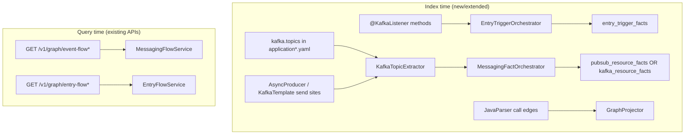

# Feature: Kafka Messaging Index + Service Graph Hardening (BL-050)

> **Status:** Backlog (`in-progress` — KFK-04 partial via BL-053)  
> **Backlog:** [BL-050](../../../docs/BACKLOG.md)  
> **Full design:** [TestSeer_BL050_Kafka_Messaging_Graph_Design.md](../TestSeer_BL050_Kafka_Messaging_Graph_Design.md) (canonical)  
> **Evidence:** Manual vs TestSeer gap analysis — `platform-transaction-eval-consumer` / `transaction-eval-suite`  
> **Related:** [07-option-c-messaging-flow.md](07-option-c-messaging-flow.md) (Pub/Sub only today) · [11-entry-triggers.md](11-entry-triggers.md) · [04-graph-projection.md](04-graph-projection.md)

## Problem

Option C and entry triggers were built for **GCP Pub/Sub** and REST/cron ingress. Quotient evaluation services (e.g. `transaction-eval-consumer`) use **Kafka** for primary ingress and most egress. A manual file-by-file graph vs TestSeer index on the same repo shows:

| Surface | Manual (code) | TestSeer (indexed) |
|---------|---------------|-------------------|
| Primary entry: `@KafkaListener` → `TransactionEvalConsumer` | ✓ | ✓ T1 linked (**KFK-01 done** on pilot) |
| Reverse impact for Kafka handler | — | ✗ `entry-flow/impact` → `triggers: []` (**TE-GAP-03**) |
| Kafka publish (processed, redeem, fraud, pattern, reward-status) | ✓ 5 topics | ✗ `event-flow` 0 steps (**TE-GAP-01**) |
| Cross-repo pipeline trace | Named upstream/downstream | `NO_PUBLISHER`, `NO_SUBSCRIBER` (**TE-GAP-04**) |
| Call graph / reachability | Consumer → service → processors | **Partial** — 121 `nodeIds`, 0 edges (**TE-GAP-02**) |
| Cron ingress (evaluation-jobs) | Out of consumer scope | 4 `CRON_K8S` triggers, **unlinked** (**TE-GAP-05**) |
| Outbound HTTP | Workbench + PubSub notification API | Symbols + paths; cross-repo notification gap (**TE-GAP-04/06**) |

**Pilot service:** `serviceId` `81d1611f-e019-4ce4-94f1-7df64aa15c41` (`transaction-eval-suite`), commit `0bdc0be4`, indexed `2026-06-16T06:46:56Z`.

**P0 implementation (Steps 1–4):** [TestSeer_BL050_P0_Implementation_Design.md](../TestSeer_BL050_P0_Implementation_Design.md)

**Gap analysis artifact (external):**  
`DesignDocuments/Docs/TransactionEvalConsumer_ServiceGraph_GapAnalysis.md`

## Goals

| ID | Goal | Must |
|----|------|------|
| KFK-01 | Index `@KafkaListener` / `@KafkaHandler` as `KAFKA_SUBSCRIBE` entry triggers linked to handler method | Must |
| KFK-02 | Extract `kafka.topics.*` from Spring YAML → messaging resource facts (topic name, consumer group, producer bean) | Must |
| KFK-03 | Wire Kafka subscribe/publish into `GET /v1/graph/event-flow` and cross-repo trace (reuse hop model; not Pub/Sub-only) | Must |
| KFK-04 | Populate `graph_edges` for symbol adjacency so `reachability` / `neighborhood` are non-empty for indexed services | Must |
| KFK-05 | Link `CRON_K8S` triggers to Spring Boot main / job module handlers in monorepos | Should |
| KFK-06 | Extend outbound + `external-endpoints` from yaml `rest.apis` / `rest-clients` (PubSub publish URI, Workbench) | Should |
| KFK-07 | Fix `GET /v1/facts/by-file` returning `[]` for indexed Java paths | Should |
| KFK-08 | Optional `serviceModuleId` / path filter on entry-flow so suite index does not surface unrelated crons as consumer ingress | Should |

## Non-goals

- Proving Kafka message delivery at runtime
- Replacing Pub/Sub Option C tables (extend, don’t fork)
- Full Confluent Cloud / schema registry integration (future)

## Acceptance criteria (pilot: transaction-eval-consumer)

After index of `platform-transaction-eval-consumer`:

1. `GET /v1/facts/entry-triggers` includes `KAFKA_SUBSCRIBE` for `TransactionEvalConsumer.processSalesCanonicalEvent` with topic from yaml (`QUOT.SALES.TRANSACTION.PIPELINE.EVENTS` or env alias).
2. `GET /v1/graph/entry-flow/impact?handlerFqn=...TransactionEvalConsumer.processSalesCanonicalEvent` returns ≥1 trigger.
3. `GET /v1/graph/event-flow?shortId=QUOT.SALES.TRANSACTION.PIPELINE.EVENTS` shows subscriber hop to transaction-eval-suite.
4. `GET /v1/graph/event-flow` for processed / redeem / fraud topics shows publisher hops from producer classes.
5. `GET /v1/graph/reachability` or `neighborhood` for `TransactionEvaluationService` returns non-empty nodes (depth ≥1) — **BL-053** after re-index; use `symbolFqn` not bare `serviceId` for `type=class`.
6. `GET /v1/facts/outbound` includes `PubSubNotificationClient` and kafka producer classes.
7. Cross-repo trace for pipeline topic does **not** emit `NO_SUBSCRIBER` when publisher repos are indexed in `quotient-full` bundle.

## Shipped (query + viz slice — partial BL-050)

Independent of full KFK-01–08 indexing, the following are **done** and support Kafka topics once indexed:

| Surface | Status | Notes |
|---------|--------|-------|
| `transport` on `PubSubView` / `PubSubOrgView` / `CrossRepoHop` | Done | `MessagingTransportUtil` reads `attributes.transport` |
| Event Flow viz transport badges | Done | Topic dropdown, hop cards, matrix, graph — [22-event-flow-viz-redesign.md](22-event-flow-viz-redesign.md) P4 |
| Viz participant detail → message-schema + gates | Done | Lazy `GET /v1/facts/message-schema`, `GET /v1/facts/gates`; `QMsgEvent.Type`; **`payloadFields` proto field table** |

**Still blocked on KFK-02/03:** empty `event-flow` egress for eval consumer until Kafka publish hops indexed (**TE-GAP-01**).

**Open issues:** [28-transaction-eval-graph-gap-issues.md](28-transaction-eval-graph-gap-issues.md)

## Implementation sketch

| Component | Change |
|-----------|--------|
| `KafkaListenerTriggerExtractor` | New — `trigger_kind=KAFKA_SUBSCRIBE`, topic from annotation + property placeholder resolution |
| `YamlKafkaTopicExtractor` | New or extend `YamlPubSubExtractor` — `kafka.topics.stxn.pipeline`, producers under `kafka.topics.*.producer` |
| `MessagingClassLinker` | Map `*AsyncProducer`, `@Qualifier("...Kafka...")` to topic short ids |
| `MessagingGraphProjector` | Subscribe/publish edges for Kafka resources |
| `EntryTriggerGraphProjector` | `TRIGGERED_BY` from KAFKA trigger → handler |
| `CallGraphProjector` | Ensure injection/autowired call edges feed `graph_edges` |
| `MethodCallGraphExtractor` / `FactoryRoutingExtractor` | **Shipped (BL-053)** — `INVOKES`, `ROUTES_TO`, `routing_table_facts`, `GET /v1/graph/routing` |
| `OutboundCallExtractor` | Include `RestService` subclasses (`PubSubNotificationClient`) |
| `ExternalEndpointResolver` | Resolve `rest.apis.pubsub.uri` + `topic-name` |
| `HttpPubSubPublishLinker` | Virtual `pubsub_resource_facts` for HTTP notification publish (BL-051) — topic-keyed event-flow hop |

**Related (shipped):** [BL-051 HTTP Pub/Sub event-flow hop](../TestSeer_HTTP_PubSub_EventFlow_Hop_Design.md) · [BL-052 FlowGate manual §9](26-flow-gate-manual-s9.md) — eval config gates after re-index  
**Related (shipped):** [BL-053 Processor routing & call graph](../TestSeer_BL053_Processor_Routing_CallGraph_Design.md) — KFK-04 partial; `ProcessorFactory` → Default/Receipt/Corrected after re-index.

## Phasing

| Phase | Delivers | Unblocks |
|-------|----------|----------|
| **P1a** | KFK-01, KFK-02, entry-flow impact for Kafka listener | Agent entry-point queries for eval consumer |
| **P1b** | KFK-03, cross-repo subscriber/publisher for Kafka topics | E2E trace `SALES.TRANSACTION.PIPELINE` |
| **P1c** | KFK-04, KFK-06, KFK-07 | Graph viz, outbound completeness |
| **P2** | KFK-05, KFK-08 | Monorepo cron linking + scoped entry-flow |

## Test plan

- Fixture: minimal module with `@KafkaListener`, yaml topic config, one `AsyncProducer` send — unit tests on extractors.
- Integration: index `platform-transaction-eval-consumer` local path; assert acceptance criteria 1–7 via REST.
- Regression: existing Pub/Sub services (e.g. offer-event consumers) unchanged in `facts/pubsub`.

## References

- Manual graph: `DesignDocuments/Docs/TransactionEvalConsumer_ServiceGraph_Manual.md`
- TestSeer graph: `DesignDocuments/Docs/TransactionEvalConsumer_ServiceGraph_TestSeer.md`
- Gap analysis: `DesignDocuments/Docs/TransactionEvalConsumer_ServiceGraph_GapAnalysis.md`
