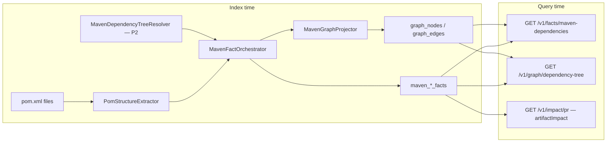

# Feature: Maven Dependency Tree + Artifact Versioning (BL-058)

> **Status:** Shipped (2026-06-16)  
> **Design:** [TestSeer_BL058_Maven_Dependency_Tree_Design.md](../TestSeer_BL058_Maven_Dependency_Tree_Design.md)  
> **Req IDs:** MVN-01–MVN-18  
> **Backlog:** BL-058 (Done)  
> **Pilot:** `platform-transaction-eval-consumer` → parent `evaluation-common` / `redemption-common`

## Problem

TestSeer indexes Java **source-level** dependencies (`DEPENDS_ON`, `USES_TYPE`) but not **Maven artifact** graphs (GAV, scope, transitive closure, reactor modules). A PR that bumps a shared library does not surface cross-repo consumers in impact analysis.

This is a **new fact layer** — not an extension of reachability hydration (TE-GAP-02 / KFK-04).

## Goals

- Parse `pom.xml` at index → `maven_module_facts` + `maven_dependency_facts`
- Optionally resolve full tree via `mvn dependency:tree` (cached per `commit_sha`)
- Project `MAVEN_MODULE` / `ARTIFACT` graph (`CONTAINS_MODULE`, `DEPENDS_ON_ARTIFACT`)
- Query APIs + MCP for agents; PR `artifactImpact[]` for lib bumps

## Non-goals

- Gradle (future BL)
- Merging Maven edges into class `reachability` CTE
- Runtime classpath verification

## End-to-end flow



## REST

| Method | Path | Description |
|--------|------|-------------|
| `GET` | `/v1/facts/maven-dependencies` | Module list + dependency rows |
| `GET` | `/v1/graph/dependency-tree` | BFS tree with optional hydration |

Standard `ResponseEnvelope` + freshness (`CURRENT` | `STALE` | `INDEXING` | `NOT_INDEXED`).

**Scope:** `scope=runtime` (default) includes Maven `compile` + `runtime` classpath deps (matches `mvn dependency:tree -Dscope=runtime`).

### Example

```bash
curl "http://localhost:8080/v1/facts/maven-dependencies?serviceId=UUID&scope=runtime"
curl "http://localhost:8080/v1/graph/dependency-tree?serviceId=UUID&scope=runtime&hydrate=true"
```

## MCP

| Tool | REST |
|------|------|
| `testseer_get_maven_dependencies` | `/v1/facts/maven-dependencies` |
| `testseer_get_dependency_tree` | `/v1/graph/dependency-tree` |

See [08-mcp-agent-integration.md](08-mcp-agent-integration.md).

## Graph model (additive)

| Node | Example |
|------|---------|
| `MAVEN_MODULE` | `transaction-eval-consumer` (repo path) |
| `ARTIFACT` | `com.quotient:evaluation-common:2.0.31` |
| `SERVICE` | existing registry row |

| Edge | Meaning |
|------|---------|
| `CONTAINS_MODULE` | Parent POM → child module |
| `DEPENDS_ON_ARTIFACT` | Module → resolved GAV (direct or transitive) |
| `USES_TYPE` | **Keep** — Java-level type usage |

## Key classes

| Class | Role |
|-------|------|
| `PomStructureExtractor` | P1 DOM parse |
| `MavenDependencyTreeResolver` | P2 `mvn dependency:tree` |
| `MavenFactOrchestrator` | Index wiring |
| `MavenGraphProjector` | Graph projection |
| `InternalArtifactLinker` | P3 cross-repo `com.quotient:*` |
| `MavenDependencyQueryService` | Facts API |
| `DependencyTreeGraphService` | Tree BFS + hydration |
| `MavenScopeFilter` | Runtime scope includes compile |

## Viz

`viz.html` → **Dependency Graph** tab: Class/Service (default), **Maven (cross-service)**, **Maven artifact tree**.

## Pilot acceptance (2026-06-16)

| # | Assertion | Result |
|---|-----------|--------|
| AC-MVN-1 | `maven_module_facts` ≥ 1 | **12** modules on `transaction-eval-suite` |
| AC-MVN-2 | Runtime classpath deps indexed | **70** deps (`scope=runtime`) |
| AC-MVN-3 | Hydrated dependency tree | Consumer module tree with nodes/edges |
| AC-MVN-4 | `linkedServiceId` on internal GAV | Partial — requires multi-service index |
| AC-MVN-5 | PR `artifactImpact[]` | Implemented (P4b) |
| AC-MVN-6 | Class reachability unchanged | Verified — no `DEPENDS_ON_ARTIFACT` in class CTE |

## Tests

Full matrix: [design doc §11](../TestSeer_BL058_Maven_Dependency_Tree_Design.md#11-test-matrix-specified--implement-with-bl-058).

## Related

- [02-ingestion-pipeline.md](02-ingestion-pipeline.md) — orchestrator hook
- [04-graph-projection.md](04-graph-projection.md) — class graph (orthogonal)
- [05-impact-analysis.md](05-impact-analysis.md) — P4b extension
- [16-workspace-catalog-config.md](16-workspace-catalog-config.md) — catalog lib mapping
