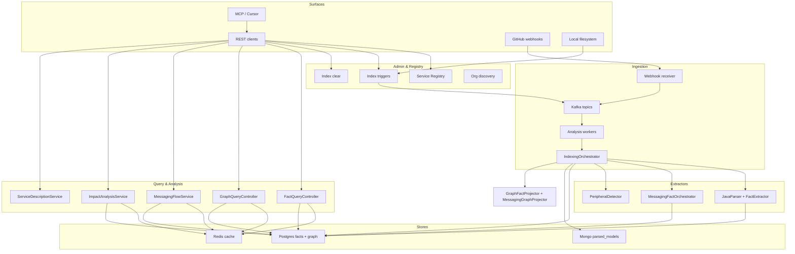

# TestSeer — Feature Design Documents (End-to-End)

> **Status:** Canonical  
> **Last verified:** 2026-06-15 (BL-052 flow gates)  
> **Architecture overview:** [TestSeer_Phase1_Architecture.md](../TestSeer_Phase1_Architecture.md)

Each document below describes one feature from **trigger → ingestion → storage → query → agent surface**, with APIs, data model, operational notes, and known gaps.

## Feature index

| # | Feature | Doc | REST / MCP entry points |
|---|---------|-----|-------------------------|
| 1 | Service Registry | [01-service-registry.md](01-service-registry.md) | `/registry/services`, `testseer_list_services` |
| 2 | Ingestion Pipeline | [02-ingestion-pipeline.md](02-ingestion-pipeline.md) | `/webhook/github`, Kafka workers |
| 3 | Fact Query API | [03-fact-query-api.md](03-fact-query-api.md) | `/v1/facts/*`, `/v1/status/*` |
| 4 | Graph Projection | [04-graph-projection.md](04-graph-projection.md) | `/v1/graph/*` |
| 5 | Impact Analysis | [05-impact-analysis.md](05-impact-analysis.md) | `/v1/impact/pr`, `testseer_get_impact` |
| 6 | Admin Indexing & Clear | [06-admin-indexing.md](06-admin-indexing.md) | `/admin/index/*`, `testseer_trigger_index`, `testseer_clear_index` |
| 7 | Option C — Messaging Flow | [07-option-c-messaging-flow.md](07-option-c-messaging-flow.md) | `/v1/facts/pubsub`, `/v1/graph/event-flow*`, messaging MCP tools |
| 8 | MCP Agent Integration | [08-mcp-agent-integration.md](08-mcp-agent-integration.md) | 16 MCP tools in `testseer-mcp` |
| 9 | Service Description (cached) | [09-service-description.md](09-service-description.md) | `GET /v1/services/{id}/description` |
| 10 | Data Object Catalog | [10-data-object-catalog.md](10-data-object-catalog.md) | `/v1/catalog/data-objects`, enriched `/v1/facts/data-access` |
| 11 | Entry Triggers (Inbound) | [11-entry-triggers.md](11-entry-triggers.md) | `/v1/facts/entry-triggers`, `/v1/graph/entry-flow` (+ TRG-12 chain flags), `/v1/graph/entry-flow/impact` |
| 12 | Data Consistency Hints | [12-data-consistency-hints.md](12-data-consistency-hints.md) | `/v1/consistency/scenarios`, `/v1/gaps/consistency`; structured `consistencyHints[]` on event-flow, data-access, cross-repo subscribers + report root |
| 13 | IDE Cache Push Notification | [13-ide-cache-push-notification.md](13-ide-cache-push-notification.md) | `/v1/notifications/index-events`, `/poll` (BL-024) |
| 14 | Entry Triggers P4 — Airflow | [14-airflow-entry-triggers.md](14-airflow-entry-triggers.md) | `AIRFLOW_DAG` on entry-trigger APIs (BL-025) |
| 15 | Live Flow Gates | [15-live-flow-gates.md](15-live-flow-gates.md) | Live overlay on `/v1/facts/gates`, event-flow (BL-027) |
| 16 | Workspace Catalog Config | [16-workspace-catalog-config.md](16-workspace-catalog-config.md) | `/v1/workspace/*` — org-scoped catalog libs & service modules |
| 17 | Platform API Contracts | [17-platform-api-contracts.md](17-platform-api-contracts.md) | `/v1/facts/contract-operations` (BL-046) |
| 18 | TRG-14 first-hop trigger enrichment | [18-trg-14-first-hop-trigger-enrichment.md](18-trg-14-first-hop-trigger-enrichment.md) | `inboundTriggers[]` on event-flow first hop |
| 19 | Live GCP Pub/Sub Verify | [19-live-pubsub-verify.md](19-live-pubsub-verify.md) | `?liveVerify=true` on cross-repo trace (MSG-10 v1 shipped) |
| 20 | TRG-13 reverse impact | [20-trg-13-reverse-impact.md](20-trg-13-reverse-impact.md) | `/v1/graph/entry-flow/impact` + MCP `handlerFqn` |
| 21 | TRG-12 entry-flow chain | [21-trg-12-entry-flow-chain.md](21-trg-12-entry-flow-chain.md) | `/v1/graph/entry-flow?includeMessaging&crossRepo` + MCP flags |
| 22 | Event Flow viz redesign | [22-event-flow-viz-redesign.md](22-event-flow-viz-redesign.md) | `/viz.html` Customer Journey → Event Flow — pipeline/graph/matrix, transport, schema detail (**BL-048 Done**) |
| 23 | GitHub PR comment bot | [23-pr-comment-bot.md](23-pr-comment-bot.md) | Post-index PR issue comment (BL-022 v1); PRB-20+ cross-repo fan-out deferred |
| 24 | Kafka messaging + graph gaps | [24-kafka-messaging-and-graph-gaps.md](24-kafka-messaging-and-graph-gaps.md) · [Design](../TestSeer_BL050_Kafka_Messaging_Graph_Design.md) | KFK-01–08 · `@KafkaListener` triggers, kafka yaml topics, event-flow hops (BL-050 backlog) |
| 25 | HTTP Pub/Sub event-flow hop | [TestSeer_HTTP_PubSub_EventFlow_Hop_Design.md](../TestSeer_HTTP_PubSub_EventFlow_Hop_Design.md) | BL-051 · `HttpPubSubPublishLinker`, `HTTP_PUBSUB` transport, `outbounds[]` on eval notification topic |
| 26 | Processor routing & call graph | [TestSeer_BL053_Processor_Routing_CallGraph_Design.md](../TestSeer_BL053_Processor_Routing_CallGraph_Design.md) | BL-053 · `ROUTES_TO`, `routing_table_facts`, `GET /v1/graph/routing`, reachability `type=method`, entry-flow `processorRouting[]` |
| 26 | FlowGate manual §9 (partner/system config) | [26-flow-gate-manual-s9.md](26-flow-gate-manual-s9.md) · [Design](../TestSeer_BL051_FlowGate_Manual_S9_Design.md) | BL-052 · `SystemConfigKeys`, source `@ConditionalOnProperty`, ConfigMap yaml, eval rule-pack |
| 27 | Service flow diagram composer | [27-service-flow-diagram.md](27-service-flow-diagram.md) · [Design](../TestSeer_BL054_Service_Flow_Diagram_Design.md) | BL-054 · `GET /v1/graph/flow-diagram`, Mermaid, domain-actor roles, manual graph parity |
| 28 | Transaction-eval graph gap issues | [28-transaction-eval-graph-gap-issues.md](28-transaction-eval-graph-gap-issues.md) | TE-GAP-01–10 · root cause, requirements, validation curls for BL-050/054 pilot |
| 29 | Maven dependency tree + versioning | [29-maven-dependency-tree.md](29-maven-dependency-tree.md) · [Design](../TestSeer_BL058_Maven_Dependency_Tree_Design.md) · [AC-MVN-4](../TestSeer_AC_MVN_4_Internal_Artifact_Link_Design.md) | BL-058 **Done** · `/v1/facts/maven-dependencies`, `/v1/graph/dependency-tree`, `POST /admin/maven/backfill-links`, MCP |

## Cross-cutting designs

| Topic | Doc |
|-------|-----|
| Logging, metrics, tracing, alerting | [TestSeer_Observability_Design.md](../TestSeer_Observability_Design.md) |
| Data object catalog (Phases 1–5) | [TestSeer_Data_Object_Catalog_Design.md](../TestSeer_Data_Object_Catalog_Design.md) · [10-data-object-catalog.md](10-data-object-catalog.md) · [Implementation caveats](../TestSeer_Data_Object_Catalog_Implementation_Caveats.md) |
| Consistency catalog S-01–S-12 | [12-data-consistency-hints.md](12-data-consistency-hints.md) · [S-06–S-12 design](../TestSeer_Consistency_Catalog_S06_S12_Design.md) · BL-039–045 **Done** |
| Processor routing & call graph (BL-053) | [TestSeer_BL053_Processor_Routing_CallGraph_Design.md](../TestSeer_BL053_Processor_Routing_CallGraph_Design.md) · extends BL-050 KFK-04 |
| Reachability subgraph hydration (TE-GAP-02) | [TestSeer_TE_GAP_02_Reachability_Hydration_Design.md](../TestSeer_TE_GAP_02_Reachability_Hydration_Design.md) · **Closed** 2026-06-16 |
| Service flow diagram / manual graph parity (BL-054) | [TestSeer_BL054_Service_Flow_Diagram_Design.md](../TestSeer_BL054_Service_Flow_Diagram_Design.md) · [27-service-flow-diagram.md](27-service-flow-diagram.md) |
| BL-050 P0 implementation (TE-GAP-01–04) | [TestSeer_BL050_P0_Implementation_Design.md](../TestSeer_BL050_P0_Implementation_Design.md) |
| Multi-module catalog + symbol resolution (shipped + API) | [TestSeer_Multi_Module_Catalog_Requirements.md](../TestSeer_Multi_Module_Catalog_Requirements.md) · [16-workspace-catalog-config.md](16-workspace-catalog-config.md) |
| Maven dependency tree + artifact versioning (BL-058 / AC-MVN-4) | [TestSeer_BL058_Maven_Dependency_Tree_Design.md](../TestSeer_BL058_Maven_Dependency_Tree_Design.md) · [AC-MVN-4](../TestSeer_AC_MVN_4_Internal_Artifact_Link_Design.md) · [29-maven-dependency-tree.md](29-maven-dependency-tree.md) |
| REST conventions, errors, OpenAPI governance | [TestSeer_REST_API_Design.md](../TestSeer_REST_API_Design.md) · plan [P16](../archive/plans/2026-06-12-p16-rest-api-hardening.md) (**R1–R3 shipped**) |

## Platform data flow (all features)

## Database inventory (Flyway V1–V23)

> **V22 (BL-058):** `maven_module_facts`, `maven_dependency_facts` — see [29-maven-dependency-tree.md](29-maven-dependency-tree.md).  
> **V23 (AC-MVN-4):** `maven_dependency_facts.link_source`, `cross_repo`.

| Migration | Tables |
|-----------|--------|
| V1 | `service_registry` |
| V2 | `symbol_facts` |
| V3 | `outbound_call_facts` |
| V4 | `peripheral_facts`, `unsupported_construct_facts` |
| V5 | `analysis_runs` |
| V6 | `graph_nodes`, `graph_edges` |
| V7 | `analysis_runs` job_type CHECK (`MANUAL`, `LOCAL`) |
| V8 | `pubsub_resource_facts`, `message_schema_facts`, `data_access_facts`, `flow_gate_facts`, `validation_hint_facts`, `pubsub_verification_facts` |
| V9 | `external_endpoint_facts`, `external_call_site_facts` — see external partner endpoint extraction |
| V10 | `data_object_facts`, `accessor_method_facts`, `schema_object_facts`; extends `data_access_facts` — see [10-data-object-catalog.md](10-data-object-catalog.md) |
| V11 | `entry_trigger_facts` — see [11-entry-triggers.md](11-entry-triggers.md) |
| V12 | `consistency_scenario_facts` — core shipped; cross-repo + trace-root hints (BL-037/038-code); see [12-data-consistency-hints.md](12-data-consistency-hints.md) |
| V13 | `workspace_org_settings`, `workspace_catalog_library`, `workspace_service_module`, `workspace_symbol_classpath`, `workspace_bundle`, `workspace_bundle_index_order` — see [16-workspace-catalog-config.md](16-workspace-catalog-config.md) |
| V14 | `data_object_facts.evidence_source` widened to `VARCHAR(255)` |
| V15 | `consistency_scenario_facts.scenario_id` widened |
| V16 | `contract_operation_facts`, `contract_schema_facts` |
| V17 | `test_http_call_facts` (contract phase 4) |
| V18 | `async_retry_path_facts` |
| V19 | `routing_table_facts` (BL-053 processor routing) |
| V20 | `graph_nodes` / `graph_edges` key columns widened |
| V21 | `uq_pubsub_resource` widened with `linked_class_fqn` — multiple HTTP_PUBSUB publisher classes per topic (BL-051); see [07-option-c-messaging-flow.md](07-option-c-messaging-flow.md) |
| V22 | `maven_module_facts`, `maven_dependency_facts` (BL-058) — see [29-maven-dependency-tree.md](29-maven-dependency-tree.md) |
| V23 | `maven_dependency_facts.link_source`, `cross_repo` (AC-MVN-4) |

MongoDB: `parsed_models` (raw AST snapshots; not on query hot path).

## Operational scripts

| Script | Feature |
|--------|---------|
| `scripts/pull-all-repos.sh` | Prep for bulk index |
| `scripts/index-all-repos.sh` | Admin local index — full org |
| `scripts/clear-index.sh` | Index clear |
| `scripts/build-mcp.sh` | MCP build |
| `scripts/openapi-governance-check.sh` | OpenAPI drift gate (P16 R1) |

## Not yet shipped (see [BACKLOG.md](../../../docs/BACKLOG.md))

| Planned | Backlog | Priority |
|---------|---------|----------|
| Event Flow viz redesign | BL-048 | P2 |
| Gradle dependency tree | BL-059 | P3 |
| Internal artifact alias expansion | BL-060 | P3 |
| PR comment bot v2 | BL-049 | P2 |
| Nightly scheduler, observability GCP rollout, IntelliJ backend, workspace catalog MCP | BL-016, BL-017, BL-023, BL-047 | P3 |
